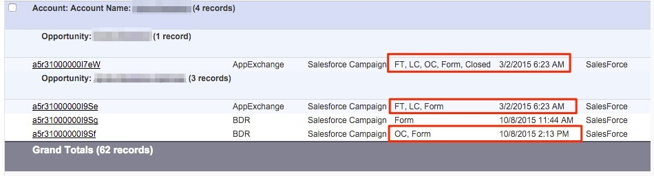

# 基于帐户的归因 {#account-based-attribution}

随着基于帐户的营销(ABM)的兴起，了解如何 [!DNL Marketo Measure] 能补充你的反弹道导弹战略。 [!DNL Marketo Measure] 将显示每个潜在客户的每个接触点，并在您的帐户下联系。

## 的 [!UICONTROL What] {#the-what}

当一个帐户下存在多个机会时，不同的机会将共享相同的前两个接触点 — 首次接触(FT)和商机创建(LC)。 创建新Opportunity后，其单个收入额将分配到各个接触点，这些接触点有助于将Opportunity进一步向下移至漏斗中。 请务必注意，与Opportunity关联的接触点被视为Buyer Attribution接触点(BAT)。

例如，以下帐户有两个Opportunity。 对于第一个Opportunity ，它只有一个Touchpoint。 该接触点包括FT、LC和机会创建(OC)接触点。 第二个Opportunity将与第一个Opportunity具有相同的FT和LC，但OC Touchpoint不同。 此外，第二个Opportunity还有一些与第一个Opportunity不相关联的其他Touchpoint ，因为它们发生在第一个Opportunity的结束日期之后。

## 这有什么用？ {#how-does-this-help}

自 [!DNL Marketo Measure] 呈现与您的帐户关联的所有营销互动，营销人员可以更好地了解哪些帐户可能关闭，他们与您公司的互动频率，这些互动的内容，每个互动的价值等。

使用 [!DNL Marketo Measure] 而ABM方法，营销业绩最终将以收入为基础。 如果您想要转为使用基于帐户的营销方法，请查看 [CMO的ABM编排指南](https://info.bizible.com/cmos-guide-to-abm-orchestration)指导您完成ABM编排的规划、执行和测量阶段。
