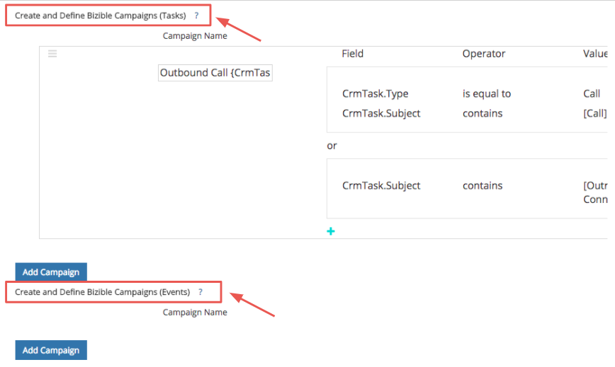

# Salesforce活动归因 {#salesforce-activities-attribution}

的 [!DNL Marketo Measure] Salesforce活动集成会将特定的任务和事件记录纳入您的归因模型中。 开始跟踪未收到到期信用的销售电子邮件或销售电话等内容。 要配置活动规则，您需要转到 [experience.adobe.com/marketo-measure](https://experience.adobe.com/marketo-measure){target=&quot;_blank&quot;}。 从那里，转到 **[!UICONTROL Settings]** ，然后单击 **[!UICONTROL Activities]** 选项卡。

你要让你的销售团队非常开心！ 让我们带您完成快速教程。

首先，我们引入了一个新概念，称为 [!DNL Marketo Measure] 营销活动。 对于您定义的每个规则，您要将记录存储到 [!DNL Marketo Measure] 可命名的营销活动。 根据需要添加多个营销活动。 想象一下，在付费媒体促销活动旁边衡量叫客促销活动的有效性！

你要用这个 [!DNL Marketo Measure] 营销活动名称，以告知我们应将营销活动映射到的渠道。 如果您仍在考虑“出站销售”，则可能所有“出站销售”促销活动都应位于BDR渠道中。

熟悉此层次结构：

* 渠道
   * 子渠道
      * Campaign
      * Campaign
   * 子渠道
      * Campaign

>[!TIP]
>
>例如，如果要为每个销售代表设置一个唯一的营销活动，请利用我们的动态替换参数来填写 [!DNL Marketo Measure] 营销活动名称。 在同一示例中，您可以输入 `"Outbound Sales - {AssignedTo}"` 然后把它变成 `"Outbound Sales - Jill"` 或 `"Outbound Sales - Jack."` 你不知道我们救了你多少时间！

一旦 [!DNL Marketo Measure] 已设置促销活动名称，该设置活动规则了。

规则用作过滤器，告诉我们哪些记录符合归因条件。 假设您正在CRM中使用类似逻辑创建报表以生成该报表。 您可以灵活地使用和/或语句的组合以及各种运算符（如匹配any、contains、starts with、ends with、equal to等）。 在框外的规则或层“或”语句中定义“和”语句。

>[!NOTE]
>
>公式字段不能在规则中使用，也不会显示在选取列表中。 由于公式在后台计算而不修改记录， [!DNL Marketo Measure] 无法检测记录是否符合规则。
>
>请确保为ID字段（如CrmEvent.CreatedById）使用正确的值。 [!DNL Salesforce IDs] 长度为18个字符(例如，0054H000007WmrfQAC)。

最后，我们选择一个日期或日期/时间字段，以用作买方接触点日期。 标准字段和自定义字段均可选择。

>[!TIP]
>
>安装软件包后， [!DNL Marketo Measure] 在活动记录中包含一个自定义的买方接触点日期字段。 如果您要使用动态日期（如状态更改的日期），则可以使用CRM工作流设置“采购员接触点日期”，然后在此步骤中选择采购员接触点日期。

不要忘记为任务或事件设置不同的规则。 您将需要知道您的销售团队用于记录其活动的对象。

您可能希望将这些新触点放入其适当的 [营销渠道](https://experience.adobe.com/#/marketo-measure/MyAccount/Business?busView=false&amp;id=10#/!/MyAccount/Business/Account.Settings.SettingsHome?tab=Channels.Online%20Channels){target=&quot;_blank&quot;}。 为此，您可以使用刚刚创建的新营销活动映射来定义渠道。 或许您将为BDR渠道创建一个新行，营销活动以“出站”开头。

>[!TIP]
>
>添加渠道定义时，请使用通配符值，这是一种更便于状态运算符的方法，例如：
>
>开头(出站&#42; )
>
>包含( &#42;出站&#42; )
>
>结束于( &#42;出站)
>
>没有通配符基本上表示“等于”，因此请务必根据需要使用它们。

| **运算符** | **用例** |
|---|---|
| 等于 | 单个值 — 精确匹配 |
| 包含 | 单个值 — 包含值 |
| 匹配任意 | 多个值 — 精确匹配 |
| 匹配任意（包含） | 多个值 —  &#42;值&#42;, &#42;值， &#42;值&#42; |

最后，您可以选择为新渠道输入成本。 我们的 [营销支出上传](https://experience.adobe.com/#/marketo-measure/MyAccount/Business?busView=false&amp;id=10#/!/MyAccount/Business/Account.Settings.SettingsHome?tab=Reporting.Marketing%20Spend){target=&quot;_blank&quot;}允许您在渠道级别、子渠道级别或营销活动级别输入支出。 使用您的新 [!DNL Marketo Measure] 促销活动，您可以按月添加这些相关成本，然后查看每个促销活动的ROI!

>[!MORELIKETHIS]
>
>[活动归因常见问题解答](/help/advanced-marketo-measure-features/activities-attribution/activities-attribution-faq.md)
