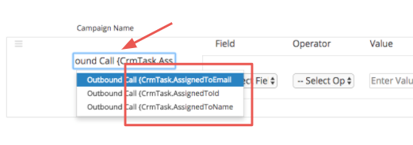
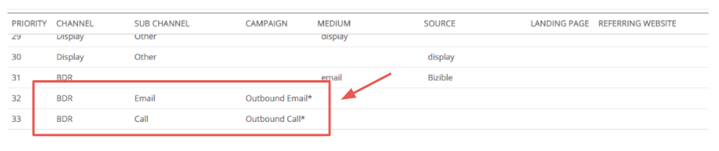

# Salesforce活动归因 {#salesforce-activities-attribution}

[!DNL Marketo Measure] Salesforce Activities集成将特定的任务和事件记录引入归因模型。 开始跟踪未获得应付款的销售电子邮件或销售电话等内容。 要配置活动规则，请转到[experience.adobe.com/marketo-measure](https://experience.adobe.com/marketo-measure){target="_blank"}。 从该位置，转到&#x200B;**[!UICONTROL Settings]**&#x200B;选项卡，然后单击&#x200B;**[!UICONTROL Activities]**&#x200B;选项卡。

>[!AVAILABILITY]
>
>此功能仅对第2层客户启用。 要申请更高的客户层，请联系Adobe客户团队（您的客户经理）。

首先，我们将引入一个名为[!DNL Marketo Measure]营销活动的新概念。 对于您定义的每个规则，您要将记录存储到可命名的[!DNL Marketo Measure]营销活动中。 根据需要添加多个营销活动。 想象一下，在付费媒体营销活动旁边测量出站销售活动的有效性！

您将使用此[!DNL Marketo Measure]营销活动名称告诉我们应将它映射到哪个渠道。 如果您仍在考虑出站销售，则可能所有出站销售促销活动都应位于BDR渠道中。

熟悉此层次结构：

* 渠道
   * 子渠道
      * Campaign
      * Campaign
   * 子渠道
      * Campaign

>[!TIP]
>
>例如，如果要为每个销售代表设置唯一的Campaign，请使用动态替换参数来填写[!DNL Marketo Measure] Campaign名称。 在同一示例中，您可以输入`"Outbound Sales - {AssignedTo}"`，然后它会将其更改为`"Outbound Sales - Jill"`或`"Outbound Sales - Jack."`之类的内容

设置[!DNL Marketo Measure]营销活动名称后，便可设置活动规则了。

规则可作为一个过滤器，告诉我们哪些记录符合归因条件。 假设您现在在CRM中使用类似的逻辑创建报告来生成该报告。 您可以灵活地组合使用和/或语句以及各种运算符，如`matches any`、`contains`、`starts with`、`ends with`、`is equal to`。 在框外的盒装规则或层`or`语句中定义`and`语句。

>[!NOTE]
>
>公式字段不能在规则中使用，也不会显示在选择列表中。 由于公式在后台计算且不会修改记录，因此[!DNL Marketo Measure]无法检测记录是否符合规则。
>
>确保为ID字段使用正确的值，例如CrmEvent.CreatedById。 [!DNL Salesforce IDs]的长度为18个字符( 0054H000007WmrfQAC)。

最后，选择一个日期或日期/时间字段以用作Buyer Touchpoint日期。 标准字段和自定义字段均可选择。

>[!TIP]
>
>在安装包时，[!DNL Marketo Measure]在活动记录中包含自定义Buyer Touchpoint日期字段。 如果您要使用动态日期（如状态更改的日期），则可以使用CRM工作流设置“Buyer Touchpoint日期”，然后在此步骤中在此处选择Buyer Touchpoint日期。

不要忘记为任务或事件设置不同的规则。 您必须知道销售团队使用哪个对象来记录其活动。

您可能希望将这些新的接触点放置到他们适当的[营销渠道](https://experience.adobe.com/#/marketo-measure/MyAccount/Business?busView=false&id=10#/!/MyAccount/Business/Account.Settings.SettingsHome？tab=Channels.Online%20Channels){target="_blank"}中。 为此，请使用刚刚创建的新营销活动映射定义渠道。

>[!TIP]
>
>添加渠道定义时，请使用通配符值，这是一种声明运算符的更简单方法，例如：
>
>开头为（出站&#42; ）
>
>包含（&#42;出站&#42; ）
>
>结尾为（ &#42;出站）
>
>无通配符基本上表示“等于”，因此请务必根据需要使用它们。

| **操作员** | **用例** |
|---|---|
| 等于 | 单个值 — 完全匹配 |
| Contains | 单个值 — 包含值 |
| 匹配任意 | 多个值 — 完全匹配 |
| 匹配任意（包含） | 多个值 — &#42;值&#42;、&#42;值、&#42;值&#42; |

最后但同样重要的是，您可以选择输入新渠道的成本。 [营销支出上传](https://experience.adobe.com/#/marketo-measure/MyAccount/Business?busView=false&id=10#/!/MyAccount/Business/Account.Settings.SettingsHome？tab=Reporting.Marketing%20Spent){target="_blank"}允许您在渠道级别、子渠道级别或营销活动级别输入支出。 通过新的[!DNL Marketo Measure]营销活动，您可以按月添加这些相关成本，然后查看每个营销活动的ROI！

>[!MORELIKETHIS]
>
>[活动归因常见问题解答](/help/advanced-marketo-measure-features/activities-attribution/activities-attribution-faq.md)
