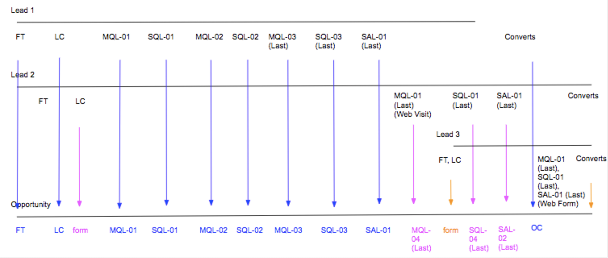

# 回音廊舞台场景 {#boomerang-stage-scenarios}

>[!AVAILABILITY]
>
>Boomerang功能仅对第3层客户启用。 要申请更高的客户层，请联系Adobe客户团队（您的客户经理）。

以下是“回旋”阶段场景的几个示例，用于了解如何做到这一点 [!DNL Marketo Measure] 在每种情况下创建接触点。

## 单一潜在客户方案 {#single-lead-scenarios}

**场景1：商机的标准Boomerang接触点**

这是最简单的“回弹”情景。 顶行（标记为Lead 1）表示单个Lead的历程，以及他们的接触点在Lead记录中的显示方式。 底线（标记为Opportunity）显示Lead的接触点如何转换为Opportunity。 接触点的进展按时间顺序进行，从左到右。

在此方案中，客户已选择让其 **MQL** 和 **SQL** 用“自食其果”追踪的阶段。 每个Boomerang接触点位置都标有阶段和发生阶段的数字(MQL-01、SQL-01、MQL-02)。 该舞台的最后一个回访式接触点在接触点位置具有“（最后一个）”。

然后，Lead 1将转换为具有Opportunity的Contact ，后者被视为OC接触。

**场景2：潜在客户的Boomerang接触点和自定义阶段**

在此方案中，客户仅选择跟踪 **SQL阶段** 有回力郎接触点。 MQL和SAL阶段仍在跟踪中，但 [!DNL Marketo Measure] 自定义舞台功能。

请注意，MQL接触点位置未标记为数字。 这是因为未选择通过Boomerang接触点跟踪它。 在为自定义模型中包含但未使用Boomerang跟踪的阶段创建接触点时， [!DNL Marketo Measure] 从该阶段中获取最后一个发生次数。

在SAL阶段， [!DNL Marketo Measure] 忽略此阶段的前两个实例。 [!DNL Marketo Measure] 仅为创建SAL接触点 _最后一个_ 发生次数。 在上面的示例中，这发生在OC接触点之前。

正在使用Boomerang接触点跟踪SQL阶段，并且已创建三个接触点并相应地对其进行标记。

然后，Lead 1将转换为具有Opportunity的Contact ，后者被视为OC接触。

**场景3：潜在客户未到达/跳过某个阶段**

此方案使用与方案2相同的标准。 客户只选择使用自走式接触点跟踪SQL阶段。 MQL和SAL仍在跟踪中，但 [!DNL Marketo Measure] 自定义舞台功能。

在此方案中，潜在客户实际上永远不会过渡到SAL阶段。 在到达SAL阶段之前，它将转换为联系人，实际上就是“跳过”SAL阶段。 这种情况下 [!DNL Marketo Measure] 假定SAL与OC接触点同时出现，并且SAL和OC位置将出现在同一接触点上。

然后，Lead 1将转换为具有Opportunity的Contact ，后者被视为OC接触。

## 具有多个潜在客户的方案 {#scenarios-with-multiple-leads}

以下情形是自走式暂存越来越复杂的情况，因为我们正在考虑多个潜在客户如何影响Opportunity历程。

顶行（标记为潜在客户1，蓝色部分）表示单个潜在客户的历程，以及他们的接触点在Lead记录中的显示方式。 Lead 2（粉红色）和Lead 3（橙色）也是如此。 底线（标记为Opportunity）显示这两个Lead的接触点如何转化为Opportunity。 接触点的进展按时间顺序进行，从左到右。

**场景1：[!UICONTROL Three Leads with Opportunity]**

在此方案中，客户已选择跟踪 **MQL** 和 **SAL阶段** 有回力郎接触点。 标准自定义阶段正在跟踪SQL阶段。

Opportunity上的FT和LC接触点来自Lead 1 （蓝色），因为它们出现在Lead 2 （粉红色）的FT和LC之前。 Lead 2的LC接触点将显示为Opportunity上的“Form”接触点。

来自Lead 2的MQL-01 （最后一个）将成为Opportunity上的第一个MQL。 Lead 1中的MQL-01将不会显示为Opportunity上的接触点，因为Lead 2的MQL是先出现的。 但是， Lead 1的MQL-02和MQL-03将出现在Opportunity中。

SQL阶段使用自定义阶段进行跟踪，而不是使用自举阶段。 即使Lead 1和Lead 2之间有三次出现SQL阶段，但只有最后出现的SQL将作为接触点包含在Opportunity中。

来自Lead 1的SAL-01 （最后一个）接触点将作为Opportunity上的接触点转移。 然后，Lead 1将转换为具有Opportunity的Contact ，后者被视为OC接触。 由于已发生此阶段转换，潜在客户2的SAL-01（上一个）接触点将创建为接触点 _之后_ OC触点。

Lead 3的FT 、 LC和MQL 、 SQL 、 SAL接触点（橙色）都发生在Opportunity上的OC接触点之后。 这些接触点包含在Opportunity中，但被视为“中间接触”。

当潜在客户2和3转换为联系人时， [!DNL Marketo Measure] 将不会创建另一个OC接触点，因为只能有一个机会创建阶段。

**场景2 -[!UICONTROL Three Leads with Opportunity]**

在此方案中，客户已选择跟踪 **MQL**， **SQL**、和 **SAL** 与回力郎接触点一起登场。

从FT到SAL-01（最后一个），Lead 1的所有接触点都包含在该商机中。 Lead 2的LC接触点将作为Form接触点包含在Opportunity上的LC和MQL-01接触点之间。

来自Lead 2的MQL-01 （最后一个）最终成为Opportunity上的MQL-04 （最后一个）接触点。 由于此情形是查看一个Opportunity中多个Lead的历程，因此Lead的接触点的位置和编号可能会在Opportunity上转换为接触点时发生变化。 同样，Lead 2中的SQL-01 (Last)将变为Opp上的SQL-04 (Last)。 Lead 2的SAL-01 (Last)也变为Opportunity的SAL-02 (Last)。

Opportunity上只包括2个SAL接触点。 [!DNL Marketo Measure] 如果尚未发生阶段过渡，则不会尝试强制/创建接触点。

Lead 3的接触点历程在OC接触发生之前开始，但在Lead 1和Lead 2进行FT和LC接触很久之后开始。 在这种情况下， Lead 3的FT和LC在Opportunity上显示为一个Form接触点。 然后，Lead 1将转换为具有Opportunity的Contact ，后者被视为OC接触。

Lead 3的MQL 、 SQL和SAL接触在OC接触之后同时发生。 由于它们发生在OC接触点之后，因此此接触点将显示为Opportunity上的Form/Middle Touch，而不是Boomerang阶段过渡。

**场景2a - Web访问Boomerang接触点**

在此方案中，客户已选择跟踪 **MQL**， **SQL**、和 **SAL** 与回力郎接触点一起登场。 这种情况与上述情况几乎相同，只是有一些例外。

从FT到SAL-01（最后一个），Lead 1的所有接触点都将包含在该商机中。 Lead 2的LC接触点将作为Form接触点包含在Opportunity上的LC和MQL-01接触点之间。

潜在客户2的MQL-01（上次）（Web访问）将不会创建为Opp上的接触点。 这是因为此接触点是在最后一次出现SQL阶段之后进行的Web访问，无助于推动Opportunity向前发展。

Lead 1的阶段更改为SAL ，然后转换为具有Opportunity的Contact ；在这种情况下， SAL-01 (Last)和OC职位将在同一接触点中组合在一起。

Lead 3的FT，LC触摸创建为Opp上的表单接触点。 OC接触后，只会将表单填充操作创建为接触点。 因此，不会将Lead 2的SQL-01 (Last)和SAL-01 (Last)阶段过渡创建为接触点，因为这些接触点是Web访问。

潜在客户3的MQL、SQL、SAL接触包含为接触点，因为这是一种表单填充操作。

**场景3 — 回溯线归因权重**

在此方案中，客户已选择跟踪 **MQL**， **SQL**、和 **SAL** 与回力郎接触点一起登场。

Opportunity上的FT和LC接触点来自Lead 1 （蓝色），因为它们出现在Lead 2 （粉红色）的FT和LC之前。 Lead 2的LC接触点在Opportunity中显示为“Form”接触点。

来自Lead 2的MQL-01 （最后一个）成为Opportunity上的第一个MQL。 Lead 1中的MQL-01将不会显示为Opportunity上的接触点，因为Lead 2的MQL是先出现的。

Lead 2的SQL-01 （最后一个）在Opportunity上变为SQL-01。 Lead 1上的SQL-01将不会显示为Opportunity上的接触点，因为Lead 2上的SQL-01最先发生。

请注意，在最终到达SAL阶段之前，Lead 1会在MQL和SQL之间往返几次。 SQL-01、MQL-02、SQL-02、MQL-03、SQL-03 _不会_ 将作为机会的接触点包含在内，因为这些阶段过渡无助于推动机会在历程中前进。

Lead 1的SAL-01（最后一个）接触点是要包含在Opp上的下一个接触点。 然后，潜在客户1转换为具有机会的联系人，从而创建OC接触点。

Lead 3的FT和LC以及MQL 、 SQL和SAL接触点在Opportunity上显示为形式接触。

Lead 2的SQL-01 (Last)接触点将不会作为Opp上的接触点包含在内，因为它发生在OC接触点之后。 此外，Lead 2的SQL阶段转换已经发生 _在最后的SAL阶段转换之后_，无助于推动机会之旅。

## 机会方案 {#opportunity-scenarios}

**场景1 — 使用Opportunity和Boomerang跟踪的联系人**

在此方案中，客户已选择跟踪 **演示和协商阶段过渡** 在 **联系人**. 每个自转阶段最多可以接收两个接触点。 Contact上的阶段过渡与Lead上的阶段过渡之间的区别在于Contact阶段过渡可以显示为Opportunity上的Boomerang接触点 _之后_ oc接触点。 对于在Lead上发生的暂存过渡而言，情况并非如此，因为这些过渡显示为表单接触点。

在此示例中，Contact 1的Demo和Negotiation阶段过渡包括在Opportunity中作为Demo-01和Negotiation-01接触点。 发生联系2的演示阶段转换 _之后_ 联系1的联系人，并作为Opportunity上的Demo-02 （上一个）接触点显示。

请注意，没有第二个过渡到“协商”阶段；Opportunity会立即从Demo-02 (Last)移动到Close Won。 在本例中， [!DNL Marketo Measure] 将包括与已关闭的赢家接触点的协商过渡。
