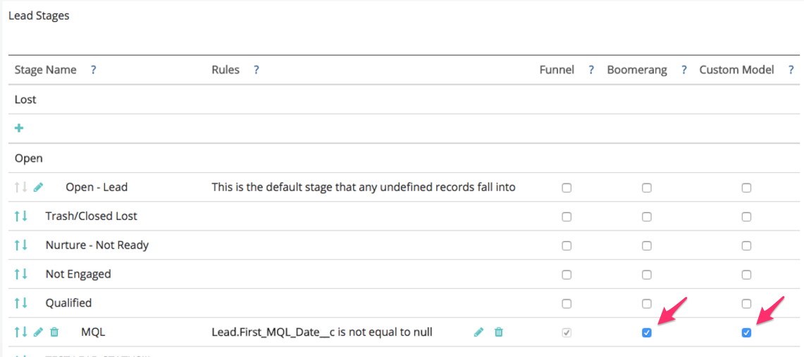

# 设置Boomerang阶段 {#setting-up-boomerang-stages}

启用 [!UICONTROL Boomerang] 您帐户的阶段，您必须是帐户管理员。 或者，可以通过联系 [Marketo支持](https://nation.marketo.com/t5/support/ct-p/Support){target=&quot;_blank&quot;}。 启用该功能后，请按照以下说明进行设置。

## 波美朗阶段设置 {#boomerang-stage-setup}

1. 转到 [!UICONTROL Stage Mapping]. 在标题为“[!UICONTROL Boomerang]，”选中要跟踪的阶段旁边的框。

   

1. 转到 [!UICONTROL Attribution Settings] 选项卡，并输入要查看的每个阶段的接触点数量。 最多允许10个。 默认值设置为1。

   

1. 单击 **[!UICONTROL Save]**.

   >[!NOTE]
   >
   >请允许24-48小时内根据这些更改重新处理您的数据。

## 具有自定义模型归因的Boomerang阶段设置 {#boomerang-stage-setup-with-custom-model-attribution}

1. 转到 [!UICONTROL Stage Mapping]. 在标题为“[!UICONTROL Boomerang]，”选中要跟踪的阶段旁边的框。

   

1. 如果您还希望将这些Boomerang阶段包含在您的自定义模型中并接收归因点数，请务必同时选中“[!UICONTROL Custom Model]列。

   

1. 转到 [!UICONTROL Attribution Settings] 选项卡。 确定您希望如何为自食果糖阶段的归因加权。 这些选项用于在第一次出现、最后一次出现时对归因进行加权，或者让归因在所有发生时平均拆分。

   

1. 输入要查看的每个阶段的发生次数。 我们最多可以允许10个。 默认值设置为1。

   

1. 设置要分配到自定义模型中包含的Boomerang阶段的归因百分比。 请确保所有阶段的归因总数最多为100%。 单击 **[!UICONTROL Save and Process]**.

   

   >[!NOTE]
   >
   >请允许24-48小时内根据这些更改重新处理您的数据。
