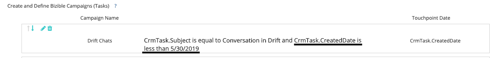

# Drift集成常见问题解答 {#drift-integration-faq}

作为 [!DNL Marketo Measure] 与Drift的整合，我们列出了一些最常见的问题。 如果存在下面未列出的任何问题，请联系您的客户成功经理或 [Marketo支持](https://nation.marketo.com/t5/support/ct-p/Support){target="_blank"}.

**如何启用集成？**

漂移聊天跟踪 [!DNL Marketo Measure] 默认情况下处于启用状态。 如果您出于任何原因要禁用该功能（默认情况下不会从“流聊天”中创建接触点），则需要向您的 [!DNL Marketo Measure] Javascript实施，以下粗体显示：

``

对于使用 [!DNL Google Tag Manager] 加载 [!DNL Marketo Measure] 脚本中，如果要将“漂移聊天”排除在接触点合格之外，则需要添加到以下内容 `` 在 [!DNL Marketo Measure] 脚本：

``

**该集成有何用途？**

现在，集成允许 [!DNL Marketo Measure] 用于跟踪最终用户在Drift聊天中提供其电子邮件地址的时间。 从此处，我们通过这些与“Web聊天”接触点类型的交互创建接触点。 通过此集成，营销人员可以了解其聊天交互的效果，以及有助于促使人们与这些聊天进行交互的渠道/子渠道/营销活动。

**如果我通过促销活动同步规则跟踪Drift，该怎么办？**

如果有任何营销活动同步规则来为漂移聊天交互创建接触点，您需要确保停止将这些特定最终用户添加到相应的CRM营销活动中。 否则，在启用功能位后，我们将为一次Drift聊天交互创建CRM Campaign接触点和数字接触点。

**如果我通过CRM促销活动跟踪流量，该怎么办？**

如果已设置CRM营销活动以为“漂移聊天”交互创建接触点，则需要在这些特定营销活动上设置接触点结束日期（“接触点结束日期”应为启用“Web聊天集成”功能位的日期）。

**如果我通过活动跟踪漂移，该怎么办？**

如果存在用于为“漂移聊天”交互创建接触点的活动规则，则需要在规则中添加一段额外的逻辑。 您需要使用任务创建日期字段添加逻辑，以防止创建接触点重复（IE CrmTask.CreatedDate小于启用功能位的日期）。 有关示例，请参阅下面的屏幕截图。

