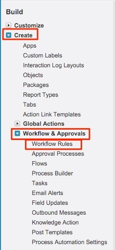
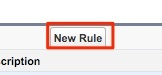
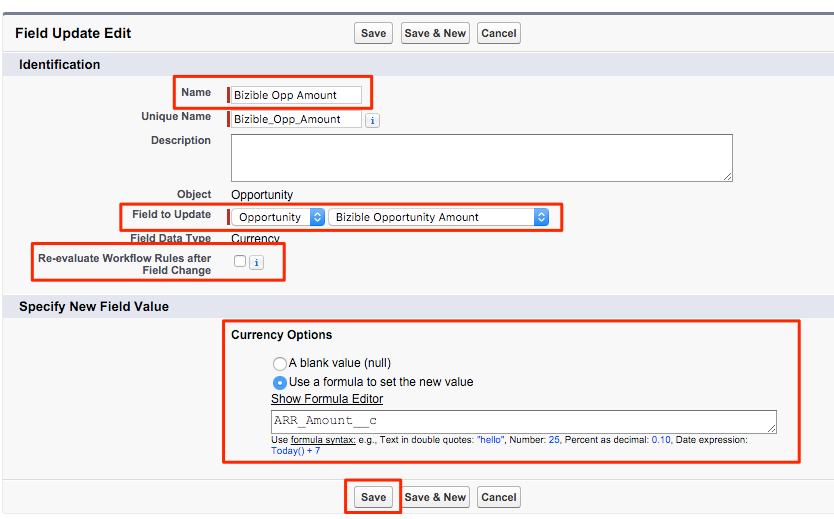

# 使用自定义收入金额字段 {#using-a-custom-revenue-amount-field}

默认情况下，买方归因接触点将从以下两个字段之一中提取机会金额：

* 金额（SFDC默认值）
* [!DNL Marketo Measure] 机会金额（自定义）

如果您在Opportunity中使用自定义金额字段，我们将需要配置一个工作流，以计算买方接触点收入。 这需要一些更先进的知识 [!DNL Salesforce]，因此可能需要SFDC管理员的帮助。

首先，我们需要以下信息：

* “金额”字段的API名称

从此处，我们将开始创建工作流。

1. 导航到 **[!UICONTROL Setup]** > **[!UICONTROL Create]** > **[!UICONTROL Workflow & Approvals]** > **[!UICONTROL Workflow Rules]**.

   

1. 选择 **[!UICONTROL New Rule]**，将对象设置为“Opportunity”并单击 **[!UICONTROL Next]**.

   

   

1. 配置工作流。 将规则名称设置为“Update” [!DNL Marketo Measure] 机会金额。” 将“评估标准”设置为“已创建，且每次进行编辑”。 对于规则标准，选择您的自定义金额字段，然后选择运算符 [!UICONTROL as "Not Equal To"] 并将“Value”字段留空。

   

1. 添加工作流操作。 将此选取列表设置为“[!UICONTROL New Field Update].&quot;

   

1. 你会在这里填写字段信息。 在“名称”字段中，我们建议使用以下命名：&quot;[!DNL Marketo Measure] Opp金额。” “唯一名称”将根据“名称”字段自动填充。 在“要更新的字段”选取列表中，选择“[!DNL Marketo Measure] 机会金额。” 选择字段后，选择“更改字段后重新评估工作流规则”框。 在“指定新字段值”中，选择“使用公式来设置新值”。 在空框中，删除自定义金额字段的API名称。 单击 **[!UICONTROL Save]**.

   

1. 系统会将您带回到工作流的汇总页面，请确保“激活”，此时您就可以正常使用。 要激活，请单击 **编辑** 新工作流旁边，然后单击 **激活**.

   完成这些步骤后，需要更新商机，以触发工作流，从 [!UICONTROL custom opportunity] 字段。

   这可以通过在SFDC内通过Data Loader运行您的机会来实现。 有关在中使用数据加载器的详细信息 [本文](/help/advanced-marketo-measure-features/custom-revenue-amount/using-data-loader-to-update-marketo-measure-custom-amount-field.md).

如果在过程中遇到任何问题，请立即联系Adobe客户团队（您的客户经理）或 [[!DNL Marketo] 支持](https://nation.marketo.com/t5/support/ct-p/Support){target="_blank"}.
