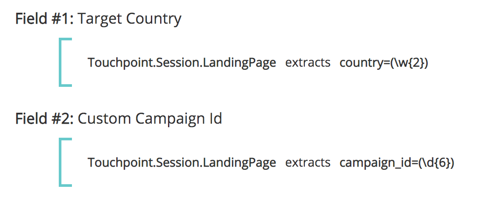
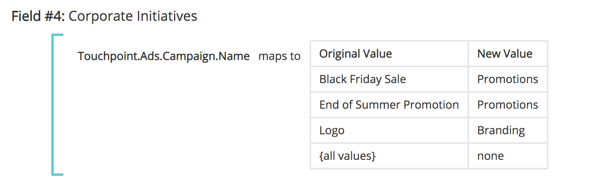
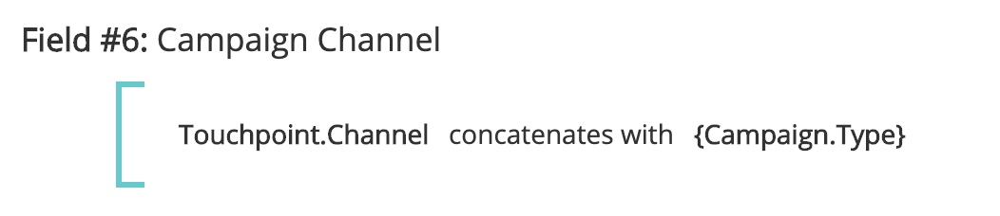
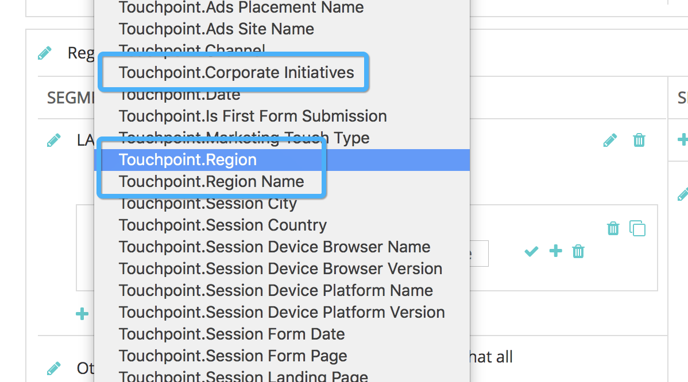

# 接触点字段 {#touchpoint-fields}

过去，当客户使用 [!DNL Marketo Measure] 在我们没有直接标记集成的情况下，我们的客户成功团队会教导我们的客户如何适当地标记其登陆页面，以便他们使用正确的UTM格式，并且我们可以解决其广告。 其中有些客户不使用UTM，而是使用自己的标记参数，这意味着使用新的标记结构编辑其所有广告网络中的所有登陆页面可能非常耗时 [!DNL Marketo Measure] 强制。 为了适应它们的标记结构，我们现在接受可以使用我们的规则定义映射的自定义参数。 目标是适应客户对其自定义跟踪参数的使用，因此我们不必要求客户更改其URL结构。

>[!AVAILABILITY]
>
>现在在第2层和第3层提供完全分段。

>[!NOTE]
>
>这是一项高级功能，仅由Professional Services设置。

## 启用功能 {#enabling-the-feature}

从 [!DNL Marketo Measure] 设置菜单，导航到接触点字段页面。 从该位置，您可以通过选择 **是** 下 **启用计算字段**. 启用该功能后，您可以创建接触点字段。

## 操作方法 {#how-to}

要创建计算字段，请记住，用户可以执行三个不同的操作：提取、映射到和连接。 这些运算符也称为用于定义计算字段的运算符。

提取

此 [!UICONTROL extracts] 运算符从其他位置提取字段中的值，例如：促销活动字段、潜在客户字段，或者在更高级的用例中， [从登陆页面提取自定义参数](https://docs.google.com/document/d/1NRViyCsXvPKbCTfGW32Yi2vWBjMDRF7bzkzKj9s2DDA/edit?ts=5e20b482#heading=h.xxwtissvw4){target="_blank"}. It then places it onto a Touchpoint Field (See [Maps To Example](https://docs.google.com/document/d/1NRViyCsXvPKbCTfGW32Yi2vWBjMDRF7bzkzKj9s2DDA/edit?ts=5e20b482#heading=h.xxwtissvw4){target="_blank"} #2)。

**示例#1**

联系人上有一个自定义字段campaign_source__c ，客户希望将该字段放置到接触点上以进行报告。 您可以定义规则以创建名为“促销活动来源”的计算字段，并将值拖放到该字段中。

目标：使用自定义字段的值并将其放置到接触点对象上以便更轻松地报告。

* 创建计算字段并将其标记为“促销活动源”
* 从搜索Contact.Campaign_Source__c字段开始定义规则
* 使用运算符“extracts”，因为我们需要从参数中提取值
* 要从字段中提取完整的字符串，我们将使用表达式“(”。&#42;)”

   * **(** 标记提取开始
   * **)** 标记提取结束
   * **.&#42;** 说明我们正在提取完整的字符串

**示例#2**

此功能支持的一个常见用例是从URL字符串的自定义参数中提取值。 如果您使用UTM以外的参数，但希望将值解析到接触点字段，则此功能非常有用。

**链接：** `https://www.adobe.com/blog/marketing-revenue-reporting-overview?promo=5OFF` 或 `https://www.adobe.com/blog/marketing-revenue-reporting-overview?promo=25OFF`.\
**目标：** 创建一个名为“Discount Code”的自定义字段，并放置值“5OFF”或“25OFF”，无论传递什么值。

* 创建计算字段并将其标记为“折扣代码”
* 通过从搜索Touchpoint.Session.LandingPage字段开始定义规则
* 使用运算符“extracts”，因为我们需要从参数中提取值
* 要提取促销的值，我们将该值定义为“promo=(\w+)”

   * **(** 标记提取开始
   * **)** 标记提取结束
   * **\w** 告诉我们正在提取一个包含0-9的“单词”
   * **+** 将提取参数的完整值，而不限制字符
   * 请注意，您使用的是正斜杠，而不是反斜杠

**示例#3**

让我们尝试一个类似的示例，其中我们提取了一个跟踪代码，例如： `https://www.adobe.com/blog/marketing-revenue-reporting-overview?cid=123456`.

**目标：** 创建一个计算字段，并使用cid参数中的值将其标记为“Adobe Campaign Id”。

* 创建计算字段并将其标记为“Adobe Campaign Id”
* 通过从搜索Touchpoint.Session.LandingPage字段开始定义规则
* 使用运算符“extracts”，因为我们需要从参数中提取值
* 要提取“123456”值，我们将该值定义为“cid=(\d{6})”

   * **(** 标记提取开始
   * **)** 标记提取结束
   * **\d** 告诉我们正在提取一个“数字”
   * **{6}** 是我们正在提取的字符数

**示例#4**

由于登陆页面变得更加复杂，并且您有多个跟踪参数，因此您可能需要构建多个接触点字段并多次提取值，例如：
`https://www.adobe.com/blog/marketing-revenue-reporting-overview?trackID=123456&country=US&campaign_ID=7890`.

**目标：** 使用参数中的相应值为“目标国家/地区”和“自定义促销活动ID”创建多个计算字段。

* 创建计算字段并将其标记为“目标国家/地区”
* 通过从搜索Touchpoint.Session.LandingPage字段开始定义规则
* 使用运算符“extracts”，因为我们需要从参数中提取值
* 要提取“US”值，我们将该值定义为“country=(\w{2})”

   * **(** 标记提取开始
   * **)** 标记提取结束
   * **\w** 告诉我们正在提取一个“单词”
   * **{2}** 是我们正在提取的字符数

* 创建计算字段并将其标记为“自定义促销活动Id”
* 通过从搜索Touchpoint.Session.LandingPage字段开始定义规则
* 使用运算符“extracts”，因为我们需要从参数中提取值
* 要提取“123456”值，我们将该值定义为“campaign_ID=(\d{6})”

   * **(** 标记提取开始
   * **)** 标记提取结束
   * **\d** 告诉我们正在提取一个“数字”
   * **{6}** 是我们正在提取的字符数

**将映射到**

此 [!UICONTROL maps to] 运算符会创建一个值表，这些值需要转换或存储到另一个值中。 通常，它采用键值的形式，其中代码表示友好名称，需要映射到该友好名称。

**示例#1**

您为跨多个渠道运行的“夏季末期促销活动”和“黑色星期五促销活动”创建了营销活动。 除了其他可能的值之外，您要创建一个名为“促销活动”的计算字段，并将任何包含“夏季促销活动结束”或“黑色星期五促销活动”的接触点映射到“促销活动”等促销活动值。

**示例#2**

现在，我们已经了解了如何提取并映射到字段，让我们合并这些操作，以便首先从参数中提取值，然后将其映射到友好的名称，这样更合理。 让我们从以下登陆页面开始： `https://www.adobe.com/blog/marketing-revenue-reporting-overview?BZ=04-01-09-03-10`.

**目标：** 创建多个计算字段，其中第一个数字映射到区域，第二个数字映射到产品，第三个映射到计划，第四个映射到角色，而第五个映射到媒体平台。 然后，将数值映射到“友好名称”。

* 创建计算字段并将其标记为“区域”
* 通过从搜索Touchpoint.Session.LandingPage字段开始定义规则
* 使用运算符&#39;&#39;[!UICONTROL extracts]”因为我们需要从参数中提取值
* 若要提取“04”值，我们将该值定义为“BZ=(\d{2})-\d{2}-\d{2}-\d{2}-\d{2}-\d{2}”

   * **(** 标记提取开始

      * 请注意，由于我们仅提取4，因此只有第一位数字具有左圆括号
   * **)** 标记提取结束

      * 请注意，由于我们仅提取4，因此只有第一位数字具有右括号
   * **\d** 告诉我们正在提取一个“数字”
   * **{2}** 是我们正在提取的字符数

* 单击 [!UICONTROL Save]. 您必须先保存新字段，然后才能将其用于下一个规则！
* 接下来，我们要将第一个数字的所有可能值映射到其友好名称
* 创建计算字段并将其标记为“Region_Name”
* 从搜索提取字段开始，定义规则。 在本例中， [!DNL Touchpoint.Region]
* 使用运算符&#39;&#39;[!UICONTROL maps to]”，因为我们希望为每个数字创建与其值的映射
* 您将看到一个表来列出每个映射。 最终，它看上去将类似于此：
* 根据上面的映射和URL，使用此登陆页面的接触点的“Region_Value”将为“EMEA”
* 对其余4组数字重复提取和映射

   * 要提取01，可将值定义为“BZ=\d{2}-**(\d{2})**-\d{2}-\d{2}-\d{2}”
   * 要提取09，可将值定义为“BZ=\d{2}-\d{2}-**(\d{2})**-\d{2}-\d{2}”
   * 要提取03，可将值定义为“BZ=\d{2}-\d{2}-\d{2}-**(\d{2})**-\d{2}”
   * 要提取10，可将值定义为“BZ=\d{2}-\d{2}-\d{2}-\d{2}-\d{2}-**(\d{2})**&quot;

**连接**

此 [!UICONTROL concatenates] 运算符将多个字段中的值组合到单个字段中。 这对于创建跨多个字段提取数据的自定义值非常有用，以便

**示例#1**

Segment__c和Grade__c的Opportunity对象上有单独的字段，用户希望将它们合并到接触点对象上的单个字段中以进行报告。 通过连接这些字段，您将看到Enterprise_A或Mid-Market_B之类的值。

## 接触点字段和区段 {#touchpoint-fields-and-segments}

现在，URL中的值已解析出来并存在于接触点上，无论在何处使用接触点字段，您都将看到新字段，例如创建区段或定义接触点删除规则。

此产品版本中提供了使用接触点字段创建区段的功能。 无法使用以前的接触点字段构建区段。

为了更轻松地构建区段，现在可以从创建的接触点字段创建动态区段。 例如，如果您创建的接触点字段解析了地理区域，而不是为每个可能的区域创建区段，则可以设置一个区段，我们将会为每个实例创建区段，此时将显示一个新值。 在需要解析属性（如邮政编码）并将其用作区段时，此功能非常有用！

您的设置类似于下面的屏幕截图。 区段名称使用大括号动态拉入接触点字段值以搜索您的字段。

规则引用同一接触点字段并搜索“不等于null”的值。

## 常见问题 {#faq}

**我们可以创建的接触点字段数量是否存在上限？**

字段限制为100个。

**我未在选择列表中看到我刚刚创建的新接触点字段。 它在哪里？**

创建规则后，不要忘记保存规则。 如果您没有看到新字段，请检查是否保存了新字段。 您必须先保存新字段，然后才能将其用于下一个规则。

>[!NOTE]
>
>由于复杂程度，使用“映射到”运算符的接触点字段无法用于其他接触点字段。

**如何使用什么表达式从单个登陆页面提取多个参数？**

与提取示例#4一样，您需要创建多个字段来提取每个参数。 因此，如果您有五个不同的值，您将创建五个接触点字段来提取每个值。

**为什么我看不到新字段在 [!DNL Marketo Measure] 纲要？**

需要执行额外的操作才能在中公开新字段。 [!DNL Marketo Measure] 架构Data Warehouse。 目前，通过设置和配置公开字段，因此您可以在构建区段或创建接触点删除规则时使用接触点字段。

**如何验证提取表达式是否有效以及提取的值是否正确？**

有一个在线工具([[!DNL https]：//regex101.com/](https://regex101.com/){target="_blank"})，可以运行并测试表达式。 表达式如果有效，则显示绿色；如果无效，则显示红色。 此外， [!UICONTROL explanation] 右上方的框很有用，可告诉您正在提取的内容。

