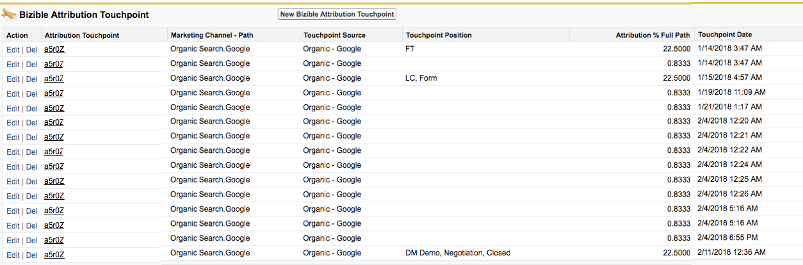

# 为什么您绝不应删除接触点 {#why-you-should-never-delete-touchpoints}

如果您发现Opportunity上有一个接触点被错误地分配归因点数，请联系您的客户经理以确定后续步骤。 在这些情况下，我们建议使用购买者的接触点抑制功能，从SFDC和ROI仪表板中删除接触点。 您的客户经理可以帮助创建这些规则。 请不要自行手动删除这些接触点。

的 [!DNL Marketo Measure] 处理系统不会注册某个接触点已从SFDC中手动删除。 从今天起，我们的系统就没有任何信号来调整数据。 [!DNL Marketo Measure] 不会自动推送另一个接触点以替换已删除的接触点，也不会将接触点位置或归因重新分配给后续接触点。

删除接触点后，它会在归因数据中创建一个孔。 通常，这将在Opportunity的归因接触点中体现。 在下图中，已删除本应接收机会创建接触的接触点。 因此，此机会缺少OC接触点，并且此Opp的归因百分比不会增加100%。

如果触点已从您的SFDC中删除，请联系 [Marketo支持](https://nation.marketo.com/t5/support/ct-p/Support){target=&quot;_blank&quot;}请求重新导入您的数据。
