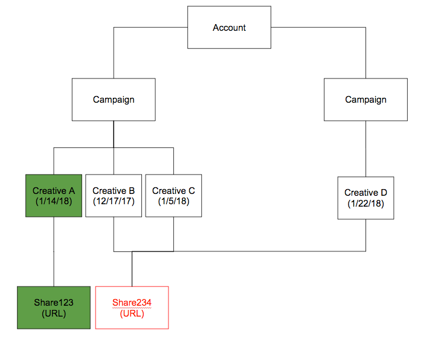

# linkedIn集成 {#linkedin-integration}

## 概述 {#overview}

的 [!DNL Marketo Measure] 与LinkedIn的集成分为两部分：

赞助内容：赞助内容集成允许 [!DNL Marketo Measure] 标记 [!DNL LinkedIn] 广告，最终允许 [!DNL Marketo Measure] 跟踪用户完成其整个接触点历程，并将活动映射回特定 [!DNL LinkedIn] Campaign和Creative。 这为客户提供了有关其ROI的洞察 [!DNL LinkedIn] 活动。

首席代Forms:通过与LinkedIn的首席Forms相集成，Marketo Measure可以深入了解通过LinkedIn平台提交的表单。 这些表单填充与CRM或 [!DNL Marketo Engage] 实例，以便他们符合归因条件。 通过深入分析有助于生成表单的促销活动、创意和表单，团队现在可以进一步优化其LinkedIn营销和广告支出。

## 可用性 {#availability}

适用于所有客户。

## 要求 {#requirements}

**营销活动管理者角色**

对于 [!DNL Marketo Measure] 要下载广告数据和广告成本数据，您必须在促销活动管理器中具有以下角色之一：

* 账单管理员
* 客户经理
* 营销活动管理器

了解更多： [Campaign Manager中的用户角色和功能](https://www.linkedin.com/help/lms/answer/a425731/user-roles-and-functions-in-campaign-manager).

**付费媒体管理员角色**

对于 [!DNL Marketo Measure] 要创建/更新赞助创意，您必须具有以下付费媒体管理员角色之一：

* 赞助内容海报
* 首席Forms经理

了解更多： [linkedIn页面管理角色](https://www.linkedin.com/help/linkedin/answer/4783/linkedin-page-admin-roles-overview).

还有其他 [!DNL LinkedIn] 我们所做的角色 **not** 需要我们的集成。 这些角色通常被误认为是必需的角色，因此请注意，存在差异！

**页面管理角色**

对于 [!DNL Marketo Measure] 要能够从潜在客户代表表单下载/集成潜在客户，您必须具有以下页面管理员角色：

* 超级管理员

了解更多： [linkedIn页面管理角色](https://www.linkedin.com/help/linkedin/answer/4783/linkedin-page-admin-roles-overview).

## linkedIn广告类型 {#linkedin-ad-types}

[!DNL Marketo Measure] 将支持：

**赞助内容：** 赞助内容允许您将内容交付到 [!DNL LinkedIn] 除关注您公司的成员之外的成员信息源。 赞助内容可以定位到特定受众，并可帮助广告商访问 [!DNL LinkedIn] 会员无论在何地、何时都参与 [!DNL LinkedIn] 平台，包括台式机、移动设备和平板电脑。 支持具有潜在客户Forms的赞助内容。

支持的赞助内容广告格式类型 [!DNL Marketo Measure] 是单个图像广告和视频广告(通过潜在客户代Forms)。 由于架构的复杂性，我们不支持轮播广告。

[!DNL Marketo Measure] 不支持赞助消息、文字广告或动态广告。

>[!TIP]
>
>对于源自非赞助内容源（例如“文本广告”或“赞助InMail”的促销活动类型）的任何促销活动/支出， [!DNL Marketo Measure] does _not_ 从根本上支持跟踪这些促销活动类型。 如果要跟踪促销活动支出（如此类促销活动支出）以及“赞助内容”支出，请务必使用我们的“营销支出”CSV手动记录所述支出。

## 工作原理：赞助内容 {#how-it-works-sponsored-content}

>[!NOTE]
>
>在首次使用之前，必须通过导航到 [!DNL Marketo Measure] [!UICONTROL Settings] > [!UICONTROL Integrations] > [!UICONTROL Ads] > [!UICONTROL Enable LinkedIn Lead Gen Forms].

**[!DNL LinkedIn's]独特的自动标记要求**

[!DNL Marketo Measure] 可帮助跟踪 [!DNL LinkedIn] 通过自动标记登陆页面来提升营销活动效果。

[!DNL Marketo Measure] 将搜索具有唯一LinkedIn共享的创作元素，并添加 `?_bl={creativeId}` 参数。

**复制共享**

通过 [!DNL Marketo Measure/LinkedIn] 集成时，我们要求客户不要复制/克隆/复制现有创作元素。 如果找到共享，并且检测到共享仅用于一个创作元素， [!DNL Marketo Measure] 可以按原样标记共享，而无需重新创建任何创意或共享，并且所有广告历史记录（展示次数、点击次数、共享次数）都将保留。

一旦发现共享内容可在多个创作元素之间共享， [!DNL Marketo Measure] 必须执行暂停、复制和重新标记过程，才能设置唯一值。 [!DNL Marketo Measure] 将暂停和存档实时创意内容，从而删除广告历史记录（包括展示次数、点击次数和社交共享），以便正确自动标记所有内容。

向前看， [!DNL Marketo Measure] 建议不要重复任何 [!DNL LinkedIn] 共享并尽可能保持所有创意和共享的独特性，以便我们只需添加跟踪即可，而无需删除广告历史记录。

**缩短的URL**

出现额外步骤的原因是LinkedIn允许目标URL缩短URL（bit.ly、goog.le等），这表示 [!DNL Marketo Measure] 看不到已解析的长URL，并且 [!DNL Marketo Measure] 需要将跟踪参数添加到已解析的URL。 为了绕过这个问题， [!DNL Marketo Measure] 在重新创建广告之前查找缩短的URL，展开该URL，然后使用解析的URL及其所有参数创建新广告，从而允许 [!DNL Marketo Measure] 添加标记。 创建新广告将删除广告历史记录（展示次数、点击次数、共享次数），因此需要获得标记缩短URL的权限。

如果您大量使用缩短的URL，这可能会严重影响您的创意内容。 我们建议您不再使用缩短的URL，以便 [!DNL Marketo Measure] 无需创建新广告即可标记登陆页面并删除广告历史记录。

**过程**

让我们从一些例子开始。 假设我们…….

创意A :共享123\
创作B :股份234\
创意C :股份234\
创作D :股份234

`1)` [!DNL Marketo Measure] 将首先查看所有状态为“活动”的营销活动、创意和共享内容。 [!DNL Marketo Measure] 不会标记暂停、存档或取消的广告。 如果广告已暂停，则设置为 [!UICONTROL active]，我们会在活动后再次标记它。 如果我们能够找到唯一的共享，则意味着它不会在多个创意或营销活动(例如，创意A :股份123)、 [!DNL Marketo Measure] 将添加我们的自定义参数 `>> ?_bl={creativeId}` 到共享URL。

`2)` 现在，如果共享并失去其唯一性(例如，创作B :Share 234和Creative C :Share 234和Creative D :股份234)、 [!DNL Marketo Measure] 将暂停并存档所有类似的创意内容（包括创意B、创意C和创意D）。

`3)` [!DNL Marketo Measure] 将创建3个新创作元素（Creative E、Creative F和Creative G），以复制已存档的Creative B的内容。

`4)` [!DNL Marketo Measure] 还将创建3股新股份，即Share 345、Share 456和Share 567，以复制Share 234的内容，但它将具有自己的独特性 `?_bl` 标记。

`5)` [!DNL Marketo Measure] 将必须定期检查共享是否未共享，如果共享未共享，我们将在上面的步骤2中重新启动该过程。

>[!NOTE]
>
>实施此操作意味着我们的客户将丢失创作B的广告历史记录：Share 234, Creative C :Share 234和Creative D :共享234，因为它现在已通过Creative E重新创建：股份345，股份F :Share 456和Creative G :股份567。

## 工作原理：牵头将军Forms {#how-it-works-lead-gen-forms}

**过程**

到达 [!DNL LinkedIn's] 广告表单API和广告表单响应API，我们能够为广告帐户收集表单提交数据，并将电子邮件地址与CRM或Marketo中的潜在客户关联。

linkedIn表单可能包含多个电子邮件地址。 在下载表单响应时，我们将优先查找以下电子邮件地址：具有有效电子邮件值的工作电子邮件、电子邮件地址（主要表单字段）或自定义字段。

无论营销活动或创作状态如何，所有表单响应都将导致接触点。 [!DNL Marketo Measure] 具有90天的回顾时间限制，因此 [!DNL Marketo Measure] 无法访问90天以前的表单响应，但是 [!DNL Marketo Measure] 和 [!DNL LinkedIn] 集成启用后，潜在客户表单接触点将通过 [!DNL Marketo Measure].

>[!NOTE]
>
>linkedIn成本仍会作为赞助内容促销活动的一部分进行下载。

**在CRM或Marketo中跟踪潜在客户Forms**

在 [!DNL Marketo Measure] LinkedIn Lead Gen Forms集成之前，客户通常会将其表单提交推送到Marketo计划和/或CRM促销活动，以跟踪表单并接收这些活动的归因。 启用“潜在客户Forms”设置后，我们希望确保不会重复计算这些表单提交。 请检查以下内容：

* CRM对象上的“启用买方接触点”字段设置为“无”或“排除所有促销活动成员”
* 更新任何相关的Marketo计划或Marketo活动规则
* 更新任何相关的CRM Campaign规则

>[!NOTE]
>
>LinkedIn API具有90天的回顾时间限制，因此如果您使用的是Marketo或CRM规则，建议您将规则上的结束日期设置为在中启用集成之日之前90天 [!DNL Marketo Measure].

## 接触点详细信息 {#touchpoint-details}

一次 [!DNL Marketo Measure] 已成功在LinkedIn创意中标记登陆页面，您将能够在接触点上查看已解析的广告数据。 以下是您应该看到的数据值映射：

<table> 
 <colgroup> 
  <col> 
  <col> 
 </colgroup> 
 <tbody> 
  <tr> 
   <th>接触点字段</th> 
   <th>示例值</th> 
  </tr> 
  <tr> 
   <td>
广告Id 
</td> 
   <td>
84186224 
</td> 
  </tr> 
  <tr> 
   <td>
广告内容 
</td> 
   <td>
95%的营销人员认为，需求创#B2B策略是成功的。 了解更多： [!DNL https]://lnkd.in/jgdi50vKrgv
</td> 
  </tr> 
  <tr> 
   <td>
广告组ID 
</td> 
   <td>
（空白） 
</td> 
  </tr> 
  <tr> 
   <td>
广告组名称 
</td> 
   <td>
（空白） 
</td> 
  </tr> 
  <tr> 
   <td>
广告促销活动Id 
</td> 
   <td>
138949954 
</td> 
  </tr> 
  <tr> 
   <td>
广告促销活动名称 
</td> 
   <td>
SU - COM帐户 — 需求技能 
</td> 
  </tr> 
  <tr> 
   <td>
广告目标URL 
</td> 
   <td>
https://www.adobe.com/marketing-attribution-for-demand-generation-leaders?_bl=84186217 
</td> 
  </tr> 
  <tr> 
   <td>
表单URL 
</td> 
   <td>
info.bizible.com/demo 
</td> 
  </tr> 
  <tr> 
   <td>
表单URL — 原始 
</td> 
   <td>
info.bizible.com/demo 
</td> 
  </tr> 
  <tr> 
   <td>
关键词Id 
</td> 
   <td>
（空白） 
</td> 
  </tr> 
  <tr> 
   <td>
关键词匹配类型 
</td> 
   <td>
（空白） 
</td> 
  </tr> 
  <tr> 
   <td>
登陆页面 
</td> 
   <td>
https://www.adobe.com/marketing-attribution-for-demand-generation-leaders 
</td> 
  </tr> 
  <tr> 
   <td>
登陆页面 — 原始 
</td> 
   <td>
https://www.adobe.com/marketing-attribution-for-demand-generation-leaders?_bl=84186217 
</td> 
  </tr> 
  <tr> 
   <td>
营销渠道 
</td> 
   <td>
付费社交 
</td> 
  </tr> 
  <tr> 
   <td>
营销渠道 — 路径 
</td> 
   <td>
付费Social.LinkedIn 
</td> 
  </tr> 
  <tr> 
   <td>
中 
</td> 
   <td>
“cpc”或“Lead Gen Form”
</td> 
  </tr> 
  <tr> 
   <td>
反向链接页面 
</td> 
   <td>
www.linkedin.com/ 
</td> 
  </tr> 
  <tr> 
   <td>
反向链接页面 — 原始 
</td> 
   <td>
www.linkedin.com/ 
</td> 
  </tr> 
  <tr> 
   <td>
塞拉赫短语 
</td> 
   <td>
（空白） 
</td> 
  </tr> 
  <tr> 
   <td>
接触点类型 
</td> 
   <td>
Web窗体 
</td> 
  </tr> 
  <tr> 
   <td>
接触点源 
</td> 
   <td>
LinkedIn 
</td> 
  </tr> 
 </tbody> 
</table>

## 成本 {#costs}

因为 [!DNL Marketo Measure] 与 [!DNL LinkedIn]，我们会每天下载每个Campaign和Creative的录制支出。 客户无需报告 [!DNL LinkedIn] 在 [!DNL Marketo Measure] 应用程序。

与其他广告集成一样， [!DNL Marketo Measure] 已定义营销渠道规则以将所有 [!DNL LinkedIn] 促销活动、创意和成本。 要使用规则，客户将需要为其“付费”插入一个新行 [!DNL LinkedIn] 努力。 它可以是新渠道或现有渠道。 在反向链接列中，使用定义“[[!DNL LinkedIn] 付款]” [!DNL Marketo Measure] 定义为具有 [!DNL Marketo Measure] 标记。

## [!DNL Marketo Measure] Discover {#marketo-measure-discover}

对 [!DNL Marketo Measure] Discover支持潜在客户Forms报告。

**付费媒体展示板**

第一代Forms磁贴：包含LinkedIn表单填充计数的新图块。 深入查看此计数将显示活动ID、表单日期、表单名称和电子邮件地址。

**参与路径板**

历程事件：包括通过集成获得的表单的“活动”事件类型和媒介“潜在客户表单”。 深入查看视图包括促销活动、创意和表单详细信息。

## 赞助内容常见问题解答 {#sponsored-content-faq}

**什么是深色共享？**

暗共享是指从未在公司页面上发布过的帖子，该帖子会立即创建并直接添加为创作元素。 所以 [!DNL Marketo Measure] — 创建的创意不会显示在公司页面的顶部并再次获得提升，因此会使用暗共享，以便在后台启动。

**状态的功能 [!DNL Marketo Measure] 实际上是标记？**

在 [!DNL LinkedIn] 营销活动和创意：活动、暂停、存档和取消。 我们仅标记“活动”和“活动的创意”。 标记其他状态会将其再次设置为“活动”。 [!DNL Marketo Measure] 将不会标记“暂停”、“已存档”或“已取消的促销活动”或“创作活动”，但在状态变为“活动”时，将继续标记。

**该变量的值 [!DNL Marketo Measure] 使用标记吗？**

在目标URL的末尾， [!DNL Marketo Measure] 添加参数 `&_bl={creativeId}`，其中 `{creativeId}` 是来自LinkedIn的创作ID。 使用创作ID， [!DNL Marketo Measure] 也可以确定促销活动ID，因为 [!DNL LinkedIn] 具有相当基本的广告结构，因为每个创意只能属于一个营销活动。

**我以前的创意 [!DNL Marketo Measure] 创建新版本？**

When [!DNL Marketo Measure] 重新创建共享并将其放入新的创意中，即会将旧的创意内容存档。 这也是为什么 [!DNL Marketo Measure] 将不标记已存档的营销活动或创作活动 — 否则，将循环使用 [!DNL Marketo Measure] 尝试无限期地标记它。

**为什么创建的广告的目标URL与我的原始广告不匹配？**

[!DNL Marketo Measure] 需要将跟踪参数添加到已解析的URL，但API中显示的URL可能是一个缩短的URL，而不存在所有参数。 为了绕过这个问题， [!DNL Marketo Measure] 在重新创建添加之前，先查找缩短的URL并对其进行解析，然后使用解析的URL及其所有参数创建新广告，从而允许 [!DNL Marketo Measure] 添加标记。

**你在标记我所有的广告吗？ 我在所有登陆页面上看不到bl参数？**

我们观察到，某些营销人员会在目标URL中放置图像链接，目标URL [!DNL Marketo Measure] 无法标记，因此我们会搜索广告内容中的URL。 如果 [!DNL Marketo Measure] 具有标记缩短URL的权限，我们将展开该URL和标记，但由于LinkedIn的复制结构，它会在文本中自动缩短。 标记将位于LinkedIn缩短的URL中，该URL将显示在接触点的“广告内容”字段中，而不是“登陆页面 — 原始”字段中。

**哦，不，我队里有人意外地克隆了一个股票。 我能暂停一下吗？**

没关系。 [!DNL Marketo Measure] 将以编程方式检查是否存在不再唯一的共享，这意味着该共享之后已复制到其他Creative中。 检测到该副本后， [!DNL Marketo Measure] 将遵循常规流程来标记和创建新广告。

**我的广告正在等待审查。 为什么它会在 [!DNL Marketo Measure] 标记了？**

linkedIn要求创建或修改的所有广告在发布之前必须经过正常的安全流程。 [!DNL Marketo Measure] 会尝试尽可能快地截取广告，因为它会每6小时扫描一次新广告，但是 [!DNL LinkedIn's] 此外，该步骤可能会将启动延迟数小时。

**我的广告上有2个URL。 哪个被标记了？**

都是。 的 [!DNL Marketo Measure] 通过集成，我们可以从广告的点进图像中标记目标URL，但同时也会自动更新广告描述中缩短的URL。

**我已将 [!DNL LinkedIn ads] 帐户。 为什么不 [!DNL Marketo Measure] 标记我的链接？**

连接的 [!DNL LinkedIn] 用户需要具有正确的编辑访问权限，这意味着用户需要是客户经理、营销活动经理或创意经理。

**如何知道我的创意是否会被复制？ 我能否查看我的创意人员是否使用相同的共享？**

共享ID未在 [!DNL LinkedIn] 报表，因此没有清晰而明显的方法来检查创意到共享映射。 如果您怀疑某个创作元素可能是副本，则可以通过在 [!DNL LinkedIn] 促销活动管理器 — 此操作将在新选项卡中打开广告，您将在URL中找到共享ID。

## Lead Gen Forms常见问题解答 {#lead-gen-forms-faq}

**此增强的成本是多少？**

此服务包含在任何付费内容中 [!DNL Marketo Measure] 订阅。

**集成是否具有追溯性？**

是，尽管我们的回顾时间范围仅限于90天，但我们将从LinkedIn下载历史广告表单响应。 越长 [!DNL Marketo Measure] 启用LinkedIn集成后，通过 [!DNL Marketo Measure].

没有选项可设置要下载的特定日期，但是，如果您需要禁止某个接触点，则可以选择设置“删除接触点”规则。

**如果我已在使用 [!DNL Marketo Measure] linkedIn广告集成？**

不会，我们不会为所有客户自动下载该功能，但只需在设置中启用此功能的一个简单开关。

**表单数据是否可用？**

表单数据可通过 [!DNL Marketo Measure] 发现，包括表单ID和表单名称。 CRM中的接触点对象上尚未提供表单详细信息。

**任何 [!DNL LinkedIn] 之前已同步到Marketo项目或CRM促销活动的潜在客户？**

建议您调整 [!DNL Marketo Measure] 规则从这些特定项目或营销策划中生成接触点，以避免重复。 LinkedIn API具有90天的回顾时间限制，因此如果您使用的是Marketo或CRM规则，建议您将规则上的结束日期设置为在中启用集成之日之前90天 [!DNL Marketo Measure]. 从现在开始， [!DNL Marketo Measure] 可以下载这些潜在客户，以便您更深入地了解和详细信息。

**是否包含任何自动标记或跟踪？**

不，这和其他 [!DNL Marketo Measure] 集成。 我们不会修改登陆页面（因为没有点进登陆页面），而是只从LinkedIn下载相关信息，并将其视为 [!DNL Marketo Measure].
