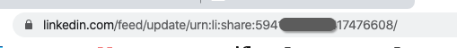

# linkedIn集成 {#linkedin-integration}

## 概述 {#overview}

此 [!DNL Marketo Measure] 与LinkedIn的集成包括两部分：

赞助内容：赞助内容集成允许 [!DNL Marketo Measure] 标记目标URL [!DNL LinkedIn] 广告，最终允许 [!DNL Marketo Measure] 跟踪用户完成其整个接触点历程并将活动映射回特定 [!DNL LinkedIn] Campaign和Creative。 这可以为客户提供有关其ROI的见解 [!DNL LinkedIn] 活动。

Forms负责人：通过与LinkedIn的Forms负责人Marketo Measure集成，可以深入了解通过LinkedIn平台提交的表单。 这些表单填写会根据CRM或中的潜在客户进行匹配 [!DNL Marketo Engage] 以便他们符合归因条件。 通过深入了解帮助生成表单的促销活动、创意和表单，团队现在可以进一步优化其LinkedIn营销和广告支出。

## 可用性 {#availability}

可供所有用户使用。

## 要求 {#requirements}

**营销活动经理角色**

对象 [!DNL Marketo Measure] 要下载广告数据和广告成本数据，您必须在“促销活动管理器”中拥有以下角色之一：

* 账单管理员
* 客户经理
* 营销活动管理器

了解详情： [Campaign Manager中的用户角色和功能](https://www.linkedin.com/help/lms/answer/a425731/user-roles-and-functions-in-campaign-manager).

**付费媒体管理员角色**

对象 [!DNL Marketo Measure] 要创建/更新赞助的创意人员，您必须具有以下付费媒体管理员角色之一：

* 赞助内容海报
* Forms负责人

了解详情： [linkedIn页面管理员角色](https://www.linkedin.com/help/linkedin/answer/4783/linkedin-page-admin-roles-overview).

还有其他的 [!DNL LinkedIn] 我们执行的角色 **非** 需要才能进行集成。 这些角色经常被误认为所需的角色，因此请注意，它们存在区别！

**页面管理员角色**

对象 [!DNL Marketo Measure] 要能够从lead gen forms下载/集成潜在客户，您必须具有以下页面管理员角色：

* 超级管理员

了解详情： [linkedIn页面管理员角色](https://www.linkedin.com/help/linkedin/answer/4783/linkedin-page-admin-roles-overview).

## linkedIn广告类型 {#linkedin-ad-types}

[!DNL Marketo Measure] 将支持：

**赞助内容：** 赞助内容允许您将内容发送至 [!DNL LinkedIn] 除关注您公司的成员外，还有其他成员的信息源。 赞助内容可以针对特定受众，并帮助广告商联系 [!DNL LinkedIn] 会员无论何时何地参与 [!DNL LinkedIn] 跨台式机、移动设备和平板电脑的平台。 支持由Lead Gen Forms提供的赞助内容。

支持的赞助内容广告格式类型 [!DNL Marketo Measure] 是单幅图像广告和视频广告(通过潜在客户Forms)。 由于架构的复杂性，我们不支持轮播广告。

[!DNL Marketo Measure] 不支持赞助消息、文字广告或动态广告。

>[!TIP]
>
>对于源自非赞助内容来源的任何促销活动/支出（例如“文本广告”或“赞助的InMail”的促销活动类型）， [!DNL Marketo Measure] 是 _非_ 本身支持跟踪这些营销活动类型。 如果您希望将此类营销活动的支出与您的“赞助内容”支出一起跟踪，请务必使用我们的营销支出CSV手动记录说出的支出。

## 工作原理：赞助内容 {#how-it-works-sponsored-content}

>[!NOTE]
>
>在首次使用之前，必须通过导航到 [!DNL Marketo Measure] [!UICONTROL Settings] > [!UICONTROL Integrations] > [!UICONTROL Ads] > [!UICONTROL Enable LinkedIn Lead Gen Forms].

**[!DNL LinkedIn's]独特的自动标记要求**

[!DNL Marketo Measure] 可以帮助跟踪 [!DNL LinkedIn] 通过自动标记登陆页面提升促销活动效果。

[!DNL Marketo Measure] 将搜索具有唯一LinkedIn共享的创意人员并添加 `?_bl={creativeId}` 参数结束处。

**复制共享**

使用此 [!DNL Marketo Measure/LinkedIn] 集成，我们要求客户不要复制/克隆/复制现有创意。 如果发现共享并且发现共享仅用于一个Creative， [!DNL Marketo Measure] 可以按原样标记共享，而无需重新创建任何创意内容或共享，并且所有广告历史记录（展示次数、点击次数、共享）都将保留。

一旦发现某个共享在多个创意人员之间共享， [!DNL Marketo Measure] 必须运行暂停、复制和重新标记的过程，才能生成唯一的集。 [!DNL Marketo Measure] 将暂停并存档实时创意内容，因此将擦除广告历史记录（包括展示次数、点击次数和社交分享），以便正确自动标记所有内容。

往前看， [!DNL Marketo Measure] 建议不要复制任何 [!DNL LinkedIn] 共享并尽可能保持所有创意和共享的唯一性，以便我们只需添加跟踪即可，而无需擦除广告历史记录。

**缩短的URL**

额外步骤的原因是LinkedIn允许目标URL缩短为URL（bit.ly、goog.le等），这意味着 [!DNL Marketo Measure] 看不到已解析的长的URL和 [!DNL Marketo Measure] 需要将跟踪参数添加到已解析的URL。 为了避开这个问题， [!DNL Marketo Measure] 在重新创建广告之前查找缩短的URL，展开URL，然后使用解析的URL及其所有参数创建新广告，允许 [!DNL Marketo Measure] 以添加标记。 创建新广告将擦除广告历史记录（展示次数、点击次数、共享次数），因此需要具有标记缩短URL的权限。

如果您大量使用缩短的URL，这可能会严重影响您的创意人员。 我们建议您不要再使用缩短的URL，以便 [!DNL Marketo Measure] 可以标记登陆页面，而无需创建新广告并擦除广告历史记录。

**进程**

让我们从一些示例开始。 假设我们有....

创意A ：共享123\
创意B ：共享234\
创意C ：共享234\
创意D ：共享234

`1)` [!DNL Marketo Measure] 将首先查看所有状态为“活动”的促销活动、创意和共享。 [!DNL Marketo Measure] 不会标记已暂停、已存档或已取消的广告。 如果广告已暂停，则将设置为 [!UICONTROL active]，则当它再次处于活动状态时，我们将为其添加标记。 如果可以找到唯一的共享，则意味着它不会用于多个创意人员或营销活动（例如，创意A ：共享123）， [!DNL Marketo Measure] 将添加我们的自定义参数 `>> ?_bl={creativeId}` 到共享URL。

`2)` 现在，如果共享已失去其唯一性（例如，创意B ：共享234和创意C ：共享234和创意D ：共享234）， [!DNL Marketo Measure] 将暂停并存档所有类似的创意内容（包括Creative B、Creative C和Creative D）。

`3)` [!DNL Marketo Measure] 将创建3个新创意元素，即Creative E、Creative F和Creative G，以复制已存档的Creative B的内容。

`4)` [!DNL Marketo Measure] 还将创建3个新共享（Share 345、Share 456和Share 567），以复制Share 234的内容，但将具有其自己的唯一性 `?_bl` 标记。

`5)` [!DNL Marketo Measure] 将必须定期检查是否未共享共享，如果共享，我们将重新开始上述步骤2中的流程。

>[!NOTE]
>
>实施此操作意味着我们的客户将丢失创意B的广告历史：共享234，创意C ：共享234和创意D ：共享234，因为现在分别使用创意E ：共享345，共享F ：共享456和创意G ：共享567重新创建。

## 工作原理：Forms负责人 {#how-it-works-lead-gen-forms}

**[!DNL LinkedIn's]独特的自动标记要求**

[!DNL Marketo Measure] 可以帮助跟踪 [!DNL LinkedIn] 通过自动标记登陆页面提升促销活动效果。

[!DNL Marketo Measure] 将搜索具有唯一LinkedIn共享的创意人员并添加 `?_bl={creativeId}` 参数结束处。

**进程**

到 [!DNL LinkedIn's] 广告表单API和广告表单响应API，我们可以从CRM或Marketo收集广告帐户的表单提交数据并将电子邮件地址与潜在客户关联。

linkedIn表单可能包含多个电子邮件地址。 下载表单响应时，我们将查找具有以下优先级的电子邮件地址：工作电子邮件、电子邮件地址（主表单字段）或具有有效电子邮件值的自定义字段。

无论Campaign或创意状态如何，所有表单响应都将导致接触点。 [!DNL Marketo Measure] 有90天的回溯限制，因此 [!DNL Marketo Measure] 无法访问超过90天的表单响应，但 [!DNL Marketo Measure] 和 [!DNL LinkedIn] 集成已启用，则通过可看到更多潜在客户群体表单接触点 [!DNL Marketo Measure].

>[!NOTE]
>
>linkedIn成本仍作为赞助内容促销活动的一部分下载。

**在CRM或Marketo中跟踪潜在客户Gen Forms**

早于 [!DNL Marketo Measure] 而存在LinkedIn Lead Gen Forms集成，客户通常将其表单提交推送到Marketo项目和/或CRM Campaign以跟踪表单并接收对这些活动的归因。 启用Forms销售线索生成设置后，我们希望确保不会重复计算这些表单提交。 检查以下各项：

* CRM对象上的“启用购买者接触点”字段设置为“无”或“排除所有营销活动成员”
* 更新任何相关的Marketo项目或Marketo活动规则
* 更新任何相关的CRM Campaign规则

>[!NOTE]
>
>linkedIn API具有90天的回溯限制，因此如果您使用的是Marketo或CRM规则，建议您将规则的结束日期设置为在中启用集成的日期之前的90天 [!DNL Marketo Measure].

## 接触点详细信息 {#touchpoint-details}

之后 [!DNL Marketo Measure] 已成功在LinkedIn creative上标记您的登陆页面，您可以在接触点上查看已解析的广告数据。 以下是您应会看到的数据值的映射：

<table> 
 <colgroup> 
  <col> 
  <col> 
 </colgroup> 
 <tbody> 
  <tr> 
   <th style="width:30%">接触点字段</th> 
   <th>示例值</th> 
  </tr> 
  <tr> 
   <td>广告ID</td>
   <td>84186224</td>
  </tr> 
  <tr> 
   <td>广告内容</td>
   <td>copy-1-image-2-man 95%的#B2B营销人员认为需求创建策略是成功的。 了解详情： [!DNL https]：//lnkd.in/jgdi50vKrgv</td>
  </tr> 
  <tr> 
   <td>广告组ID</td>
   <td>（空白）</td>
  </tr> 
  <tr> 
   <td>广告组名称</td>
   <td>（空白）</td>
  </tr> 
  <tr> 
   <td>广告营销活动ID</td>
   <td>138949954</td>
  </tr> 
  <tr> 
   <td>广告营销活动名称</td>
   <td>SU - COM帐户 — 需求技能</td>
  </tr> 
  <tr> 
   <td>广告目标URL <b>*</b></td>
   <td>https://www.adobe.com/marketing-attribution-for-demand-generation-leaders?_bl=84186217</td> 
  </tr> 
  <tr> 
   <td>表单URL</td> 
   <td>info.bizible.com/demo</td> 
  </tr> 
  <tr> 
   <td>表单URL — 原始</td> 
   <td>info.bizible.com/demo</td> 
  </tr> 
  <tr> 
   <td>关键字ID</td> 
   <td>（空白）</td> 
  </tr> 
  <tr> 
   <td>关键字匹配类型</td> 
   <td>（空白）</td> 
  </tr> 
  <tr> 
   <td>登陆页面</td> 
   <td>https://www.adobe.com/marketing-attribution-for-demand-generation-leaders</td> 
  </tr> 
  <tr> 
   <td>登陆页面 — 原始</td> 
   <td>https://www.adobe.com/marketing-attribution-for-demand-generation-leaders?_bl=84186217</td> 
  </tr> 
  <tr> 
   <td>营销渠道</td> 
   <td>付费社交</td> 
  </tr> 
  <tr> 
   <td>营销渠道 — 路径</td> 
   <td>付费Social.LinkedIn</td> 
  </tr> 
  <tr> 
   <td>中</td> 
   <td>“cpc”或“潜在客户表单”</td> 
  </tr> 
  <tr> 
   <td>反向链接页面</td> 
   <td>www.linkedin.com/</td> 
  </tr> 
  <tr> 
   <td>反向链接页面 — 原始</td> 
   <td>www.linkedin.com/</td> 
  </tr> 
  <tr> 
   <td>搜索短语</td> 
   <td>（空白）</td> 
  </tr> 
  <tr> 
   <td>接触点类型</td> 
   <td>Web窗体</td>
  </tr> 
  <tr> 
   <td>接触点源</td>
   <td>LinkedIn</td>
  </tr> 
 </tbody> 
</table>

**&#42;** _仅为赞助内容填充“广告目标URL”字段。 它不会为Forms潜在客户填充。_

 

## 成本 {#costs}

因为 [!DNL Marketo Measure] 与直接集成 [!DNL LinkedIn]，我们每天下载每个促销活动和创意的录制支出。 客户无需报告 [!DNL LinkedIn] 在 [!DNL Marketo Measure] 应用程序中。

与其他广告集成一样， [!DNL Marketo Measure] 已定义营销渠道规则来放置所有 [!DNL LinkedIn] 营销活动、创意和成本。 要使用规则，客户需要为其Paid插入一个新行 [!DNL LinkedIn] 努力。 它可以是新渠道或现有渠道。 在反向链接列中，使用定义“[[!DNL LinkedIn] 已支付]”，其中 [!DNL Marketo Measure] 定义为与的任何接触点 [!DNL Marketo Measure] 标记之前。

## [!DNL Marketo Measure] 发现 {#marketo-measure-discover}

在以下方面做出了一些增强： [!DNL Marketo Measure] 探索如何支持Forms销售线索报告。

**付费媒体讨论区**

潜在客户Forms图块：包含LinkedIn表单填充数的新图块。 深入查看此计数将显示活动ID、表单日期、表单名称和电子邮件地址。

**参与路径板**

事件历程：包括“活动”事件类型和媒介“潜在客户群表单”，适用于通过集成产生的表单。 穿透钻取视图包括Campaign、Creative和Form详细信息。

## 赞助内容常见问题解答 {#sponsored-content-faq}

**什么是Dark Share？**

黑暗分享是一个从未在公司页面上发布的帖子，它会被立即创建并直接添加为创意。 所以 [!DNL Marketo Measure]-created Creative不会出现在公司页面顶部并再次得到提升，而是使用深色共享，以便能够在后台启动。

**状态的作用 [!DNL Marketo Measure] 真的标记了？**

一个有四种不同的状态 [!DNL LinkedIn] 营销活动和创意：活动、已暂停、已存档和已取消。 我们仅标记处于活动状态的营销活动和创意内容。 标记其他状态会再次将它们设置为“活动”。 [!DNL Marketo Measure] 不会标记“已暂停”、“已存档”或“已取消”营销活动或创意，但如果状态更改为“活动”，则将恢复标记。

**它有什么价值 [!DNL Marketo Measure] 是否使用来标记？**

目标URL的末尾， [!DNL Marketo Measure] 正在添加参数 `&_bl={creativeId}`，其中 `{creativeId}` 是LinkedIn中的创作ID。 使用创作Id， [!DNL Marketo Measure] 还可以确定促销活动ID，因为 [!DNL LinkedIn] 具有非常基本的广告结构，因为每个创意内容只能属于一个营销活动。

**我的旧创意曾经发生了什么 [!DNL Marketo Measure] 是否创建它的新版本？**

时间 [!DNL Marketo Measure] 重新创建共享并将其放置到新的创意中，旧创意会存档。 这也是为什么 [!DNL Marketo Measure] 不会标记已存档的营销活动或创意内容 — 否则它将循环 [!DNL Marketo Measure] 试图无限期地标记它。

**为什么创建广告的目标URL与我的原始广告不匹配？**

[!DNL Marketo Measure] 需要将跟踪参数添加到已解析的URL，但API中显示的URL可能是缩短的URL，而无需显示所有参数。 为了避开这个问题， [!DNL Marketo Measure] 在重新创建添加之前查找缩短的URL，解析它，然后使用解析的URL及其所有参数创建新广告，允许 [!DNL Marketo Measure] 以添加标记。

**你在标记我的所有广告吗？ 我没有在所有登陆页面上看到bl参数？**

我们注意到一些营销人员会将图像链接放置到目标URL中，而 [!DNL Marketo Measure] 无法标记，因此我们在广告内容中搜索URL。 如果 [!DNL Marketo Measure] 具有标记缩短的URL的权限，我们将展开该URL并为其添加标记，但由于LinkedIn的复制结构，其在文本中会自动缩短。 标记将驻留在LinkedIn缩短的URL中，该URL将显示在接触点的“广告内容”字段中，而不是“登陆页面 — 原始”字段中。

**哦，不，我团队里有人不小心克隆了一份。 我能暂停一下吗？**

没关系。 [!DNL Marketo Measure] 将以编程方式检查是否存在不再唯一的共享，这意味着该共享已被复制到另一个Creative中。 检测到该副本后， [!DNL Marketo Measure] 将按照常规流程标记和创建新广告。

**我的广告先前正在等待审核。 为什么此后它再次等待审阅 [!DNL Marketo Measure] 标记它？**

linkedIn要求所有创建或修改的广告在发布前都必须通过正常的安全流程。 [!DNL Marketo Measure] 尝试尽快截获广告，因为它每6小时扫描一次新广告，但使用 [!DNL LinkedIn's] 此外，这可能会导致启动延迟几个小时。

**我的广告上有2个URL。 哪一个被标记？**

两者。 此 [!DNL Marketo Measure] 通过集成，我们可以通过广告中的点进图像标记目标URL，但也可以自动更新广告描述中缩短的URL。

**我已连接我的 [!DNL LinkedIn ads] 帐户。 为什么不是 [!DNL Marketo Measure] 标记我的链接？**

连接的 [!DNL LinkedIn] 用户需要具有适当的编辑权限，这意味着用户必须是客户经理、营销活动经理或创意经理。

**我如何知道我的创意是否会被复制？ 我能看看我的创意人员是否在使用相同的份额吗？**

中未提供共享ID [!DNL LinkedIn] 因此，没有明确和显而易见的方法来检查创意到共享的映射。 如果您怀疑某个创意可能是副本，则可以通过从中打开广告来手动检查 [!DNL LinkedIn] 营销活动管理器 — 这会在新选项卡中打开广告，您可以在URL中找到共享ID。

## Forms销售主管常见问题解答 {#lead-gen-forms-faq}

**此增强功能的成本是多少？**

此服务包含在任何已付费用中 [!DNL Marketo Measure] 订阅。

**集成是否可以追溯？**

是，我们将从LinkedIn下载历史广告表单响应，不过我们将回顾时间限制为90天。 时间越长 [!DNL Marketo Measure] 如果启用了LinkedIn集成，则会通过显示更多潜在客户群表单接触点 [!DNL Marketo Measure].

没有选项可设置下载的特定日期，但如果存在需要禁止的接触点，则可以选择设置接触点删除规则。

**如果我已经在使用 [!DNL Marketo Measure] linkedIn广告集成？**

不会，我们不会自动开始为所有客户下载它，但在设置中启用此功能非常简单。

**表单数据是否可用？**

表单数据通过以下方式提供 [!DNL Marketo Measure] 发现表单ID和表单名称。 表单详细信息在CRM中的接触点对象上尚不可用。

**对于任意 [!DNL LinkedIn] 之前已同步到Marketo项目或CRM营销活动的潜在客户？**

建议您调整任何 [!DNL Marketo Measure] 用于从这些特定项目或营销策划生成接触点以避免重复的规则。 linkedIn API具有90天的回溯限制，因此如果您使用的是Marketo或CRM规则，建议您将规则的结束日期设置为在中启用集成的日期之前的90天 [!DNL Marketo Measure]. 从这一刻起， [!DNL Marketo Measure] 可为您下载这些销售线索，以便获得更好的见解和详细信息。

**是否涉及任何自动标记或跟踪？**

不，这与其他不同 [!DNL Marketo Measure] 集成。 我们只是从LinkedIn下载相关信息，并将其视为中的活动，而不是修改登陆页面（因为没有点进登陆页面） [!DNL Marketo Measure].
