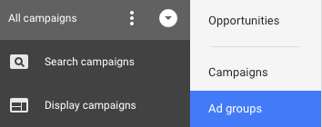

# 了解 [!DNL Marketo Measure] AdWords标记 {#understanding-marketo-measure-adwords-tagging}

要在非常精细的粒度级别跟踪广告，广告目标URL必须是唯一的。 为了完成这一任务， [!DNL Marketo Measure] 自动标记会自动将跟踪参数添加到的广告目标URL [!DNL AdWords] 广告。 下面让我们看一个示例。

以下URL将不提供任何粒度数据：

* `http://example.com/landing-page?myParam=foo`

但是，由于 [!DNL Marketo Measure] 参数：

* `http://example.com/landing-page?myParam=foo&_bt={creative}&_bk={keyword}&_bm={matchtype}&_bn={network}&_bg={adgroupid}`

## 如何 [!DNL Marketo Measure] 自动标记有效 {#how-marketo-measure-auto-tagging-works}

**如果 [!DNL Marketo Measure] 查找跟踪模板：**

* [!DNL Marketo Measure] 会将其参数添加到跟踪模板。
* 如果在跟踪模板（如Kenshoo或Marin）中找到第三方重定向， [!DNL Marketo Measure] 将不采取任何操作。 相反，您必须 [添加 [!DNL Marketo Measure] 参数添加到帐户中的第三方工具](/help/api-connections/utilizing-marketo-measures-api-connections/how-bid-management-tools-affect-marketo-measure.md){target=&quot;_blank&quot;}。

但是，如果未找到跟踪模板， [!DNL Marketo Measure] 将：

* 扫描我们的所有广告目标URL [!DNL Marketo Measure] 参数。
* 如果找到，你就可以走了。
* 如果找不到， [!DNL Marketo Measure] 会将其参数附加到广告目标URL的末尾。 对于新广告， [!DNL Marketo Measure] 将在创建后的两小时内将其参数附加到广告目标URL。
* 在启用自动标记之前，必须先设置跟踪模板，以便 [!DNL Marketo Measure] 可以附加到该广告，并阻止重置广告历史记录。

[!DNL Marketo Measure] 建议使用帐户级别、促销活动级别或广告组级别跟踪模板，因为它允许对所有广告添加和减除参数，而不会有广告历史记录中断或删除的风险。

## 跟踪模板 {#tracking-templates}

如 [!DNL Google AdWords]，跟踪模板是用于访问登陆页面的URL。 收集的跟踪信息用于了解您的广告流量。 [单击此处](https://support.google.com/adwords/answer/7197008?hl=en){target=&quot;_blank&quot;} ，以了解Google的更多信息。

[!DNL Marketo Measure] 建议使用帐户级别、促销活动级别或广告组级别跟踪模板，因为它允许对所有广告添加和减除参数，而不会有广告历史记录中断或删除的风险。

有两个跟踪模板 [!DNL Marketo Measure] 建议使用。 请使用以下方法确定适合您的版本：

* 如果所有广告URL都具有“？” 在中，使用以下URL:

`{lpurl}&_bt={creative}&_bk={keyword}&_bm={matchtype}&_bn={network}&_bg={adgroupid}`

* 如果您的广告URL中没有“？” 在中，使用以下URL:

`{lpurl}?_bt={creative}&_bk={keyword}&_bm={matchtype}&_bn={network}&_bg={adgroupid}`

## 在帐户级别设置跟踪模板 {#setting-up-a-tracking-template-at-the-account-level}

1. 登录到 [!DNL Google AdWords] 帐户。

1. 单击 **[!UICONTROL All campaigns]** 然后 **[!UICONTROL Settings]** 中。

   

1. 单击 **[!UICONTROL Account Settings]** 然后 **[!UICONTROL Tracking Template]**. 输入 [!DNL Marketo Measure] 跟踪模板。

   

1. 单击 **[!UICONTROL Save]**.

## 在促销活动级别设置跟踪模板 {#setting-up-a-tracking-template-at-the-campaign-level}

1. 单击 **[!UICONTROL All campaigns]** 然后 **[!UICONTROL Campaigns]** 中。

   

1. 选择所有适用的营销活动或 **[!UICONTROL Select All]**，单击 **[!UICONTROL Edit]**，然后单击 **[!UICONTROL Change Tracking Templates]**.

   

1. 输入 [!DNL Marketo Measure] 跟踪模板并单击 **[!UICONTROL Apply]**.

## 在广告组级别设置跟踪模板： {#setting-up-a-tracking-template-at-the-ad-group-level}

1. 单击 **[!UICONTROL All campaigns]** 然后 **[!UICONTROL Ad Groups]** 中。

   

1. 选择所有适用的广告组或选择全部，单击 **[!UICONTROL Edit]** 然后单击 **[!UICONTROL Change Tracking Templates]**.

1. 输入 [!DNL Marketo Measure] 跟踪模板并单击 **[!UICONTROL Apply]**.

   

## 常见问题解答 {#faq}

**问：连接的用户需要哪些权限？**

答：userinfo.email

**问：导入支出数据需要多长时间？**

答：6小时

**问：导入广告数据需要多长时间？**

答：4小时

>[!NOTE]
>
>进行更改后，即可完成。 随时联系 [Marketo支持](https://nation.marketo.com/t5/support/ct-p/Support){target=&quot;_blank&quot;}（如果在设置过程中遇到任何问题）。

[单击此处](https://support.google.com/adwords/answer/6076199?hl=en#tracking){target=&quot;_blank&quot;} ，以了解Google有关创建帐户级别跟踪模板的说明。
