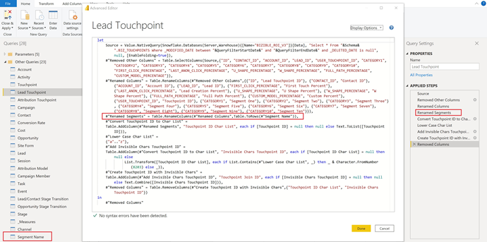
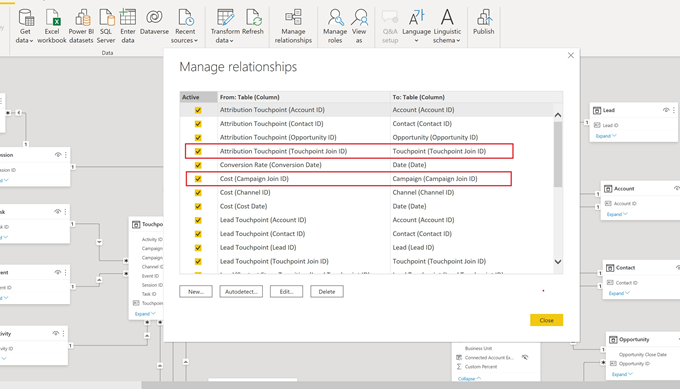

# [!DNL Marketo Measure] 报表模板 — Power BI {#marketo-measure-report-template-power-bi}

## 快速入门 {#getting-started}

您可以访问Power BI报表模板 [此处](https://github.com/adobe/Marketo-Measure-BI-Templates){target="_blank"}.

打开Adobe [!DNL Marketo Measure] 报表模板Power BI文件。

您可以在 [!DNL Marketo Measure] UI [!DNL Data Warehouse] 信息页面。 详细说明了如何找到此页面 [此处](/help/marketo-measure-data-warehouse/data-warehouse-access-reader-account.md){target="_blank"}.

QueryFilterStartDate和QueryFilterEndDate参数用于限制导入的数据量。 这些参数必须采用SQL格式，因为在发送到的查询中，这些参数将用于 [!DNL Snowflake]. 例如，如果要将数据限制为过去两年，则QueryFilterStartDate将为dateadd(year，-2,current_date())。 这些参数会与日期时间数据类型进行比较，因此建议对QueryFilterEndDate使用dateadd(day，1,current_date())将所有数据返回到当前时间。

## 数据连接 {#data-connection}

打开文件时输入的参数用于构建从data warehouse导入表的本机查询。 您仍需要设置与 [!DNL Snowflake] 实例。 为此，您需要相同的服务器和仓库名称以及用户名和密码。 有关在何处查找用户名并重置密码（如果需要）的详细信息，请参见 [此处](/help/marketo-measure-data-warehouse/data-warehouse-access-reader-account.md){target="_blank"}.

## 数据导入 {#data-import}

为了提高报表性能，并利用Power Query中的转换功能，我们选择使用导入存储方法来设置此模板。

### 查询参数 {#query-parameters}

为了限制导入到模型中的数据，可使用本机查询作为源来设置每个表。 本机查询需要批准才能执行，您需要为每个查询单击运行。 仅在首次运行查询时或参数发生更改时，才需要执行此步骤。

所有查询都会过滤掉已删除的行和 [!UICONTROL facts] 可设置表来筛选在作为参数输入的开始日期和结束日期之间具有修改日期的行。

>[!NOTE]
>
>由于日期过滤器应用于行的修改日期，因此在报告超出限制日期范围的日期时请务必谨慎。 例如，修改的日期范围仅限于过去两年。 这可以包括事件日期为三年前的事件，但最近已对其进行了修改。 但是，报告三年前的事件将返回不完整的结果，因为并非所有行都会在两年的时间范围内进行修改。

下表作为事实表处理；这些查询中添加了修改日期的日期限制。

* 活动
* 接触点
* 潜在接触点
* 归因接触点
* 成本
* 网站表单
* 会话
* 营销活动成员
* 任务
* Event
* 潜在客户/联系阶段过渡
* 机会阶段过渡

下表被视为维度表；这些查询没有设置日期限制。

* 帐户
* Campaign
* 联系人
* 转化率
* 机会
* 商机
* 阶段
* 渠道

## 数据转换 {#data-transformations}

对Power Query中的数据应用了一些转换。 要查看任何表的特定转换，请打开“电源查询”，导航到一个表，并记下窗口左侧的“应用的步骤”。 下面概述了一些特定的转换。

### 删除的列 {#removed-columns}

为了简化Power BI模型并删除冗余和不必要的数据，我们减少了从原始数据导入数据的列数 [!DNL Snowflake] 表。 删除的列包括不必要的外键、通过与模型中其他表的关系更好地利用的异常维度数据、审核列和用于内部的字段 [!DNL Marketo Measure] 正在处理。 您可以根据业务需要添加或删除列。 导航到任何表中“源”步骤之后的“已删除的其他列”步骤，单击齿轮图标，然后更新提供列表中的选定列。

>[!NOTE]
>
>* 添加其他外键值时要谨慎。 Power BI通常设置为自动检测模型中的关系并添加外键值可能导致表之间不期望的链接和/或禁用现有关系。
>
>* 中的大多数表 [!DNL Marketo Measure] data warehouse包含非规范化的维数据。 我们已尽可能地规范和清理Power BI中的模型，以提高性能和数据准确性。 当在事实表中包含任何其他非规范字段时，请务必小心，这可能会破坏表格中的维过滤，并且还可能导致报告不准确。

### 重命名的列 {#renamed-columns}

表和列已重命名，以使它们更易于使用，并标准化命名惯例。 要查看列名称的更改，请导航到任何表中“删除其他列”步骤之后的“重命名的列”步骤。

### 重命名的区段 {#renamed-segments}

由于区段名称是可自定义的，因此它们在Snowflakedata warehouse中具有通用列名称。 [!DNL BIZ_SEGMENT_NAMES] 是一个映射表，其中列出了通用区段名称及其映射的自定义区段名称，这些名称在 [!DNL Marketo Measure] UI。 区段名称表用于重命名潜在客户接触点和归因接触点表中的区段列。 如果不存在自定义区段，则会保留通用区段名称。

### 区分大小写的ID转换 {#case-sensitive-id-conversion}

[!DNL Marketo Measure] 数据有几个表，其中主键(ID)值区分大小写，即接触点和营销活动。 驱动Power BI建模层的数据引擎不区分大小写，从而产生“重复”ID值。 为了保持这些键值区分大小写，我们实施了转换步骤，将不可见字符附加到小写字符，在数据引擎层中评估时保留ID的唯一性。 有关该问题的更多详细信息以及我们使用的方法的详细步骤 [此处] (https://blog.crossjoin.co.uk/2019/10/06/power-bi-and-case-sensitivity/){target="_blank"}. 这些区分大小写的ID值将标记为“连接ID”，并用作关系层中的连接键。 我们已从报表层隐藏了连接ID，从而保持原始ID值可见，以便在报表中使用，因为不可见的字符可能会干扰剪切/粘贴函数和过滤。

### 添加的行 {#rows-added}

为了在模型中的计算中添加货币换算功能，我们在Opportunity和Cost表中都添加了公司换算率列。 此列中的值将在行级别添加，并通过在日期和货币ID上加入“转化率”表来评估。 有关此模型中货币换算工作方式的更多详细信息，请参阅 [货币兑换](#currency-conversion) 部分。

存储在 [!DNL Snowflake] 包含每次转化的日期范围。 Power BI不允许在计算（即，在一系列日期之间）时使用连接条件。 为了在日期时加入，我们向“转化率”表中添加了一些步骤以展开行，这样转化日期范围内的每个日期都有一个对应的行。

## 数据模型 {#data-model}

对于其全尺寸版本，请单击下图。

{target="_blank"}

### 关系和数据流 {#relationships-and-data-flow}

用于创建接触点的事件数据存储在 [!UICONTROL Session], [!UICONTROL Task], [!UICONTROL Event], [!UICONTROL Activity]和Campaign成员表。 这些事件表通过其各自的ID连接到接触点表，如果事件导致接触点，则详细信息会存储在接触点表中。

潜在客户接触点和归因接触点存储在其各自的表中，并带有指向接触点表的链接。 潜在客户接触点和归因接触点的大多数维度数据都源自其指向相应接触点的链接。

在此模型中，促销活动和渠道维度已链接到接触点，因此有关这些维度的所有报表都通过此链接进行，这意味着有关事件数据的维度报表可能不完整。 这是因为许多事件在处理到接触点中之后才会包含这些维度的链接。 注意：某些事件（如会话）确实具有指向营销活动和渠道维度的直接链接。 如果需要在会话级别报告这些维度，则建议为此创建单独的数据模型。

成本数据存储在 [!DNL Snowflake] data warehouse成本表。 对于所有广告提供商，可以将促销活动级别的数据汇总到渠道级别。 因此，此模型会根据“campaign_is_aggregatable_cost”标记提取成本数据。 只能在渠道级别提交自我报告的成本，无需拥有Campaign数据。 为了提供尽可能最准确的成本报告，会根据“channel_is_aggregatable_cost”标记提取自行报告的成本。 使用以下逻辑写入用于导入成本数据的查询：如果ad_provider = &quot;SelfReported&quot; ，则channel_is_aggregatable_cost = true，否则campaign_is_aggregatable_cost = true。

成本数据和接触点数据具有一些常见的维度，因此两个事实表都与促销活动和渠道维度表存在关系。

在这个模型的背景下， [!UICONTROL Lead], [!UICONTROL Contact], [!UICONTROL Account]和 [!UICONTROL Opportunity] 数据被视为维数据，并直接与 [!UICONTROL Lead] 接触点和 [!UICONTROL Attribution] 接触点表。

### 添加了表 {#added-tables}

**日期**

由于Power BI仅允许在一列的表之间建立关系，因此添加了日期维度表，以便在包含金额（机会和成本）的表和转化率表之间建立必要的连接。 有关此模型中如何计算货币兑换的更多详细信息，请参阅货币兑换部分。

**测量**

所有措施都已添加到专门的措施表中。 它未连接到模型，而是用作存储所有测量的单个位置，以便于使用。

**归因模型**

添加了单独的表以存储归因模型的名称。 此表用于创建过滤器，以便用户在归因模型之间切换以计算归因收入。

### 货币兑换 {#currency-conversion}

“折算率”(Conversion Rate)表格中的汇率表示从公司货币换算金额所需的值。 转换为任何货币需要进行双重转换，首先从原始货币转换为公司货币，然后从公司货币转换为所选货币。 在模型中，此链的第一步是向具有金额、机会和成本的表中添加具有转化率的列。 有关这些步骤的详情，请参阅本文档“数据转换”部分的“添加的行”标题。 将原始货币换算为公司货币包括将值除以此添加列。 下一步是将公司货币值乘以“折算率”表中与所选货币对应的汇率。

* 将原始值换算为公司货币值/公司换算率=以公司货币表示的值
* 以公司货币将值从公司换算为选定的货币值 `*` 选定货币的兑换率=选定货币的值

由于兑换率不是静态的，并且可以按指定的日期范围进行更改，因此必须在行级别执行所有货币兑换计算。 同样，由于兑换率与特定日期范围有关，因此必须在度量的DAX内执行查找计算，以便可以在货币代码和日期上定义关系。

如果无法识别兑换率，此模型中的货币兑换度量会将值1.0替换该汇率。 已创建单独的度量以显示度量的货币值，如果计算包含多个货币值（即，某个值无法转换为所选货币），则会发出警报。

## 数据定义 {#data-definitions}

已将表、自定义列和度量的定义添加到Power BI模型中。

查看直接来自的列的定义 [!DNL Snowflake]，请参阅 [data warehouse文档](/help/marketo-measure-data-warehouse/data-warehouse-schema.md){target="_blank"}

## 模板与Discover之间的差异 {#discrepancies-between-templates-and-discover}

### 归因收入 {#attributed-revenue}

潜在客户接触点和归因接触点会从原始接触点继承维度数据。 报表模板模型从与接触点的关系中来源所有继承的维度数据，而在Discover模型中，维度数据会异常化为潜在客户和归因接触点记录。 总的归因收入或归因管道收入值应在两个报表之间排列。 但是，当按维度数据（渠道、子渠道或营销活动）划分或过滤收入时，可能会发现差异。 如果模板和Discover之间的维度收入额不匹配，则模板报表数据集中可能缺少接触点记录。 当具有潜在客户或归因接触点记录，但在导入报表的数据集内的接触点表中没有相应记录时，会发生这种情况。 由于这些表按修改日期进行过滤，因此潜在客户/归因接触点记录可能比接触点记录更近修改，因此潜在客户/归因接触点已导入数据集，而原始接触点记录则不会。 要解决此问题，请扩大接触点表的过滤日期范围，或考虑将日期约束全部删除在一起。 注意：接触点是一个大表，因此请考虑更完整数据集与必须导入的数据量之间的权衡。

### 成本 {#cost}

模板中的成本报表仅在促销活动和渠道级别可用，但是， Discover为某些广告提供商（例如创意、关键词、广告组等）提供粒度级别较低的报表。 有关如何在模板中建模成本数据的更多详细信息，请参阅本文档的数据模型部分。 如果维度在 [!UICONTROL Discover] 设置为“渠道”或“营销活动”时，“渠道”、“子渠道”和“营销活动”级别的成本应在“发现”和“报表”模板之间排列。

### ROI {#roi}

由于ROI是根据归因收入和成本计算的，因此其中任一计算中可能出现的差异都可能出现在ROI中，原因也相同，如这些部分所述。

### 接触点 {#touchpoints}

如报表模板中所示，这些量度不会在Discover中镜像。 目前无法直接比较两者。

### Web流量 {#web-traffic}

报表模板数据模型通过会话与接触点之间的关系，将渠道、子渠道和促销活动维度数据标准化。 这与Discover数据模型不同，Discover数据模型会将这些维度规范化为会话。 由于这一区别，访问和访客的总计数应与Discover和报表模板相匹配，但是，按维度显示或过滤后，这些数字便不会保持一致。 这是因为模板中的维度数据仅可用于导致接触点（即非匿名事件）的Web事件。 有关更多详细信息，请参考 [数据模型](#data-model) 部分。

网站表单总计数之间可能存在细微差异 [!DNL Discover] 和模板。 这是因为报表模板中的数据模型通过与会话的关系，然后通过接触点获取网站表单的维度数据；在少数情况下，网站表单数据没有相关会话。

### 潜在客户和帐户 {#leads-and-accounts}

Discover和模板之间接触帐户的维度报表可能略有不同，这又是因为维度建模来自接触点与潜在接触点或归因接触点之间的关系。 有关更多详细信息，请参阅归因收入部分中概述的详细信息。

Discover中的所有潜在客户计数都是归因的潜在客户计数，在报表模板中，量度是接触的潜在客户。 因此，无法直接比较此措施的两个报告。

### 参与路径 {#engagement-path}

在 [!UICONTROL Engagement Path] 报表。 报表位于 [!DNL Discover] 模板中的报表是基于归因接触点建模的，而模板中的报表是基于归因接触点建模的。 模板仅关注机会及其相关接触点，而不显示所有接触点数据。

### 交易速度 {#deal-velocity}

模板中的此报表与Discover中Velocity功能板上的Deal Velocity拼贴之间应该没有差异。
