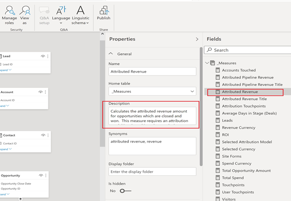

# [!DNL Marketo Measure] 报表模板 — Power BI {#marketo-measure-report-template-power-bi}

## 快速入门 {#getting-started}

您可以访问Power BI报表模板 [此处](https://github.com/adobe/Marketo-Measure-BI-Templates){target="_blank"}.

打开Adobe [!DNL Marketo Measure] 报表模板Power BI文件。

您可以在以下位置找到特定服务器、仓库和架构信息： [!DNL Marketo Measure] 上的UI [!DNL Data Warehouse] 信息页面。 有关如何查找此页面的说明已详细说明 [此处](/help/marketo-measure-data-warehouse/data-warehouse-access-reader-account.md){target="_blank"}.

QueryFilterStartDate和QueryFilterEndDate参数用于限制导入的数据量。 这些参数必须采用SQL格式，因为它们用于发送到的查询 [!DNL Snowflake]. 例如，如果您希望将数据限制在过去两年，则QueryFilterStartDate将为dateadd (year，-2，current_date())。 这些参数会与datetime数据类型进行比较，因此建议为QueryFilterEndDate使用dateadd (day，1，current_date())将所有数据返回到当前时间。

## 数据连接 {#data-connection}

打开文件时输入的参数用于构造从data warehouse导入表的本地查询。 您仍需要设置与的数据连接 [!DNL Snowflake] 实例。 为此，您将需要相同的服务器和仓库名称以及用户名和密码。 有关在何处查找您的用户名和根据需要重置密码的详细信息，已记录在案 [此处](/help/marketo-measure-data-warehouse/data-warehouse-access-reader-account.md){target="_blank"}.

## 数据导入 {#data-import}

为了提高报告性能并充分利用Power Query中的转换功能，我们选择使用导入存储方法来设置此模板。

### 查询参数 {#query-parameters}

为了限制导入到模型中的数据，每个表都使用本机查询作为源进行设置。 本机查询需要批准才能执行，您需要为每个查询单击“运行”。 仅当首次运行查询或参数更改时，才需要执行此步骤。

所有查询都会过滤掉已删除的行和 [!UICONTROL facts] 将表设置为过滤到修改日期介于作为参数输入的开始日期和结束日期之间的行。

>[!NOTE]
>
>由于日期过滤器应用于行的修改日期，因此在报告超出限制日期范围的日期时请务必谨慎。 例如，修改后的日期范围限于过去两年。 这可能包括事件日期为三年前的事件，但最近已对其进行修改。 但是，如果报告三年前的事件，则将返回不完整的结果，因为并非所有行在两年时间范围内都已修改。

以下表格被视为事实表格；修改日期的日期限制已添加到这些查询中。

* 活动
* 接触点
* 潜在客户接触点
* 归因接触点
* 成本
* 站点表单
* 会话
* 营销活动成员
* 任务
* Event
* 潜在客户/联系人阶段过渡
* 机会阶段转换

以下表被视为维度表；没有为这些查询设置日期限制。

* 帐户
* 营销活动
* 联系人
* 转化率
* 机会
* 商机
* 阶段
* 渠道

## 数据转换 {#data-transformations}

一些转换已应用于Power Query中的数据。 要查看任何表的特定转换，请打开Power Query，导航到表，并记下窗口左侧的已应用步骤。 下面概述了一些特定的转换。

### 已删除列 {#removed-columns}

为了简化数据模型，并删除冗余和不必要的数据，我们减少了从原始数据导入Power BI的列数 [!DNL Snowflake] 表格。 删除的列包括不必要的外键、通过与模型中其他表的关系、审核列和内部使用的字段更好地利用反正规化的维度数据 [!DNL Marketo Measure] 正在处理。 您可以根据业务需求添加或删除列。 在任何表格的“源”步骤之后，导航到“已删除的其他列”步骤，单击齿轮图标，然后更新所提供列表中选定的列。

>[!NOTE]
>
>* 添加其他外键值时请务必谨慎。 Power BI通常设置为自动检测模型中的关系，添加外键值可能会导致表之间出现不良链接和/或禁用现有关系。
>
>* 中的大多数表 [!DNL Marketo Measure] data warehouse包含非规范化的维度数据。 我们致力于在Power BI中尽可能规范和清理模型，以提高性能和数据准确性。 在数值表中包含任何其他非规范化字段时，请务必谨慎，这可能会破坏跨表的维度筛选，并可能导致报告不准确。

### 重命名的列 {#renamed-columns}

已对表和列进行了重命名，以使它们更便于用户使用并标准化命名约定。 要查看列名更改，请导航到任何表中“删除了其他列”步骤后面的“重命名的列”步骤。

### 重命名的区段 {#renamed-segments}

由于区段名称是可自定义的，因此它们在Snowflakedata warehouse中具有通用列名称。 [!DNL BIZ_SEGMENT_NAMES] 是一个映射表，其中列出了通用区段名称及其映射的定制区段名称，这些名称在 [!DNL Marketo Measure] UI。 “区段名称”表用于重命名“潜在客户接触点”和“归因接触点”表中的区段列。 如果不存在自定义区段，则保留通用区段名称。

### 区分大小写ID转换 {#case-sensitive-id-conversion}

[!DNL Marketo Measure] 数据具有一些主键(ID)值区分大小写（即接触点和Campaign）的表。 驱动Power BI建模层的数据引擎不区分大小写，因此会导致id值“重复”。 为了保持这些键值的大小写敏感性，我们实施了转换步骤，将不可见字符附加到小写字符，在数据引擎层评估时保留ID的唯一性。 有关该问题的更多详细信息以及我们使用的方法的详细步骤均可在 [此处] (https://blog.crossjoin.co.uk/2019 /10/06/power-bi-and-case-sensitivity/){target="_blank"}. 这些区分大小写的ID值将标记为“联接ID”，并用作关系层中的联接键。 我们已从报告层隐藏了联接ID，使原始ID值保持可见以用于报告，因为不可见的字符可能会干扰剪切/粘贴函数和筛选。

### 已添加行 {#rows-added}

为了向模型中的计算添加货币兑换功能，我们在Opportunity和Cost表中添加了一个公司兑换率列。 此列中的值是在行级别添加的，通过连接折换率表的日期和货币ID来计算。 有关货币兑换在此模型中如何工作的更多详细信息，请参阅 [货币换算](#currency-conversion) 部分。

转化率表存储在 [!DNL Snowflake] 包含每次转换的日期范围。 Power BI不允许在计算中使用联接标准（即在一系列日期之间）。 为了联结日期，我们在“转化率”表中添加了步骤以展开各行，以便在转化日期范围内每个日期都有一行。

## 数据模型 {#data-model}

单击下面的图像获取其全尺寸版本。

{target="_blank"}

### 关系和数据流 {#relationships-and-data-flow}

用于创建接触点的事件数据存储在中 [!UICONTROL Session]， [!UICONTROL Task]， [!UICONTROL Event]， [!UICONTROL Activity]和Campaign成员表。 这些事件表通过各自的ID连接到接触点表，如果事件产生了接触点，则详细信息会存储在接触点表中。

潜在客户接触点和归因接触点将存储在它们自己的表中，并提供指向接触点表的链接。 Lead和Attribution接触点的大多数维度数据源自其指向相应接触点的链接。

在此模型中，促销活动和渠道维度均链接到接触点，因此有关这些维度的所有报表均通过此链接，这意味着有关事件数据的维度报表可能不完整。 这是因为许多事件在处理到接触点之后才会有指向这些维度的链接。 注意：某些事件（如会话）确实具有到“促销活动”和“渠道”维度的直接链接。 如果需要在会话级别报告这些维度，则建议为此目的创建一个单独的数据模型。

成本数据存储在 [!DNL Snowflake] data warehouse成本表。 对于所有广告提供商，促销活动级别的数据可汇总到渠道级别。 因此，此模型根据“campaign_is_aggregatable_cost”标志提取成本数据。 自助报告的成本只能在渠道级别提交，并且不需要具有Campaign数据。 为了尽可能提供最准确的成本报告，系统将根据“channel_is_aggregatable_cost”标志提取自报告的成本。 导入成本数据的查询使用以下逻辑写入：如果ad_provider = &quot;SelfReported&quot;，则channel_is_aggregatable_cost = true，否则campaign_is_aggregatable_cost = true。

成本数据和接触点数据具有一些常见的维度，因此两个事实表都与Campaign和渠道维度表有关系。

在此模型的上下文中， [!UICONTROL Lead]， [!UICONTROL Contact]， [!UICONTROL Account]、和 [!UICONTROL Opportunity] 数据被视为维数据，并直接连接到 [!UICONTROL Lead] 接触点和 [!UICONTROL Attribution] 接触点表格。

### 已添加表 {#added-tables}

**日期**

由于Power BI仅允许一列中的表之间的关系，因此添加了“日期”维度表，以便于包含金额（业务机会和成本）的表与转化率表之间的必要联接。 有关此模型中货币兑换计算方式的更多详细信息，请参阅货币兑换部分。

**测量**

所有测量都已添加到专用的“测量”表中。 它未连接到模型，但用作存储所有测量的一个位置，以方便使用。

**归因模型**

添加了单独的表来存储归因模型的名称。 此表用于创建过滤器，这些过滤器允许用户在归因收入计算的归因模型之间进行切换。

### 货币换算 {#currency-conversion}

“折换率”表中的汇率表示从公司币种折换金额所需的值。 任何币种的折换都需要进行双重折换，首先从原始币种折换为公司币种，然后从公司币种折换为选定币种。 该模型中此链的第一步是将一个具有公司转换率的列添加到具有金额、商机和成本的表中。 有关这些步骤的详情，请参阅本文档中数据转换部分的添加的行标题。 从原始货币转换为公司货币包括将值除以此添加的列。 下一步是将公司货币值乘以兑换率表中与所选货币对应的汇率。

* 将原始值转换为公司币种值/公司折换率=公司币种值
* 将值从公司货币转换为以公司货币表示的选定货币值 `*` 所选货币的兑换率=所选货币的值

由于折换率不需要是静态的，并且可以根据指定的日期范围进行更改，因此必须在行级别执行所有货币折换计算。 同样，由于折换率与特定的日期范围相关，因此查找计算必须在度量的DAX内执行，因此可以在货币代码和日期上定义关系。

如果没有能够识别兑换率，则此模型中的货币兑换度量将使用1.0值替代兑换率。 已创建单独的度量值以显示度量的货币值，如果计算包含多个货币值（即，无法将值转换为所选货币），则发出警报。

## 数据定义 {#data-definitions}

已将表、自定义列和度量的定义添加到Power BI模型中。

要查看直接来自的列的定义 [!DNL Snowflake]，请参阅 [data warehouse文档](/help/marketo-measure-data-warehouse/data-warehouse-schema.md){target="_blank"}

## 模板和发现之间的差异 {#discrepancies-between-templates-and-discover}

### 已归因收入 {#attributed-revenue}

潜在客户接触点和归因接触点继承原始接触点的维度数据。 报表模板模型会从关系到接触点收集所有继承的维度数据，而在发现模型中，维度数据会反正规化为“潜在客户”和“归因接触点”记录。 整体归因收入或归因管道收入值应在这两个报表之间对齐。 但是，当按维度数据（渠道、子渠道或营销活动）划分或过滤收入时，可能会发现不一致。 如果模板和发现之间的维度收入量不匹配，则模板报表数据集可能缺少接触点记录。 当有“商机”或“归因”接触点记录，但接触点表中没有导入到报表中的数据集中的相应记录时，会发生这种情况。 由于这些表是按修改日期筛选的，因此“商机/归因接触点”记录的修改可能比接触点记录更晚，因此“商机/归因接触点”已导入数据集，而原始接触点记录并非如此。 要解决此问题，请扩大接触点表的过滤日期范围，或者考虑一起删除日期限制。 注意：接触点是一个大表，因此请考虑更完整数据集与必须导入的数据量之间的取舍。

### 成本 {#cost}

模板中的成本报告仅在营销活动和渠道级别可用，但是，对于某些广告提供商（如创意、关键字、广告组等），可在较低级别的粒度下发现优惠报告。 有关如何在模板中为成本数据建模的更多详细信息，请参阅本文档的数据模型部分。 如果维度过滤于 [!UICONTROL Discover] 设置为渠道或营销活动，渠道级别、子渠道级别和营销活动级别的成本应在发现和报表模板之间对齐。

### ROI {#roi}

由于ROI是通过归因收入和成本计算的，因此ROI中可能出现的任何一种计算中的相同差异，原因也相同，如这些部分中所述。

### 接触点 {#touchpoints}

这些量度（如报表模板中所示）不会在“发现”中镜像。 目前两者之间无法直接比较。

### 网络流量 {#web-traffic}

报表模板数据模型通过会话与接触点之间的关系标准化渠道、子渠道和营销活动维度数据。 这与发现数据模型不同，后者将这些维度反规范化为会话。 由于这种区别，Discover和报告模板之间的访问和访客的总体计数应该相匹配，但是，一旦按维度显示或过滤，这些数字就不应对齐。 这是因为模板中的维度数据仅适用于导致接触点的Web事件（即非匿名事件）。 欲知更多详情，请参考 [数据模型](#data-model) 部分。

网站表单总数在以下两者之间可能存在较小差异 [!DNL Discover] 和模板。 这是因为报表模板中的数据模型通过依次与会话和接触点的关系获取网站表单的维度数据；在少数情况下，网站表单数据没有相关的会话。

### 潜在客户和客户 {#leads-and-accounts}

所接触帐户的维度报表在发现和模板之间可能略有不同，这同样是由于维度建模来自接触点和潜在客户接触点或归因接触点之间的关系。 有关更多详细信息，请参阅归因收入部分中列出的详细信息。

Discover中的所有商机计数都是归因商机计数，并且在报表模板中，量度是接触到的商机。 因此，在这两个报告中不可能直接比较这项措施。

### 参与路径 {#engagement-path}

两者之间没有直接的比较 [!UICONTROL Engagement Path] 发现和模板中的报告。 中的报告 [!DNL Discover] 根据接触点建模，而模板中的报表根据归因接触点建模。 模板仅侧重于机会及其相关的接触点，而不是显示所有接触点数据。

### 交易速度 {#deal-velocity}

模板中的此报告与Discover中Velocity仪表板上的“交易速度”拼贴之间应该没有差异。
