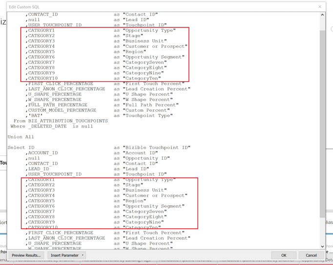

# [!DNL Marketo Measure] 报表模板 — 表格 {#marketo-measure-report-template-tableau}

## 快速入门 {#getting-started}

您可以访问 [!DNL Tableau] 报告模板 [此处](https://github.com/adobe/Marketo-Measure-BI-Templates){target="_blank"}.

打开 [!DNL Adobe Marketo Measure] 报表模板表格工作簿文件。

您需要将现有连接数据更新为特定Snowflake连接信息。 单击 [!UICONTROL Edit Connection] 按钮，并按照 [[!UICONTROL Data Connection]](#data-connection) 部分。


## 数据连接 {#data-connection}

您需要设置与Snowflake实例的数据连接。 为此，您需要服务器名称以及用户名和密码。 有关在何处查找此信息和根据需要重置密码的详细信息，已记录在案 [此处](/help/marketo-measure-data-warehouse/data-warehouse-access-reader-account.md){target="_blank"}.


您还需要输入初始SQL命令。 这支持在此数据模型中使用自定义查询。 要输入的命令是“使用架构” `<your schema name>`“。 您可以在以下位置找到架构名称： [!UICONTROL data warehouse connections] 页面，请参阅上面引用的文档。


### 自定义SQL查询 {#custom-sql-queries}

因为 [!DNL Tableau] 我们将数据源筛选器应用到整个查询，而不是应用到筛选器所设置的单个表中，我们选择对模型中的每个表使用自定义SQL。 这允许模型过滤掉表级别的已删除行和重复行。 例如，当应用为数据源过滤器时，会话。_deleted_date为null将添加到查询的where子句中，从而生成以下查询。

**已添加到数据源的筛选器**

```
--A deleted session removes this row completely and the touchpoint data is lost. Select *
   From Touchpoint    tp
      join Session sn
      on tp.session_id = sn.session_id 
 Where tp._deleted_date is null
    and sn._deleted_date is null
```

但是，这不正确，因为如果删除了会话，但未删除相应的接触点，则将从数据集中删除接触点数据。 我们希望数据集中存在接触点数据，因为尚未删除接触点。 添加自定义SQL可确保筛选条件在表级别应用，从而生成以下查询。

**通过自定义SQL应用的筛选器**

```
--A deleted session only removes the session related data, and the touchpoint data is preserved. Select *
   From Touchpoint       tp
      join Session sn
      on tp.session_id          = sn.session_id 
      and sn._deleted_date      is null
  Where tp._deleted_date is null
```

## 数据转换 {#data-transformations}

有一些转换已经应用于中的数据 [!DNL Tableau] 从Snowflake的原始状态开始。 这些转换中的大多数都应用于自定义SQL查询，这些查询在 [!DNL Tableau] 模型。 要查看用于生成表的自定义SQL，请右键单击表名并选择“编辑自定义SQL查询”。 下面概述了一些特定的转换。


### 已删除列 {#removed-columns}

为了简化数据模型，并删除冗余和不必要的数据，我们减少了从原始Snowflake表中导入Tableau的列数。 删除的列包括不必要的外键、最好通过与模型中其他表的关系使用的反正规化维度数据、审核列以及用于内部的字段 [!DNL Marketo Measure] 正在处理。 您可以根据需要通过编辑自定义SQL的Select部分中的导入列列表来添加或删除列。

>[!NOTE]
>
>数据仓库中的大多数表包含非正规化的维数据。 我们一直在努力将中的模型正常化并清理 [!DNL Tableau] 尽可能提高性能和数据准确性。 在数值表中包含任何其他非规范化字段时，请务必谨慎，这可能会破坏跨表的维度筛选，并可能导致报告不准确。

### 重命名的列 {#renamed-columns}

已重命名表和列，使它们更便于用户使用并标准化命名约定。 要查看列名更改，请引用创建表的自定义SQL语句。

### 已添加行 {#rows-added}

为了向模型中的计算添加货币兑换功能，我们在Opportunity和Cost表中添加了一个公司兑换率和目标兑换率列。 这些列中的值在行级别添加，并通过在日期和货币ID上联接到兑换率表来计算。 由于Tableau不允许事实表共享多个维度表，因此转换率直接添加到使用它的表中。 有关货币兑换在此模型中如何工作的更多详细信息，请参阅 [货币换算](#currency-conversion) 部分。


有些地方有两张桌子 [!DNL Snowflake] 已与一个合并组合在一起，以在 [!DNL Tableau] 数据模型。 在这些情况下，已添加“类型”列来指示哪个 [!DNL Snowflake] 表并指定行所代表的实体。 有关已合并的表的更多详细信息，请参阅本文档中的“关系和数据流”部分。


### 区段名称 {#segment-names}

由于区段名称是可自定义的，因此它们在Snowflake数据仓库中具有通用列名称。 [!DNL BIZ_SEGMENT_NAMES] 是一个映射表，其中列出了通用区段名称及其映射到的自定义区段名称，如 [!DNL Marketo Measure] UI。 如果您使用自定义区段名称并希望更新 [!DNL Tableau] 要合并这些列，请使用此表并手动重命名Tableau模型内的列。 区段列位于“潜在客户”和“归因接触点”表中，只需重命名一次。

此 [!UICONTROL CATEGORY] 列列出类别编号，而SEGMENT_NAME列具有其映射到的自定义段名称。


可通过两种方式更新名称。 第一个选项是更新自定义SQL。 在此示例中，已根据“区段名称”表中的映射重命名了类别1-6。



另一个选项是直接在中重命名列 [!DNL Tableau] 表格。


## 数据模型 {#data-model}

单击下面的图像获取其全尺寸版本。

[](/help/bi-report-templates/assets/tableau-data-model.png){target="_blank"}

### 关系和数据流 {#relationships-and-data-flow}

用于创建接触点的事件数据存储在中 [!UICONTROL Session]， [!UICONTROL Task]， [!UICONTROL Event]， [!UICONTROL Activity]、和 [!UICONTROL Campaign Member] 表格。 这些事件表通过各自的ID连接到接触点表，如果事件产生了接触点，则详细信息会存储在接触点表中。

潜在客户接触点和归因接触点将合并到此模型中的同一张表中，并带有指向接触点表的链接。 添加了“接触点类型”列，以指定某行是“潜在客户”还是“归因”接触点。 Lead和Attribution接触点的大多数维度数据源自其指向相应接触点的链接。

Opportunity Stage Transitions和Lead Stage Transitions将合并到此模型中的一个表中，其中包含指向 [!UICONTROL Lead and Attribution] 接触点表。 添加了“过渡类型”列，以指定某行是Opportunity阶段还是Lead阶段过渡。

成本和接触点数据共享“渠道”和“促销活动”维度。 但是，Tableau在事实表之间对共享维建模的能力有限。 由于我们限制为仅有一个共享维度表，因此“渠道”和“促销活动”数据已合并到一个表中。 在Tableau中，使用两个维度的交叉联接将它们组合到一个表中：渠道和营销活动。 唯一ID是通过关联渠道和营销活动ID创建的。 将同一ID值添加到接触点和成本表，以创建与此组合维度表的关系。


在此模型中，促销活动和渠道维度均链接到接触点，因此有关这些维度的所有报表均通过此链接，这意味着有关事件数据的维度报表可能不完整。 这是因为许多事件在处理到接触点之后才会有指向这些维度的链接。

>[!NOTE]
>
>某些事件（如会话）确实具有到“营销活动”和“渠道”维度的直接链接。 如果需要在会话级别报告这些维度，则建议为此目的创建一个单独的数据模型。

成本数据存储在Snowflake数据仓库成本表中的不同聚合级别上。 对于所有广告提供商，促销活动级别的数据可汇总到渠道级别。 因此，此模型根据“campaign_is_aggregatable_cost”标志提取成本数据。 自助报告的成本只能在渠道级别提交，并且不需要具有Campaign数据。 为了尽可能提供最准确的成本报告，系统将根据“channel_is_aggregatable_cost”标志提取自报告的成本。 导入成本数据的查询使用以下逻辑写入：如果ad_provider = &quot;SelfReported&quot;，则channel_is_aggregatable_cost = true，否则campaign_is_aggregatable_cost = true。

在这个模型的上下文中，Lead [!UICONTROL Contact]， [!UICONTROL Account]、和 [!UICONTROL Opportunity] 数据被视为维度数据，并直接联接到潜在客户和归因接触点表。

### 货币换算 {#currency-conversion}

“折换率”表中的汇率表示从公司币种折换金额所需的值。 任何币种的折换都需要进行双重折换，首先从原始币种折换为公司币种，然后从公司币种折换为选定币种。 模型中此链的第一步是将具有这些折换率的两列添加到具有金额、商机和成本的表中。 有关这些步骤的详情，请参阅本文档中的添加行部分。 由于折换率不需要是静态的，并且可以根据指定的日期范围进行更改，因此必须在行级别执行所有货币折换计算。 从原始币种折换为公司币种包括将值除以公司折换率，然后乘以目标折换率。 目标兑换率由所选的货币参数值确定。

* 将原始值转换为公司币种值/公司折换率=公司币种值
* 将值从公司货币转换为以公司货币表示的选定货币值 `*` 所选货币的兑换率=所选货币的值


如果没有能够识别兑换率，则此模型中的货币兑换度量将使用1.0值替代兑换率。 已创建单独的度量以显示度量的货币值，如果计算包含多个货币值（即，无法将值转换为所选货币），则发出警报。 这些指标（成本货币和收入货币）作为工具提示包含在任何显示成本或收入数据的视觉效果中。


## 数据定义 {#data-definitions}

定义已添加到 [!DNL Tableau model] 用于参数、自定义列和测量。


要查看直接来自的列的定义 [!DNL Snowflake]，请参见 [数据仓库文档](/help/marketo-measure-data-warehouse/data-warehouse-schema.md){target="_blank"}.

## 模板和发现之间的差异 {#discrepancies-between-templates-and-discover}

### 已归因收入 {#attributed-revenue}

潜在客户接触点和归因接触点继承原始接触点的维度数据。 报表模板模型会从关系到接触点收集所有继承的维度数据，而在发现模型中，维度数据会反正规化为“潜在客户”和“归因接触点”记录。 整体归因收入或归因管道收入值应在这两个报表之间对齐。 但是，当按维度数据（渠道、子渠道或营销活动）划分或过滤收入时，可能会发现不一致。 如果模板和发现之间的维度收入量不匹配，则模板报表数据集可能缺少接触点记录。 当有“商机”或“归因”接触点记录，但接触点表中没有导入到报表中的数据集中的相应记录时，会发生这种情况。 由于这些表是按修改日期筛选的，因此“商机/归因接触点”记录的修改可能比接触点记录更晚，因此“商机/归因接触点”已导入数据集，而原始接触点记录并非如此。 要解决此问题，请扩大接触点表的过滤日期范围，或者考虑一起删除日期限制。

>[!NOTE]
>
>接触点是一个大表，因此请考虑更完整数据集与必须导入的数据量之间的取舍。

### 成本 {#cost}

模板中的成本报告仅在营销活动和渠道级别可用，但是，对于某些广告提供商（如创意、关键字、广告组等），可在较低级别的粒度下发现优惠报告。 有关如何在模板中建模成本数据的更多详细信息，请参阅 [!UICONTROL Data Model] 部分。 如果维度过滤于 [!UICONTROL Discover] 设置为渠道或营销活动，渠道级别、子渠道级别和营销活动级别的成本应在发现和报表模板之间对齐。

### ROI {#roi}

由于ROI是通过归因收入和成本计算的，因此ROI中可能出现的任何一种计算中的相同差异，原因也相同，如这些部分中所述。

### 接触点 {#touchpoints}

这些量度（如报表模板中所示）不会在“发现”中镜像。 目前两者之间无法直接比较。

### 网络流量 {#web-traffic}

报表模板数据模型通过会话与接触点之间的关系标准化渠道、子渠道和营销活动维度数据。 这与发现数据模型不同，后者将这些维度反规范化为会话。 由于这种区别，Discover和报告模板之间的访问和访客的总体计数应该相匹配，但是，一旦按维度显示或过滤，这些数字就不应对齐。 这是因为模板中的维度数据仅适用于导致接触点的Web事件（即非匿名事件）。 欲知更多详情，请参见 [数据模型](#data-model) 部分。

网站表单总数在以下两者之间可能存在较小差异 [!DNL Discover] 和模板。 这是因为报表模板中的数据模型通过依次与会话和接触点的关系获取网站表单的维度数据；在少数情况下，网站表单数据没有相关的会话。

### 潜在客户和客户 {#leads-and-accounts}

所接触帐户的维度报表可能略有不同 [!DNL Discover] 和模板，这再次归因于来自接触点和潜在接触点或归因接触点之间的关系的维度建模。 有关更多详细信息，请参阅归因收入部分中概述的详细信息。

中的所有潜在客户计数 [!UICONTROL Discover] 是已归因的销售线索计数，在报表模板中，该指标为 [!UICONTROL leads] 触手可及。 因此，在这两个报告中不可能直接比较这项措施。

### 参与路径 {#engagement-path}

两者之间没有直接的比较 [!UICONTROL Engagement Path] 报告位置 [!DNL Discover] 和模板。 中的报告 [!DNL Discover] 根据接触点建模，而模板中的报表根据归因接触点建模。 模板仅侧重于机会及其相关的接触点，而不是显示所有接触点数据。

### 交易速度 {#deal-velocity}

模板中的此报告与Discover中Velocity仪表板上的“交易速度”拼贴之间应该没有差异。
