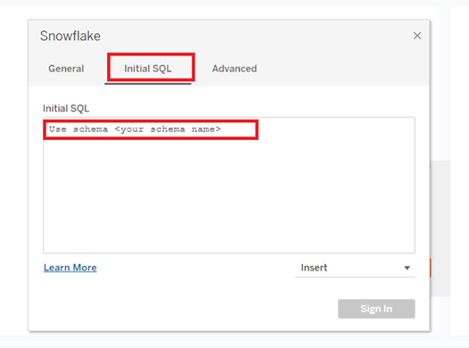
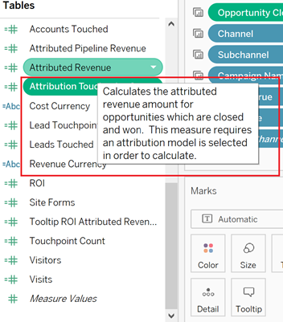

# [!DNL Marketo Measure] 报表模板 — 表格 {#marketo-measure-report-template-tableau}

## 快速入门 {#getting-started}

您可以访问 [!DNL Tableau] 报告模板 [此处](https://github.com/adobe/Marketo-Measure-BI-Templates){target="_blank"}.

打开 [!DNL Adobe Marketo] 测量报表模板表格工作簿文件。

您需要将现有连接数据更新为您的特定Snowflake连接信息。 单击 [!UICONTROL Edit Connection] 按钮，并按照 [[!UICONTROL Data Connection]](#data-connection) 部分。


## 数据连接 {#data-connection}

您需要设置与Snowflake实例的数据连接。 为此，您需要服务器名称以及用户名和密码。 有关在何处查找此信息并在需要时重置密码的详细信息已记录 [此处](/help/marketo-measure-data-warehouse/data-warehouse-access-reader-account.md){target="_blank"}.


您还需要输入初始SQL命令。 这支持在此数据模型中使用自定义查询。 要输入的命令是“使用架构” `<your schema name>`&quot; 您可以在 [!UICONTROL data warehouse connections] 页面，请参阅上面引用的文档。



### 自定义SQL查询 {#custom-sql-queries}

因为 [!DNL Tableau] 将数据源过滤器应用于整个查询，而不是应用于筛选器所设置的单个表，我们选择对模型中的每个表使用自定义SQL。 这允许模型在表级别过滤掉已删除和重复的行。 例如，当应用为数据源过滤器时，会话。_deleted_date为null将添加到查询的where子句中，从而生成以下查询。

**添加到数据源的过滤器**

```
--A deleted session removes this row completely and the touchpoint data is lost. Select *
   From Touchpoint    tp
      join Session sn
      on tp.session_id = sn.session_id 
 Where tp._deleted_date is null
    and sn._deleted_date is null
```

但是，这是不正确的，因为如果删除了会话，但未删除相应的接触点，则接触点数据会从数据集中删除。 我们希望数据集中存在接触点数据，因为接触点尚未删除。 添加自定义SQL可确保在表级别应用筛选条件，从而生成以下查询。

**通过自定义SQL应用的过滤器**

```
--A deleted session only removes the session related data, and the touchpoint data is preserved. Select *
   From Touchpoint       tp
      join Session sn
      on tp.session_id          = sn.session_id 
      and sn._deleted_date      is null
  Where tp._deleted_date is null
```

## 数据转换 {#data-transformations}

对中的数据应用了一些转换 [!DNL Tableau] 从原始状态Snowflake。 这些转换中的大多数都应用于自定义SQL查询，这些查询在 [!DNL Tableau] 模型。 要查看用于生成表的自定义SQL，请右键单击表名称并选择“编辑自定义SQL查询”。 下面概述了一些特定的转换。


### 删除的列 {#removed-columns}

为了简化数据模型并删除冗余和不必要的数据，我们减少了从原始Snowflake表导入Tableau的列数。 删除的列包括不必要的外键、通过与模型中其他表的关系更好地利用的异常维度数据、审核列和用于内部的字段 [!DNL Marketo Measure] 正在处理。 您可以根据业务需要，通过编辑自定义SQL的“选择”部分中导入列的列表，来添加或删除列。

>[!NOTE]
>
>data warehouse中的大多数表都包含不规范的维数据。 我们已努力将模型规范化和清理 [!DNL Tableau] 尽可能提高性能和数据准确性。 当在事实表中包含任何其他非规范字段时，请务必小心，这可能会破坏表格中的维过滤，并且还可能导致报告不准确。

### 重命名的列 {#renamed-columns}

表和列已重命名，以使它们更易于使用，并标准化命名惯例。 要查看列名称更改，请引用创建表的自定义SQL语句。

### 添加的行 {#rows-added}

为了在模型中的计算中添加货币换算功能，我们在Opportunity和Cost表中都添加了公司换算率和目标换算率列。 这些列中的值将在行级别添加，并通过在日期和货币ID上加入“转化率”表来评估。 由于表格不允许事实表共享多个维度表，因此转化率直接添加到使用该维度表的表中。 有关此模型中货币换算工作方式的更多详细信息，请参阅 [货币兑换](#currency-conversion) 部分。


有几个地方有两张桌子 [!DNL Snowflake] 已与并集组合，以在中创建一个表 [!DNL Tableau] 数据模型。 在这些情况下，添加了“类型”列以指示 [!DNL Snowflake] 表格，并指定行表示的实体。 有关已合并表的更多详细信息，请参阅此文档中的关系和数据流部分。


### 区段名称 {#segment-names}

由于区段名称是可自定义的，因此它们在Snowflakedata warehouse中具有通用列名称。 [!DNL BIZ_SEGMENT_NAMES] 是一个映射表，其中列出了通用区段名称以及它映射到的自定义区段名称，如 [!DNL Marketo Measure] UI。 如果您使用自定义区段名称，并且希望 [!DNL Tableau] 要合并这些元素，请使用此表并手动重命名表格模型中的列。 区段列位于潜在客户和归因接触点表中，只需重命名一次。

的 [!UICONTROL CATEGORY] 列列出类别编号，SEGMENT_NAME列具有它映射到的自定义区段名称。


可以通过两种方式更新名称。 第一个选项是更新自定义SQL。 在此示例中，已根据区段名称表中的映射重命名类别1-6。


另一个选项是直接在 [!DNL Tableau] 表。


## 数据模型 {#data-model}

对于其全尺寸版本，请单击下图。

[](/help/bi-report-templates/assets/tableau-data-model.png){target="_blank"}

### 关系和数据流 {#relationships-and-data-flow}

用于创建接触点的事件数据存储在 [!UICONTROL Session], [!UICONTROL Task], [!UICONTROL Event], [!UICONTROL Activity]和 [!UICONTROL Campaign Member] 表格。 这些事件表通过其各自的ID连接到接触点表，如果事件导致接触点，则详细信息会存储在接触点表中。

潜在接触点和归因接触点将合并到此模型中的一个表中，并包含指向接触点表的链接。 添加了“接触点类型”列以指定某行是潜在客户还是归因接触点。 潜在客户接触点和归因接触点的大多数维度数据都源自其指向相应接触点的链接。

机会阶段过渡和潜在客户阶段过渡组合到此模型中的一个表中，并包含指向 [!UICONTROL Lead and Attribution] 接触点表。 添加了“过渡类型”列，以指定某行是“机会”还是“潜在客户”阶段过渡。

成本和接触点数据共享渠道和促销活动维度。 但是，Tableau在对事实表之间共享维度进行建模方面存在限制。 由于我们仅限于一个共享维度表，因此渠道和促销活动数据已合并到一个表中。 在Tableau中，它们使用两个维度的交叉连接组合到一个表中：渠道和营销活动。 唯一ID是通过关联渠道ID和营销活动ID来创建的。 此ID值会添加到接触点和成本表，以创建与此组合维度表的关系。


在此模型中，促销活动和渠道维度已链接到接触点，因此有关这些维度的所有报表都通过此链接进行，这意味着有关事件数据的维度报表可能不完整。 这是因为许多事件在处理到接触点中之后才会包含这些维度的链接。

>[!NOTE]
>
>某些事件（如会话）确实具有指向营销活动和渠道维度的直接链接。 如果需要在会话级别报告这些维度，则建议为此创建单独的数据模型。

成本数据在Snowflakedata warehouse成本表中以不同的聚合级别存储。 对于所有广告提供商，可以将促销活动级别的数据汇总到渠道级别。 因此，此模型会根据“campaign_is_aggregatable_cost”标记提取成本数据。 只能在渠道级别提交自我报告的成本，无需具有Campaign数据。 为了提供尽可能最准确的成本报告，会根据“channel_is_aggregatable_cost”标记提取自行报告的成本。 使用以下逻辑写入用于导入成本数据的查询：如果ad_provider = &quot;SelfReported&quot; ，则channel_is_aggregatable_cost = true，否则campaign_is_aggregatable_cost = true。

在这种模式下，领导， [!UICONTROL Contact], [!UICONTROL Account]和 [!UICONTROL Opportunity] 数据被视为维度数据，并直接连接到潜在客户和归因接触点表。

### 货币兑换 {#currency-conversion}

“折算率”(Conversion Rate)表格中的汇率表示从公司货币换算金额所需的值。 转换为任何货币需要进行双重转换，首先从原始货币转换为公司货币，然后从公司货币转换为所选货币。 此链的模型中的第一步是，将具有这些转化率的两列添加到具有金额、机会和成本的表中。 有关这些步骤的详情，请参阅本文档的添加的行一节。 由于兑换率不是静态的，并且可以按指定的日期范围进行更改，因此必须在行级别执行所有货币兑换计算。 从原始货币换算为公司货币包括将价值除以公司转化率，然后乘以目标转化率。 目标兑换率由所选货币参数值确定。

* 将原始值换算为公司货币值/公司换算率=以公司货币表示的值
* 以公司货币将值从公司换算为选定的货币值 `*` 选定货币的兑换率=选定货币的值


如果无法识别兑换率，此模型中的货币兑换度量会将值1.0替换该汇率。 已创建单独的度量以显示度量的货币值，如果计算包含多个货币值（即，无法将值转换为所选货币），则会发出警报。 这些度量（成本币种和收入币种）将作为显示成本或收入数据的任何可视化工具提示包含在内。


## 数据定义 {#data-definitions}

定义已添加到 [!DNL Tableau model] 参数、自定义列和度量。



查看直接来自的列的定义 [!DNL Snowflake]，请参阅 [data warehouse文档](/help/marketo-measure-data-warehouse/data-warehouse-schema.md){target="_blank"}.

## 模板与Discover之间的差异 {#discrepancies-between-templates-and-discover}

### 归因收入 {#attributed-revenue}

潜在客户接触点和归因接触点会从原始接触点继承维度数据。 报表模板模型从与接触点的关系中来源所有继承的维度数据，而在Discover模型中，维度数据会异常化为潜在客户和归因接触点记录。 总的归因收入或归因管道收入值应在两个报表之间排列。 但是，当按维度数据（渠道、子渠道或营销活动）划分或过滤收入时，可能会发现差异。 如果模板和Discover之间的维度收入额不匹配，则模板报表数据集中可能缺少接触点记录。 当具有潜在客户或归因接触点记录，但在导入报表的数据集内的接触点表中没有相应记录时，会发生这种情况。 由于这些表按修改日期进行过滤，因此潜在客户/归因接触点记录可能比接触点记录更近修改，因此潜在客户/归因接触点已导入数据集，而原始接触点记录则不会。 要解决此问题，请扩大接触点表的过滤日期范围，或考虑将日期约束全部删除在一起。

>[!NOTE]
>
>接触点是一个大表，因此请考虑更完整数据集与必须导入的数据量之间的权衡。

### 成本 {#cost}

模板中的成本报表仅在促销活动和渠道级别可用，但是， Discover为某些广告提供商（例如创意、关键词、广告组等）提供粒度级别较低的报表。 有关如何在模板中建模成本数据的更多详细信息，请参阅 [!UICONTROL Data Model] 部分。 如果维度在 [!UICONTROL Discover] 设置为“渠道”或“营销活动”时，“渠道”、“子渠道”和“营销活动”级别的成本应在“发现”和“报表”模板之间排列。

### ROI {#roi}

由于ROI是根据归因收入和成本计算的，因此其中任一计算中可能出现的差异都可能出现在ROI中，原因也相同，如这些部分所述。

### 接触点 {#touchpoints}

如报表模板中所示，这些量度不会在Discover中镜像。 目前无法直接比较两者。

### Web流量 {#web-traffic}

报表模板数据模型通过会话与接触点之间的关系，将渠道、子渠道和促销活动维度数据标准化。 这与Discover数据模型不同，Discover数据模型会将这些维度规范化为会话。 由于这一区别，访问和访客的总计数应与Discover和报表模板相匹配，但是，按维度显示或过滤后，这些数字便不会保持一致。 这是因为模板中的维度数据仅可用于导致接触点（即非匿名事件）的Web事件。 有关更多详细信息，请参考 [数据模型](#data-model) 部分。

网站表单总计数之间可能存在细微差异 [!DNL Discover] 和模板。 这是因为报表模板中的数据模型通过与会话的关系，然后通过接触点获取网站表单的维度数据；在少数情况下，网站表单数据没有相关会话。

### 潜在客户和帐户 {#leads-and-accounts}

接触帐户的维度报表可能因 [!DNL Discover] 和模板一样，这也是由于维度建模来自接触点与潜在接触点或归因接触点之间的关系。 有关更多详细信息，请参阅归因收入部分中概述的详细信息。

所有潜在客户计数 [!UICONTROL Discover] 属性潜在客户计数，在报表模板中量度为 [!UICONTROL leads] 被抚摸了。 因此，无法直接比较此措施的两个报告。

### 参与路径 {#engagement-path}

在 [!UICONTROL Engagement Path] 报告 [!DNL Discover] 和模板。 报表位于 [!DNL Discover] 模板中的报表是基于归因接触点建模的，而模板中的报表是基于归因接触点建模的。 模板仅关注机会及其相关接触点，而不显示所有接触点数据。

### 交易速度 {#deal-velocity}

模板中的此报表与Discover中Velocity功能板上的Deal Velocity拼贴之间应该没有差异。
