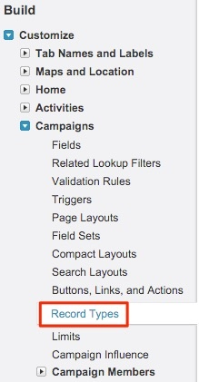
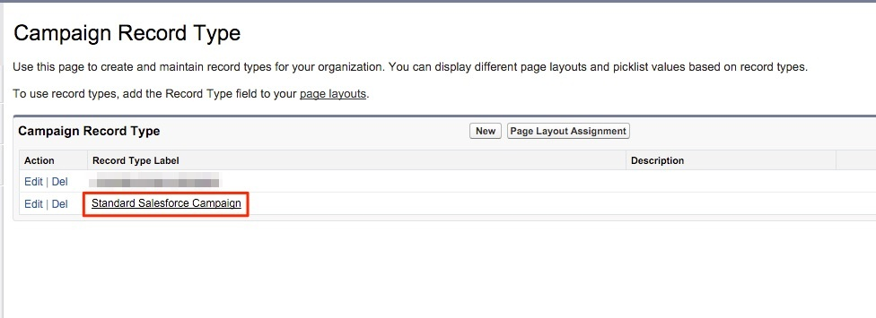
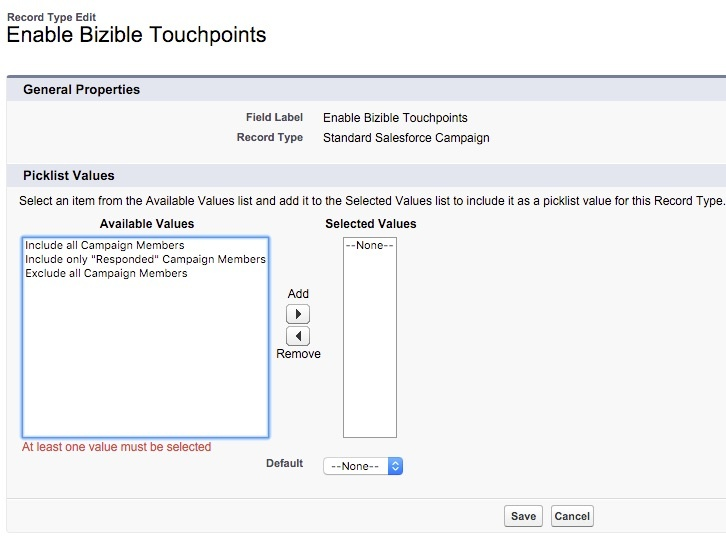

# 多个营销活动记录类型的配置 {#configurations-for-multiple-campaign-record-types}

**“启用买方接触点”字段中缺少选取列表值**

如果您的SFDC组织使用多种促销活动记录类型，则必须为每个记录类型添加“启用采购员接触点”的选择列表值。 要添加选项，请执行以下步骤。

1. 转到 **[!UICONTROL Setup]** > **[!UICONTROL Customize]** > **[!UICONTROL Campaigns]** > **[!UICONTROL Record Types]**.

   

1. 通过单击 **[!UICONTROL Record Type Label]**，而不是 [!UICONTROL edit] 按钮。

   

1. 此时您会看到该记录类型的可用选择列表。 选择 **[!UICONTROL Edit]** ，位于“启用买方接触点”字段旁。

   

1. 将“可用值”分组中的所有三个值添加到“选定值”分组。

   

1. 将默认值设置为“无”并单击 **[!UICONTROL Save]**. 对任何其他Campaign记录类型重复此操作。
