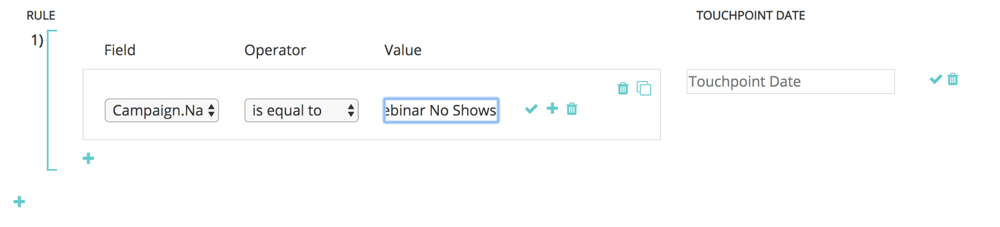

# 自定义Campaign同步 {#custom-campaign-sync}

现在，通过安装 [!DNL Marketo Measure] 程序包中，您可以指定要作为合格接触点包含哪些营销活动。 与以前一样，这方面存在多个障碍。 一旦 [!DNL Marketo Measure] 包安装在CRM中，您的安全团队批准可能需要一些时间。 此外，在Campaign对象中使用单个选取列表时缺乏灵活性。 使用此新功能，无需安装软件包，即可开始使用Campaign和Campaign成员记录。 可以构建规则以明确定义可以构建的记录以明确定义哪些记录符合条件。

## 要求 {#requirements}

* Campaign同步在所有层都可用
* 要导入数据，您仍需要将CRM连接到 [!DNL Marketo Measure] 帐户

## 工作原理 {#how-it-works}

1. 拥有AccountAdmin权限，您可以导航到 **[!UICONTROL Settings]** > **[!UICONTROL Campaigns]** 和查看同步Campaign成员规则UI。
1. 单击 **+** 图标以开始创建规则。

   

1. 您可以选择从以下位置创建规则 [!UICONTROL Campaign] 或 [!UICONTROL Campaign Member] 字段。 使用我们应验证的运算符和值填写规则的其余部分。 在下面的示例中，我们将按名称检查特定Campaign。

   

   >[!NOTE]
   >
   >公式字段不能在规则中使用，也不会显示在选择列表中。 因为公式在后台计算且不会修改记录， [!DNL Marketo Measure] 无法检测记录是否适合规则。

1. 选择接触点日期。 输入大括号后，将显示可能日期的列表 `{`  — 然后，您可以选择要应用于通过规则创建的所有接触点的日期。

   

   >[!NOTE]
   >
   >如果您使用的是自定义Campaign同步规则， [!DNL Marketo Measure] 将不会读取您使用“批量更新接触点日期”按钮所做的任何更新。

1. 单击复选标记，然后根据需要为其他营销活动添加其他规则。

   

   >[!NOTE]
   >
   >现在，规则已与CRM同步一起定义，声明的规则自然将开始冲突。 如果选择继续使用这两个自定义促销活动同步，请执行以下操作 _和_ CRM同步类型，请务必创建规则，这样您的CRM同步类型就不会被忽略。

   

   >[!NOTE]
   >
   >如果您考虑最终停止 [!UICONTROL CRM Sync Type]时，理想的做法是创建不引用“同步类型”的规则，但是 _静态_ 维护当前的CRM接触点。 这样，当进行切换时，规则仍然有效。

下面是一个示例，其中显示了任何现有的CRM接触点都不会丢失：

## 验证 {#validation}

您可以轻松检查Campaign中的“买方接触点”和“买方归因接触点”记录，以确保规则正常工作。 这是一个BAT [!DNL Marketo Measure] 创建日期具有相应的动态接触点日期，可从营销策划中提取。 “创建日期”字段位于其下图。

## 测试 {#testing}

1. Campaign同步功能附带测试功能，以便您检查已创建的规则是否实际符合Campaign条件。 首先，单击 [!UICONTROL Test] 按钮。 必须先保存规则，然后才能开始测试。

   

   此时将显示一个弹出窗口，您可以在其中输入营销活动ID（CRM中的15或18个字符）以进行测试。 关键是输入您尝试同步的CRM中的促销活动ID，以确保该ID与您创建的规则相匹配。

   

1. 单击之后 [!UICONTROL Test]，您将看到Campaign的名称和符合接触点资格的Campaign成员数量。 下表将显示与您的促销活动ID匹配的所有规则。 只显示匹配项。

   

1. 您还可以单击Member count （成员计数）以查看作为Campaign规则资格一部分的潜在客户和联系人及其ID的列表。 这只是一个示例集，最多可显示50个记录，以便您了解哪些记录符合条件。

   
