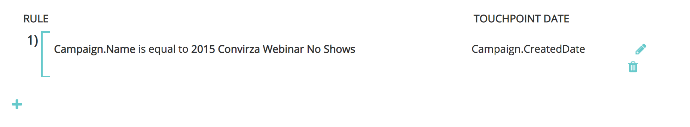

# 自定义营销活动同步 {#custom-campaign-sync}

今天，安装了 [!DNL Marketo Measure] 包中，您能够指示要作为合格接触点包含的营销活动。 与以前一样，这存在多个障碍。 一旦 [!DNL Marketo Measure] 包已安装在CRM中，可能需要一些时间才能获得安全团队的批准。 此外，在Campaign对象上使用单个选取列表时缺乏灵活性。 使用此新功能，无需安装包即可开始使用Campaign和Campaign成员记录。 可以构建规则以准确定义可以构建哪些记录，以准确定义哪些记录符合条件。

## 要求 {#requirements}

* 营销活动同步在所有层中都可用
* 要导入数据，您仍需要将CRM连接到 [!DNL Marketo Measure] 帐户

## 工作原理 {#how-it-works}

1. 借助AccountAdmin权限，您可以导航到 **[!UICONTROL Settings]** > **[!UICONTROL Campaigns]** 请参阅同步营销活动成员规则UI。
1. 单击 **+** 图标以开始创建规则。

   

1. 您可以选择从中创建规则 [!UICONTROL Campaign] 或 [!UICONTROL Campaign Member] 字段。 使用我们需要验证的运算符和值填写规则的其余部分。 在以下示例中，我们正在按名称检查特定营销活动。

   

   >[!NOTE]
   >
   >公式字段不能在规则中使用，也不会显示在选取列表中。 由于公式在后台计算而不修改记录， [!DNL Marketo Measure] 无法检测记录是否符合规则。

1. 选择接触点日期。 在输入花括号后，将显示可能的日期列表 `{`  — 然后，您可以选择要选择将其应用于规则中创建的所有触点的日期。

   

   >[!NOTE]
   >
   >如果您使用自定义营销活动同步规则， [!DNL Marketo Measure] 将不会读取您使用批量更新接触点日期按钮进行的任何更新。

1. 单击复选标记，然后根据需要为其他促销活动添加其他规则。

   

   >[!NOTE]
   >
   >现在，规则与CRM同步一起定义，所声明的规则自然会开始冲突。 如果选择继续同时使用自定义营销活动同步 _和_ 对于CRM同步类型，创建规则至关重要，这样您的CRM同步类型就不会被忽略。

   

   >[!NOTE]
   >
   >如果您考虑最终停止 [!UICONTROL CRM Sync Type]，则最好创建不引用“同步类型”但 _仍_ 维护当前CRM接触点。 如果/当进行了该切换时，规则仍然有效。

以下是相应内容的示例，以便不会丢失任何现有CRM接触点：

## 验证 {#validation}

您可以轻松检查营销活动中的买方接触点和买方归因接触点记录，以确保规则正常运行。 这是一个蝙蝠 [!DNL Marketo Measure] 从营销活动中提取的相应动态接触点日期创建。 创建日期字段位于其下方的图像中。

## 测试 {#testing}

1. 营销活动同步功能附带一项测试功能，以便您能够检查您创建的规则是否实际符合营销活动标准。 首先，单击 [!UICONTROL Test] 按钮。 必须先保存规则，然后才能开始测试。

   

   将显示一个弹出窗口，您可以在其中输入要测试的促销活动ID（CRM中为15或18个字符）。 重点是从您尝试同步的CRM中输入营销活动ID，以确保它与您创建的规则相匹配。

   

1. 在单击 [!UICONTROL Test]，您将看到营销活动的名称以及符合接触点资格的营销活动成员数量。 下面将显示一个表，其中显示了与您的促销活动ID匹配的所有规则。 将仅显示匹配项。

   

1. 您还可以单击成员计数，以查看属于Campaign规则资格的潜在客户和联系人及其Id的列表。 这只是一个示例集，最多会显示50个，以便您了解哪些记录符合条件。

   
