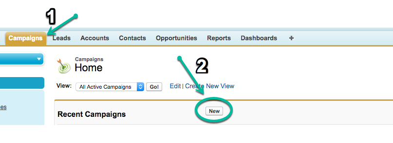

# 同步离线营销活动 {#syncing-offline-campaigns}

可能很难准确地跟踪离线营销活动，并且很难了解它们与您的数字营销工作的对比情况。 通过[!DNL Marketo Measure]，您可以在[!DNL Salesforce]中跟踪接触点并将其归因于离线营销活动，即使在事件发生几周后才会创建[!DNL Salesforce]营销活动的情况下也是如此。

>[!NOTE]
>本文介绍了一个过时的流程。 我们鼓励用户使用[新的、改进的应用程序内进程](/help/channel-tracking-and-setup/offline-channels/custom-campaign-sync.md){target="_blank"}。

## 同步之前 {#before-you-sync}

以下是有关高效同步过程的一些提示：

* 离线营销活动是指不在线发生的营销互动。 其中包括营销渠道，如活动、网络研讨会和商展。 仅包括离线营销活动。
* 如果要在安装[!DNL Marketo Measure]之前包含跟踪在线活动的营销活动，请确保将接触点结束日期设置为在您的网站上部署JavaScript的日期。
* 保持[!DNL Marketo Measure]应用程序在离线渠道页面上处于打开状态会很有帮助，这样可以轻松识别不同的促销活动类型，以及接触点将存储到的营销渠道。

* 在点击“[!UICONTROL Save]”按钮之前仔细检查所有内容！

## 批量更新接触点日期 {#bulk-update-touchpoint-date}

在[!DNL Salesforce]中，促销活动成员对象上的创建日期字段将记录促销活动成员添加到促销活动的日期。 为了使同步过程顺利进行，请确保Buyer Touchpoint日期字段的日期与Salesforce促销活动成员对象上的日期相同。 此步骤是使用“[!UICONTROL Bulk Update Touchpoint Date button]”_之前的_&#x200B;来执行的，您在“启用买方接触点”字段中选择了[!UICONTROL picklist]选项。

为什么这很重要？ 想象一下，你的公司在1月份的一次会议上赞助了一个展位。 会上，100个人对您的产品表现出兴趣，并提供了他们的联系信息以接收电子邮件更新。 三周后，您终于在[!DNL Salesforce]中创建了一个活动以跟踪会议结果。

您的上传日期将晚于会议日期三周。 若要修复此差异，可以使用[!UICONTROL Bulk Update Touchpoint Date]按钮设置适当的日期。 下图显示了按钮。

在这种情况下，它将回填上传日期3周。 应在设置“[!UICONTROL Enable Buyer Touchpoints]”字段之前执行此步骤。

总之，如果您使用[!UICONTROL Bulk Update Touchpoint Date]按钮并将接触点日期更改为事件的日期，[!DNL Marketo Measure]将为事件的实际日期（而非上传日期）生成接触点。

您还可以更新现有营销活动上所有营销活动成员的日期。 执行此操作时，请确保接触点的日期是成员交互的日期。 单击批量更新Buyer Touchpoint日期，根据情况筛选促销活动成员列表，然后在促销活动成员列表上方的&quot;[!UICONTROL Select Date]&quot;选项中，添加与事件发生日期相同的日期。

>[!CAUTION]
>请确保在&#x200B;_之前更新接触点日期_&#x200B;为所有营销活动成员启用接触点。

## 如何创建营销活动并同步购买者接触点 {#how-to-create-a-campaign-and-sync-buyer-touchpoints}

要在[!DNL Salesforce]中创建营销活动，请导航到[!UICONTROL Campaigns]选项卡并选择“[!UICONTROL New]”，如下图所示。 根据您的[!DNL Salesforce]设置，您可能需要通过单击加号(+)图标将Campaigns添加到顶部栏。

创建此营销活动时，单击“[!UICONTROL Enable Buyer Touchpoints]”字段，然后从选择列表中选择以下选项之一：

* **包括所有营销活动成员**
   * 此选项允许[!DNL Marketo Measure]将接触点归因于每个营销活动成员。

* **包括“已响应”营销活动成员。**
   * 此选项会将接触点应用于具有“已响应”状态的营销活动成员。

* **排除所有营销活动成员。**
   * 此选项不会将接触点归因于营销活动中的任何成员，并充当刻意从[!DNL Marketo Measure]中排除营销活动的标志。 如果您曾经在意外情况下将促销活动与购买者接触点同步，则可以将状态更改为“排除所有促销活动成员”，并且接触点将被删除。

一旦选择了其中一个选项，[!DNL Marketo Measure]将为每个营销活动成员分配一个接触点（如果适用）。 添加到营销活动&#x200B;_的销售线索或联系人必须_&#x200B;具有与其记录关联的电子邮件地址，才能[!DNL Marketo Measure]创建接触点。 如果没有电子邮件地址，[!DNL Marketo Measure]将不会向营销活动成员分配接触点。

>[!MORELIKETHIS]
>[[!DNL Marketo Measure] 教程：映射脱机渠道](https://experienceleague.adobe.com/en/docs/marketo-measure-learn/tutorials/onboarding/marketo-measure-salesforce/mapping-offline-channels){target="_blank"}
>[[!DNL Marketo Measure] 教程： Campaign对象字段](https://experienceleague.adobe.com/en/docs/marketo-measure-learn/tutorials/onboarding/marketo-measure-salesforce/campaign-object-fields){target="_blank"}
