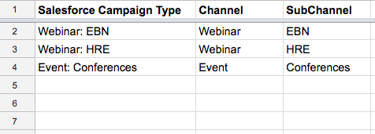

# 脱机自定义渠道设置 {#offline-custom-channel-setup}

## 快速入门 {#getting-started}

与[!DNL Marketo Measure]处理联机渠道规则的方式相比，您会注意到脱机渠道规则不需要使用电子表格。 但是，实施计划中仍会提供一个工作表，因为这样有助于您思考如何组织离线渠道。

电子表格包含三列：

**[!UICONTROL Salesforce]营销活动类型** — 在此处添加[!DNL Salesforce]中标识的营销活动类型

* 例如，这可以是电子邮件、网络研讨会、会议，或者您为此字段创建的任何您希望将接触点归因的值。

**[!UICONTROL Channel]** — 在此处添加您的各种营销渠道

**[!UICONTROL Subchannel]** — 在此处添加任何相应的子渠道

## 脱机渠道逻辑 {#offline-channel-logic}

[!DNL Marketo Measure]脱机渠道逻辑由Campaign对象确定，特别是[!DNL Salesforce]营销活动类型。 每个离线工作必须具有[!DNL Salesforce]促销活动类型，如晚宴或商展，因为[!DNL Marketo Measure]依赖此字段了解要映射到的渠道和子渠道。

SFDC促销活动类型将显示在离线渠道的选项卡中，列在[!DNL Salesforce]促销活动类型下。 请注意，[!DNL Marketo Measure]只能为具有关联购买者接触点的营销活动导入SFDC促销活动类型。

您可以在此处在[!DNL Marketo Measure]应用程序中创建渠道/子渠道映射。 这可能需要在[!DNL Marketo Measure]应用程序中创建新渠道和子渠道，操作可在应用程序的“创建渠道”部分中完成，如下图所示。 需要为[!DNL Marketo Measure]创建新渠道和子渠道以了解将接触点推送到何处。 您可以决定您希望如何映射营销活动类型。

## 渠道映射示例 {#channel-mapping-example}

例如，假设您每年参加两次[!DNL Salesforce]会议。 但是，每个会议都非常不同，并且都有独特的目标受众。 你想知道，这两者中哪一个能带来更多价值。 在您的[!DNL Salesforce]环境中，您可以为1月事件指定营销活动类型“会议”，将您的频道命名为“[!DNL Salesforce]”，并将子频道命名为“1月会议”。

现在，您也想为6月份的会议做同样的事情。 您认为，由于这也是一个会议，因此可以为它指定相同的营销活动类型，在本例中为“会议”。 渠道相同，[!DNL Salesforce]，并且此第二次会议的子渠道为“6月会议”。 从组织角度看，这是有道理的。 但是，由于两个营销活动具有相同的营销活动类型，因此读取和应用这些规则会导致[!DNL Marketo Measure]逻辑非常混乱。 [!DNL Marketo Measure]脚本无法将数据从一个类型映射到两个不同的子渠道。 这意味着您需要为每个子渠道创建新的营销活动类型，但子渠道可以具有相同的渠道。

以下是[!DNL Marketo Measure]无法读取的逻辑示例：

在上述场景中，您将需要创建一个唯一的促销活动类型，因为您不能将相同的促销活动类型映射到两个不同的子渠道。 相反，您需要设置如下所示的唯一类型：

渠道映射中必须包含任何现有的营销活动类型，并应将“NULL”添加为渠道。

请花些时间查阅[!DNL Salesforce]，以确定要包含的现有记录类型的数量和性质，以及是否需要根据上述信息创建其他营销活动。 填写完所有必要信息后，即可上传。

了解有关[脱机同步 [!DNL Salesforce] 营销活动与 [!DNL Marketo Measure]](/help/channel-tracking-and-setup/offline-channels/legacy-processes/syncing-offline-campaigns.md)的详细信息。

## 为在线营销工作处理SFDC促销活动 {#handling-sfdc-campaigns-for-online-marketing-efforts}

营销团队通常会创建[!DNL Salesforce]营销活动来跟踪各种数字营销工作。 这种做法没有问题；但是，应区别对待这些营销活动与真正的离线营销活动（例如直邮或会议），这一点很重要。 与数字事件（网站上发生的交互）相关的营销活动不应与[!DNL Marketo Measure]同步。 同步这些营销活动会导致接触点重复，因为[!DNL Marketo Measure]JavaScript已在跟踪在线工作。

处理在线活动促销活动的另一个技巧是将促销活动类型[!DNL Salesforce]映射为NULL。 为此，请先在标题为NULL的[!DNL Marketo Measure]应用程序中创建一个渠道，如下图所示。 在[!DNL Marketo Measure]应用程序的&#x200B;**创建渠道**&#x200B;部分下找到此项。 在意外同步不应同步的营销活动时，这将很有帮助。 通过查看所有存储在NULL下的内容，可以轻松找到促销活动并更正同步状态。

## 在应用程序中输入离线渠道规则 {#entering-your-offline-channel-rules-to-the-app}

使用自定义规则编辑并更新电子表格后，下一步是在[!DNL Marketo Measure]应用程序中重新创建此渠道映射，实际上您将无法上载离线渠道的电子表格。 而是要在选择列表框中输入信息，如下图所示。 通过单击&#x200B;**[!UICONTROL Offline Channels]**&#x200B;部分下的&#x200B;**[!UICONTROL Channels]**&#x200B;可找到此项。

>[!TIP]
>要确定&#x200B;_何时_&#x200B;将[!DNL Salesforce]营销活动类型提取到[!DNL Marketo Measure]渠道映射中？ 转到&#x200B;**[!UICONTROL Setup]** > **[!UICONTROL Campaigns]** > **[!UICONTROL Fields]** > **[!UICONTROL Type]**。 然后，您可以查看选择列表中包含哪些值以及哪些值处于非活动状态。 非活动内容将不会在“[!UICONTROL Offline Channels]”分区中显示为可选类型。 请注意，此过程可能需要几分钟到48小时的时间。

完成后，单击&#x200B;**[!UICONTROL Save]**，[!DNL Marketo Measure]将上载更改并重新处理数据。

>[!MORELIKETHIS]
> [[!DNL Marketo Measure] 教程：映射脱机渠道](https://experienceleague.adobe.com/zh-hans/docs/marketo-measure-learn/tutorials/onboarding/marketo-measure-salesforce/mapping-offline-channels){target="_blank"}
> [[!DNL Marketo Measure] 教程：同步离线营销活动](https://experienceleague.adobe.com/zh-hans/docs/marketo-measure-learn/tutorials/onboarding/marketo-measure-salesforce/syncing-offline-campaigns){target="_blank"}
> [Marketo Engage程序集成](/help/marketo-measure-and-marketo/marketo-engage-programs-integration.md#channel-mapping){target="_blank"}
