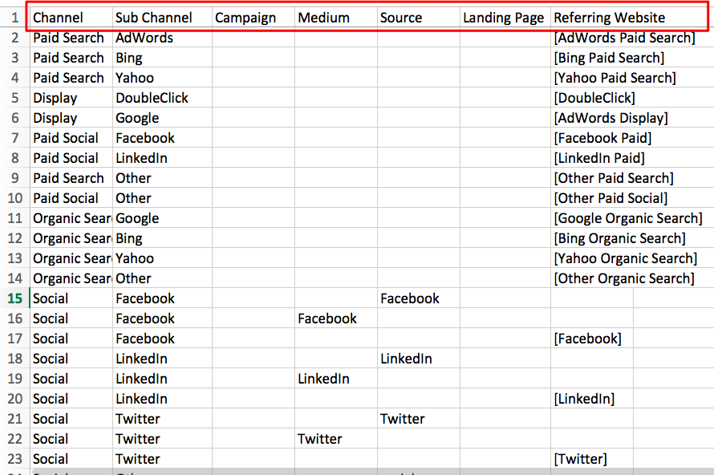

# 在线自定义渠道设置 {#online-custom-channel-setup}

要获得准确的报告，必须设置营销渠道以反映组织的UTM策略。 本指南将引导您了解配置自定义渠道规则的最佳方法。

## 开始之前 {#before-you-begin}

在开始为[!DNL Marketo Measure]创建渠道规则之前，请花些时间考虑营销活动的组织结构以及它们如何适应[!DNL Marketo Measure]框架。 确定要跟踪的渠道、子渠道、营销活动和反向链接网站。

切记事项：

* 您的组织最多可以创建40个自定义营销渠道。 这包括离线和在线渠道。
* 您的组织最多可创建200个子渠道。
* 每个数据集合或存储段都需要有自己的规则（电子表格中的行）来指定数据的组织方式。 尽可能具体一些。
* [!DNL Marketo Measure]逻辑从电子表格的顶行开始按降序排列数据优先级，并向下排列。 它会逐行读取每个存储段或单元格，以查找第一个匹配项。 然后，将根据这些存储桶中的值对数据排序。 有关详情，请参阅下文。
* 请勿按字母顺序对工作表进行排序，因为这会干扰逻辑规则。
* 上传文件后，您无法在七天内更改任何规则。 [!DNL Marketo Measure]利用此时间处理和更新接触点。

## [!DNL Marketo Measure]逻辑和优先级 {#marketo-measure-logic-and-priorities}

第一步是从[!DNL Marketo Measure]应用程序下载自定义渠道电子表格。 导航到&#x200B;**我的帐户**&#x200B;选项卡下的&#x200B;**设置**&#x200B;并选择&#x200B;**联机**。 您可以选择&#x200B;**下载原始模板**&#x200B;或&#x200B;**下载当前规则**。

电子表格有七列：

* **渠道：**&#x200B;在此处添加您的各种营销渠道
* **子渠道：**&#x200B;在此处添加相应的子渠道
* **营销活动：**&#x200B;在此处添加营销活动名称，无论值来自UTM还是Salesforce Campaigns用于[!DNL Marketo Measure]活动功能
* **Medium：** medium列表示utm_medium参数的值
* **Source：**&#x200B;源列表示utm_source参数的值
* **登陆页面：**&#x200B;在此处添加登陆页面
* **反向链接网站：**&#x200B;引用您页面流量或内置[!DNL Marketo Measure]逻辑的网站URL（用方括号表示）

第八列将注明哪些规则不能从电子表格中删除，并显示“请勿删除”。 电子表格顶部具有默认渠道规则，[!DNL Marketo Measure]建议即使不使用这些渠道，也不要更改或删除这些规则。 [!DNL Marketo Measure]与这些平台有深度集成，因此默认包含这些平台。

行表示规则和[!DNL Marketo Measure]对数据优先处理的顺序。 第一行的优先级高于第二行，第二行的优先级高于第三行，依此类推。 在确定要将接触点分段到的营销渠道和子渠道时，[!DNL Marketo Measure]会从上到下、从左到右阅读，直到找到满足接触点标准的行。 (如果接触点具有`utm_source=Facebook`，则由于屏幕快照中的规则15，该接触点会存储到Social.Facebook渠道中)。

[!DNL Marketo Measure]附带12个默认渠道供您使用。 这些渠道与[!DNL Marketo Measure]完全集成的平台相关。 无论是否使用它们，都不要删除它们。 例如，如果您确实使用其中一个平台(Bing Ads)，但希望对渠道或子渠道使用不同的命名约定，则可以更新名称。 下图显示了一个示例。

规则的结构也很重要。 规则可能看起来像重复信息和丢失数据，但此结构是故意的。 要准确排序数据，必须单独将每个单独的源映射到相应的渠道，甚至共享子渠道和渠道的源。 规则越细致，结果就越有洞察力。 基本上，最佳实践是为要跟踪的每项营销工作编写详细规则。

请考虑以下情况：您有由于某种原因不想跟踪的其他广告，或者您从熟悉的渠道而不是熟悉的来源接收对您网站的访问。 如果[!DNL Marketo Measure]找不到用于对数据进行排序的适当规则，这种情况可能会导致数据丢失。 为避免发生这种情况，[!DNL Marketo Measure]建议您中断针对多行的规则。

规则的每个参数或组件都单独映射到渠道。 例如，当[!DNL Marketo Measure]具有[!DNL Facebook]要排序的数据时，它会查找与[!DNL Facebook]相关的规则。 它从上到下扫描。 在下图所示的示例中，[!DNL Marketo Measure]将了解对于第一个[!DNL Facebook]子通道，它只需读取源参数即可将数据放入该规则的存储桶。

下一个规则仅要求输入媒体参数，因此具有该参数的任何数据都会存储到此渠道中。 最后，对于[!DNL Facebook]，来自Facebook URL的任何数据都会被放入最后一个Facebook存储桶中。

存在默认渠道“其他”以捕获不符合任何规则条件的数据。 请注意，“其他”渠道中的某些存储桶包含星号(&#42;)。 这些星号表示充当总括的通配符。

由于[!DNL Marketo Measure]逻辑是从上到下运行的，因此应将用星号(&#42;)指示的通配符规则放在规则表的最末尾。 所有未按照其他规则捕获或排序的数据都将添加到此通配符存储段。

以下是通配符逻辑的更多示例：

* &#42;电子邮件&#42; =包含“电子邮件”
* &#42;电子邮件=以“电子邮件”结尾
* 电子邮件&#42; = [!UICONTROL starts with email]

此外，请注意，如果为某个渠道创建子渠道，则必须为该渠道下的所有规则创建一个子渠道。 换言之，如果创建一个子渠道，则不能将其余列留空。

## 设置自定义渠道规则 {#setting-up-your-custom-channels-rules}

在决定如何组织和设置数据优先级后，您便可以将规则添加到电子表格中。 以下是一些最佳实践：

* 从一开始就使规则尽可能简单。 您始终可以在规则的基础上进行构建。
* 请勿在渠道名称中添加任何特殊字符（例如，$%#&amp;&#42;@）
* 请勿编辑与BingAds和AdWords关联的规则。 这些规则对于存储自动来自[!DNL Marketo Measure] API与这些平台集成的数据至关重要。 但是，根据您的需要更改子渠道和渠道名称并不是问题。
* 请勿删除包含“请勿删除”注释的规则。
* 有机搜索规则始终放在[!UICONTROL Paid Search rules]之后
* 您无法创建基于不同子域的规则。
* 如果要在电子表格中的单元格中添加多个值，请确保仅用分号`;`分隔这些值。 无逗号或空格。
* 您不必在反向链接URL的末尾添加dot-com (.com)。
* 添加引荐URL时，请勿像其他API相关规则一样将其放在括号中。

## 上传您的自定义渠道规则 {#uploading-your-custom-channels-rules}

确保您在CSV中添加的任何新渠道和子渠道值已添加到Bizible帐户的渠道设置区域中。 请仔细检查CSV中与[!DNL Marketo Measure]帐户的渠道设置区域匹配的所有渠道和子渠道名称。 确保检查逗号与空格。

如果您在上传期间收到错误消息，请更正问题并重新上传。 如果未收到任何错误消息，请单击页面底部的&#x200B;**保存并处理**。
