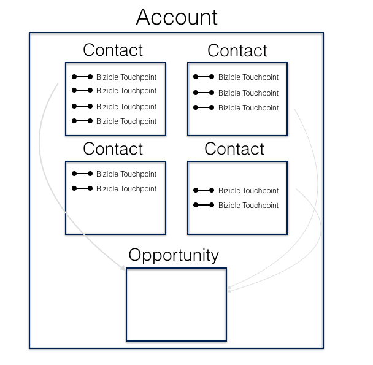

# 归因映射方法 {#attribution-mapping-methodology}

归因映射方法是在您的CRM中查找特定对象（联系人、商机、客户）以便在关联的商机中创建归因接触点的过程。 换言之，就是 [!DNL Marketo Measure] 一种基于您当前CRM的流程了解在归因模型中包含哪些接触点的方式。

## 帐户ID映射 {#account-id-mapping}

开箱即用， [!DNL Marketo Measure] 提供帐户ID映射。 这意味着 [!DNL Marketo Measure] 查看Account及其Contacts营销信息，以创建与商机关联的Attribution Touchpoints。 下面简单介绍了该过程。

请记住 **并非全部** 您的联系人中的接触点将作为归因接触点推送到Opportunity中。 Opportunity的时间线（其首次接触日期 — 结束日期）确定接触点是否计为Opportunity的影响因素。 因此，如果联系A上的接触点在机会关闭后发生成功/失败， [!DNL Marketo Measure] 不会将该接触点推向Opportunity。 所有其他归因对象映射均会遵循此时间线过程。

优点：这种归因方法对大多数公司都非常有效。 营销团队不需要依赖销售团队将所有联系人与特定机会（这通常是问题）相关联。 此外，即使销售团队与联系人角色建立关联，也可能会错过许多其他联系人与营销材料的交互。 最后，这种方法有助于主动营销策略，即努力影响账户的总体，而不是影响特定用户。

缺点：如果有严格的营销和销售SLA规定哪些人应该获得点数，则此方法可能会产生问题。 此外，如果人们不使用帐户层次结构来定义较大帐户(例如：IBM)中的特定业务单位，则特定于某个业务单位的营销互动可能会扩展到其他业务单位机会。

## 机会联系人角色映射 {#opportunity-contact-role-mapping}

虽然大多数客户端都使用帐户ID映射， [!DNL Marketo Measure] 可以查找Opportunity中的联系人角色（与Opportunity关联的联系人）以细分归因流程。 这意味着 [!DNL Marketo Measure] 将只将与机会上的联系人角色关联的营销交互作为买方归因接触点推送。 以下是此过程的演示。

优点：如果您的团队具有明确定义的联系人角色流程，则此类型的归因映射可能非常适合您。 它有助于更好地协调销售和营销，因为每个人都将充分了解归因的划分方式。 当组织面向一家大公司内的多个业务部门以及同时销售不同产品时，此过程也很有用。

缺点：但是，如果没有联系人职责流程，则市场营销会损失大量市场营销数据，并且团队最终因影响机会的市场营销工作而获得的信用会减少。

## 机会主要联系人角色映射 {#opportunity-primary-contact-role-mapping}

除了简单地查看机会上的联系人角色外， [!DNL Marketo Measure] 可以更加集中精力只查看一个Opportunity上的Primary Contact。 考虑到这种设置， [!DNL Marketo Measure] 仅获取与opportunity上的主要联系人关联的营销接触点，并将该信息推送到该特定商机的归因故事中。 请参阅下图。

优点：如果您的团队只想了解对业务机会中设置为“主要”的联系人的营销影响，则此类映射最适合您的团队。

缺点：这肯定是最不常使用的映射过程，可能会严重削弱营销影响力，这种影响力正推动客户越过其他联系人寻找机会。
