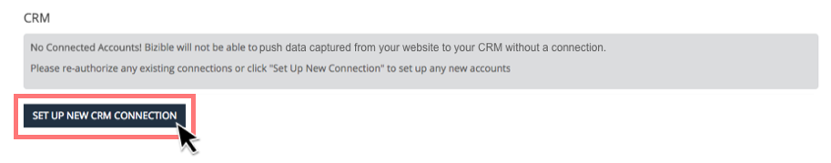
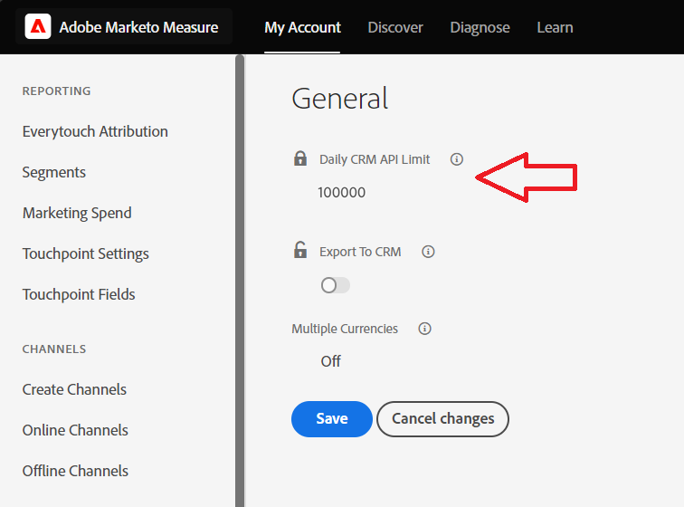

# 将Marketo Measure连接到Salesforce {#connect-marketo-measure-to-salesforce}

本文概述如何将[!DNL Salesforce]帐户连接到[!DNL Marketo Measure]帐户。

## 正在将[!DNL Marketo Measure]与[!DNL Salesforce]连接 {#connecting-marketo-measure-with-salesforce}

1. 使用无痕浏览器登录到[!DNL Marketo Measure]。

1. 在屏幕顶部的菜单栏中，导航到&#x200B;**[!UICONTROL My Account]**&#x200B;并单击&#x200B;**[!UICONTROL Settings]**&#x200B;选项。

1. 在左侧的设置选项列中，单击&#x200B;**[!UICONTROL Connections]**&#x200B;部分下的[!UICONTROL Integrations]。

   

1. 在“连接”中的CRM部分下，单击&#x200B;**[!UICONTROL Set Up New CRM Connection]**。

   

1. 此时会出现一个弹出窗口，要求您选择CRM连接。 单击&#x200B;**[!UICONTROL Connect]**&#x200B;徽标旁边的[!DNL Salesforce]。

   

1. 此时会出现一个最终的弹出窗口，询问您是否拥有[!DNL Salesforce]凭据、沙盒或生产环境。 输入您的信息并单击&#x200B;**[!UICONTROL Authorize]**&#x200B;以将帐户连接到[!DNL Marketo Measure]。

>[!NOTE]
>
>[!DNL Marketo Measure]一次只能连接到一个[!DNL Salesforce]实例。
>
>* 可以将[!DNL Marketo Measure]实例连接到SFDC沙盒实例以测试集成，然后再将连接切换到SFDC生产实例。
>* 如果您首先使用SFDC沙盒进行测试，我们强烈建议您使用一个沙盒进行测试，该沙盒是SFDC生产实例的精确副本（根据Lead、Contact、Account、Opportunity、Campaign和Case对象中的字段而定）。 如果您在生产中有任何活动的APEX触发器触发对Lead、Contact、Account、Opportunity、Campaign和Case对象的更新，则应尝试在沙盒中激活它们。
>* 完成测试后，将更新[!DNL Marketo Measure]帐户以指向生产[!DNL Salesforce] （而不是沙盒[!DNL Salesforce]）。 由于集成构建的方式，一旦[!DNL Marketo Measure]帐户连接到生产[!DNL Salesforce]，您就无法“向后”连接到沙盒[!DNL Salesforce]组织。

## API信用使用情况 {#api-credits-usage}

Marketo Measure采用CRM集成任务，通过集成用户与客户的Salesforce交互。 通过此用户进行的所有数据交换都使用Salesforce API积分。 您能够将信用配额分配给集成用户，这有助于控制过多的API调用。 此配额或限制每24小时重置一次。

您可以在Marketo Measure中通过&#x200B;**我的帐户** > **设置** > **CRM** > **常规** > **每日CRM API限制**&#x200B;访问此限制，并且可以为租户配置此限制。

### 设置API积分限制 {#setting-a-limit-for-api-credits}

1. 导航到&#x200B;**我的帐户** > **设置**。

1. 在CRM下，单击&#x200B;**常规**。 您看到了&#x200B;**每日CRM API限制**&#x200B;选项。

1. 单击“锁定”图标以进行编辑。

   

1. 输入等于或大于100,000的所需限制。 完成后单击&#x200B;**保存**。

   

>[!NOTE]
>
>要增加所连接解决方案的可用Salesforce API积分，请联系您的Salesforce管理员并参考[此Salesforce文档](https://developer.salesforce.com/docs/atlas.en-us.salesforce_app_limits_cheatsheet.meta/salesforce_app_limits_cheatsheet/salesforce_app_limits_platform_api.htm){target="_blank"}。

>[!MORELIKETHIS]
>
>[错误通知](/help/configuration-and-setup/getting-started-with-marketo-measure/error-notifications.md){target="_blank"}
