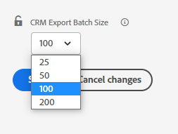

# 如何 [!DNL Marketo Measure] 和 [!DNL Salesforce] Interact {#how-marketo-measure-and-salesforce-interact}

>[!NOTE]
>
>您可能会看到说明“[!DNL Marketo Measure]”，但仍可在CRM中看到“Bizible”。 我们正在努力更新品牌，并且品牌重塑很快将会反映在您的CRM中。

下面我们来从高层面了解一下两者之间的关系 [!DNL Marketo Measure] 和Salesforce。

## Salesforce和 [!DNL Marketo Measure] {#salesforce-and-marketo-measure}

一旦 [!DNL Marketo Measure] 已创建帐户并 [!DNL Salesforce] 已连接， [!DNL Marketo Measure] 开始将营销数据推送到CRM实例，前提是 [!DNL Marketo Measure] 已安装受管软件包，并且 [!DNL Marketo Measure] Salesforce用户具有编辑权限。

如果您未安装 [!DNL Marketo Measure] Salesforce包， [!DNL Marketo Measure] 不会向Salesforce实例写入任何数据。

默认情况下， [!DNL Marketo Measure] 每次在作业向CRM发送数据时，将每个API点数导出200条记录。 对于大多数客户而言，这提供了所消耗的API积分之间的最佳平衡。 [!DNL Marketo Measure] 和CRM上的CPU资源要求。 但是，对于具有复杂CRM配置（如工作流和触发器）的客户，较小的批处理大小可能有助于提高CRM性能。 为此， [!DNL Marketo Measure] 允许客户配置CRM导出批次大小。 此设置可在 [!UICONTROL Settings] > [!UICONTROL CRM] > [!UICONTROL General] 中的页面 [!DNL Marketo Measure] Web应用程序和客户可以选择批量为200（默认）、100、50或25。

在修改此设置时，请记住，较小的批次大小会消耗您的CRM中的更多API积分。 仅当您在CRM中遇到CPU超时或CPU负载过高时，才建议减小批次大小。

## Salesforce标准对象和访问 {#salesforce-standard-objects-and-access}

这将列出 [!DNL Salesforce] 符合以下条件的标准对象 [!DNL Marketo Measure] 与交互，并建立连接后我们添加到这些对象的自定义字段，以及 [!DNL Marketo Measure] 软件包已安装。 开箱即用， [!DNL Marketo Measure] 不会写入任何标准 [!DNL Salesforce] 对象字段。

**商机**

<table> 
 <tbody> 
  <tr> 
   <th>字段</th> 
   <th>标准/自定义</th> 
   <th>读取</th> 
   <th>写入</th> 
  </tr> 
  <tr> 
   <td>Id</td> 
   <td>标准</td> 
   <td>x</td> 
   <td> </td> 
  </tr> 
  <tr> 
   <td>电子邮件</td> 
   <td>标准</td> 
   <td>x</td> 
   <td> </td> 
  </tr> 
  <tr> 
   <td>状态</td> 
   <td>标准</td> 
   <td>x</td> 
   <td> </td> 
  </tr> 
  <tr> 
   <td>CreatedDate</td> 
   <td>标准</td> 
   <td>x</td> 
   <td> </td> 
  </tr> 
  <tr> 
   <td>LastModifiedDate</td> 
   <td>标准</td> 
   <td>x</td> 
   <td> </td> 
  </tr> 
  <tr> 
   <td>ConversionDate</td> 
   <td>标准</td> 
   <td>x</td> 
   <td> </td> 
  </tr> 
  <tr> 
   <td>ConvertedContactId</td> 
   <td>标准</td> 
   <td>x</td> 
   <td> </td> 
  </tr> 
  <tr> 
   <td>ConvertedOpportunityId</td> 
   <td>标准</td> 
   <td>x</td> 
   <td> </td> 
  </tr> 
  <tr> 
   <td>IsConverted</td> 
   <td>标准</td> 
   <td>x</td> 
   <td> </td> 
  </tr> 
  <tr> 
   <td>IsDeleted</td> 
   <td>标准</td> 
   <td>x</td> 
   <td> </td> 
  </tr> 
  <tr> 
   <td>网站</td> 
   <td>标准</td> 
   <td>x</td> 
   <td> </td> 
  </tr> 
  <tr> 
   <td>公司</td> 
   <td>标准</td> 
   <td>x</td> 
   <td> </td> 
  </tr> 
  <tr> 
   <td>bizible2__帐户__c</td> 
   <td>自定义</td> 
   <td>x</td> 
   <td>x</td> 
  </tr> 
  <tr> 
   <td>bizible2__Ad_Campaign_Name_FT__c</td> 
   <td>自定义</td> 
   <td>x</td> 
   <td>x</td> 
  </tr> 
  <tr> 
   <td>bizible2__Ad_Campaign_Name_LC__c</td> 
   <td>自定义</td> 
   <td>x</td> 
   <td>x</td> 
  </tr> 
  <tr> 
   <td>bizible2__Landing_Page_FT__c</td> 
   <td>自定义</td> 
   <td>x</td> 
   <td>x</td> 
  </tr> 
  <tr> 
   <td>bizible2__Landing_Page_LC__c</td> 
   <td>自定义</td> 
   <td>x</td> 
   <td>x</td> 
  </tr> 
  <tr> 
   <td>bizible2__Marketing_Channel_FT__c</td> 
   <td>自定义</td> 
   <td>x</td> 
   <td>x</td> 
  </tr> 
  <tr> 
   <td>bizible2__Marketing_Channel_LC__c</td> 
   <td>自定义</td> 
   <td>x</td> 
   <td>x</td> 
  </tr> 
  <tr> 
   <td>bizible2__Touchpoint_Date_FT__c</td> 
   <td>自定义</td> 
   <td>x</td> 
   <td>x</td> 
  </tr> 
  <tr> 
   <td>bizible2__Touchpoint_Date_LC__c</td> 
   <td>自定义</td> 
   <td>x</td> 
   <td>x</td> 
  </tr> 
  <tr> 
   <td>bizible2__Touchpoint_Source_FT__c</td> 
   <td>自定义</td> 
   <td>x</td> 
   <td>x</td> 
  </tr> 
  <tr> 
   <td>bizible2__Touchpoint_Source_LC__c</td> 
   <td>自定义</td> 
   <td>x</td> 
   <td>x </td> 
  </tr> 
 </tbody> 
</table>

**联系人**

<table> 
 <tbody> 
  <tr> 
   <th>字段</th> 
   <th>标准/自定义</th> 
   <th>读取</th> 
   <th>写入</th> 
  </tr> 
  <tr> 
   <td>帐户</td> 
   <td>标准</td> 
   <td>x</td> 
   <td> </td> 
  </tr> 
  <tr> 
   <td>Id</td> 
   <td>标准</td> 
   <td>x</td> 
   <td> </td> 
  </tr> 
  <tr> 
   <td>电子邮件</td> 
   <td>标准</td> 
   <td>x</td> 
   <td> </td> 
  </tr> 
  <tr> 
   <td>创建日期</td> 
   <td>标准</td> 
   <td>x</td> 
   <td> </td> 
  </tr> 
  <tr> 
   <td>IsDeleted</td> 
   <td>标准</td> 
   <td>x</td> 
   <td> </td> 
  </tr> 
  <tr> 
   <td>LastModifiedDate</td> 
   <td>标准</td> 
   <td>x</td> 
   <td> </td> 
  </tr> 
  <tr> 
   <td>bizible2__Ad_Campaign_Name_FT__c</td> 
   <td>自定义</td> 
   <td>x</td> 
   <td>x</td> 
  </tr> 
  <tr> 
   <td>bizible2__Ad_Campaign_Name_LC__c</td> 
   <td>自定义</td> 
   <td>x</td> 
   <td>x</td> 
  </tr> 
  <tr> 
   <td>bizible2__Landing_Page_FT__c</td> 
   <td>自定义</td> 
   <td>x</td> 
   <td>x</td> 
  </tr> 
  <tr> 
   <td>bizible2__Landing_Page_LC__c</td> 
   <td>自定义</td> 
   <td>x</td> 
   <td>x</td> 
  </tr> 
  <tr> 
   <td>bizible2__Marketing_Channel_FT__c</td> 
   <td>自定义</td> 
   <td>x</td> 
   <td>x</td> 
  </tr> 
  <tr> 
   <td>bizible2__Marketing_Channel_LC__c</td> 
   <td>自定义</td> 
   <td>x</td> 
   <td>x</td> 
  </tr> 
  <tr> 
   <td>bizible2__Touchpoint_Date_FT__c</td> 
   <td>自定义</td> 
   <td>x</td> 
   <td>x</td> 
  </tr> 
  <tr> 
   <td>bizible2__Touchpoint_Date_LC__c</td> 
   <td>自定义</td> 
   <td>x</td> 
   <td>x</td> 
  </tr> 
  <tr> 
   <td>bizible2__Touchpoint_Source_FT__c</td> 
   <td>自定义</td> 
   <td>x</td> 
   <td>x</td> 
  </tr> 
  <tr> 
   <td>bizible2__Touchpoint_Source_LC__c</td> 
   <td>自定义</td> 
   <td>x</td> 
   <td>x </td> 
  </tr> 
 </tbody> 
</table>

**Case**

<table> 
 <tbody> 
  <tr> 
   <th>字段</th> 
   <th>标准/自定义</th> 
   <th>读取</th> 
   <th>写入</th> 
  </tr> 
  <tr> 
   <td>Id</td> 
   <td>标准</td> 
   <td>x</td> 
   <td> </td> 
  </tr> 
  <tr> 
   <td>CreatedDate</td> 
   <td>标准</td> 
   <td>x</td> 
   <td> </td> 
  </tr> 
  <tr> 
   <td>LastModifiedDate</td> 
   <td>标准</td> 
   <td>x</td> 
   <td> </td> 
  </tr> 
  <tr> 
   <td>提供的电子邮件</td> 
   <td>标准</td> 
   <td>x</td> 
   <td> </td> 
  </tr> 
  <tr> 
   <td>IsDeleted</td> 
   <td>标准</td> 
   <td>x</td> 
   <td> </td> 
  </tr> 
  <tr> 
   <td>bizible2__Ad_Campaign_Name_FT__c</td> 
   <td>自定义</td> 
   <td>x</td> 
   <td>x</td> 
  </tr> 
  <tr> 
   <td>bizible2__Ad_Campaign_Name_LC__c</td> 
   <td>自定义</td> 
   <td>x</td> 
   <td>x</td> 
  </tr> 
  <tr> 
   <td>bizible2__Landing_Page_FT__c</td> 
   <td>自定义</td> 
   <td>x</td> 
   <td>x</td> 
  </tr> 
  <tr> 
   <td>bizible2__Landing_Page_LC__c</td> 
   <td>自定义</td> 
   <td>x</td> 
   <td>x</td> 
  </tr> 
  <tr> 
   <td>bizible2__Marketing_Channel_FT__c</td> 
   <td>自定义</td> 
   <td>x</td> 
   <td>x</td> 
  </tr> 
  <tr> 
   <td>bizible2__Marketing_Channel_LC__c</td> 
   <td>自定义</td> 
   <td>x</td> 
   <td>x</td> 
  </tr> 
  <tr> 
   <td>bizible2__Touchpoint_Date_FT__c</td> 
   <td>自定义</td> 
   <td>x</td> 
   <td>x</td> 
  </tr> 
  <tr> 
   <td>bizible2__Touchpoint_Date_LC__c</td> 
   <td>自定义</td> 
   <td>x</td> 
   <td>x</td> 
  </tr> 
  <tr> 
   <td>bizible2__Touchpoint_Source_FT__c</td> 
   <td>自定义</td> 
   <td>x</td> 
   <td>x</td> 
  </tr> 
  <tr> 
   <td>bizible2__Touchpoint_Source_LC__c</td> 
   <td>自定义</td> 
   <td>x</td> 
   <td>x </td> 
  </tr> 
 </tbody> 
</table>

**帐户**

<table> 
 <tbody> 
  <tr> 
   <th>字段</th> 
   <th>标准/自定义</th> 
   <th>读取</th> 
   <th>写入</th> 
  </tr> 
  <tr> 
   <td>Id</td> 
   <td>标准</td> 
   <td>x</td> 
   <td> </td> 
  </tr> 
  <tr> 
   <td>网站</td> 
   <td>标准</td> 
   <td>x</td> 
   <td> </td> 
  </tr> 
  <tr> 
   <td>LastModifiedDate</td> 
   <td>标准</td> 
   <td>x</td> 
   <td> </td> 
  </tr> 
  <tr> 
   <td>IsDeleted</td> 
   <td>标准</td> 
   <td>x</td> 
   <td> </td> 
  </tr> 
  <tr> 
   <td>bizible2__Engagement_Score__c</td> 
   <td>自定义</td> 
   <td>x</td> 
   <td>x </td> 
  </tr> 
 </tbody> 
</table>

**机会**

<table> 
 <tbody> 
  <tr> 
   <th>字段</th> 
   <th>标准/自定义</th> 
   <th>读取</th> 
   <th>写入</th> 
  </tr> 
  <tr> 
   <td>名称</td> 
   <td>标准</td> 
   <td>x</td> 
   <td> </td> 
  </tr>
  <tr> 
   <td>帐户</td> 
   <td>标准</td> 
   <td>x</td> 
   <td> </td> 
  </tr>
  <tr> 
   <td>Id</td> 
   <td>标准</td> 
   <td>x</td> 
   <td> </td> 
  </tr> 
  <tr> 
   <td>CreatedDate</td> 
   <td>标准</td> 
   <td>x</td> 
   <td> </td> 
  </tr> 
  <tr> 
   <td>LastModifiedDate</td> 
   <td>标准</td> 
   <td>x</td> 
   <td> </td> 
  </tr> 
  <tr> 
   <td>IsWon</td> 
   <td>标准</td> 
   <td>x</td> 
   <td> </td> 
  </tr> 
  <tr> 
   <td>IsClosed</td> 
   <td>标准</td> 
   <td>x</td> 
   <td> </td> 
  </tr> 
  <tr> 
   <td>IsDeleted</td> 
   <td>标准</td> 
   <td>x</td> 
   <td> </td> 
  </tr> 
  <tr> 
   <td>关闭日期</td> 
   <td>标准</td> 
   <td>x</td> 
   <td> </td> 
  </tr> 
  <tr> 
   <td>阶段名称</td> 
   <td>标准</td> 
   <td>x</td> 
   <td> </td> 
  </tr> 
  <tr> 
   <td>数量</td> 
   <td>标准</td> 
   <td>x</td> 
   <td> </td> 
  </tr> 
  <tr> 
   <td>bizible2__Bizible_Opportunity_Amount__c</td> 
   <td>自定义</td> 
   <td>x</td> 
   <td>x </td> 
  </tr> 
 </tbody> 
</table>

**机会联系人角色**

<table> 
 <tbody> 
  <tr> 
   <th>字段</th> 
   <th>标准/自定义</th> 
   <th>读取</th> 
   <th>写入</th> 
  </tr> 
  <tr> 
   <td>Id</td> 
   <td>标准</td> 
   <td>x</td> 
   <td> </td> 
  </tr> 
  <tr> 
   <td>CreatedDate</td> 
   <td>标准</td> 
   <td>x</td> 
   <td> </td> 
  </tr> 
  <tr> 
   <td>IsDeleted</td> 
   <td>标准</td> 
   <td>x</td> 
   <td> </td> 
  </tr>
  <tr> 
   <td>LastModifiedDate</td> 
   <td>标准</td> 
   <td>x</td> 
   <td> </td> 
  </tr> 
  <tr> 
   <td>机会ID</td> 
   <td>标准</td> 
   <td>x</td> 
   <td> </td> 
  </tr> 
  <tr> 
   <td>ContactId</td> 
   <td>标准</td> 
   <td>x</td> 
   <td> </td> 
  </tr>

<tr> 
   <td>IsPrimary</td> 
   <td>标准</td> 
   <td>x</td> 
   <td> </td> 
  </tr> 
  <tr> 
   <td>角色</td> 
   <td>标准</td> 
   <td>x</td> 
   <td> </td> 
  </tr> 
 </tbody> 
</table>

**营销活动**

<table> 
 <colgroup> 
  <col> 
  <col> 
  <col> 
  <col> 
 </colgroup> 
 <tbody> 
  <tr> 
   <th>字段</th> 
   <th>标准/自定义</th> 
   <th>读取</th> 
   <th>写入</th> 
  </tr> 
  <tr> 
   <td>Id</td> 
   <td>标准</td> 
   <td>x</td> 
   <td> </td> 
  </tr> 
  <tr> 
   <td>电子邮件</td> 
   <td>标准</td> 
   <td>x</td> 
   <td> </td> 
  </tr> 
  <tr> 
   <td>状态</td> 
   <td>标准</td> 
   <td>x</td> 
   <td> </td> 
  </tr> 
  <tr> 
   <td>CreatedDate</td> 
   <td>标准</td> 
   <td>x</td> 
   <td> </td> 
  </tr> 
  <tr> 
   <td>LastModifiedDate</td> 
   <td>标准</td> 
   <td>x</td> 
   <td> </td> 
  </tr> 
  <tr> 
   <td>ConversionDate</td> 
   <td>标准</td> 
   <td>x</td> 
   <td> </td> 
  </tr> 
  <tr> 
   <td>ConvertedContactId</td> 
   <td>标准</td> 
   <td>x</td> 
   <td> </td> 
  </tr> 
  <tr> 
   <td>ConvertedOpportunityId</td> 
   <td>标准</td> 
   <td>x</td> 
   <td> </td> 
  </tr> 
  <tr> 
   <td>IsConverted</td> 
   <td>标准</td> 
   <td>x</td> 
   <td> </td> 
  </tr> 
  <tr> 
   <td>IsDeleted</td> 
   <td>标准</td> 
   <td>x</td> 
   <td> </td> 
  </tr> 
  <tr> 
   <td>网站</td> 
   <td>标准</td> 
   <td>x</td> 
   <td> </td> 
  </tr> 
  <tr> 
   <td>公司</td> 
   <td>标准</td> 
   <td>x</td> 
   <td> </td> 
  </tr> 
  <tr> 
   <td>类型</td> 
   <td>标准</td> 
   <td>x</td> 
   <td> </td> 
  </tr> 
 </tbody> 
</table>

**营销活动成员**

<table> 
 <tbody> 
  <tr> 
   <th>字段</th> 
   <th>标准/自定义</th> 
   <th>读取</th> 
   <th>写入</th> 
  </tr> 
  <tr> 
   <td>Id</td> 
   <td>标准</td> 
   <td>x</td> 
   <td> </td> 
  </tr> 
  <tr> 
   <td>CreatedDate</td> 
   <td>标准</td> 
   <td>x</td> 
   <td> </td> 
  </tr> 
  <tr> 
   <td>LastModifiedDate</td> 
   <td>标准</td> 
   <td>x</td> 
   <td> </td> 
  </tr> 
  <tr> 
   <td>IsDeleted</td> 
   <td>标准</td> 
   <td>x</td> 
   <td> </td> 
  </tr> 
  <tr> 
   <td>FirstRespondedDate</td> 
   <td>标准</td> 
   <td>x</td> 
   <td> </td> 
  </tr> 
  <tr> 
   <td>HasResponsed</td> 
   <td>标准</td> 
   <td>x</td> 
   <td> </td> 
  </tr> 
  <tr> 
   <td>ContactId</td> 
   <td>标准</td> 
   <td>x</td> 
   <td> </td> 
  </tr> 
  <tr> 
   <td>商机ID</td> 
   <td>标准</td> 
   <td>x</td> 
   <td> </td> 
  </tr> 
  <tr> 
   <td>IsConverted</td> 
   <td>标准</td> 
   <td>x</td> 
   <td> </td> 
  </tr> 
  <tr> 
   <td>CampaignId</td> 
   <td>标准</td> 
   <td>x</td> 
   <td> </td> 
  </tr> 
  <tr> 
   <td>bizible2__Bizible_Touchpoint_Date__c</td> 
   <td>自定义</td> 
   <td>x</td> 
   <td>x</td> 
  </tr> 
  <tr> 
   <td>bizible2__Touchpoint_Status_Date__c</td> 
   <td>自定义</td> 
   <td>x</td> 
   <td>x</td> 
  </tr> 
  <tr> 
   <td>bizible2__Touchpoint_Status_Contact__c</td> 
   <td>自定义</td> 
   <td>x</td> 
   <td>x</td> 
  </tr> 
  <tr> 
   <td>bizible2__Touchpoint_Status_Leade__c</td> 
   <td>自定义</td> 
   <td>x</td> 
   <td>x</td> 
  </tr> 
  <tr> 
   <td>bizible2__Touchpoint_Status_Opportunity__c</td> 
   <td>自定义</td> 
   <td>x</td> 
   <td>x </td> 
  </tr> 
 </tbody> 
</table>

>[!NOTE]
>
>为了确保Marketo Measure能够准确捕获Salesforce帐户中的删除事件，需要以下对象的可复制权限。 可复制权限是以下对象的标准权限：
>
>* 帐户
>* Campaign
>* 营销活动成员
>* 联系人
>* 活动
>* 商机
>* 机会
>* 任务

## [!DNL Marketo Measure] 中的自定义对象 [!DNL Salesforce] {#marketo-measure-custom-objects-in-salesforce}

除了在SFDC的标准对象上创建自定义字段外，在 [!DNL Marketo Measure] 软件包已安装，它会创建几个自定义对象。 以下是这些自定义对象的列表，以及一个表示以下字段的表： [!DNL Marketo Measure] 将写入。

**买方接触点**

买方接触点是 [!DNL Marketo Measure] 自定义对象，用于封装联系人、潜在客户和案例的营销交互。

<table> 
 <tbody> 
  <tr> 
   <th>字段</th> 
   <th>标准/自定义</th> 
   <th>读取</th> 
   <th>写入</th> 
  </tr> 
  <tr> 
   <td>bizible2__Bizible_Person__c</td> 
   <td>自定义</td> 
   <td>x</td> 
   <td>x</td> 
  </tr> 
  <tr> 
   <td>bizible2__SF_Campaign__c</td> 
   <td>自定义</td> 
   <td>x</td> 
   <td>x</td> 
  </tr> 
  <tr> 
   <td>bizible2__UniqueId__c</td> 
   <td>自定义</td> 
   <td>x</td> 
   <td>x</td> 
  </tr> 
  <tr> 
   <td>bizible2__Marketing_Channel__c</td> 
   <td>自定义</td> 
   <td>x</td> 
   <td>x</td> 
  </tr> 
  <tr> 
   <td>bizible2__Marketing_Channel_Path__c</td> 
   <td>自定义</td> 
   <td>x</td> 
   <td>x</td> 
  </tr> 
  <tr> 
   <td>bizible2__Touchpoint_Type__c</td> 
   <td>自定义</td> 
   <td>x</td> 
   <td>x</td> 
  </tr> 
  <tr> 
   <td>bizible2__Ad_Id__c</td> 
   <td>自定义</td> 
   <td>x</td> 
   <td>x</td> 
  </tr> 
  <tr> 
   <td>bizible2__Ad_Content__c</td> 
   <td>自定义</td> 
   <td>x</td> 
   <td>x</td> 
  </tr> 
  <tr> 
   <td>bizible2__Ad_Group_Id__c</td> 
   <td>自定义</td> 
   <td>x</td> 
   <td>x</td> 
  </tr> 
  <tr> 
   <td>bizible2__Ad_Group_Name__c</td> 
   <td>自定义</td> 
   <td>x</td> 
   <td>x</td> 
  </tr> 
  <tr> 
   <td>bizible2__Ad_Campaign_Id__c</td> 
   <td>自定义</td> 
   <td>x</td> 
   <td>x</td> 
  </tr> 
  <tr> 
   <td>bizible2__Ad_Campaign_Name__c</td> 
   <td>自定义</td> 
   <td>x</td> 
   <td>x</td> 
  </tr> 
  <tr> 
   <td>bizible2__Placement_Id__c</td> 
   <td>自定义</td> 
   <td>x</td> 
   <td>x</td> 
  </tr> 
  <tr> 
   <td>bizible2__Placement_Name__c</td> 
   <td>自定义</td> 
   <td>x</td> 
   <td>x</td> 
  </tr> 
  <tr> 
   <td>bizible2__Site_Id__c</td> 
   <td>自定义</td> 
   <td>x</td> 
   <td>x</td> 
  </tr> 
  <tr> 
   <td>bizible2__Site_Name__c</td> 
   <td>自定义</td> 
   <td>x</td> 
   <td>x</td> 
  </tr> 
  <tr> 
   <td>bizible2__Form_URL__c</td> 
   <td>自定义</td> 
   <td>x</td> 
   <td>x</td> 
  </tr> 
  <tr> 
   <td>bizible2__Form_URL_Raw__c</td> 
   <td>自定义</td> 
   <td>x</td> 
   <td>x</td> 
  </tr> 
  <tr> 
   <td>bizible2__Platform__c</td> 
   <td>自定义</td> 
   <td>x</td> 
   <td>x</td> 
  </tr> 
  <tr> 
   <td>bizible2__Browser__c</td> 
   <td>自定义</td> 
   <td>x</td> 
   <td>x</td> 
  </tr> 
  <tr> 
   <td>bizible2__Geo_City__c</td> 
   <td>自定义</td> 
   <td>x</td> 
   <td>x</td> 
  </tr> 
  <tr> 
   <td>bizible2__Geo_Country__c</td> 
   <td>自定义</td> 
   <td>x</td> 
   <td>x</td> 
  </tr> 
  <tr> 
   <td>bizible2__Geo_Region__c</td> 
   <td>自定义</td> 
   <td>x</td> 
   <td>x</td> 
  </tr> 
  <tr> 
   <td>bizible2__Keyword_Id__c</td> 
   <td>自定义</td> 
   <td>x</td> 
   <td>x</td> 
  </tr> 
  <tr> 
   <td>bizible2__Keyword_MatchType__c</td> 
   <td>自定义</td> 
   <td>x</td> 
   <td>x</td> 
  </tr> 
  <tr> 
   <td>bizible2__Touchpoint_Position__c</td> 
   <td>自定义</td> 
   <td>x</td> 
   <td>x</td> 
  </tr> 
  <tr> 
   <td>bizible2__Keyword_Text__c</td> 
   <td>自定义</td> 
   <td>x</td> 
   <td>x</td> 
  </tr> 
  <tr> 
   <td>bizible2__Landing_Page__c</td> 
   <td>自定义</td> 
   <td>x</td> 
   <td>x</td> 
  </tr> 
  <tr> 
   <td>bizible2__Landing_Page_Raw__c</td> 
   <td>自定义</td> 
   <td>x</td> 
   <td>x</td> 
  </tr> 
  <tr> 
   <td>bizible2__中__c</td> 
   <td>自定义</td> 
   <td>x</td> 
   <td>x</td> 
  </tr> 
  <tr> 
   <td>bizible2__Referrer_Page__c</td> 
   <td>自定义</td> 
   <td>x</td> 
   <td>x</td> 
  </tr> 
  <tr> 
   <td>bizible2__Referrer_Page_Raw__c</td> 
   <td>自定义</td> 
   <td>x</td> 
   <td>x</td> 
  </tr> 
  <tr> 
   <td>bizible2__Search_Phrase__c</td> 
   <td>自定义</td> 
   <td>x</td> 
   <td>x</td> 
  </tr> 
  <tr> 
   <td>bizible2__Touchpoint_Date__c</td> 
   <td>自定义</td> 
   <td>x</td> 
   <td>x</td> 
  </tr> 
  <tr> 
   <td>bizible2__Touchpoint_Source__c</td> 
   <td>自定义</td> 
   <td>x</td> 
   <td>x</td> 
  </tr> 
  <tr> 
   <td>bizible2__Segment__c</td> 
   <td>自定义</td> 
   <td>x</td> 
   <td>x</td> 
  </tr> 
  <tr> 
   <td>bizible2__Count_First_Touch__c</td> 
   <td>自定义</td> 
   <td>x</td> 
   <td>x</td> 
  </tr> 
  <tr> 
   <td>bizible2__Count_Lead_Creation_Touch__c</td> 
   <td>自定义</td> 
   <td>x</td> 
   <td>x</td> 
  </tr> 
  <tr> 
   <td>bizible2__Count_U_Form__c</td> 
   <td>自定义</td> 
   <td>x</td> 
   <td>x</td> 
  </tr> 
  <tr> 
   <td>bizible2__Ad_Destination_URL__c</td> 
   <td>自定义</td> 
   <td>x</td> 
   <td>x</td> 
  </tr> 
  <tr> 
   <td>bizible2__Case__c</td> 
   <td>自定义</td> 
   <td>x</td> 
   <td>x</td> 
  </tr> 
  <tr> 
   <td>bizible2__Contact__c</td> 
   <td>自定义</td> 
   <td>x</td> 
   <td>x</td> 
  </tr> 
 </tbody> 
</table>

**[!DNL Marketo Measure]人员**

此 [!DNL Marketo Measure] 人员是 [!DNL Marketo Measure] 与Lead、Contact和Case对象都相关的自定义对象。

<table> 
 <tbody> 
  <tr> 
   <th>字段</th> 
   <th>标准/自定义</th> 
   <th>读取</th> 
   <th>写入</th> 
  </tr> 
  <tr> 
   <td>bizible2__UniqueId__c</td> 
   <td>自定义</td> 
   <td>x</td> 
   <td>x</td> 
  </tr> 
  <tr> 
   <td>bizible2__Lead__c</td> 
   <td>自定义</td> 
   <td>x</td> 
   <td>x</td> 
  </tr> 
  <tr> 
   <td>bizible2__Case__c</td> 
   <td>自定义</td> 
   <td>x</td> 
   <td>x</td> 
  </tr> 
  <tr> 
   <td>bizible2__Contact__c</td> 
   <td>自定义</td> 
   <td>x</td> 
   <td>x </td> 
  </tr> 
 </tbody> 
</table>

## 买方归因接触点 {#buyer-attribution-touchpoint}

买方归因接触点属于 [!DNL Marketo Measure] 用于封装营销对机会的影响的自定义对象。

**买方归因接触点**

<table> 
 <tbody> 
  <tr> 
   <th>字段</th> 
   <th>标准/自定义</th> 
   <th>读取</th> 
   <th>写入</th> 
  </tr> 
  <tr> 
   <td>bizible2__帐户__c</td> 
   <td>自定义</td> 
   <td>x</td> 
   <td>x</td> 
  </tr> 
  <tr> 
   <td>bizible2__SF_Campaign__c</td> 
   <td>自定义</td> 
   <td>x</td> 
   <td>x</td> 
  </tr> 
  <tr> 
   <td>bizible2__Contact__c</td> 
   <td>自定义</td> 
   <td>x</td> 
   <td>x</td> 
  </tr> 
  <tr> 
   <td>bizible2__Opportunity__c</td> 
   <td>自定义</td> 
   <td>x</td> 
   <td>x</td> 
  </tr> 
  <tr> 
   <td>bizible2__UniqueId__c</td> 
   <td>自定义</td> 
   <td>x</td> 
   <td>x</td> 
  </tr> 
  <tr> 
   <td>bizible2__Marketing_Channel__c</td> 
   <td>自定义</td> 
   <td>x</td> 
   <td>x</td> 
  </tr> 
  <tr> 
   <td>bizible2__Marketing_Channel_Path__c</td> 
   <td>自定义</td> 
   <td>x</td> 
   <td>x</td> 
  </tr> 
  <tr> 
   <td>bizible2__Touchpoint_Type__c</td> 
   <td>自定义</td> 
   <td>x</td> 
   <td>x</td> 
  </tr> 
  <tr> 
   <td>bizible2__Ad_Id__c</td> 
   <td>自定义</td> 
   <td>x</td> 
   <td>x</td> 
  </tr> 
  <tr> 
   <td>bizible2__Ad_Content__c</td> 
   <td>自定义</td> 
   <td>x</td> 
   <td>x</td> 
  </tr> 
  <tr> 
   <td>bizible2__Ad_Group_Id__c</td> 
   <td>自定义</td> 
   <td>x</td> 
   <td>x</td> 
  </tr> 
  <tr> 
   <td>bizible2__Ad_Group_Name__c</td> 
   <td>自定义</td> 
   <td>x</td> 
   <td>x</td> 
  </tr> 
  <tr> 
   <td>bizible2__Ad_Campaign_Id__c</td> 
   <td>自定义</td> 
   <td>x</td> 
   <td>x</td> 
  </tr> 
  <tr> 
   <td>bizible2__Ad_Campaign_Name__c</td> 
   <td>自定义</td> 
   <td>x</td> 
   <td>x</td> 
  </tr> 
  <tr> 
   <td>bizible2__Placement_Id__c</td> 
   <td>自定义</td> 
   <td>x</td> 
   <td>x</td> 
  </tr> 
  <tr> 
   <td>bizible2__Placement_Name__c</td> 
   <td>自定义</td> 
   <td>x</td> 
   <td>x</td> 
  </tr> 
  <tr> 
   <td>bizible2__Site_Id__c</td> 
   <td>自定义</td> 
   <td>x</td> 
   <td>x</td> 
  </tr> 
  <tr> 
   <td>bizible2__Site_Name__c</td> 
   <td>自定义</td> 
   <td>x</td> 
   <td>x</td> 
  </tr> 
  <tr> 
   <td>bizible2__Form_URL__c</td> 
   <td>自定义</td> 
   <td>x</td> 
   <td>x</td> 
  </tr> 
  <tr> 
   <td>bizible2__Form_URL_Raw__c</td> 
   <td>自定义</td> 
   <td>x</td> 
   <td>x</td> 
  </tr> 
  <tr> 
   <td>bizible2__Platform__c</td> 
   <td>自定义</td> 
   <td>x</td> 
   <td>x</td> 
  </tr> 
  <tr> 
   <td>bizible2__Browser__c</td> 
   <td>自定义</td> 
   <td>x</td> 
   <td>x</td> 
  </tr> 
  <tr> 
   <td>bizible2__Geo_City__c</td> 
   <td>自定义</td> 
   <td>x</td> 
   <td>x</td> 
  </tr> 
  <tr> 
   <td>bizible2__Geo_Country__c</td> 
   <td>自定义</td> 
   <td>x</td> 
   <td>x</td> 
  </tr> 
  <tr> 
   <td>bizible2__Geo_Region__c</td> 
   <td>自定义</td> 
   <td>x</td> 
   <td>x</td> 
  </tr> 
  <tr> 
   <td>bizible2__Keyword_Id__c</td> 
   <td>自定义</td> 
   <td>x</td> 
   <td>x</td> 
  </tr> 
  <tr> 
   <td>bizible2__Keyword_MatchType__c</td> 
   <td>自定义</td> 
   <td>x</td> 
   <td>x</td> 
  </tr> 
  <tr> 
   <td>bizible2__Touchpoint_Position__c</td> 
   <td>自定义</td> 
   <td>x</td> 
   <td>x</td> 
  </tr> 
  <tr> 
   <td>bizible2__Keyword_Text__c</td> 
   <td>自定义</td> 
   <td>x</td> 
   <td>x</td> 
  </tr> 
  <tr> 
   <td>bizible2__Landing_Page__c</td> 
   <td>自定义</td> 
   <td>x</td> 
   <td>x</td> 
  </tr> 
  <tr> 
   <td>bizible2__Landing_Page_Raw__c</td> 
   <td>自定义</td> 
   <td>x</td> 
   <td>x</td> 
  </tr> 
  <tr> 
   <td>bizible2__中__c</td> 
   <td>自定义</td> 
   <td>x</td> 
   <td>x</td> 
  </tr> 
  <tr> 
   <td>bizible2__Referrer_Page__c</td> 
   <td>自定义</td> 
   <td>x</td> 
   <td>x</td> 
  </tr> 
  <tr> 
   <td>bizible2__Referrer_Page_Raw__c</td> 
   <td>自定义</td> 
   <td>x</td> 
   <td>x</td> 
  </tr> 
  <tr> 
   <td>bizible2__Search_Phrase__c</td> 
   <td>自定义</td> 
   <td>x</td> 
   <td>x</td> 
  </tr> 
  <tr> 
   <td>bizible2__Touchpoint_Date__c</td> 
   <td>自定义</td> 
   <td>x</td> 
   <td>x</td> 
  </tr> 
  <tr> 
   <td>bizible2__Touchpoint_Source__c</td> 
   <td>自定义</td> 
   <td>x</td> 
   <td>x</td> 
  </tr> 
  <tr> 
   <td>bizible2__Segment__c</td> 
   <td>自定义</td> 
   <td>x</td> 
   <td>x</td> 
  </tr> 
  <tr> 
   <td>bizible2__Attribution_First_Touch__c</td> 
   <td>自定义</td> 
   <td>x</td> 
   <td>x</td> 
  </tr> 
  <tr> 
   <td>bizible2__Attribution_Lead_Conversion_Touch__c</td> 
   <td>自定义</td> 
   <td>x</td> 
   <td>x</td> 
  </tr> 
  <tr> 
   <td>bizible2__Attribution_U_Form__c</td> 
   <td>自定义</td> 
   <td>x</td> 
   <td>x</td> 
  </tr> 
  <tr> 
   <td>bizible2__Attribution_W_Form__c</td> 
   <td>自定义</td> 
   <td>x</td> 
   <td>x</td> 
  </tr> 
  <tr> 
   <td>bizible2__Attribution_Custom_Model__c</td> 
   <td>自定义</td> 
   <td>x</td> 
   <td>x</td> 
  </tr> 
  <tr> 
   <td>bizible2__Attribution_Custom_Model_2__c</td> 
   <td>自定义</td> 
   <td>x</td> 
   <td>x</td> 
  </tr> 
  <tr> 
   <td>bizible2__Count_First_Touch__c</td> 
   <td>自定义</td> 
   <td>x</td> 
   <td>x</td> 
  </tr> 
  <tr> 
   <td>bizible2__Count_Lead_Creation_Touch__c</td> 
   <td>自定义</td> 
   <td>x</td> 
   <td>x</td> 
  </tr> 
  <tr> 
   <td>bizible2__Count_U_Form__c</td> 
   <td>自定义</td> 
   <td>x</td> 
   <td>x</td> 
  </tr> 
  <tr> 
   <td>bizible2__Count_W_Form__c</td> 
   <td>自定义</td> 
   <td>x</td> 
   <td>x</td> 
  </tr> 
  <tr> 
   <td>bizible2__Count_Custom_Model__c</td> 
   <td>自定义</td> 
   <td>x</td> 
   <td>x</td> 
  </tr> 
  <tr> 
   <td>bizible2__Count_Custom_Model_2__c</td> 
   <td>自定义</td> 
   <td>x</td> 
   <td>x</td> 
  </tr> 
  <tr> 
   <td>bizible2__Ad_Destination_URL__c</td> 
   <td>自定义</td> 
   <td>x</td> 
   <td>x</td> 
  </tr> 
  <tr> 
   <td>bizible2__Revenue_First_Touch__c</td> 
   <td>自定义</td> 
   <td>x</td> 
   <td>x</td> 
  </tr> 
  <tr> 
   <td>bizible2__Revenue_Lead_Creation_Touch__c</td> 
   <td>自定义</td> 
   <td>x</td> 
   <td>x</td> 
  </tr> 
  <tr> 
   <td>bizible2__Revenue_U_Form__c</td> 
   <td>自定义</td> 
   <td>x</td> 
   <td>x</td> 
  </tr> 
  <tr> 
   <td>bizible2__Revenue_W_Formed__c</td> 
   <td>自定义</td> 
   <td>x</td> 
   <td>x</td> 
  </tr> 
  <tr> 
   <td>bizible2__Revenue_Custom_Model__c</td> 
   <td>自定义</td> 
   <td>x</td> 
   <td>x</td> 
  </tr> 
  <tr> 
   <td>bizible2__Revenue_Custom_Model_2__c</td> 
   <td>自定义</td> 
   <td>x</td> 
   <td>x</td> 
  </tr> 
 </tbody> 
</table>
