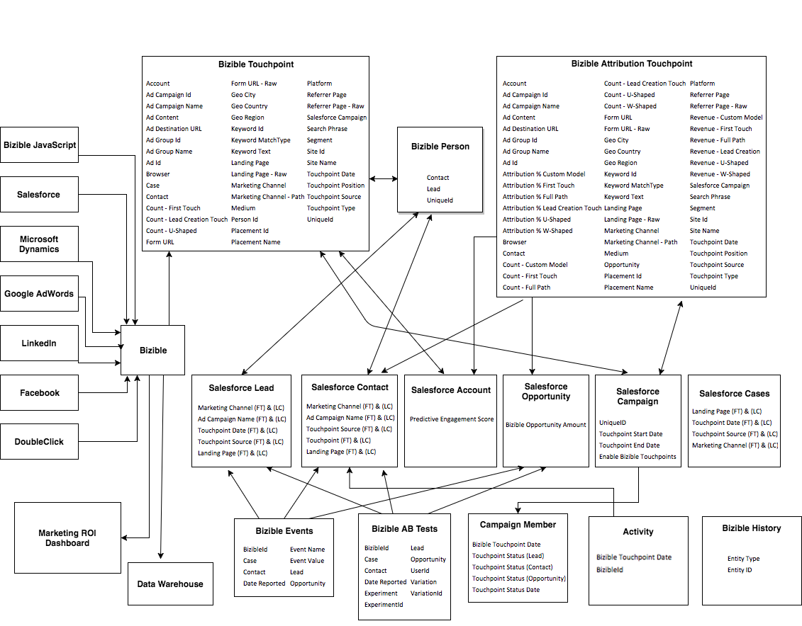

# [!DNL Marketo Measure]对象和字段分类 {#marketo-measure-object-and-field-taxonomy}

下面是一个流程图，它表示[!DNL Marketo Measure]自定义对象与[!DNL Salesforce]标准对象的关系。

对于完整大小的图像，[单击此处](assets/bizible-object-and-field-taxonomy-graph-full.png)。

可以在此处](/help/introduction-to-marketo-measure/overview-resources/glossary-of-marketo-measure-fields.md)找到每个对象[中活动的[!DNL Marketo Measure]字段的定义。

## 常见问题 {#faq}

**箭头中的逻辑是什么？**

每个箭头都描述对象与另一个对象之间的关系。 例如，您看到[!DNL Marketo Measure]人员填充了标准[!DNL Salesforce]潜在客户对象上的字段。 如果指向它，则表示它填充了箭头的接收端。

**什么是[!DNL Marketo Measure]人员？**

它是[!DNL Salesforce]中的自定义[!DNL Marketo Measure]对象，可将采购员接触点链接到潜在客户和联系人。

**什么是[!DNL Bizible].JS？**

这是我们用于跟踪某人在特定网站上拥有的Web信息的自定义JavaScript。

**什么是营销ROI仪表板？**

它是一个位于[!DNL Marketo Measure]应用程序中的自定义营销渠道仪表板。 通过转到[!DNL Salesforce]中的[!DNL Marketo Measure]选项卡，可以访问该区域。
