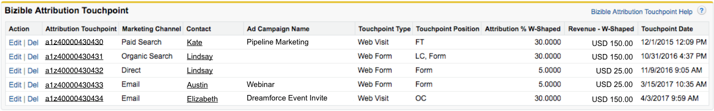

# [!DNL Marketo Measure] Salesforce对象 {#marketo-measure-salesforce-objects}

>[!NOTE]
>
>您可能会看到说明“[!DNL Marketo Measure]”，但仍可在CRM中看到“Bizible”。 我们正在努力更新品牌，并且品牌重塑很快将会反映在您的CRM中。

时间 [!DNL Marketo Measure] 安装在 [!DNL Salesforce] (SFDC)，多个自定义 [!DNL Marketo Measure] 添加对象。 本文解释了其中几个自定义项 [!DNL Marketo Measure] 对象。 某些对象 [!DNL Marketo Measure] 添加至 [!DNL Salesforce] 为：

* [买方接触点](#touchpoint)
* [买方归因接触点](#attribution)
* [[!DNL Marketo Measure] 人员](#person)
* [[!DNL Marketo Measure] A/B测试](#ab)
* [[!DNL Marketo Measure] 活动](#events)

由要跟踪的内容捕获的接触点将写入由安装创建的自定义对象。 [!DNL Bizible Salesforce] 包。

[!DNL Marketo Measure] 对象与特定标准相关 [!DNL Salesforce] 对象。 这允许您报告 [!DNL Marketo Measure] 和 [!DNL Salesforce] 对象到一起。 下表显示了 [!DNL Salesforce] 对象 [!DNL Marketo Measure] 对象与之相关。

## 买方接触点 {#buyer-touchpoint}

此 [!UICONTROL Buyer Touchpoint] (BT) Object讲述个人的营销故事。 它包含与潜在客户和联系人生成的营销接触点相关的所有数据。 BT向您显示相关信息，例如接触点来自哪个营销渠道，或者广告促销活动将该特定潜在客户/联系人带到您的网站。

BT对象在“潜在客户”和“联系人”页面上可见，显示为 **相关列表** （请参阅下图）。

BT相关列表显示了属于潜在客户或联系人的所有接触点。 在列表中，为自定义字段 [!DNL Marketo Measure] 提供有关每个接触点的更多详细信息的字段。 单击“采购员接触点ID”编号会将您定向到“采购员接触点详细信息”页面，该页面提供了有关接触点的更多详细信息，如潜在客户/联系人在Web会话期间访问的第一个网页(**登陆页面**)。

## 买方归因接触点 {#buyer-attribution-touchpoint}

此 [!UICONTROL Buyer Attribution Touchpoint] Object讲述与商机相关的联系人的营销交互情况。 它显示 *归因* 与营销接触点相关的数据。 此对象允许您查看有多少收入点数归于每个营销接触点。 您使用的归因模型类型将确定归属于接触点的收入百分比。

只有在创建了Opportunity之后，才会创建买方归因接触点(BAT)，该Opportunity与具有买方接触点(BT)数据的联系人相关。 如果没有机会，将不会创建BAT。 创建Opportunity后， BAT对象将使用 [!DNL Salesforce] *数量* 字段以了解归因到接触点的收入。

A **工作流** 如果您使用 [自定义金额字段](/help/advanced-marketo-measure-features/custom-revenue-amount/using-a-custom-revenue-amount-field.md) 以显示Opportunity对象的收入。 [!DNL Marketo Measure] 无法读取在自定义“金额”字段中显示的信息，因此无法填充接触点上的收入归因数据。 此工作流将使用 **[!DNL Marketo Measure]机会金额** 字段，其中之一 [!DNL Marketo Measure] 自定义字段，用于将来自自定义金额字段的收入值映射到商机金额字段。

BAT对象在 [!UICONTROL Opportunity]， [!UICONTROL Contact]、和 [!UICONTROL Account] 作为相关列表的对象。 此列表显示具有归因数据属于某个Opportunity的所有接触点。 单击“买方归因接触点ID”会将您定向到“买方归因接触点详细信息”页面。 在这里，您将能够查看更多具体的归因数据和有关接触点来源的信息（类似于买方接触点对象中提供的内容）。

## [!DNL Marketo Measure] 人员 {#marketo-measure-person}

此 [!DNL Marketo Measure] 人员对象将Lead和Contact对象关联在一起。 开箱即用的Salesforce不提供在同一报告中使用Lead和Contact对象创建报告的选项。 通过与Lead和Contact对象关联， [!DNL Marketo Measure] 人员允许您在同一报表中报告两个对象。 当Lead已转换为Contact时，这尤其有用。 在 [!DNL Marketo Measure] 人员记录：您将看到对相应Lead和/或Contact记录的查找、与人员关联的接触点的相关列表以及人员ID（始终是Lead/Contact的电子邮件地址）。 由于 [!DNL Marketo Measure] 人员与商机和联系人对象相关，将永远不会 [!DNL Marketo Measure] 与买方归因接触点关联的人员记录。 以下是 [!DNL Marketo Measure] Salesforce中的人员记录：

## [!DNL Marketo Measure] A/B测试 {#marketo-measure-a-b-test}

如果您通过运行A/B测试 [!DNL Optimizely] 或VWO (Visual Web Optimizer)，您可以将这些帐户连接到 [!DNL Marketo Measure] 用于在Salesforce中查看A/B测试数据的帐户。 此 [!DNL Marketo Measure] A/B测试对象基本上允许您从Optimizy/VWO中获取A/B测试数据，并将该数据关联到潜在客户和联系人。

此 [!DNL Marketo Measure] A/B测试对象将作为相关列表显示在 [!UICONTROL Leads]， [!UICONTROL Contacts] 和 [!UICONTROL Opportunity] 页数。 该列表显示了您正在优化或VWO中运行的所有试验和变体，并允许您查看与特定潜在客户和联系人相关的试验/变体。

## [!DNL Marketo Measure] 活动 {#marketo-measure-events}

此 [!DNL Marketo Measure] 事件对象允许您跟踪网站上发生的特定事件。 要跟踪网站上发生的特定事件，除了必须在页面上添加自定义代码之外， [!DNL Marketo Measure] Javascript。 捕获的信息将显示在 [!DNL Marketo Measure] 对象相关列表，该列表可在 [!UICONTROL Leads]， [!UICONTROL Contacts] 和 [!UICONTROL Opportunity] 页数。 此 [!DNL Marketo Measure] 事件对象 *不会* 绑定到归因数据。 此对象的目的是查看用户是否在您的网站上执行特定操作。

## [!DNL Marketo Measure] 字段 {#marketo-measure-fields}

由捕获的数据 [!DNL Marketo Measure] JavaScript将推送到自定义 [!DNL Marketo Measure] 中的字段 [!DNL Marketo Measure] 对象。 某些字段仅存在于某些对象中。 您可以查看 [词汇表[[!DNL Marketo Measure] 字段]](/help/introduction-to-marketo-measure/overview-resources/glossary-of-marketo-measure-fields.md) 和 [相关可视化图表 [!DNL Marketo Measure] 对象](/help/configuration-and-setup/marketo-measure-and-salesforce/marketo-measure-object-and-field-taxonomy.md).

## [!DNL Marketo Measure] 报告和仪表板 {#marketo-measure-reports-and-dashboards}

此 [!DNL Marketo Measure] 已添加到您的中的报告和仪表板 [!DNL Salesforce] 为您提供开箱即用的报表和数据可视化功能。 这些是基本的 [!DNL Marketo Measure] 报告，以便您快速组织、分析和了解接触点数据。
