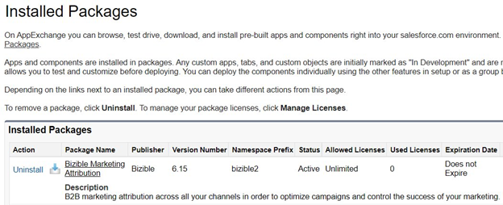
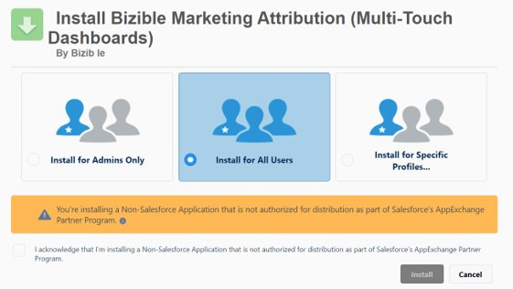

# [!DNL Marketo Measure] Salesforce包的安装和设置 {#marketo-measure-salesforce-package-installation-and-set-up}

安装之前 [!DNL Marketo Measure] [!DNL Salesforce] 基础包，您需要确定是否首先在 [!DNL Salesforce] 沙盒，然后再迁移到Salesforce生产实例。

>[!NOTE]
>
>一旦您的 [!DNL Marketo Measure] 帐户已连接到 [!DNL Salesforce] 生产实例，您无法向后移动并连接到沙盒。 此外， [!DNL Marketo Measure] 帐户只能连接到一个 [!DNL Salesforce] 生产实例。

此 [!DNL Marketo Measure] 基础包包含：

* 7自定义 [!DNL Marketo Measure] 对象
* 自定义 [!DNL Marketo Measure] 字段
* 25 [!DNL Stock] 报表

[!DNL Marketo Measure] 能够阅读标准内容 [!DNL Salesforce] 对象、字段和记录， [!DNL Marketo Measure] 永远不会更新数据或向其推送数据。 收集的所有数据 [!DNL Marketo Measure] Javascript将显示在 [!DNL Marketo Measure] 自定义对象和字段。

请按照以下步骤安装 [!DNL Marketo Measure Salesforce] 基础包。

1. 使用无痕浏览器，转到 [Salesforce Appexchange](https://appexchange.salesforce.com/appxListingDetail?listingId=a0N3000000B3KLuEAN){target="_blank"} 并登录。

1. 在中安装 [!DNL Marketo Measure] 沙盒或生产环境包。

1. 登录 [!DNL Salesforce] 作为管理员。

1. 选择 **[!UICONTROL Install]适用于所有用户**.

   

1. 安装完成后，即可进行查看。

   

完成安装后，您可以更新 [[!DNL Salesforce] 页面布局](/help/configuration-and-setup/marketo-measure-and-salesforce/page-layout-instructions.md){target="_blank"} 使用 [!DNL Marketo Measure] 字段（如果需要）。

>[!NOTE]
>
>了解 [!DNL Marketo Measure] 已创建权限集并 [它们的使用方式](/help/configuration-and-setup/marketo-measure-and-salesforce/marketo-measure-permission-sets.md){target="_blank"}.

## 安装 [!DNL Marketo Measure] 功能板包 {#install-marketo-measure-dashboard-package}

此 [!UICONTROL Dashboard] 扩展包中包含三个预建的功能板。 我们建议安装 [!UICONTROL within] 适用于所有用户的生产环境。

1. 从安装包 [[!DNL Salesforce] Appexchange](https://login.salesforce.com/packaging/installPackage.apexp?p0=04t610000001jI6){target="_blank"}.

1. 选择 **[!UICONTROL Install for All Users]**.

   

## 创建 [!DNL Marketo Measure] 个人资料和用户 {#creating-a-marketo-measure-profile-and-user}

[!DNL Marketo Measure] 通过连接的发送和接收数据 [!DNL Salesforce] 用户属于 [!DNL Marketo Measure] 应用程序。

为了将接触点数据推送到 [!DNL Salesforce] 实例中，连接的用户必须有权访问 [!DNL Marketo Measure] 自定义对象（例如，买方接触点和买方归因接触点）以及标准 [!DNL Salesforce] 诸如潜在客户和联系人之类的对象。

创建 [!DNL Marketo Measure] 配置文件以确保您在将数据推送到Salesforce时不会遇到验证错误。

步骤1：创建特定 [!DNL Marketo Measure] 个人资料

1. 分配以下权限：

* &quot;[!DNL Marketo Measure] 管理员权限集”
   * 托管权限集使SFDC管理员能够从中创建、读取、写入和删除记录 [!DNL Marketo Measure] 对象。
* “查看和编辑已转化商机权限集”
   * 这允许 [!DNL Marketo Measure] 以便在潜在客户转换为联系人后对其进行修饰。 如果未启用此权限集，则可能存在显着的数据跟踪缺口。

>[!NOTE]
>
>此配置文件可以是系统管理员配置文件的克隆。

步骤2：创建专用 [!DNL Marketo Measure] 用户，以便您能够跟踪 [!DNL Marketo Measure] 在您的 [!DNL Salesforce] 实例

1. 分配新的 [!DNL Marketo Measure] 该用户的配置文件。

1. 启用“营销用户”作为用户级别权限。

* 此 [!UICONTROL Marketing User] 通过复选框，用户可创建营销活动并使用营销活动导入向导。 如果未选择此选项，则用户只能查看营销活动和高级营销活动设置，编辑单个潜在客户或联系人的营销活动历史记录，以及运行营销活动报表。 [!DNL Marketo Measure] 需要能够读取和写入campaign对象。

步骤3：从所有触发器、工作流和流程中排除此配置文件

第4步：登录到 [!DNL Marketo Measure] 帐户并重新授权 [!DNL Salesforce] 与新用户的连接

1. 转到apps.bizible.com ，然后使用新用户生产环境登录 [!DNL Salesforce] 凭据。

1. 选择 **[!UICONTROL Settings]** 内部 **[!UICONTROL My Account]** 下拉菜单。

1. 选择 **[!UICONTROL Connections]** 内部 **[!UICONTROL Integrations]** 分组。

1. 单击当前连接的右侧的键图标 [!DNL Salesforce] 连接并选择 **使用生产环境重新授权**. 使用新用户凭据再次登录（如果出现提示）。
