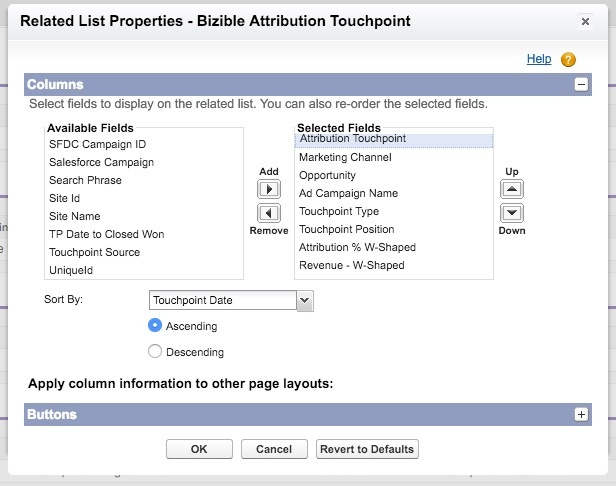

# 页面布局说明 {#page-layout-instructions}

>[!NOTE]
>
>您可能会看到说明“[!DNL Marketo Measure]”，但仍可在CRM中看到“Bizible”。 我们正在努力更新品牌，并且品牌重塑很快将会反映在您的CRM中。

轻松查看 [!DNL Marketo Measure] 因此，建议更新以下项的页面布局： [!UICONTROL Account]， [!UICONTROL Contact]， [!UICONTROL Lead]， [!UICONTROL Opportunity]、和 [!UICONTROL Campaign] 对象。 下面的每个“对象页面布局”的说明都进行了细分。

要开始，请先导航到 [!DNL Salesforce] 设置设置并找到 [!UICONTROL Customize] 选项卡。

## 营销活动对象 {#campaign-object}

建议您添加 [!DNL Marketo Measure] 仅沙盒的SFDC Campaign字段。 这些字段可用于测试接触点生成。 在生产中，建议仅添加 [!DNL Marketo Measure] 批量更新接触点日期按钮。 不建议添加 [!DNL Marketo Measure] 字段到生产环境，因为您可以创建Campaign同步规则。

1. 在“生成”选项中，选择 **[!UICONTROL Campaigns]**.

1. 单击 **[!UICONTROL Page Layouts]**.

   

1. 单击 **[!UICONTROL Edit]** ，位于要更新的页面布局旁边。

   

1. 在 [!UICONTROL fields] 选项，选择 **[!UICONTROL Enable Buyer Touchpoints]** 字段，然后将其拖动到页面上所需的任何位置。 接下来，添加 **[!UICONTROL Touchpoint Start Date]** 和 **[!UICONTROL Touchpoint End Date]** 字段。

   

1. 接下来，在页面顶部单击“[!UICONTROL Buttons]”选项。

1. 拖动 **[!UICONTROL Bulk Update Touchpoint Date]** 按钮到自定义按钮部分。

   

1. 单击 **[!UICONTROL Save]**.

   >[!NOTE]
   >
   >如果您使用多个Campaign记录类型，则必须更新 **[!UICONTROL Enable Buyer Touchpoints]** 字段。 请参阅 [本文](/help/channel-tracking-and-setup/offline-channels/configurations-for-multiple-campaign-record-types.md) 以获取说明。

## 潜在客户 {#leads}

1. 在“生成”选项中，选择 **[!UICONTROL Leads]**.

1. 单击 **[!UICONTROL Page Layouts]**.

1. 单击 **[!UICONTROL Edit]** ，位于要更新的页面布局旁边。 请记住，多个页面布局可以包含“买方接触点”部分。

1. 单击快速查找菜单左侧的VisualForce页面选项。

1. 创建一个部分并将其命名为“购买者接触点”。

   >[!NOTE]
   >
   >为每个部分选择“一列”格式。

1. 拖动 **[!UICONTROL Marketo Measure Lead Related List]** VisualForce页面放入页面布局部分。

   

1. 单击 [!DNL VisualForce] ，并将高度更改为100并启用滚动条。

1. 返回菜单，选择 [!UICONTROL Canvas Apps] 部分，并在接触点下方创建名为“Marketo Measure Insights”的部分 [!DNL VisualForce] 部分已创建。

   >[!NOTE]
   >
   >为每个部分选择“一列”格式。

1. 拖动 [!DNL Marketo Measure Insights] 将应用程序画布到新创建的分区中。 单击 **保存**. 有时，在放入画布应用程序之前必须先保存页面布局，因为Salesforce无法立即识别此布局。 因此，在创建部分后，保存页面布局，然后重新编辑以将画布应用程序拖动到该部分中。 这适用于每个对象。

   >[!NOTE]
   >
   >对于 [!DNL Marketo Measure Insights] Canvas应用程序正常运行之前， [必须正确配置权限](/help/configuration-and-setup/marketo-measure-insights-canvas-app/marketo-measure-insights-configuration.md).

   >[!TIP]
   >
   >大多数客户不使用以(FT)或(LC)结尾的字段，因为它们是 [!DNL Marketo Measure] 接触点作为对象存在。

如果您使用 [!DNL Marketo Measure] ABM功能， [单击此处获取其他页面布局说明](/help/advanced-marketo-measure-features/account-based-marketing/account-based-marketing-overview.md).

## 联系人 {#contacts}

1. 在“生成”选项中，选择 **[!UICONTROL Contacts]**.

1. 单击 **[!UICONTROL Page Layouts]**.

1. 选择要编辑的页面布局。

   转到快速查找菜单中的“相关列表”选项，然后添加 **[!UICONTROL Buyer Touchpoints]** 相关列表。

1. 单击扳手图标，并按此顺序添加以下列：

   * 买方接触点
   * 营销渠道
   * 接触点源
   * 广告营销活动名称
   * 接触点位置
   * 接触点日期

1. 排序依据：接触点日期，升序。

   

1. 展开按钮选项并取消选择 **[!UICONTROL New]**.

   

1. 返回 [!UICONTROL Related List] 选项，现在添加 **[!UICONTROL Buyer Attribution Touchpoint]** 相关列表。

1. 单击扳手图标，并按此顺序添加以下列：

   * 归因接触点
   * 营销渠道
   * 机会
   * 广告营销活动名称
   * 接触点类型
   * 接触点位置
   * 归因% W型(_或者最可靠的归因模型，例如“完整路径”或“自定义”_)
   * 收入W型(_或者最可靠的归因模型，例如“完整路径”或“自定义”_)
   * 接触点日期

1. 按接触点排序 [!UICONTROL Date] > [!UICONTROL Ascending].

1. 展开按钮部分并取消选择 **[!UICONTROL New]**.

1. 单击 **[!UICONTROL Save]**.

## 机会 {#opportunities}

1. 在“生成”选项中，选择 **[!UICONTROL Opportunities]**.

1. 单击 **[!UICONTROL Page Layouts]**.

1. 选择要编辑的页面布局。

1. 添加 **[!UICONTROL Buyer Attribution Touchpoint]** 相关列表，然后单击扳手，为“业务机会”添加以下列：

   * 归因接触点
   * 营销渠道
   * 联系人
   * 广告营销活动名称
   * 接触点类型
   * 接触点位置
   * 归因% W型(_或者最可靠的归因模型，例如“完整路径”或“自定义”_)
   * 收入W型(_或者最可靠的归因模型，例如“完整路径”或“自定义”_)
   * 接触点日期

1. 排序方式 [!UICONTROL Touchpoint Date] > [!UICONTROL Ascending].

1. 取消选择 **[!UICONTROL New]** 内部 [!UICONTROL Buttons] 部分。

1. 单击 **[!UICONTROL Save]**.

## 帐户 {#accounts}

1. 在“生成”选项中，选择 **[!UICONTROL Accounts]**.

1. 单击 **[!UICONTROL Page Layouts]**.

1. 选择要编辑的页面布局。

1. 添加 **[!UICONTROL Buyer Attribution Touchpoint]** 相关列表，然后单击扳手以添加以下列：

   * 归因接触点
   * 营销渠道
   * 机会
   * 广告营销活动名称
   * 接触点类型
   * 接触点位置
   * 归因% W型(_或者最可靠的归因模型，例如“完整路径”或“自定义”_)
   * 收入W型(_或者最可靠的归因模型，例如“完整路径”或“自定义”_)
   * 接触点日期

1. 按接触点日期>升序排序。

1. 取消选择 **[!UICONTROL New]** 内部 [!UICONTROL Buttons] 部分。

1. 单击 **[!UICONTROL Save]**.

如果您使用 [!DNL Marketo Measure] ABM功能，查看 [其他页面布局说明](/help/advanced-marketo-measure-features/account-based-marketing/account-based-marketing-overview.md).
