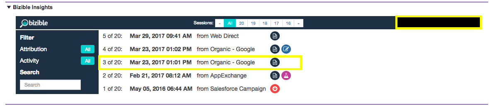

# [!DNL Marketo Measure]分析解释 {#marketo-measure-insights-explained}

了解[!DNL Marketo Measure]中的[!DNL Salesforce]分析视图，包括不同的图标表示什么以及如何使用该功能。 此功能非常有助于查看潜在客户、联系人或客户的前20场会议。

在[!DNL Marketo Measure] JavaScript跟踪某人并在您的网站上填写表单后，该人员即成为您系统中的潜在客户，其数字营销数据将被发送到您的Salesforce (SFDC)组织。 发生这种情况时，您会看到接触点数据填充到Lead/Contact/Opportunity/Account对象的[!DNL Marketo Measure] Lead Insights部分(Canvas App)中。

首先，您可在洞察内容的中间部分中看到访客在您网站上的会话数。 您可以随意滚动浏览这些会话和导航。

如果您单击分析中上角的“全部”，可以查看所有会话的汇总。 在这里，您可以了解各个会话的日期、驱动这些会话的渠道或来源以及指定更多信息的一组图标。

您首先看到的是FT或LC图标。 这些表示所列会话的接触点位置。 具体来说，FT代表First Touch，LC代表Lead Creation。 您可以有多个会话，但只有一个接触点可以是FT或LC。 您永远不会找到与一个人相关联的多个FT或LC。

看起来像纸张的图标表示页面查看发生在会话中。 每个会话都可能包含此图标。

看起来像烧杯的图标表示发生了A/B测试试验。 目前，我们与Optimizy和VWO进行了集成。 通过此集成，我们能够推送用户在其特定会话中看到的试验和变体。

如果单击任何特定会话（可以通过单击会话的实际日期或分组会话中上部的日期来执行此操作），您将能够查看会话详细信息。 在每个会话中，您可以看到用户查看的所有特定页面，这些页面按日期和时间排序。

在每个会话的右侧，您可以看到推送SFDC中[!DNL Marketo Measure]字段的更多粒度营销数据。 在此示例中，您可以看到广告组、广告内容、促销活动、关键字、Medium。 您还可以向下滚动以查看我们提供的[!DNL Marketo Measure]数据的更多信息。

最后，当某人拥有大量会话时，您可以使用[!UICONTROL Insights]中的某些过滤器来查找他们在您网站上的参与的特定部分。 例如，您可以按[!UICONTROL Touchpoint Position]进行筛选。

您还可以按页面查看次数、AB测试或Forms进行搜索。
