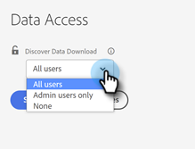
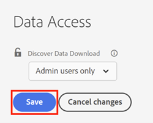

# [!UICONTROL Discover Data Download]访问控制 {#discover-data-download-access-control}

[!UICONTROL Discover Data Download]控件使[!DNL Marketo Measure]管理员能够根据用户的角色为Discover仪表板设置数据下载策略。 该控件涵盖了“发现功能板”上的所有数据下载操作。

1. 单击[!UICONTROL Security]下的&#x200B;**[!UICONTROL Data Access]**。

   

1. 单击下拉菜单并为控制台选择相应的选项。

   

| 选项 | 下载访问权限 |
| --- | --- |
| 所有用户 | 所有用户都可以下载数据，包括PDF和CSV格式。 |
| 仅限管理员用户 | 只有管理员用户可以下载数据，包括PDF和CSV格式。 |
| None | 没有人可以下载数据，包括PDF和CSV格式。 |

1. 完成后，单击 **[!UICONTROL Save]**。

   

该设置可能要在用户注销并重新登录后才会生效。
