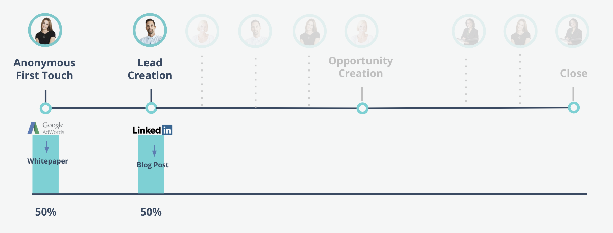
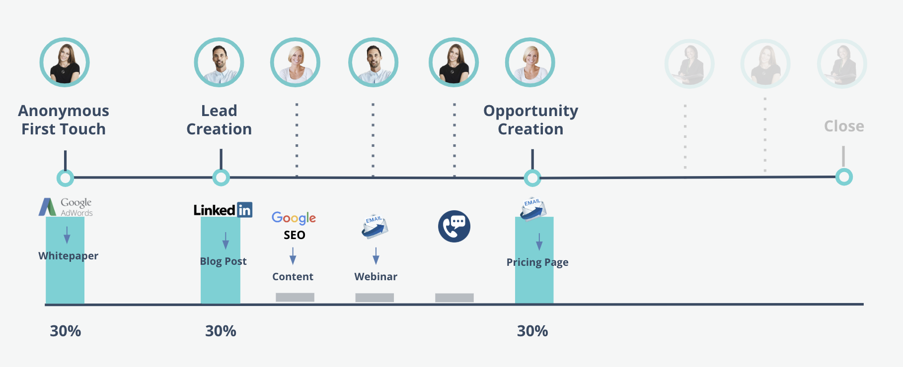

# Marketo Measure归因模型 {#marketo-measure-attribution-models}

Marketo Measure提供了六种类型的归因模型：

* 首次接触
* 商机创建
* U型
* W形
* 完整路径
* 自定义模型

这些模型的复杂性各不相同。 首次联系和潜在客户创建是我们简单的单次联系模型。 其余的四种是我们更为复杂的多触点模型。 Marketo Measure归因模型的结构反映了客户历程中发生的四个主要接触点：

* 首次接触(FT)
* 商机创建(LC)
* 机会创建(OC)
* 闭门交易(CW)

在 **单接触模型**，则归因点数仅归因于一个里程碑接触点，因此名称为“单次接触”。
在 **多接触模型**，则大多数归因点数会分配给两个或更多里程碑接触点。 剩余点数归因于里程碑接触点之间发生的接触点。

接下来的几节将介绍每个归因模型以及如何分配归因点数。

## 单点接触模型 {#single-touch-models}

**首次接触模型**

首次联系模型仅关注潜在客户与您的组织进行的首次交互。 此模型将100%的归因点数归因于潜在客户首次了解您的公司首次联系(FT)。

假设Kate首次通过Adwords广告访问www.adobe.com并查看白皮书。 Adwords渠道将从该Opportunity中接收100%的归因点数。

**商机创建模型**

潜在客户创建模型将100%的归因点数归因到LC接触点，当潜在客户提供其联系信息并成为潜在客户时。

继续前一个示例，在Kate通过Adwords首次访问www.adobe.com后，Austin通过Linkedin帖子访问网站。 奥斯汀填写表格并成为潜在客户。 在此模型中，Linkedin将获得归因点数的100%。

## 多接触模型 {#multi-touch-models}

多接触模型用于更长、更复杂的销售周期。 如果客户/公司的多个人员参与了购买历程，则这些模型将特别有用。

**U型模型**

U型模型同时关注FT和LC接触点。 在此模型中，英国《金融时报》和LC接触点各获得50%的收入信用。

Kate首次通过Adwords访问www.adobe.com ，将获得50%的归因点数。 剩下的50%将归因于Linkedin的帖子，该帖子促使奥斯汀填写表格并成为领先者。

**W型模型**

W型模型中包含三个里程碑接触点。 在此模型中，FT、LC和OC接触点均归因于归因点数的30%。 其余10%按比例归因于三个里程碑接触点之间发生的任何中间接触点。

凯特和奥斯汀向同事希拉里提到Marketo Measure。 她通过谷歌搜索找到一段内容，并填写表格。 之后，Austin会收到一封电子邮件，要求进行网络研讨会注册，并填写网站上的注册表。 Kate与一位销售代表就Marketo Measure产品进行了交谈。

Hillary会收到一封包含定价页面链接的电子邮件，并访问该页面。 然后，为其帐户创建一个Opportunity。 希拉里对定价页面的Web访问为“机会创建”提供了点数，因为它是与“机会创建”日期最接近的营销互动。 每个里程碑接触点都分配了归因点数的30%，中间接触点则归因了其余的10%。

**全路径模型**

完整路径模型包括所有四个里程碑接触点。 英国《金融时报》、LC、OC和CW各获得22.5%的收入信用，其余10%在中间接触中平均分配。

机会创造后，凯特、奥斯汀和希拉里决定把Marketo Measure推销给他们的CMO伊丽莎白。 Elizabeth出席Marketo Measure主办活动的会议。 Kate看到Linkedin的一篇关于案例研究的帖子，并填写表格以下载内容。 伊丽莎白出席了Marketo Measure主办的一场销售晚宴。 晚饭后，她决定购买Marketo Measure，并成为客户。 在这种情况下，销售晚宴将归因于已结束交易的收入信用的22.5%。 英国《金融时报》、LC和OC接触点也分别获得22.5%的信用。 中间接触点均等分配余下10%的收入信用。

**自定义归因模型**

Marketo Measure还提供了一个自定义归因模型，允许用户选择要包含在其模型中的接触点或自定义阶段。 此外，用户还能够控制归因到这些接触点和阶段的归因点数百分比。
