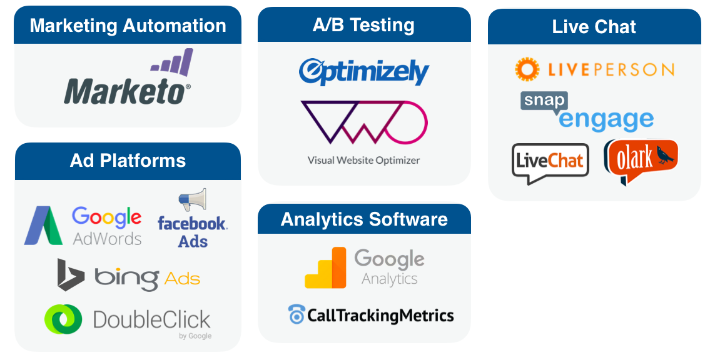

# Marketo Measure框架 {#marketo-measure-framework}

进一步了解构成Marketo Measure框架的四个主要组件。 Marketo Measure依赖这些应用程序来跟踪、组织和存储数据，并提供报告功能。 构成Marketo Measure框架的四个组成部分是：

* Marketo Measure的JavaScript
* CRM集成
* 第三方应用程序/系统
* Marketo Measure应用程序

## Marketo Measure JavaScript {#marketo-measure-javascript}

Marketo Measure JavaScript可跟踪潜在/潜在客户与您的组织之间所有在线营销互动（也称为接触点）。 它是一个自定义脚本，在结束 `</head>` 标记。

``

>[!NOTE]
>
>有关如何添加Marketo Measure JS的说明，请 [单击此处](/help/marketo-measure-tracking/setting-up-tracking/adding-marketo-measure-script.md).

Marketo Measure的JS可从Web访问（包括匿名Web访问）、常规流量/页面导航、内容下载和表单提交中捕获数据。 此数据会推送到您的CRM，并且每次营销互动都会显示为一个接触点。

## CRM集成 {#crm-integrations}

Marketo Measure与CRM集成，以存储和组织Marketo Measure JS捕获的所有数据。 目前，Marketo Measure具有与两个CRM的API集成。

通过在CRM中显示Marketo Measure数据，您将能够查看与每个接触点相关的粒度信息，并生成报表以了解渠道的执行情况。

## 第三方应用程序 {#third-party-applications}

大多数营销人员依靠一些不同的应用程序来开展营销工作。 除了Salesforce和MS Dynamics之外，Marketo Measure还与13个第三方应用程序集成（如下所示）。

如果您使用上述应用程序运行任何营销工作，则可以将这些帐户关联到您的Marketo Measure帐户。 这可以轻松跟踪数据并将数据传输到您的Marketo Measure帐户。

## Marketo Measure应用程序 {#marketo-measure-application}

Marketo Measure应用程序用于查看和报告归因数据、配置帐户设置和更新帐户信息。 Marketo Measure应用程序中的主要菜单项包括：

**帐户配置**

您可以在此处更新公司的常规信息并访问Marketo Measure Javascript。

**设置**

此菜单项允许您配置归因和渠道映射设置，管理与CRM和第三方应用程序的集成，查看/添加Marketo Measure帐户用户，以及更新账单信息。

**营销ROI仪表板**

“营销ROI功能板”菜单项，可以根据渠道性能、活动和成本，将数据可视化。
