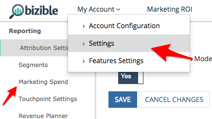

# 营销渠道成本 {#marketing-channel-costs}

使用最基本的好处之一 [!DNL Marketo Measure] 是将营销工作与对收入的影响直接联系起来的能力 — 具有所需数量的粒度。 投资回报率有可能出现在接触点层面。 要利用此优势，只需将渠道成本上传到 [!DNL Marketo Measure] 应用程序。 ROI报告会自动创建，并且可在 **营销ROI仪表板** 在 [experience.adobe.com/marketo-measure](https://experience.adobe.com/marketo-measure){target="_blank"}.

[单击此处直接导航到说明。](/help/marketing-spend/spend-management/marketing-channel-costs.md#uploading-marketing-costs)

此 [!DNL Marketo Measure] 营销支出功能允许客户跨所有渠道、子渠道和营销活动上传其支出。 客户添加的数据越多，我们在收入归因功能板中可以展示的ROI报表越多。

从直接广告连接报告和导入的成本会在最精细的级别自动拉入，无需上传。 这包括我们当前与Google AdWords、Bing Ads、Doubleclick和Facebook的集成。

[单击此处直接导航到常见问题解答。](/help/marketing-spend/spend-management/marketing-channel-costs.md#faq)

## 定义 {#definitions}

**按营销活动支出**

在极其精细的粒度级别，客户可以按在各自渠道中分组的各个促销活动输入支出。 对于CRM营销活动， [!DNL Marketo Measure] 已将Campaign ID提取到单独的列中，这可帮助您将离线营销活动支出从CRM映射到此表中。 在此级别添加支出将使客户能够查看Campaign ROI并按Campaign优化性能。

所有促销活动的总数不需要合计在子渠道或渠道中输入的任何值，但不能超过在子渠道或渠道中输入的任何值。 如果总和小于在子渠道或渠道中输入的值， [!DNL Marketo Measure] 将自动为“其他”添加一行以弥补差异并填补任何空白。

**按子渠道支出**

在更高级别，客户可以按子渠道输入支出，这些支出将分组到其渠道下。 在此级别增加支出将使客户能够查看子渠道ROI并按子渠道优化性能。

所有子渠道的总数不需要合计在渠道中输入的任何值，但不能超过在渠道中输入的任何值。 如果总和小于在渠道中输入的值， [!DNL Marketo Measure] 将自动为“其他”添加一行以弥补差异并填补任何空白。

**按渠道支出**

在最高级别，客户可以按渠道输入支出。 在此级别增加支出将使客户能够按渠道查看渠道ROI并优化性能。

**日期选取器**

默认日期范围将从您的开始日期开始 [!DNL Marketo Measure] 到当前月。 为确保成本保持正确，您不能输入未来月份的成本，但可以在与合作之前输入月份的成本 [!DNL Marketo Measure].

**筛选器**

要在“营销支出”表中缩小结果范围，请选择顶部的一个渠道以过滤掉其他渠道。 当您的团队专注于单个渠道时，这将很有帮助。

**搜索**

使用搜索框从渠道、子渠道或营销活动中查找匹配的文本。

**下载当前成本**

下载的CSV将从当前屏幕中提取结果，这意味着应用的任何日期、过滤器或搜索都将按原样下载。

**上传CSV**

无论浏览器中处于哪个视图，如果它是筛选视图或包含所有日期和渠道的默认视图，则可以上传任何CSV。

我们遇到的最常见错误是日期列的格式，如果日期格式发生更改，可能会发生此错误；如果在Excel和/或Google工作表之间移动，则可能会有意发生此错误。 请牢记，日期应为MM-YY，因此Sep-12日期应为9月12日而非9月12日，或May-12日期应为05-12日期。

## 开始之前 {#before-you-begin}

[!DNL Marketo Measure] 附带13个默认渠道，可以对其使用或展开。 此外，还可创建多达40个在线和离线渠道以适应您独特的营销结构。 在此基础上，可创建总计200个子渠道以支持这些在线和离线渠道。

[!DNL Marketo Measure] 将自动从与API集成的平台(例如Bing Ads和Google AdWords)下载营销渠道成本。 未与集成的平台的成本 [!DNL Marketo Measure] 需要手动上传。 在上传成本数据之前，应设置营销渠道。

## 上传营销成本 {#uploading-marketing-costs}

设置或更新营销渠道和规则后，可以上传相关成本。 为此，请执行以下步骤：

**步骤1：导航至 [!DNL Marketo Measure] 应用程序。**

转到 **[!UICONTROL My Account]** 菜单，单击 **[!UICONTROL Settings]** 然后导航到 **[!UICONTROL Marketing Spend]** 左侧边栏中的 **[!UICONTROL Reporting]** 部分。

**步骤2：下载当前成本CSV**

导航到屏幕右侧，然后单击 **[!UICONTROL Download Current Costs].** 利用此选项，您可以下载CSV格式的电子表格。

**步骤3：打开CSV文件并进行更改**

您可以导入文件，并使用Google Sheets、Apple Numbers、Microsoft Excel或您选择的软件将其打开。 [!DNL Marketo Measure] 建议使用Google工作表。

导入工作表后，进行所需的更改，如向渠道和子渠道添加成本或更新现有信息。

检查工作表中的逻辑规则。 每行应包含一个渠道及其子渠道之一，以(.)分隔 点在末尾。 始终如一地使用此格式很重要。

例如，要将Facebook指示为子渠道，将social指示为渠道，则规则应编写如下：“Social.Facebook”。 同样，要跟踪离线事件，渠道语法应为：“Events.Big Conference”。 示例如下图所示：

_其他说明_：

请勿修改电子表格中的日期，因为这会在上传文档时导致问题。

请勿将任何字段留空。 即使没有要添加的美元值，也输入$0作为美元金额。

无需输入或更新Bing Ads和Google AdWords成本，因为 [!DNL Marketo Measure] 自动从与这些平台的API连接中提取此数据。

**步骤4：以CSV格式保存文件**

如果您使用Google Sheets，请务必先下载文件。 请勿排除或删除任何每月数据，因为这样在尝试将CSV文件上传到时会遇到困难 [!DNL Marketo Measure] 稍后。

**步骤5：上传CSV文件**

转到 **[!UICONTROL Cost]** 的部分 [!DNL Marketo Measure] 应用程序并单击 **[!UICONTROL Upload.CSV]**. 系统将刷新并反映新信息。

## 常见问题解答 {#faq}

**为什么数字出现在CSV中**

如果未在较高级别（如渠道或子渠道）输入值， [!DNL Marketo Measure] 将自动为您计算子级别的总和，上传文件后将会显示这些子级别。 此外，如果子项的总和小于为父项输入的值， [!DNL Marketo Measure] 将添加一个“其他”行以显示总数中的差异。

**营销活动是如何在我看到的列表中确定的？**

目前，我们的结果会列出我们看到的、因接触点而值得信赖的营销活动。 如果存在来自营销活动的活动，则会根据发生的接触点日期显示该营销活动。

**要筛选的行和列太多 — 能否合并视图？**

利用更改日期范围、筛选渠道或搜索值的功能，您可以合并表的结果以更好地满足您的需求。

**为何无法上传文件？**

我们在 [!DNL Marketo Measure] 应用程序。 要上传文件，您需要是“帐户管理员”。 要解决此问题，请向帐户管理员请求访问权限，或让帐户管理员代表您上传文件。 用户及其角色的列表可在下找到 **[!UICONTROL My Account]** > **[!UICONTROL Settings]** > **[!UICONTROL View/Add Account Users]**.
