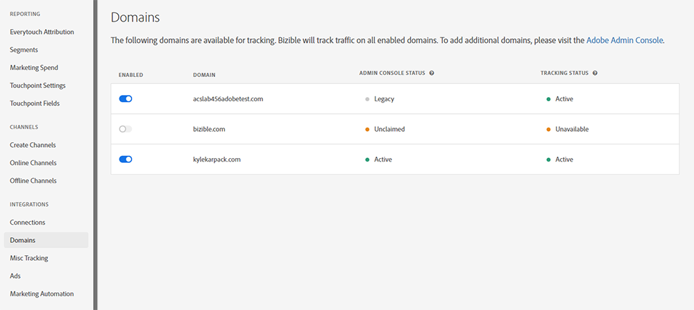

# 域管理 {#domain-management}

对于启用了IMS的租户运行 [!DNL Marketo Measure] 在Experience Cloud界面中， [!DNL Marketo Measure] 提供了一个允许用户管理其域列表的界面。 [!DNL Marketo Measure] 用户必须首先验证他们希望在 [Adobe Admin Console](https://adminconsole.adobe.com/). 在Admin Console中验证域后，用户可以管理 [!DNL Marketo Measure] 会使用这些域来跟踪网站流量。

## 在Admin Console中添加域 {#adding-domains-in-admin-console}

有权访问Adobe Admin Console的IMS用户可以添加和验证他们拥有的域。 域验证涉及为每个域添加DNS记录，然后允许Admin Console验证该记录。

有关添加域的说明，请参见 [Admin Console文档](https://helpx.adobe.com/enterprise/using/set-up-identity.html#setup-domains). 添加域后，它必须 [链接到目录](https://helpx.adobe.com/enterprise/using/set-up-identity.html#link-domains-to-directories).

## 在中管理域 [!DNL Marketo Measure] {#managing-domains-in-marketo-measure}

将域添加到Admin Console后， [!DNL Marketo Measure] 会定期将此记录同步到数据库中。 此同步在每晚进行，用户每次访问 **[!UICONTROL Domains]** 中的页面 [!DNL Marketo Measure] UI。 默认情况下，任何 [!DNL Marketo Measure] 将禁用导入，租户必须手动启用每个域。

在 **[!UICONTROL Integration]** > **[!UICONTROL Domains]** 页面上，用户将显示已在Admin Console中注册的所有域及其状态。 可以启用或禁用每个域。 如果启用了域， [!DNL Marketo Measure] 跟踪将收集在该域上看到的任何流量。 如果域被禁用， [!DNL Marketo Measure] 将忽略来自该域的任何流量，并且不会创建接触点或其他数据。 [!DNL Marketo Measure] 还将确认域的禁用情况并警告其后果：

切换域的影响是即时的，更改不具有追溯性。 将来， [!DNL Marketo Measure] 将在一段时间后清除禁用域中的数据。

## 状态 {#statuses}

Admin Console状态分类如下：

* **已验证**：此域已在Admin Console中验证
* **未验证**：此域未在Admin Console中完全验证，不符合在中跟踪的资格 [!DNL Marketo Measure]
* **无效**：此域可能已过期或已从Admin Console中删除。 在中跟踪数据 [!DNL Marketo Measure] 已标记为删除
* **旧版**：此域创建于 [!DNL Marketo Measure] 并且在Admin Console中不存在

跟踪状态可以如下所示：

* **活动**： [!DNL Marketo Measure] 当前正在从该域接收数据
* **已禁用**：此域可用于跟踪，但目前处于禁用状态
* **不可用**：此域未验证，因此无法用于跟踪

将鼠标悬停在任何单个状态项上将会触发工具提示，该提示将进一步说明该状态。

## 常见问题解答 {#faq}

**在Admin Console中删除域后会发生什么情况？**

在Admin Console中删除域时， [!DNL Marketo Measure] 会将域标记为已删除。 [!DNL Marketo Measure] 将立即停止跟踪此域上的流量，但不会删除任何之前收集的数据。

**为什么我无法启用域？**

在此页面上可能不允许选择域的原因有多种。 如果未在Admin Console中验证域，则它将在 [!DNL Marketo Measure]. 同样，如果域由不同于当前域的Adobe组织拥有 [!DNL Marketo Measure] 租户，可能无法选择它。

**如何从该列表中删除域？**

如果域的“已启用”开关已关闭， [!DNL Marketo Measure] 将忽略该标记，并将其从以下位置有效删除： [!DNL Marketo Measure]. 要从中永久删除域 [!DNL Marketo Measure]，您必须在中禁用它 [!DNL Marketo Measure]，然后将其从Admin Console中删除。
