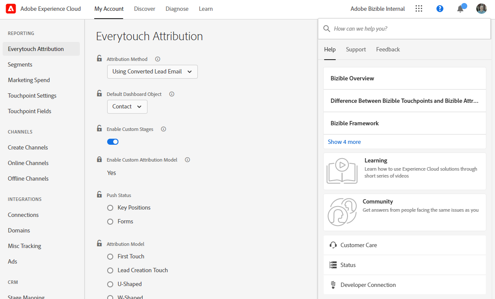
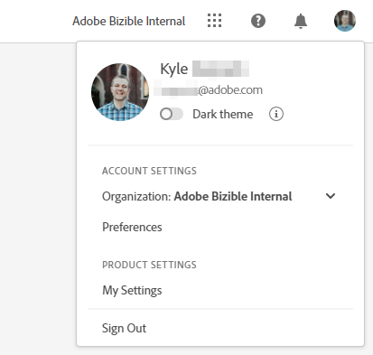

# Adobe Experience Cloud 界面概述 {#experience-cloud-interface-overview}

Adobe Experience Cloud界面与Adobe Experience Cloud应用程序和服务的外观保持一致。 但它不仅仅是全新的设计，更是一款单页应用程序，可在单一实例中提供完整的用户体验。

## 用户流程 {#user-flow}

如果您已登录Adobe Experience Cloud产品，请单击菜单图标并选择&#x200B;**[!DNL Marketo Measure]**。

>[!NOTE]
>您的下拉菜单可能会因您订阅的Adobe Experience Cloud产品而异。

如果您&#x200B;_不是_&#x200B;已登录到Adobe Experience Cloud产品，请直接在此处登录到[!DNL Marketo Measure]： [https://experience.adobe.com/marketo-measure](https://experience.adobe.com/marketo-measure)。

## 新增功能 {#new-features}

除了已更新的外观和感觉外，请注意以下功能：

**域管理**

[管理 [!DNL Marketo Measure] 域](/help/marketo-measure-and-adobe/domain-management.md)，无需[!DNL Marketo Measure]的帮助。

**集成帮助中心**

搜索支持文章、提交票证、提供反馈，所有这些都可在[!DNL Marketo Measure]应用程序中找到。

**应用程序切换器**

那些有权访问多个Adobe产品的用户可以在这些产品之间轻松切换。

**通知和公告**

您还可以在应用程序内直接查看并互动处理与产品相关的通知，以及 Adobe 产品的通用公告。

带有警报指示器的

**Adobe 设置**

要更改您的语言或其他Adobe范围的首选项，请单击您的配置文件图标。 您还可以通过单击[!DNL Marketo Measure]我的设置&#x200B;**进行特定于**&#x200B;的更改。

## 常见问题解答 {#faq}

**我的书签有什么变化？**

书签将被重定向。 例如，如果您要导航到https://apps.marketo-measure.com/Discover/391 ，则完成身份验证后您将被重定向到https://experience.adobe.com/marketo-measure/Discover/391 。

**我无法通过Experience Cloud界面登录到[!DNL Marketo Measure]。 可能存在什么问题？**

如果您可以登录到Adobe Experience Cloud，但看到类似以下内容的页面，则问题可能在[!DNL Marketo Measure]侧：

显示Marketo Measure连接问题的

如果收到上述错误，[联系支持人员](https://nation.marketo.com/t5/support/ct-p/Support)寻求帮助。
