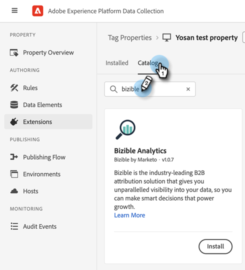

# [!DNL Marketo Measure] 与AdobeLaunch的集成 {#marketo-measure-integrations-with-adobe-launch}

Adobe Launch扩展专为现有的 [!DNL Marketo Measure] 已在其网站上使用AdobeLaunch的用户。 扩展用作标签管理解决方案，可用于根据特定事件和条件在页面上配置和动态加载脚本。

在AdobeLaunch中安装和配置后， [!DNL Marketo Measure] 扩展将在存在AdobeLaunch脚本的页面上加载bizible.js脚本。 这允许营销人员通过AdobeLaunch配置添加bizible.js，而不是显式修改网页以添加bizible.js脚本标记。

## 配置AdobeLaunch扩展 {#configure-the-adobe-launch-extension}

>[!PREREQUISITES]
>
>查看以下链接，了解有关AdobeLaunch及其扩展的更多信息：
>
>* [[!DNL Marketo Measure] 扩展名](https://experienceleague.adobe.com/docs/experience-platform/destinations/catalog/email/bizible.html?lang=en#catalog){target="_blank"}
>* [Adobe启动项概述](https://experienceleague.adobe.com/docs/launch-learn/implementing-in-websites-with-launch/index.html?lang=en#prerequisites){target="_blank"}
>* [AdobeLaunch扩展概述](https://experienceleague.adobe.com/docs/launch/using/extension-dev/overview.html?lang=en#extension-configuration){target="_blank"}

1. 按照以下步骤创建资产 [本文内容](https://experienceleague.adobe.com/docs/platform-learn/implement-in-websites/configure-tags/create-a-property.html?lang=en#go-to-the-data-collection-interface){target="_blank"}.

1. 单击刚刚创建的资产。

   

1. 单击 **[!UICONTROL Extensions]**.

   

1. 单击 **[!UICONTROL Catalog]** 选项卡并搜索&#39;&#39;[!UICONTROL Bizible]“

   

1. 在 [!UICONTROL Bizible Analytics] 图块，单击 **[!UICONTROL Install]**.

   

1. 在Bizible AccountId字段中，键入您网站的URL(例如， `adobe.com`)。

   

   >[!NOTE]
   >
   >此字段不是Business_Prod.Business表中的“帐户ID”。 来自给定URL的所有Web活动(例如， `adobe.com`)将被映射到 [!DNL Marketo Measure] 租户。

1. 单击 **[!UICONTROL Save]**.

   

1. 单击 **[!UICONTROL Rules]**，然后选择 **[!UICONTROL Create New Rule]**.

   

1. 单击 **[!UICONTROL Add]** 按钮位于 [!UICONTROL Events].

   

1. 在扩展下拉列表中，选择 **[!UICONTROL Core]**. 然后在事件类型下拉列表中，选择 **[!UICONTROL Library Loaded (Page Top)]**. 如果不为事件命名，则将应用默认名称。 单击 **[!UICONTROL Keep Changes]** 完成时。

   

1. 单击 **[!UICONTROL Add]** 按钮。

   

1. 在扩展下拉列表中，选择 **[!UICONTROL Bizible Analytics]**. 然后在操作类型下拉列表中，选择 **[!UICONTROL Initialize]**. 如果不为操作命名，则将应用默认名称。 单击 **[!UICONTROL Keep Changes]** 完成时。

   

1. 单击 **[!UICONTROL Save]**.

   
