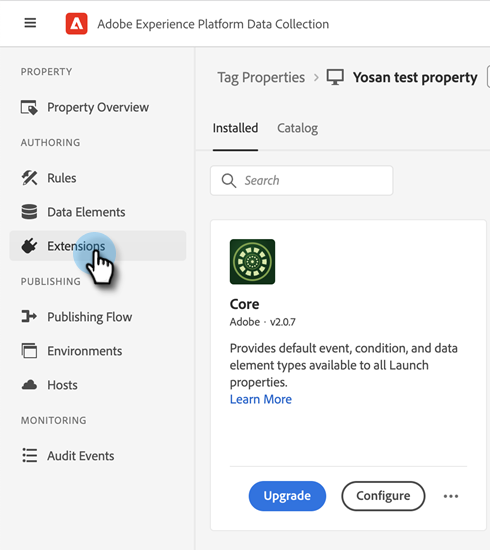

# [!DNL Marketo Measure] 与Launch集成Adobe {#marketo-measure-integrations-with-adobe-launch}

AdobeLaunch扩展专为现有 [!DNL Marketo Measure] 已在其网站上利用AdobeLaunch的用户。 该扩展用作标签管理解决方案，您可以使用该解决方案根据某些事件和条件在您的页面上配置和动态加载脚本。

在Launch中安装和配置后， [!DNL Marketo Measure] 扩展将在存在AdobeLaunch脚本的页面上加载bizible.js脚本。 这允许营销人员通过AdobeLaunch配置添加bizible.js，而不是显式修改网页以添加bizible.js脚本标记。

## 配置AdobeLaunch扩展 {#configure-the-adobe-launch-extension}

>[!PREREQUISITES]
>
>请访问以下链接，了解有关Launch及其扩展的更多Adobe:
>
>* [[!DNL Marketo Measure] 扩展](https://experienceleague.adobe.com/docs/experience-platform/destinations/catalog/email/bizible.html?lang=en#catalog){target=&quot;_blank&quot;}
>* [Adobe启动概述](https://experienceleague.adobe.com/docs/launch-learn/implementing-in-websites-with-launch/index.html?lang=en#prerequisites){target=&quot;_blank&quot;}
>* [AdobeLaunch扩展概述](https://experienceleague.adobe.com/docs/launch/using/extension-dev/overview.html?lang=en#extension-configuration){target=&quot;_blank&quot;}

1. 按照步骤创建属性 [在本文中](https://experienceleague.adobe.com/docs/platform-learn/implement-in-websites/configure-tags/create-a-property.html?lang=en#go-to-the-data-collection-interface){target=&quot;_blank&quot;}。

1. 单击之前创建的资产。

   

1. 单击 **[!UICONTROL Extensions]**.

   

1. 单击 **[!UICONTROL Catalog]** 选项卡，搜索“[!UICONTROL Bizible].&quot;

   

1. 在 [!UICONTROL Bizible Analytics] 拼贴，单击 **[!UICONTROL Install]**.

   

1. 在Bizible AccountId字段中，键入您网站的URL。

   

   >[!NOTE]
   >
   >此字段不是Business_Prod.Business表中的“帐户ID”。 来自给定URL的所有Web活动都将映射到 [!DNL Marketo Measure] 租户。

1. 单击 **[!UICONTROL Save]**.

   

1. 单击 **[!UICONTROL Rules]**，然后选择 **[!UICONTROL Create New Rule]**.

   

1. 单击 **[!UICONTROL Add]** 按钮 [!UICONTROL Events].

   

1. 在扩展下拉菜单中，选择 **[!UICONTROL Core]**. 然后，在事件类型下拉菜单中，选择 **[!UICONTROL Library Loaded (Page Top)]**. 如果不为事件指定名称，则会应用默认名称。 单击 **[!UICONTROL Keep Changes]** 完成时。

   

1. 单击 **[!UICONTROL Add]** 按钮。

   

1. 在扩展下拉菜单中，选择 **[!UICONTROL Bizible Analytics]**. 然后，在操作类型下拉菜单中，选择 **[!UICONTROL Initialize]**. 如果您没有为操作指定名称，则会应用默认名称。 单击 **[!UICONTROL Keep Changes]** 完成时。

   

1. 单击 **[!UICONTROL Save]**.

   
