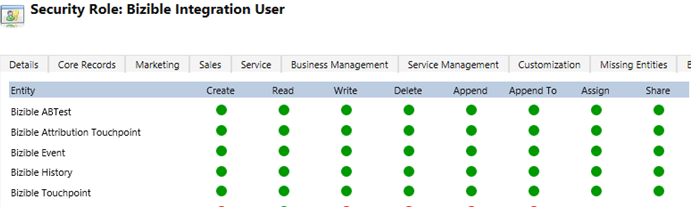

# [!DNL Microsoft Dynamics] CRM安装指南 {#microsoft-dynamics-crm-installation-guide}

>[!NOTE]
>
>您可能会看到指定“[!DNL Marketo Measure]“ ”，但仍会在您的CRM中看到“Bizible”。 我们正在努力更新该版本，并且该品牌重命名将很快地反映在您的CRM中。

## 支持的版本 {#supported-versions}

[!DNL Marketo Measure] 支持以下 [!DNL Microsoft Dynamics CRM] 版本：

* [!DNL Microsoft Dynamics 2016] （在线和内部部署）
* [!DNL Microsoft Dynamics 365] （在线和内部部署）

对于连接和身份验证， [!DNL Marketo Measure] 支持以下Active Directory Federated Services(ADFS)版本：

* ADFS 4.0 - [!DNL Windows Server 2016]
* ADFS 5.0 - [!DNL Windows Server 2019]

## 安装托管解决方案 {#install-the-managed-solution}

[下载并安装](assets/marketo-measure-dynamics-extension.zip) 动态CRM中的zip文件。

**[!UICONTROL Settings]** > **[!UICONTROL Customizations]** > **[!UICONTROL Solutions]** > **[!UICONTROL Import]** （按钮）> **[!UICONTROL Choose File]**.

>[!NOTE]
>
>以下两个屏幕截图可能与您的屏幕截图略有不同，因为它们是在解决方案升级期间拍摄的。

## [!DNL Marketo Measure] 用户权限 {#marketo-measure-user-permissions}

我们建议创建一个专用 [!DNL Marketo Measure] Dynamics中的用户，可供我们通过导出和导入数据，以避免CRM中的其他用户出现任何问题。 请注意用户名和密码以及端点URL，因为在创建 [!DNL Marketo Measure] 帐户。

## 安全角色 {#security-roles}

如果贵组织使用Dynamics安全角色，请确保连接的用户或专用 [!DNL Marketo Measure] 用户对所需实体具有足够的读/写权限。

安全角色位于以下位置： **[!UICONTROL Settings]** > **[!UICONTROL Security]** > **[!UICONTROL Security Roles]**.

对于 [!DNL Marketo Measure] 自定义实体，则我们需要所有实体的完全权限。

>[!NOTE]
>
>将要关闭销售机会的用户也需要完全权限。

对于Dynamics标准实体，请参阅 [!DNL Marketo Measure] Dynamics架构文档。 在高层， [!DNL Marketo Measure] 只需在某些实体中读取，即可收集相应数据并写入将随托管解决方案一起安装的自定义字段。 我们不会创建新的标准记录，也不会更新任何标准字段。

## 在页面布局中包含接触点： {#include-touchpoints-on-page-layouts}

1. 对于每个实体，导航到表单编辑器。 您可以在 **[!UICONTROL Settings]** > **[!UICONTROL Customizations]** > **[!UICONTROL Customize the System]** > `[Entity]` > **[!UICONTROL Forms]**. 或者，在查看记录时，您可以在设置中找到它。

   * 要配置的实体：帐户、机会、联系人、潜在客户和营销活动。

   * 要配置营销活动，您需要在 **[!UICONTROL CRM]** > **[!UICONTROL Campaigns]**.

   

1. 页面布局：首先添加“[!UICONTROL One Column]“ ”部分中的“ ”拼贴。 在该新列中，我们需要在您的帐户、机会、联系人和潜在客户实体内的每个表单中添加一个子网格。

   

   

1. 选择应在子网格中呈现的对象（买方归因接触点或买方接触点），具体取决于对象关系。 （可选）单击“编辑”按钮以更改将显示的列。 托管解决方案已设置默认布局。

   买方归因接触点子网格 — 帐户、机会和联系人\
   采购员接触点子网格 — 商机和联系人

   

1. 更新完表单后，发布并保存更改。

## 与架构相关的注意事项 {#schema-related-considerations}

**收入**

[!DNL Marketo Measure] 默认情况下，指向标准的“实际收入”字段。 如果您没有使用此工具，请说明您需要如何将收入作为自定义工作流报告给解决方案工程师或成功经理。

**关闭日期**

[!DNL Marketo Measure] 指向现成的“实际关闭日期”字段。 如果您没有使用此功能或也使用了预计关闭日期字段，请向解决方案工程师或成功经理解释您的流程。 可能需要使用自定义工作流来考虑这两个字段。

## 设置您的Adobe Admin Console和身份提供程序 {#set-up-your-adobe-admin-console-and-identity-provider}

使用的第一步 [!DNL Marketo Measure] 是创建并登录到您配置的Adobe Admin Console。 如果您尚未收到包含登录说明的电子邮件，请联系您的 [!DNL Marketo Measure] 客服专员。

作为Adobe包中的产品， [!DNL Marketo Measure] 利用Adobe Admin Console for Identity Management的完整功能。 可以 [此处](https://helpx.adobe.com/cn/enterprise/using/admin-console.html).

我们建议您查看 [Identity Management](https://helpx.adobe.com/enterprise/using/set-up-identity.html).

有关在Adobe Admin Console中设置Identity Management的指导和审阅，请联系 [!DNL Marketo Measure] 客服专员。

以便于用户验证和授权 [!DNL Marketo Measure] 实例中，Adobe Admin Console中需要执行以下步骤：

**设置 [!DNL Marketo Measure] 产品卡**

访问Adobe Admin Console时，您将看到 [!DNL Marketo Measure] 概述部分中存在的产品实例。

单击 [!DNL Marketo Measure] 产品卡将显示您 [!DNL Marketo Measure] 实例。 默认情况下， [!DNL Marketo Measure] 实例的配置文件带有前缀“[!DNL Marketo Measure]&#39;。 添加到此实例或此实例中的任何其他配置文件的任何管理员或用户都将能够登录到 [!DNL Marketo Measure].

在 [!DNL Marketo Measure] 产品实例。

开始添加可访问的用户 [!DNL Marketo Measure]，请参阅 [添加 [!DNL Marketo Measure] 管理员和 [!DNL Marketo Measure] 用户](#adding-marketo-measure-admins-and-marketo-measure-users) 部分。

## 添加 [!DNL Marketo Measure] 管理员和 [!DNL Marketo Measure] 用户 {#adding-marketo-measure-admins-and-marketo-measure-users}

下一步是授予对 [!DNL Marketo Measure] 应用程序。 这可以在的管理员和用户目录中完成 [!DNL Marketo Measure] 产品卡。

| 用户类型 | 描述 |
|---|---|
| 管理员 | 这些是的管理员和高级用户 [!DNL Marketo Measure] 具有完全更新和管理功能的应用程序 [!DNL Marketo Measure] — 特定配置选项 |
| 用户 | 这些是 [!DNL Marketo Measure] 具有 [!DNL Marketo Measure] 应用程序 |

在将用户添加到其相应的组时，您将看到他们的 [列出身份类型](https://helpx.adobe.com/enterprise/admin-guide.html/enterprise/using/set-up-identity.ug.html).

>[!NOTE]
>
>为了成为 [!DNL Marketo Measure] 管理员(在 [experience.adobe.com/marketo-measure](https://experience.adobe.com/marketo-measure){target="_blank"})，则必须将用户添加为用户 _和_ 任何 [!DNL Marketo Measure] 中的产品配置文件 [!DNL Marketo Measure] 产品卡。

**登录到[!DNL Marketo Measure]**

将用户添加到产品配置文件后，他们可以访问 [!DNL Marketo Measure] 实例 **使用Adobe ID登录** 选项 [experience.adobe.com/marketo-measure](https://experience.adobe.com/marketo-measure){target="_blank"}.

## 配置连接和数据提供程序 {#configuring-your-connections-and-data-providers}

在登录到 [!DNL Marketo Measure] 应用程序且已在Adobe Admin Console中设置为用户，下一步是设置各种数据连接。

**CRM作为数据提供商**

1. 在 [!DNL Marketo Measure] 帐户，单击 **[!UICONTROL My Account]** 下拉框并选择 **[!UICONTROL Settings]**.

   

1. 在 [!UICONTROL Integrations] 在左侧导航栏中，单击 **[!UICONTROL Connections]**.

   

1. 单击 **[!UICONTROL Set Up New CRM Connection]** 按钮。

   

1. 旁边 [!UICONTROL Microsoft Dynamics CRM]，请单击 **[!UICONTROL Connect]** 按钮。

   

1. 选择 [!UICONTROL Credentials] 或 [!UICONTROL OAuth].

   

   >[!NOTE]
   >
   >有关OAuth的更多信息，请访问 [本文](/help/marketo-measure-and-dynamics/getting-started-with-marketo-measure-and-dynamics/oauth-with-azure-active-directory-for-dynamics-crm.md). 如果您对该过程有任何疑问，请联系您的 [!DNL Marketo Measure] 客服专员。

1. 在本例中，我们选择了凭据。 输入您的凭据并单击 **[!UICONTROL Next]**.

连接后，您将在CRM/MAP连接列表中看到Dynamics连接的详细信息。

**广告帐户连接**

将广告帐户与 [!DNL Marketo Measure]，首先访问 [!UICONTROL Connections] 选项卡 [!DNL Marketo Measure] 应用程序。

1. 按照上述步骤1和2执行 _CRM作为数据提供商_ 中。

1. 单击 **[!UICONTROL Set up New CRM Connection]** 按钮。

   

1. 选择所需的平台。

   

**[!DNL Marketo Measure]Javascript**

为 [!DNL Marketo Measure] 要跟踪您的web活动，需要执行多个步骤来进行设置。

1. 单击 **[!UICONTROL My Account]** 下拉框并选择 **[!UICONTROL Account Configuration]**.

   

1. 输入您的电话号码。 对于网站，输入要用于 [!DNL Marketo Measure] 跟踪。 单击 **[!UICONTROL Save]** 完成时。

   

   >[!NOTE]
   >
   >要添加多个根域，请联系 [!DNL Marketo Measure] 客服专员。

1. 的 [[!DNL Marketo Measure] JavaScript](/help/marketo-measure-tracking/setting-up-tracking/adding-marketo-measure-script.md) 然后，需要跨整个网站和登陆页面进行放置。 我们建议在登陆页面标题内对脚本进行硬编码或通过Tag Management系统添加，例如 [Google标签管理器](/help/marketo-measure-tracking/setting-up-tracking/adding-marketo-measure-script-via-google-tag-manager.md).

   >[!NOTE]
   >
   >默认情况下， [!DNL Marketo Measure] 每次作业向您的CRM发送数据时，每个API信用导出200条记录。 对于大多数客户而言，这可以在使用的API点数之间实现最佳平衡 [!DNL Marketo Measure] 和CRM上的CPU资源要求。 但是，对于具有复杂CRM配置（如工作流和触发器）的客户，较小的批处理大小可能有助于提高CRM性能。 为此， [!DNL Marketo Measure] 允许客户配置CRM导出批量大小。 此设置位于 [!DNL Marketo Measure] Web应用程序和客户可以在批量大小为200（默认）、100、50或25之间进行选择。
   >
   >修改此设置时，请记住，较小的批处理大小将占用CRM中的更多API点数。 建议仅在CRM中遇到CPU超时或CPU负载较高时才减小批处理大小。

   >[!NOTE]
   >
   >当您禁用Marketo Measure将数据导出到Dynamics时，它不会删除任何现有数据。 如需有关删除现有数据的帮助，请联系Dynamics支持。
