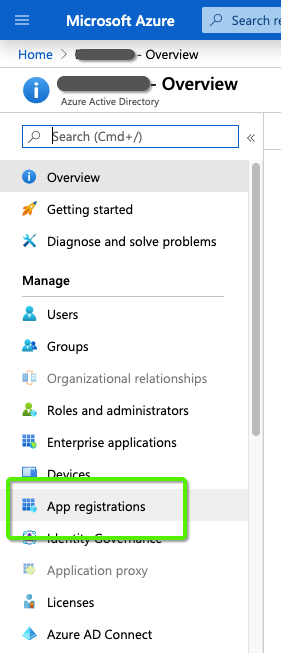

# OAuth与 [!DNL Azure Active Directory] （对于Dynamics CRM） {#oauth-with-azure-active-directory-for-dynamics-crm}

## 受影响者 {#who-s-affected}

此设置适用于新 [!DNL Marketo Measure] 将Dynamics CRM与 [!DNL Azure Active Directory] (AAD)帐户，或者希望从旧版用户名和密码登录迁移至 [!DNL Azure Active Directory] 使用OAuth。

>[!NOTE]
>
>对于这两种情况，此处设置了AAD，以便于在 [!DNL Marketo Measure] 作为数据提供程序。

## 设置新应用程序 {#set-up-new-application}

1. 登录到 [Azure门户](https://portal.azure.com/#home).

1. 选择您的Azure AD租户，方法是单击页面右上角的帐户，然后单击“切换目录”导航，然后选择相应的租户（如果您的帐户下只有一个Azure AD租户，或者您已选择相应的Azure AD租户，请跳过此步骤）。

   

1. 搜索“[!DNL Azure Active Directory]”，然后单击要打开的名称。

   

1. 单击 **[!UICONTROL App Registrations]** 菜单中。

   

1. 单击 **[!UICONTROL New Registration]** 在顶部。

   

1. 按照提示创建新应用程序。 不论是Web应用程序还是公共客户端（移动和桌面）应用程序，但如果您希望获得Web应用程序或公共客户端应用程序的特定示例，请查看我们的 [快速入门](https://docs.microsoft.com/en-us/azure/active-directory/develop/v1-overview).\
   a.名称是应用程序名称，用于向最终用户描述您的应用程序。\
   b.在“支持的帐户类型”下，选择任何组织目录中的帐户和个人Microsoft帐户。\
   c.提供重定向URI。 对于Web应用程序，这是用户可以登录的应用程序的基本URL。 例如， `http://localhost:12345`. 对于公共客户端（移动和桌面），Azure AD使用它返回令牌响应。 输入特定于您的应用程序的值。 例如， `http://MyFirstAADApp`.

1. 完成注册后，Azure AD将为您的应用程序分配唯一客户端标识符（应用程序ID）。 您需要在下一部分中使用此值，因此请从应用程序页面复制该值。

1. 要在Azure门户中查找您的应用程序，请单击 **[!UICONTROL App Registrations]**，然后单击 **[!UICONTROL All Applications]**. 打开新创建的应用程序

1. 单击 **[!UICONTROL Authentication]** 菜单中。

   

1. 添加 [!DNL Marketo Measure] 重定向URL: `https://apps.bizible.com/OAuth2` 和 `https://apps.bizible.com/OAuth2?identityOnly=true` 到重定向URL列表。

   

1. 导航到API权限选项卡，并确保为应用程序分配了正确的权限。

   

1. 从此处输入“[!UICONTROL enterprise]“ ”，然后单击 **[!UICONTROL Enterprise Applications]**.

   

1. 再次，从应用程序列表中查找并打开新应用程序。

1. 在“权限”选项卡中，单击 **[!UICONTROL Grant Admin Consent for (instance name)]**.

   

1. 单击 **[!UICONTROL Accept]**.

   

1. 从“[!UICONTROL Users and Groups]选项卡，确保将有效的“用户和组”分配给应用程序。

   

## 创建应用程序用户 {#creating-an-application-user}

完成应用程序注册后，即可创建应用程序用户。

1. 导航到常用数据服务环境(`https://[org].crm.dynamics.com`)。

1. 导航到 **[!UICONTROL Settings]** > **[!UICONTROL Security]** > **[!UICONTROL Users]**.

1. 选择 **[!UICONTROL Application Users]** 中。

1. 选择 **[!UICONTROL + New]**.

1. 在“应用程序用户”窗体中，输入所需信息。

   >[!NOTE]
   >
   >* 用户名信息不得与 [!DNL Azure Active Directory].
   >
   >* 在“应用程序ID”字段中，输入您之前在Azure AD中注册的应用程序的应用程序ID。

1. 如果设置正确，则在选择 **[!UICONTROL Save]**, **[!UICONTROL Application ID URI]** 和 **[!UICONTROL Azure AD Object Id]** 字段将自动填充正确的值。

1. 退出用户表单之前，请选择 **[!UICONTROL Manage Roles]** 并为此应用程序用户分配安全角色，以便应用程序用户可以访问所需的组织数据。

## 通过OAuth连接Dynamics实例 {#connecting-your-dynamics-instance-via-oAuth}

1. 首次设置Dynamics连接时，请按照 [本文](/help/marketo-measure-and-dynamics/getting-started-with-marketo-measure-and-dynamics/microsoft-dynamics-crm-installation-guide.md).

1. 提示输入OAuth凭据时，填写在上面部分中设置的客户端ID、客户端密钥和应用程序ID URI。

a.客户端ID是上面部分#7步中的ID。 如果您未将其写下，则应用程序ID会显示在应用程序注册的设置中。

b.客户端密钥是在Azure门户中为您的应用程序在证书和密钥下创建的应用程序密钥。

c.应用程序ID URI是目标Web API（安全资源）的URL。 要查找应用程序ID URL，请在Azure门户中单击 [!DNL Azure Active Directory]，单击“应用程序注册”，打开应用程序的“设置”页面，然后单击“属性”。 它也可以是外部资源，如 `https://graph.microsoft.com`. 这通常是Dynamics实例的URL。

1. 在单击 **[!UICONTROL Submit]**，系统将提示您使用登录 [!DNL Azure Active Directory]. 身份验证成功后，您的Dynamics帐户将作为 [!DNL Marketo Measure].

## 重新验证您的Dynamics帐户 {#re-authenticating-your-dynamics-account}

1. 当你在 [!DNL Marketo Measure] 应用程序，转到 **[!UICONTROL My Settings]** > **[!UICONTROL Settings]** > **[!UICONTROL Connections]**.

1. 单击Dynamics连接旁边CRM部分中的键图标。

1. 单击密钥后，将显示一个弹出窗口，系统将提示您输入与注册流程类似的“客户端ID”、“客户端密钥”和“应用程序ID URI”。

   

1. 在单击 **[!UICONTROL Submit]**，系统将提示您使用登录 [!DNL Azure Active Directory]. 身份验证成功后，您的Dynamics帐户将在 [!DNL Marketo Measure].
