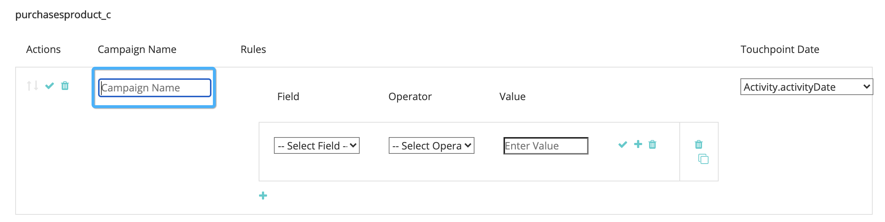
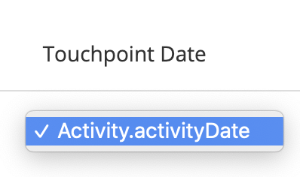

# [!DNL Marketo Engage]活动集成 {#marketo-engage-activities-integration}

作为整个[!DNL Marketo Measure]和[!DNL Marketo Engage]集成的一部分，拉入Marketo Activities的工作将发挥巨大作用。 通过Marketo Activities，系统跟踪事件，如`Click Email`、`Change Score`或`Change Status in Progression` — 这些活动类型可以缩小，并定义为选择符合接触点条件的子集。 在这些活动上创建接触点后，即会在参与历程中进行跟踪，并与您的其他营销渠道（如付费搜索或合作伙伴营销）一起衡量。

## 要求 {#requirements}

* 生产Marketo实例
* 生产[!DNL Salesforce]或[!DNL Microsoft Dynamics]实例
* 任何付费的[!DNL Marketo Measure]订阅
* 已启用Marketo人员同步（[!DNL Marketo Measure]设置）
* 已启用Marketo程序（[!DNL Marketo Measure]设置）
* Marketo活动已启用（[!DNL Marketo Measure]设置）

## 设置 {#setup}

1. 要开始设置Marketo活动，请导航到&#x200B;**我的帐户** > **设置** > **活动**。

   

   

   首先需要选择计划构建规则的活动类型列表。 不需要固定数量的活动类型，但建议您不要让接触点过载并淡化重要里程碑的重要性。 这样，您就无需超过五种活动类型即可跟踪相关参与。

1. 单击[!UICONTROL Select Activities Types]下的下拉菜单开始选择各种类型。

   

1. 选择所需的所有活动后，您会看到它们已填充到[!UICONTROL Selected Activities List]和[!UICONTROL Define Rules]下。

   

1. 对于每个活动类型，您必须定义一个或多个规则来确定哪些记录适用于接触点。 在本例中，我们为“更改得分”活动类型添加了一个规则，以便系统在Marketo人员达到90分或更高Score时创建一个接触点。

1. 首先，根据活动类型，您可能需要设置稍后可用于渠道映射的[!DNL Marketo Measure]促销活动名称。 [!DNL Marketo Measure]营销活动名称可在多个规则中重用。 这有助于在单个渠道规则中使用更广泛的名称。 并非所有活动类型都包含Marketo程序，因此第一步，需要指定一个名称。

   以下是该额外步骤的示例：

   

1. 在“更改得分”示例中，需要输入“促销活动名称”，因为该信息是从Marketo项目中提取的。 现在创建规则表达式。 在此示例后，选择值为90且运算符为“[!UICONTROL is greater than]”的字段“[!UICONTROL New Value]”。

   您可以展开规则，并通过添加“and”或“or”语句来缩小结果范围，从而添加其他过滤器或标准。

   

   

1. 最后，选择要用作接触点日期的内容。 所有可用的日期或日期/时间字段均在此处显示Marketo。 除非您有自定义日期字段，否则您会看到&quot;[!UICONTROL Activity Date]&quot;。

   

1. 请确保在此过程中单击&#x200B;**[!UICONTROL Save As Draft]**，以便您不会丢失所做的更改。

   

1. 导航到&#x200B;**[!UICONTROL Attribute Mapping]**&#x200B;选项卡。

   

1. 对于您选择的每种活动类型，您可以选择将其他Marketo属性映射到接触点字段，以便您可以在[!DNL Marketo Measure Discover]或CRM中查看和报告这些值。

   许多字段已自动映射，无法更改以便与我们的其他集成保持一致。 引用下面的字段映射部分以查找这些值。 对于某些活动类型，Marketo包括登陆页面、反向链接页面或浏览器的属性，您可以选择将这些属性映射到接触点字段。 在以下示例中，我们提出了一些其他建议，这些建议可以删除。

1. 从左栏中选择要映射到的Buyer Touchpoint字段。 然后，选择要在Buyer Touchpoint字段中填充的Marketo属性。 请记住，这些是可选的附加映射，位于[!DNL Marketo Measure]已建立的映射之上。

   可映射的字段：

   * 城市
   * 国家/地区
   * 区域
   * 登陆页面
   * 反向链接页面
   * 表单页面
   * 表单日期
   * 平台
   * 浏览器

   >[!NOTE]
   >
   >此列表中没有广告内容或关键词等广告字段，因为它们是为我们的广告平台集成保留的。

## 活动类型 {#activity-types}

某些活动类型会向我们提供项目ID和项目名称，因此可以轻松将其映射到Buyer Touchpoint上的促销活动ID和促销活动名称。 对于其他人，没有项目关联，因此规则定义的一部分要求您创建[!DNL Marketo Measure]营销活动名称。 以下是每个类别的列表：

**项目Id为**&#x200B;的活动类型

发送电子邮件(6)\
电子邮件已送达(7)\
电子邮件退回(8)\
取消订阅电子邮件(9)\
打开电子邮件(10)\
单击电子邮件(11)\
更改数据值(13)\
更改得分(22)\
添加到列表(24)\
进度中的更改状态(104)\
添加到培养(113)\
更改培养节奏(115)

>[!NOTE]
>
>在我们需要项目ID的活动类型中，如果检测到某个活动而没有项目，则[!DNL Marketo Measure]不会接受将其作为符合条件的接触点，因为我们的Campaign值不能为空。

**没有程序Id的活动类型**

单击链接(3)\
新潜在客户(12)\
将潜在客户同步到SFDC (19)\
转化商机(21)\
更改所有者(23)\
从列表中删除(25)\
SFDC活动(26)\
电子邮件软退回(27)\
从SFDC中删除潜在客户(29)\
合并潜在客户(32)\
添加到机会(34)\
从机会中删除(35)\
更新机会(36)\
删除潜在客户(37)\
发送警报(38)\
发送销售电子邮件(39)\
打开销售电子邮件(40)\
单击Sales Email (41)\
添加到SFDC Campaign (42)\
从SFDC Campaign中移除(43)\
在SFDC Campaign中更改状态(44)\
接收销售电子邮件(45)\
请求营销活动(47)\
销售电子邮件已退回(48)\
更改收入阶段(101)\
手动更改收入阶段(102)\
更改区段(108)\
调用Webhook (110)\
转发给朋友的电子邮件(111)\
已收到转发给朋友的电子邮件(112)\
更改培养轨迹(114)\
将潜在客户推送到Marketo (145)\
将潜在客户同步到Microsoft (300)\
共享内容(400)
对话已开始(158)
与交互的文件(159)
已计划对话框约会(160)
已实现Dialogue目标(161)
自定义活动(xxx)

## 渠道映射 {#channel-mapping}

对于具有项目ID的活动类型中的任意规则，Marketo项目渠道由项目确定。 我们使用项目频道来映射到您的自定义脱机频道，因此您需要确保按照此处](/help/marketo-measure-and-marketo/marketo-measure-integrations-with-marketo/marketo-engage-programs-integration.md#channel-mapping){target="_blank"}的说明正确配置了您的频道[。

对于没有项目ID的活动类型中的任何规则，您的第一步是创建营销活动名称。 使用此促销活动名称可设置您在此处](/help/channel-tracking-and-setup/online-channels/online-custom-channel-setup.md){target="_blank"}布局的自定义在线渠道[。

如果未正确配置Marketo活动的渠道，则您的新接触点可能会归入“其他”渠道下。

## 计划成本 {#program-costs}

通过Marketo程序的数据导入，成本将自动从期间成本中下载，Marketo中报告的成本将在整个分配的月份中分发。 例如，如果为2021年1月报告$1000，则将$1000拆分为31天。 可以在[!DNL Marketo Measure Discover]中找到成本。

## Cookie映射 {#cookie-mapping}

作为[!DNL Marketo Measure]与Marketo集成的结果，[!DNL Marketo Measure] Cookie ID现在也已映射并与[!DNL Marketo Munchkin Id]同步。 这有助于弥合将匿名首次接触归因于Web会话的差距，而不是将FT和LC接触都归因于Marketo活动。 设想一下这种情形：

Mark单击Facebook广告并登陆wayneenterprises.com，在那里他获得一个Cookie，ID为[!DNL Marketo Measure] 123和[!DNL Marketo Munchkin Id] 456。 没有表单填写。

Wayne Enterprises营销团队向特定的目标潜在客户发送电子邮件爆炸邮件，其中一个是`mark@email.com`。

`mark@email.com`收到电子邮件后点进并登陆`wayneenterprises.com`。 对`wayneenterprise.com`的第二次访问具有相同的Cookie Id，但是没有表单填写，因此对于[!DNL Marketo Measure]，他们仍然是匿名访客。`mark@email.com's`

Wayne Enterprises营销团队创建一个Marketo活动规则，以生成“点击电子邮件”活动类型的接触点。

今天的实施将从“Click Email”活动类型中的Marketo活动为`mark@email.com`创建单个FT和LC接触点。

通过这个Cookie映射增强功能，英国《金融时报》将回到Facebook广告中获取点数，而LC将获取该电子邮件的点数。

>[!NOTE]
>
>通过Cookie映射行为，您可能会找到一些来自Web访问的LC接触点。 一个商机出现在Marketo中时可能没有任何关联活动，然后[!DNL Marketo Measure]下载了该商机，匹配了关联的Cookie，然后将其跟踪到最近的Web会话，即使不存在创建该商机的表单活动也是如此。

## 常见问题解答 {#faq}

**如何知道是创建Marketo项目规则还是Marketo活动规则？**

[!DNL Marketo Engage]程序集成是一种根据人员是否为程序的程序成员来生成接触点的简单方法。 如果您有兴趣根据人员更改为特定项目群状态的时间来定义规则，则[!DNL Marketo Engage]活动集成将是您想要的设置，特别是“更改进展中的状态”活动类型，这样您的接触点日期可以映射到系统生成的活动日期。

**为什么我的接触点类型的名称被截断？**

“接触点类型”字段是在[!DNL Marketo Measure]包中创建的，包含16个字符。 不幸的是，更改字段的字符限制将需要弃用现有字段并创建一个字段。 “接触点类型”的值是“活动类型”，该类型也在Medium字段中设置。

**为什么我的自定义活动类型没有出现在可用活动列表中？**

我们仅显示“已批准”自定义活动类型，而不显示“草稿”或“已批准且具有草稿”。

**如何确定要为其生成接触点的活动类型？**

尽管您可以创建的活动类型的数量没有限制，但我们通常建议创建的活动类型不超过5个。 确定哪些营销活动相关程度足以成为接触点历程的一部分需要时间。 例如，“取消订阅电子邮件”可能不是要跟踪的重要接触点，但包含其他过滤器的“点击电子邮件”可能是一个很好的接触点。 这因每个组织和每个团队而异，因此我们建议您与团队合作，一起脑力激荡此处的最佳方法。

**为什么我的浏览器名称被切断？**

[!DNL Marketo Measure]浏览器名称的硬限制为20个字符，不过我们从Marketo获取的用户代理值通常为较长的字符串。

BrowserInfo.Name\
BrowserInfo.Version\
PlatformInfo.Name\
PlatformInfo.Version
