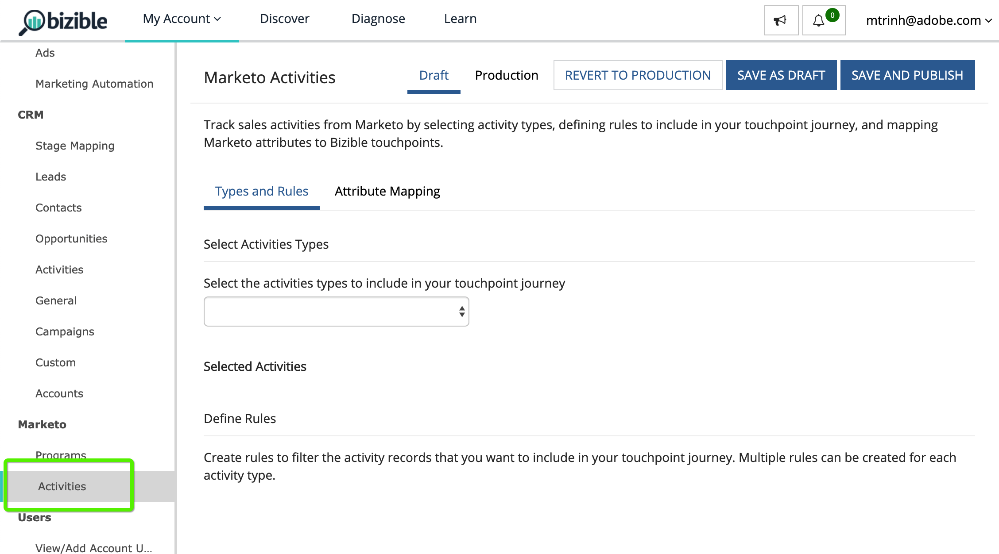

# [!DNL Marketo Engage] 活动集成 {#marketo-engage-activities-integration}

作为 [!DNL Marketo Measure] 和 [!DNL Marketo Engage] 整合、加入Marketo活动的努力将发挥巨大作用。 通过Marketo活动，系统可跟踪事件，如点击电子邮件、更改分数或按进度更改状态 — 可以缩小并定义这些活动类型，以选择符合接触点条件的子集。 在这些活动上创建接触点后，即会在参与历程中对其进行跟踪，并与您的其他营销渠道（如付费搜索或合作伙伴营销）一起进行衡量。

## 要求 {#requirements}

* 生产Marketo实例
* 生产 [!DNL Salesforce] 或 [!DNL Microsoft Dynamics] 实例
* 任何已付 [!DNL Marketo Measure] 订阅
* Marketo已启用人员同步([!DNL Marketo Measure] 设置)
* Marketo程序启用([!DNL Marketo Measure] 设置)
* Marketo活动([!DNL Marketo Measure] 设置)

## 设置 {#setup}

1. 要开始设置Marketo活动，请导航到 **我的帐户** > **设置** > **活动**.

   

   

   首先需要选择您计划在其上构建规则的活动类型列表。 无需具有硬数量的活动类型，但我们也建议您不要使接触点过载并淡化重要里程碑的重要性。 如果使用上述方法，您可能不需要超过5种活动类型来跟踪相关参与。

1. 单击下方的下拉菜单 [!UICONTROL Select Activities Types] 开始选择各种类型。

   

1. 选择您需要的所有活动后，您还会在 [!UICONTROL Selected Activities List] 以及 [!UICONTROL Define Rules].

   

1. 对于每个活动类型，您需要定义一个或多个规则来确定哪些记录符合接触点的条件。 例如，我们将为“更改分数”活动类型添加规则，以便当Marketo人员达到90分或更高分数时，系统将创建接触点。

1. 首先，根据活动类型，您可能需要设置 [!DNL Marketo Measure] 促销活动名称，稍后可在上用于渠道映射。 [!DNL Marketo Measure] 营销活动名称可以在多个规则中重复使用。 这有助于在单个渠道规则中使用更广泛的名称。 并非所有活动类型都包含Marketo程序，因此需要命名作为第一步。

   以下是额外步骤的示例：

   

1. 在我们的“更改分数”示例中，我们不需要输入促销活动名称，因为我们可以从Marketo计划中提取该信息。 现在，您可以创建规则表达式。 在示例之后，我们要选择字段“[!UICONTROL New Value]“ ”，运算符为“ ”[!UICONTROL is greater than]”，其值为90。

   您可以展开规则，并通过添加“and”或“or”语句来添加其他过滤器或标准，以缩小结果范围。

   

   

1. 最后，选择应使用什么作为接触点日期。 所有可用的日期或日期/时间字段都将显示在此处，此处位于Marketo。 除非您有自定义日期字段，否则您将看到“[!UICONTROL Activity Date].&quot;

   

1. 确保单击 **[!UICONTROL Save As Draft]** 这样你才不会丢失你的改变。

   

1. 导航到 **[!UICONTROL Attribute Mapping]** 选项卡。

   

1. 对于您选择的每个活动类型，您可以选择将其他Marketo属性映射到接触点字段，以便在 [!DNL Marketo Measure Discover] 或在CRM中。

   许多字段已自动映射，为了与我们的其他集成保持一致，无法更改这些字段。 引用下面的字段映射部分以查找这些值。 对于某些活动类型，Marketo包含登陆页面、反向链接页面或浏览器的属性，您可以选择将这些属性映射到接触点字段。 在以下示例中，我们提出了一些可删除的其他建议。

1. 从要映射到的左列中选择买方接触点字段。 然后，在买方接触点字段中选择要填充的Marketo属性。 请记住，这些是可选的，是上面附加的映射 [!DNL Marketo Measure] 已经建立。

   可映射字段：

   * 城市
   * 国家
   * 区域
   * 登陆页面
   * 反向链接页面
   * 表单页面
   * 表单日期
   * 平台
   * 浏览器

   >[!NOTE]
   >
   >此列表中不提供广告内容或关键词等广告字段，因为它们是为我们的广告平台集成而保留的。

## 活动类型 {#activity-types}

某些活动类型为我们提供了项目ID和项目名称，因此可以轻松地将其映射到买方接触点上的促销活动ID和促销活动名称。 对于其他人，没有程序关联，因此部分规则定义将要求您创建 [!DNL Marketo Measure] 营销活动名称。 以下是每个类别的列表：

**具有项目ID的活动类型**

发送电子邮件(6)\
电子邮件发送(7)\
电子邮件退回(8)\
取消订阅电子邮件(9)\
打开电子邮件(10)\
单击电子邮件(11)\
更改数据值(13)\
更改得分(22)\
添加到列表(24)\
按进度更改状态(104)\
添加到“培养”(113)\
更改“培养频率”(115)

>[!NOTE]
>
>在我们期望获得项目ID的活动类型中，如果检测到的活动没有项目， [!DNL Marketo Measure] 将不接受该接触点作为符合条件的接触点，因为我们不能具有空的促销活动值。

**没有项目ID的活动类型**

点击链接(3)\
新潜在客户(12)\
同步导致SFDC(19)\
转化潜在客户(21)\
更改所有者(23)\
从列表中删除(25)\
SFDC活动(26)\
Email Roburced Soft(27)\
从SFDC中删除潜在客户(29)\
合并潜在客户(32)\
Add to Opportunity(34)\
从Opportunity中删除(35)\
更新机会(36)\
删除潜在客户(37)\
发送警报(38)\
发送销售电子邮件(39)\
打开销售电子邮件(40)\
单击“销售电子邮件”(41)\
添加到SFDC促销活动(42)\
从SFDC Campaign(43)中删除\
更改SFDC促销活动中的状态(44)\
接收销售电子邮件(45)\
请求营销活动(47)\
销售电子邮件退回(48)\
更改收入阶段(101)\
手动更改收入阶段(102)\
更改区段(108)\
呼叫Webhook(110)\
已转发给朋友的电子邮件(111)\
已收到转发给朋友的电子邮件(112)\
改变培养轨迹(114)\
将潜在客户推送到Marketo(145)\
同步到Microsoft(300)\
共享内容(400)对话参与(158)文档与(159)对话约会(160)对话目标实现(161)自定义活动(xxx)

## 渠道映射 {#channel-mapping}

对于具有项目ID的活动类型中的任何规则，Marketo项目渠道由项目确定。 我们使用节目渠道来映射到您的自定义离线渠道，因此您需要确保已正确配置您的渠道 [此处说明](/help/marketo-measure-and-marketo/marketo-measure-integrations-with-marketo/marketo-engage-programs-integration.md#channel-mapping).

对于没有项目ID的活动类型中的任何规则，您的第一步是创建营销活动名称。 使用此营销活动名称设置您的自定义在线渠道 [在这里摆布](/help/channel-tracking-and-setup/online-channels/online-custom-channel-setup.md).

如果Marketo活动的渠道配置不正确，则您的新接触点可能会位于“其他”渠道下。

## 计划成本 {#program-costs}

通过Marketo计划的数据导入，成本会自动从期间成本中下载，而Marketo中报告的成本则会在分配的整个月份进行分配。 例如，如果在2021年1月报告了$1000 ，则$1000将在31天内进行拆分。 成本可在 [!DNL Marketo Measure Discover].

## Cookie映射 {#cookie-mapping}

由于 [!DNL Marketo Measure] 与Marketo集成， [!DNL Marketo Measure] Cookie ID现在也已映射并与 [!DNL Marketo Munchkin Id]. 这有助于缩小将匿名首次接触归因于Web会话的空白，而不是将FT和LC接触归因于Marketo活动。 想象一下这种情景：

在Facebook广告上标记点击，然后登陆wayneenterprises.com，他在该网站上获取Cookie [!DNL Marketo Measure] ID 123和 [!DNL Marketo Munchkin Id] 456。 不进行表单填写。

韦恩企业营销团队向特定目标线索发送电子邮件，其中一个是 `mark@email.com`.

`mark@email.com` 接收电子邮件并点进，然后登陆 `wayneenterprises.com`. 这将变为 `mark@email.com's` 第二次访问 `wayneenterprise.com` 使用相同的Cookie ID，但没有表单填充，因此 [!DNL Marketo Measure]，则仍然是匿名访客。

Wayne Enterprises营销团队创建Marketo活动规则，为“点击电子邮件”活动类型生成接触点。

今天的实施将为 `mark@email.com` 中，从Marketo活动的“单击电子邮件”活动类型。

通过这项Cookie映射增强功能，英国《金融时报》将回到Facebook的广告，LC将被记入电子邮件。

>[!NOTE]
>
>使用Cookie映射行为，您可能会发现来自Web访问的某些LC接触点。 可能在Marketo中显示一个潜在客户，但没有任何关联的活动，然后 [!DNL Marketo Measure] 下载了该潜在客户，将其与关联的cookie匹配，然后跟踪到最近的web会话，即使没有创建该潜在客户的表单活动也是如此。

## 常见问题解答 {#faq}

**如何知道是创建Marketo项目规则还是Marketo活动规则？**

的 [!DNL Marketo Engage] 程序集成是一种根据人员是否是程序的程序成员来生成触点的简单方法。 如果您有兴趣根据人员更改为特定项目状态的时间来定义规则，则 [!DNL Marketo Engage] 活动集成将是您需要的设置，特别是“按进度更改状态”活动类型，以便您的接触点日期可以映射到系统生成的活动日期。

**为什么我的接触点类型的名称会被截断？**

已在 [!DNL Marketo Measure] 包中包含16个字符。 遗憾的是，更改字段的字符限制将需要弃用现有字段并创建一个新字段。 “接触点类型”的值是“活动类型”，该类型也在“中”字段中设置。

**为什么我的自定义活动类型没有显示在可用活动列表中？**

我们只显示“已批准”的自定义活动类型，而不显示“草稿”或“已草稿批准”。

**如何确定要为哪些活动类型生成接触点？**

尽管您可以创建的活动类型数量没有限制，但我们通常建议不超过5个活动类型。 确定哪些营销活动足够相关，才能成为接触点历程的一部分，这需要花费时间。 例如，“取消订阅电子邮件”可能不是要跟踪的重要接触点，但“单击电子邮件”（包含其他过滤器）可能是一个不错的接触点。 这因每个组织和每个团队而异，因此我们建议您与团队合作，就此处的最佳方法进行头脑风暴。

**为什么浏览器名称会被截断？**

的 [!DNL Marketo Measure] “浏览器名称”具有20个字符的硬限制，尽管我们从Marketo获取的“用户代理”值通常是较长的字符串。

BrowserInfo.Name\
BrowserInfo.Version\
PlatformInfo.Name\
PlatformInfo.Version
