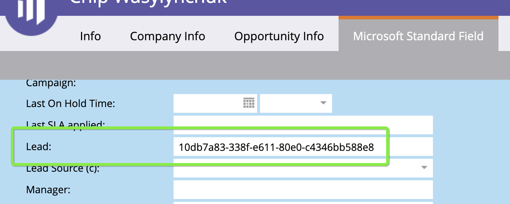

# [!DNL Marketo Engage] 人员集成 {#marketo-engage-people-integration}

Marketo人员集成允许 [!DNL Marketo Measure] 开始从Marketo下载人员，并开始将其跟踪的会话绑定到个人，并将接触点映射到其参与。 历史上， [!DNL Marketo Measure] 只能将接触点映射到CRM中的人员，因此，这有助于营销人员更快地衡量其营销工作，而不是等待阶段或触发器将其同步到CRM。

## 要求 {#requirements}

* 生产Marketo实例
* 生产 [!DNL Salesforce] 或 [!DNL Microsoft Dynamics] 实例
* 任何已付 [!DNL Marketo Measure] 订阅
* 已启用SOLR(请联系 [Marketo支持](https://nation.marketo.com/t5/Support/ct-p/Support) 启用此选项)

## 工作原理 {#how-it-works}

作为当前客户， [!DNL Marketo Measure] 已从您的CRM下载人员。 标准流程是 [!DNL Marketo Measure] 下载人员并将电子邮件地址映射到我们通过bizible.js跟踪的网络会话。

随着下载Marketo人， [!DNL Marketo Measure] 现在能够将Web会话映射到更大的个人池，这些个人池中尚未与CRM同步。 我们通常会看到这种情况，因为内部流程会等到用户达到特定状态后才将他们推送到CRM。

When [!DNL Marketo Measure] 成功将Marketo人员映射至网络会话，我们的处理将为其生成任何相关接触点，最终可在 [!DNL Marketo Measure Discover]. 如果Marketo的人被推送到CRM， [!DNL Marketo Measure] 将处理重复方案，并为CRM人员重新创建接触点，并将初始设置标记为“重复”。

为了检测这些重复项，请确保 [!DNL Marketo-Salesforce] 或 [!DNL Marketo-Dynamics] sync正在Marketo人员的潜在客户ID和联系人ID中填充。 如果ID正确同步，您应该能够在“人员”记录中看到CRM ID，如下所示：

客户可以选择在中报告完整的Marketo人员和CRM人员 [!DNL Marketo Measure] 发现。 如果您只对报告CRM人员感兴趣，我们建议创建一个区段以过滤他们。

## [!DNL Marketo Measure Discover] {#marketo-measure-discover}

在报告 [!DNL Marketo Measure Discover]，您将看到Marketo和CRM潜在客户总数。 要仅报告Marketo人员或CRM潜在客户，您需要为源创建区段类别，然后使用“源系统”字段为Marketo和CRM创建区段规则以定义规则。 创建区段后，您将看到可在 [!DNL Marketo Measure Discover] 功能板。

## 字段映射 {#field-mappings}

<table> 
 <colgroup> 
  <col> 
  <col> 
 </colgroup> 
 <tbody> 
  <tr> 
   <th>
<strong>biz_leads</strong>
</th> 
   <th>
<strong>Marketo</strong>
</th> 
  </tr> 
  <tr> 
   <td>
ID
</td> 
   <td>
ID
</td> 
  </tr> 
  <tr> 
   <td>
MODIFIED_DATE
</td> 
   <td>
updatedAt<strong>*</strong>
</td> 
  </tr> 
  <tr> 
   <td>
CREATED_DATE
</td> 
   <td>
createdAt
</td> 
  </tr> 
  <tr> 
   <td>
电子邮件
</td> 
   <td>
电子邮件
</td> 
  </tr> 
  <tr> 
   <td>
WEB_SITE
</td> 
   <td>
网站
</td> 
  </tr> 
  <tr> 
   <td>
公司
</td> 
   <td>
公司
</td> 
  </tr> 
  <tr> 
   <td>
IS_CONVERTED
</td> 
   <td>
不适用
</td> 
  </tr> 
  <tr> 
   <td>
ACCOUNT_ID
</td> 
   <td>
帐户Id(L2A)
</td> 
  </tr> 
  <tr> 
   <td>
BIZIBLE_STAGE
</td> 
   <td>
状态
</td> 
  </tr> 
  <tr> 
   <td>
IS_DELETED
</td> 
   <td>
true/false
</td> 
  </tr> 
 </tbody> 
</table>

*存在一个已知的行为问题，即Marketo公司实体中的字段不会影响人员的updatedAt值，因此如果更新了网站或公司等相关字段， [!DNL Marketo Measure] 将不知道这些值是否已修改，因为updatedAt日期/时间值未更新。 这会影响ABM功能，在ABM功能中，我们没有新的数据来解决Account的牵头问题。 目前没有解决方法，但有计划在将来解决这一问题。

## 常见问题解答 {#faq}

**为什么我的CRM和 [!DNL Marketo Measure Discover]?**

由于此集成允许我们为我们直接从Marketo导入的潜在客户创建接触点，因此可能会有一些未同步到CRM的潜在客户，因此Discover中的计数可能会高于CRM，因为触点仅被推送到CRM潜在客户。

**这如何替换我的数据？**

此集成实际上可合并您当前 [!DNL Marketo Measure] 实例，因此未替换任何内容。 我们期待您当前的CRM潜在客户是，当我们下载价值2年的Marketo潜在客户时，我们只需更新该潜在客户记录，以显示与Marketo潜在客户的匹配情况。 所有在后端发生的情况和接触点预期会保持不变。 我们还希望看到更多接触点，因为符合条件的Marketo Lead。 如果我们能够找到与这些Marketo人相匹配的Web会话，我们将开始看到接触点被计入 [!DNL Marketo Measure].

**我是否只能从Marketo下载我的人员并切断CRM连接？**

此时，不。 我们将来会有这个选项，但我们需要构建此Marketo集成的其他阶段，以便我们能够将从Marketo到 [!DNL Marketo Measure].

**你是否导入我所有的Marketo人？**

目前，我们最早将导入人员的是1/1/2018，以便我们至少拥有2年的数据，这与我们从CRM下载中强制实施的行为相同。 建立Marketo连接后，我们将实施改进行为，以下载连续2年的窗口。

我们也不会过滤任何人员类型，因此，在两年期限内的所有人员都将被导入，并符合接触点资格。

**什么是SOLR？为什么需要启用它才能使用此功能？**

为Marketo实例启用SOLR是一个很琐碎的步骤，它会在Marketo中打开硬件空间，以便您的订阅可以利用 [!DNL Marketo Measure] 集成。 如果未启用SOLR，我们将无法访问某些调用，否则这些调用将允许我们从您的Marketo实例下载相应的人员。
