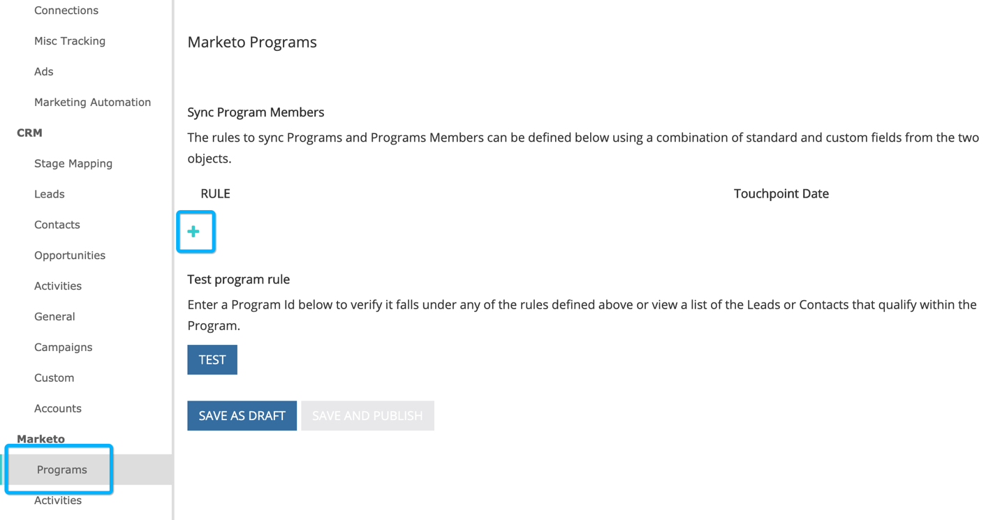

# [!DNL Marketo Engage]项目集成 {#marketo-engage-programs-integration}

通过与[!DNL Marketo Engage]程序的[!DNL Marketo Measure]集成，我们的客户可以开始从Marketo程序成员资格创建归因跟踪接触点。 此功能允许营销人员从[!DNL Marketo Measure] javascript看不到且应在归因历程中衡量的电子邮件或参与计划开始跟踪计划成员资格。

## 可用性 {#availability}

所有层。

## 要求 {#requirements}

* 生产Marketo实例
* 生产Salesforce或Microsoft Dynamics实例
* 任何付费的[!DNL Marketo Measure]订阅
* 已启用Marketo人员同步（[!DNL Marketo Measure]设置）
* 已启用Marketo程序（[!DNL Marketo Measure]设置）

## 设置 {#setup}

**规则**

1. 要开始设置Marketo程序中的规则，请导航到&#x200B;**[!UICONTROL My Account]** > **[!UICONTROL Settings]** > **[!UICONTROL Programs]**。 单击&#x200B;**+**&#x200B;图标开始创建您的第一条规则。

   

   

1. 如果有助于跟踪规则，您可以选择为规则设置名称。 您首先要从“计划”和“计划成员资格”字段列表中选择要定义规则的字段。 通过选择要检查的运算符和预期值继续构建规则。

   

1. 在同一框内添加其他语句以在规则中设置“and”标准，或者单击框外的+图标以设置“or”语句。

   

1. 选择应该使用哪个日期或日期/时间字段来映射到接触点日期。 要查看Marketo中可用的值列表，请输入花括号`{`，我们将显示可用的字段。

   

   >[!NOTE]
   >
   >如果规则要捕获活动日期，或项目群成员达到特定状态的日期，您将需要利用[!DNL Marketo Engage]活动集成并为“更改进展中的状态”活动类型设置规则。

   

您完成的规则应如下所示：

## 测试 {#test}

创建一些规则后，您可能需要对其进行测试，以验证您的语句是否与程序匹配。

1. 要运行测试，请单击&#x200B;**[!UICONTROL TEST]**&#x200B;按钮，如下所示。

   

1. 此时将显示一个模式窗口，您可以在其中从Marketo输入项目ID。

   

   输入ID并单击[!UICONTROL Test]按钮后，我们的规则引擎将检查每个规则并确定程序是否符合任何规则。 在下面的示例中，您可以看到名为[!DNL Marketo Measure]电子书的计划1002具有5个计划成员，并且由于显示的规则而符合条件。

   规则在样本大小为5000个成员时运行。 如果您的项目包含5000个以上的成员，我们可能不会检查所有成员的兼容性。 此工具仅用作检查规则是否正确构建的一种方法。

   

   您可以单击成员计数以查看符合计划条件的Marketo人员ID列表。

   

## 渠道映射 {#channel-mapping}

从Marketo项目渠道列表中，将这些值映射到您在“设置”中创建的[!DNL Marketo Measure]自定义营销渠道。 这些程序生成的任何接触点都将继承您在此处选择的渠道和子渠道名称。

1. 首先导航到&#x200B;**[!UICONTROL My Account]** > **[!UICONTROL Settings]** > **[!UICONTROL Offline Channels]**。

1. 在上方，您可以选择映射到您的CRM Campaign类型，然后在下方，您会看到Marketo项目渠道的选项。

1. 首先选择应映射到值的渠道，然后（可选）选择子渠道。 完成后，单击底部的&#x200B;**[!UICONTROL Save]**。

   

## 计划成本 {#program-costs}

通过Marketo程序的数据导入，成本将自动从期间成本中下载，Marketo中报告的成本将在整个分配的月份中分发。 例如，如果为2021年1月报告$1000，则将$1000拆分为31天。 可以在[!DNL Marketo Measure Discover]中找到成本。

>[!NOTE]
>
>Marketo Measure每月仅支持一个期间成本条目。 为确保所有成本都导入，将每月总成本汇总到单个条目中。 不支持同一月份的多项期间成本条目。

## 工作原理 {#how-it-works}

**字段映射**

<table><thead>
  <tr> 
   <th>biz_ad_campaigns</th> 
   <th>Marketo</th> 
  </tr></thead>
<tbody>
  <tr> 
   <td>ID</td> 
   <td>ID</td> 
  </tr> 
  <tr> 
   <td>IS_DELETED</td> 
   <td>（通过API检查程序是否仍然存在）</td> 
  </tr> 
  <tr> 
   <td>名称</td> 
   <td>name</td> 
  </tr> 
 </tbody> 
</table>

<table><thead>
  <tr>
    <th>biz_campaign_members</th>
    <th>Marketo</th>
  </tr></thead>
<tbody>
  <tr>
    <td>ID</td>
    <td>“MarketoProgramMembership”_ProgramId_Lead Id</td>
  </tr>
  <tr>
    <td>MODIFIED_DATE</td>
    <td>更新时间</td>
  </tr>
  <tr>
    <td>创建日期</td>
    <td>membershipDate</td>
  </tr>
  <tr>
    <td>商机ID</td>
    <td>Id（列表成员资格）</td>
  </tr>
  <tr>
    <td>潜在客户电子邮件</td>
    <td>电子邮件（列表成员资格）</td>
  </tr>
  <tr>
    <td>状态</td>
    <td>progressionstatus</td>
  </tr>
  <tr>
    <td>HAS_RESPONDED</td>
    <td>到达状态</td>
  </tr>
  <tr>
    <td>营销活动名称</td>
    <td>项目名称</td>
  </tr>
  <tr>
    <td>CAMPAIGN_ID</td>
    <td>programId</td>
  </tr>
  <tr>
    <td>营销活动类型</td>
    <td>渠道</td>
  </tr>
</tbody>
</table>

## Cookie映射 {#cookie-mapping}

作为[!DNL Marketo Measure]与Marketo集成的结果，[!DNL Marketo Measure] Cookie ID现在也已映射并与[!DNL Marketo Munchkin Id]同步。 这有助于弥合将匿名首次接触归因于Web会话的差距，而不是将FT和LC接触都归因于Marketo活动。 设想一下这种情形：

Mark点击[!DNL Facebook]广告并登陆wayneenterprises.com，在那里他被[!DNL Marketo Measure] ID 123和[!DNL Marketo Munchkin Id] 456编码。 没有表单填写。

Wayne Enterprises营销团队向特定的目标潜在客户发送电子邮件爆炸邮件，其中一个是`mark@email.com`。

`mark@email.com`会收到电子邮件，点击并登陆wayneenterprises.com。 对`wayneenterprise.com`的第二次访问具有相同的Cookie Id，但是没有表单填写，因此对于[!DNL Marketo Measure]，他们仍然是匿名访客。`mark@email.com's`

Wayne Enterprises营销团队创建一个Marketo活动规则，以生成“点击电子邮件”活动类型的接触点。

今天的实施将从“Click Email”活动类型中的Marketo活动为`mark@email.com`创建单个FT和LC接触点。

通过此Cookie映射增强功能，FT将返回并计入[!DNL Facebook]广告的点数，而LC将计入电子邮件的点数。

>[!NOTE]
>
>通过Cookie映射行为，您可能会找到一些来自Web访问的LC接触点。 一个商机出现在Marketo中时可能没有任何关联活动，然后[!DNL Marketo Measure]下载了该商机，匹配了关联的Cookie，然后将其跟踪到最近的Web会话，即使不存在创建该商机的表单活动也是如此。

## 常见问题解答 {#faq}

**如何将接触点日期设置为进度日期，或项目成员发生状态更改的日期？**

如果规则要捕获活动日期，或项目群成员达到特定状态的日期，您将需要利用[!DNL Marketo Engage]活动集成并为“更改进展中的状态”活动类型设置规则。 否则，[!DNL Marketo Engage]项目集成仅提供成员资格日期，即使Marketo人员处于多种状态，成员资格日期也是其首次加入项目的日期。

**我能否获取接触点日期的日期选项选择列表？**

要触发自动完成，首先在文本字段中输入大括号`{`，然后将显示可用字段。

**如果我创建Marketo项目规则并且也具有CRM Campaign规则，这些规则是否会计算两次？**

这取决于您的规则定义，但可能会。 您将需要评估规则集，以便没有涵盖项目和营销策划的规则，因为我们不会删除重复项或检测类似的成员资格。 一个可能的解决方案是，如果您希望Marketo成为您的单一真实来源，则将您的Campaign规则复制到程序，然后删除Campaign规则。 另一个选项是在规则中添加“CreatedOn”或“CreatedDate”标准，以便特定日期之前的规则将使用Campaign规则，而特定日期之后的规则将使用项目规则。 有很多解决方法，但需要一些规划和协调。

**Marketo的计划成员资格自定义字段是否可供定义？**

由于技术限制，我们目前无法支持计划会员资格自定义字段。 这些字段一旦可通过其他Marketo API使用，我们将看到它们并供您使用。

**我如何知道要使用项目或活动？**

[!DNL Marketo Engage]程序集成是一种根据人员是否为程序的程序成员来生成接触点的简单方法。 如果您有兴趣根据人员更改为特定项目群状态的时间来定义规则，则[!DNL Marketo Engage]活动集成将是您想要的设置，特别是“更改进展中的状态”活动类型。
