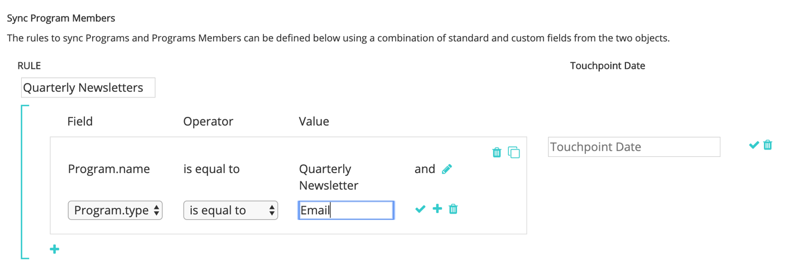

# [!DNL Marketo Engage] 程序集成 {#marketo-engage-programs-integration}

通过 [!DNL Marketo Measure] 与集成 [!DNL Marketo Engage] 通过项目，我们的客户可以开始从Marketo项目成员资格中为归因跟踪创建接触点。 此功能允许营销人员从电子邮件或参与项目中开始跟踪在其他情况下不被看到的项目成员资格。 [!DNL Marketo Measure] javascript和应在归因历程中测量。

## 可用性 {#availability}

所有层。

## 要求 {#requirements}

* 生产Marketo实例
* Production Salesforce或Microsoft Dynamics实例
* 任何付费 [!DNL Marketo Measure] 订阅
* Marketo人员同步已启用([!DNL Marketo Measure] 设置)
* 已启用Marketo程序([!DNL Marketo Measure] 设置)

## 设置 {#setup}

**规则**

1. 要开始设置Marketo程序中的规则，请导航至 **[!UICONTROL My Account]** > **[!UICONTROL Settings]** > **[!UICONTROL Programs]**. 单击 **+** 图标开始创建您的第一条规则。

   

   

1. 如果有助于跟踪规则，您可以选择为规则设置名称。 您首先要从“计划”和“计划成员资格”字段列表中选择要定义规则的字段。 通过选择要检查的运算符和预期值继续构建规则。

   

1. 在同一框内添加其他语句以在规则中设置“and”标准，或者单击框外的+图标以设置“or”语句。

   

1. 选择应该使用哪个日期或日期/时间字段来映射到接触点日期。 要查看Marketo中可用的值列表，请输入大括号 `{` 将显示可用的字段。

   

   >[!NOTE]
   >
   >如果您的规则需要获取活动日期，或项目群成员达到特定状态的日期，您需要使用 [!DNL Marketo Engage] 活动集成，并为“更改进展中的状态”活动类型设置规则。

   

您完成的规则应如下所示：

## 测试 {#test}

创建一些规则后，您可能需要对其进行测试，以验证您的语句是否与程序匹配。

1. 要运行测试，请单击 **[!UICONTROL TEST]** 按钮，如下所示。

   

1. 此时将显示一个模式窗口，您可以在其中从Marketo输入项目ID。

   

   输入ID并单击 [!UICONTROL Test] 按钮，我们的规则引擎将检查每个规则，并确定程序是否符合任何规则。 在下面的示例中，您可以看到名为的程序1002 [!DNL Marketo Measure] E-book具有5个计划成员，并且由于显示的规则而符合条件。

   规则在样本大小为5000个成员时运行。 如果您的项目包含5000个以上的成员，我们可能不会检查所有成员的兼容性。 此工具仅用作检查规则是否正确构建的一种方法。

   

   您可以单击成员计数以查看符合计划条件的Marketo人员ID列表。

   

## 渠道映射 {#channel-mapping}

从Marketo项目渠道列表中，您将这些值映射到 [!DNL Marketo Measure] 已在“设置”中创建的自定义营销渠道。 这些程序生成的任何接触点都将继承您在此处选择的渠道和子渠道名称。

1. 首先导航到 **[!UICONTROL My Account]** > **[!UICONTROL Settings]** > **[!UICONTROL Offline Channels]**.

1. 在上方，您可以选择映射到您的CRM Campaign类型，然后在下方，您会看到Marketo项目渠道的选项。

1. 首先选择应映射到值的渠道，然后（可选）选择子渠道。 完成后，单击 **[!UICONTROL Save]** 在底部。

   

## 计划成本 {#program-costs}

通过Marketo程序的数据导入，成本将自动从期间成本中下载，Marketo中报告的成本将在整个分配的月份中分发。 例如，如果为2021年1月报告$1000，则将$1000拆分为31天。 成本可在以下位置找到： [!DNL Marketo Measure Discover].

## 工作原理 {#how-it-works}

**字段映射**

<table> 
 <colgroup> 
  <col> 
  <col> 
 </colgroup> 
 <tbody> 
  <tr> 
   <th>biz_ad_campaigns</th> 
   <th>Marketo</th> 
  </tr> 
  <tr> 
   <td>ID</td> 
   <td>ID</td> 
  </tr> 
  <tr> 
   <td>IS_DELETED</td> 
   <td>（通过API检查程序是否仍然存在）</td> 
  </tr> 
  <tr> 
   <td>
名称
</td> 
   <td>name</td> 
  </tr> 
 </tbody> 
</table>

| biz_campaign_members | Marketo |
|---|---|
| ID | “MarketoProgramMembership”_ProgramId_Lead Id |
| MODIFIED_DATE | 更新时间 |
| 创建日期 | membershipDate |
| 商机ID | Id（列表成员资格） |
| 潜在客户电子邮件 | 电子邮件（列表成员资格） |
| 状态 | progressionstatus |
| HAS_RESPONDED | 到达状态 |
| 营销活动名称 | 项目名称 |
| CAMPAIGN_ID | programId |
| 营销活动类型 | 渠道 |

## Cookie映射 {#cookie-mapping}

由于 [!DNL Marketo Measure] 与Marketo集成， [!DNL Marketo Measure] Cookie ID现在也已映射并与 [!DNL Marketo Munchkin Id]. 这有助于弥合将匿名首次接触归因于Web会话的差距，而不是将FT和LC接触都归因于Marketo活动。 设想一下这种情形：

标记对的点击次数 [!DNL Facebook] 然后登陆到wayneenterprises.com，在那里他被 [!DNL Marketo Measure] Id 123和 [!DNL Marketo Munchkin Id] 456。 没有表单填写。

Wayne Enterprises营销团队会向特定的目标潜在客户发送电子邮件爆炸邮件，其中一个潜在客户是 `mark@email.com`.

`mark@email.com` 接收电子邮件并通过单击并登录到wayneenterprises.com。 它变为 `mark@email.com's` 第二次访问 `wayneenterprise.com` 相同的Cookie ID，但表单没有填写，因此 [!DNL Marketo Measure]，则他们仍为匿名访客。

Wayne Enterprises营销团队创建一个Marketo活动规则，以生成“点击电子邮件”活动类型的接触点。

今天的实施将创建一个FT和LC接触点，用于 `mark@email.com` 从“Click Email”活动类型访问Marketo活动。

通过这个Cookie映射增强功能，FT将回头计入 [!DNL Facebook] 广告和LC将记入电子邮件的贷方。

>[!NOTE]
>
>通过Cookie映射行为，您可能会找到一些来自Web访问的LC接触点。 Marketo中显示的商机可能没有任何相关活动，那么 [!DNL Marketo Measure] 下载该商机，将其与关联的Cookie相匹配，然后将其跟踪到最近的Web会话，即使不存在创建该商机的表单活动也是如此。

## 常见问题 {#faq}

**如何将接触点日期设置为进展日期，或项目群成员发生状态更改的日期？**

如果您的规则需要获取活动日期，或项目群成员达到特定状态的日期，您需要使用 [!DNL Marketo Engage] 活动集成，并为“更改进展中的状态”活动类型设置规则。 否则， [!DNL Marketo Engage] 项目集成仅提供成员资格日期，这是将Marketo人员引入项目的第一个日期，即使存在多个状态也是如此。

**我能否获取接触点日期的日期选项选择列表？**

要触发自动完成，请首先输入花括号 `{` 在文本字段中，将显示可用字段。

**如果我创建Marketo项目规则，并且还具有CRM Campaign规则，那么这些规则是否会计算两次？**

这取决于您的规则定义，但可能会。 您将需要评估规则集，以便没有涵盖项目和营销策划的规则，因为我们不会删除重复项或检测类似的成员资格。 一个可能的解决方案是，如果您希望Marketo成为您的单一真实来源，则将您的Campaign规则复制到程序，然后删除Campaign规则。 另一个选项是在规则中添加“CreatedOn”或“CreatedDate”标准，以便特定日期之前的规则将使用Campaign规则，而特定日期之后的规则将使用项目规则。 有很多解决方法，但需要一些规划和协调。

**Marketo的计划成员资格自定义字段是否可供定义？**

由于技术限制，我们目前无法支持计划会员资格自定义字段。 这些字段一旦可通过其他Marketo API使用，我们将看到它们并供您使用。

**如何知道使用项目群还是活动？**

此 [!DNL Marketo Engage] 项目集成是一种根据人员是否为项目群成员来生成接触点的简单方法。 如果您有兴趣根据人员更改为特定项目群状态的时间来定义规则， [!DNL Marketo Engage] 活动集成将是您想要的设置，尤其是“更改进展中的状态”活动类型。
