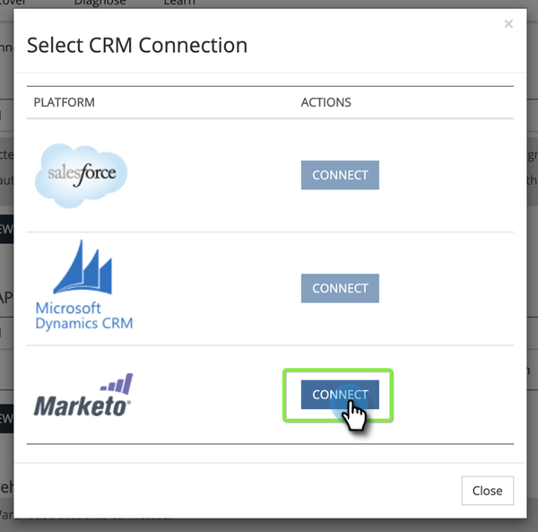
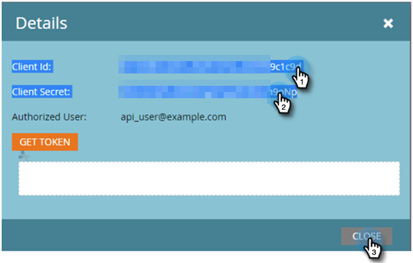

# 设置Marketo连接 {#set-up-marketo-connection}

下面是如何设置与Marketo的连接。

>[!PREREQUISITES]
>
>[为[!DNL Marketo Measure]/Marketo Engage连接创建仅API用户角色](https://experienceleague.adobe.com/docs/marketo/using/product-docs/administration/users-and-roles/create-an-api-only-user.html?lang=zh-Hans){target="_blank"}。

1. 在[!DNL Marketo Measure]中，单击&#x200B;**[!UICONTROL My Account]**&#x200B;下拉菜单并选择&#x200B;**[!UICONTROL Settings]**。

   

1. 在[!UICONTROL Integrations]下，单击&#x200B;**[!UICONTROL Connections]**。

   

1. 单击 **[!UICONTROL Set Up New CRM Connection]**。

   

1. 单击Marketo旁边的&#x200B;**[!UICONTROL Connect]**&#x200B;按钮。

   

1. 在新选项卡中，登录到您的Marketo Engage帐户。 转到&#x200B;**管理员** > **Web服务**。 向下滚动到REST API。 突出显示并保存端点和Identity服务URL。 您需要在以下步骤中使用它们。

   

1. 仍在Marketo Engage中，在左侧的树中选择&#x200B;**LaunchPoint**。 查找要连接到Marketo Measure的自定义服务，然后单击&#x200B;**查看详细信息**。

   

1. 突出显示并保存客户端ID和客户端密码。 单击&#x200B;**关闭**。

   

1. 返回[!DNL Marketo Measure]，使用您收集的数据填充这些字段。

   

1. 输入值后，单击&#x200B;**[!UICONTROL Authenticate]**。 您的Marketo Engage帐户已连接到[!DNL Marketo Measure]。

   

   >[!NOTE]
   >
   >[!DNL Marketo Measure]代表您调用Marketo API而不占用任何Marketo API限制，因此无需担心上限和与其他集成的信用分配。
