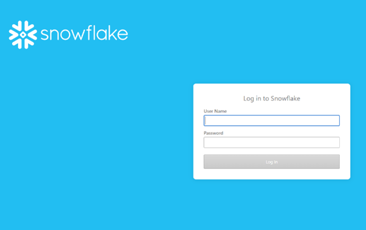

# data warehouse访问 — Reader帐户 {#data-warehouse-access-reader-account}

## Snowflake访问链接 {#snowflake-access-link}

要访问您的Snowflakedata warehouse，您需要导航到Snowflake帐户的特定URL。 您可以通过登录到 [!DNL Marketo Measure] 并按照以下步骤导航到Data warehouse信息页面。

1. 在 [!DNL Marketo Measure]，单击 **[!UICONTROL My Account]** > **[!UICONTROL Settings]**.

   

1. 在左侧菜单的“安全”下，单击 **[!UICONTROL Data Warehouse]**.

   

1. 在此页面上，您将找到指向Snowflakedata warehouse和用户名的链接。

   

   >[!NOTE]
   >
   >这是一个只读帐户，可供您的组织使用，而不仅仅是个人用户使用。 您组织内对 [!DNL Marketo Measure] 可以使用此帐户登录SnowflakeData warehouse读取器帐户。

1. 单击SnowflakeURL中提供的链接，这会将您转到Snowflake登录页面，在该页面中，您将输入用户名和密码。 _如果您没有密码，请参阅以下步骤以重置密码_.

   

1. 登录后，单击 **[!UICONTROL Worksheets]** 的双曲余切值。

   

1. BIZIBLE_ROI_V3数据库对象位于屏幕的左侧。 从查询窗口顶部的下拉选项中输入仓库、数据库和方案。 每个应该只有一个选项。 现在，您可以在Snowflake查询编辑器中执行查询。

   

## 重置密码 {#reset-your-password}

[!DNL Marketo Measure] 无权访问您的Snowflake登录密码。 如果需要重置密码，请单击 [!UICONTROL Reset Password] 按钮，然后按照说明操作。 临时密码将立即显示在UI中。 系统将提示您在下次登录时创建自己的data warehouse密码。

>[!NOTE]
>
>* 重置密码将重置所有 [!DNL Marketo Measure] 组织中的用户，而不仅仅是当前登录的用户。
>* 我们仅在UI中显示临时密码。 不会发送电子邮件。

## 通过第三方工具连接到Snowflake {#connecting-to-snowflake-via-third-party-tools}

您需要输入一些信息，以将Snowflakedata warehouse连接到第三方工具。

>[!NOTE]
>
>每个工具的连接要求各不相同；建议您查阅有关尝试连接的特定工具的文档。

* **URI** （始终必需）
   * 这是Snowflake帐户的域名。  它包含在Snowflake登录链接的一部分中。
* **用户名** （始终必需）
   * 用户名列在的Data warehouse信息页面上 [!DNL Marketo Measure].
* **密码** （始终必需）
   * 这是您首次登录Snowflake帐户时设置的密码。  要重置密码，请参阅上述步骤。
* **数据库名称** （并非始终必需）
   * 数据库是存储Snowflake中数据的内容。 它是存储资源。 数据库名称列在的Data warehouse信息页面上 [!DNL Marketo Measure].
* **仓库名称** （并非始终必需）
   * 仓库是执行查询的Snowflake。 它是计算资源。  仓库名称列在的Data warehouse信息页面上 [!DNL Marketo Measure].
   
