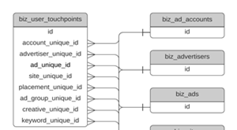

# Data Warehouse架构 {#data-warehouse-schema}

Data Warehouse允许您根据需要进行跟踪、根据需要报告归因数据，并将其连接到其他数据集。

>[!IMPORTANT]
> 具有_DELETED_DATE值的行将保留7天，然后从Snowflake中删除。
> Snowflake中使用的时区遵循协调世界时(UTC)。

>[!NOTE]
>[单击此处](#sample-queries)查看本文底部的示例查询。

## 实体关系图 {#entity-relationship-diagrams}

_Data Warehouse数据模型_ ERD显示Data Warehouse中的数据如何流动以及如何链接在一起。 此图不包括数据仓库中所有可用的表，因为其中某些表表示映射表、其他已存在的表的视图或我们不建议再使用的已弃用表。 请参阅下面的Data Warehouse中对表格和列的详细说明。 其中许多表包含反正规化的字段，但是，此图表是推荐的数据模型，它利用来自维表的数据。

其他&#x200B;_广告维度数据模型_ ERD提供了如何最好地将广告特定维度的表链接回主数据模型中的表的视图。 虽然广告维度在其他表中也进行了反规范化，但这表示连接这些维度的推荐模型。

_单击完整版本的图像_

<table style="table-layout:auto">
 <tbody> 
  <tr> 
   <th>Data Warehouse数据模型</th>
   <th>广告维度数据模型</th>
  </tr> 
  <tr> 
   <td><a href="assets/data-warehouse-data-model.pdf"></a></td>
   <td><a href="assets/ads-dimensional-data-model.pdf"></a></td>
  </tr>
 </tbody>
</table>

## 视图 {#views}

### 商业帐户 {#biz-accounts}

从源系统导入的帐户。

<table>
  <tbody>
    <tr>
      <th><strong>列</strong></th>
      <th><strong>数据类型</strong></th>
      <th><strong>描述</strong></th>
      <th><strong>示例数据</strong></th>
    </tr>
    <tr>
      <td>ID</td>
      <td>varchar</td>
      <td>源系统中的帐户ID。</td>
      <td>0013100001kpAZxAAM</td>
    </tr>
    <tr>
      <td>创建日期</td>
      <td>timestamp_ntz</td>
      <td>源系统中帐户的创建日期。</td>
      <td>2016-08-28 00:32:55.000</td>
    </tr>
    <tr>
      <td>MODIFIED_DATE</td>
      <td>timestamp_ntz</td>
      <td>源系统中帐户的上次修改日期。</td>
      <td>2018-08-01 17:38:30.000</td>
    </tr>
    <tr>
      <td>名称</td>
      <td>varchar</td>
      <td>源系统中的帐户名称。</td>
      <td>[!DNL Marketo Measure]</td>
    </tr>
    <tr>
      <td>WEB站点</td>
      <td>varchar</td>
      <td>源系统中记录的帐户网站，用于潜在客户到帐户的映射。</td>
      <td>www.adobe.com</td>
    </tr>
    <tr>
      <td>ENGAGEMENT_RATING</td>
      <td>varchar</td>
      <td>从[!DNL Marketo Measure]机器学习模型生成的字母等级(A、B、C、D、N/A)。 如果ABM被禁用，该值将为null。</td>
      <td>B</td>
    </tr>
    <tr>
      <td>ENGAGEMENT_SCORE</td>
      <td>数字(38,19)</td>
      <td>由[!DNL Marketo Measure]机器学习计算得出的用于生成预测参与度得分(Engagement_Rating)的数字得分。 如果ABM被禁用，该值将为null。</td>
      <td>0.1417350147058800000</td>
    </tr>
    <tr>
      <td>域</td>
      <td>varchar</td>
      <td>网站的已解析版本，仅存储域。</td>
      <td>adobe</td>
    </tr>
    <tr>
      <td>IS_DELETED</td>
      <td>布尔</td>
      <td>是否在源系统中删除记录。</td>
      <td>假</td>
    </tr>
    <tr>
      <td>CUSTOM_PROPERTIES</td>
      <td>varchar</td>
      <td>[!DNL Marketo Measure]已从源系统导入JSON格式的自定义属性。</td>
      <td>{"Account_Type__c"： "Security"， "Foo"："Bar"}</td>
    </tr>
    <tr>
      <td>_CREATED_DATE</td>
      <td>timestamp_ntz</td>
      <td>在Snowflake中创建记录的日期。</td>
      <td>2020-01-01 01:01:00.000</td>
    </tr>
    <tr>
      <td>修改日期(_M)</td>
      <td>timestamp_ntz</td>
      <td>上次在Snowflake中修改记录的日期。</td>
      <td>2020-01-01 01:01:00.000</td>
    </tr>
    <tr>
      <td>_DELETED_日期</td>
      <td>timestamp_ntz</td>
      <td>在Snowflake中将记录标记为已删除的日期。</td>
      <td>2020-01-01 01:01:00.000</td>
    </tr>
    <tr>
      <td><b>∗</b>行业</td>
      <td>varchar</td>
      <td>帐户的主要业务。</td>
      <td>零售、电信</td>
    </tr>
    <tr>
      <td><b>∗</b>国家/地区</td>
      <td>varchar</td>
      <td>帐户地址的国家/地区部分。</td>
      <td>美国、加拿大</td>
    </tr>
  </tbody>
</table>
<p>
<b>∗</b> <i>仅在Marketo Measure Ultimate中可用</i>
<p>

### BIZ_ACCOUNT_TO_EMAIL {#biz-account-to-emails}

已知潜在客户/联系人电子邮件地址与帐户之间的映射表。 如果禁用ABM，此表将为空。

<table>
  <tbody>
    <tr>
    <th><strong>列</strong></th>
      <th><strong>数据类型</strong></th>
      <th><strong>描述</strong></th>
      <th><strong>示例数据</strong></th>
    </tr>
    <tr>
      <td>ID</td>
      <td>varchar</td>
      <td>记录的唯一ID。</td>
      <td>0013800001MMPPiAAP_person@adobe.com|2022-01-05 17:22:13.000</td>
    </tr>
    <tr>
      <td>ACCOUNT_ID</td>
      <td>varchar</td>
      <td>Source系统帐户ID。</td>
      <td>0013100001phrBAAY</td>
    </tr>
    <tr>
      <td>电子邮件</td>
      <td>varchar</td>
      <td>已通过“联系人”关系或“潜在客户至帐户”映射映射至帐户的电子邮件地址。</td>
      <td>person@adobe.com</td>
    </tr>
    <tr>
      <td>MODIFIED_DATE</td>
      <td>timestamp_ntz</td>
      <td>源系统中帐户的上次修改日期。</td>
      <td>2018-08-31 23:53:39.000</td>
    </tr>
    <tr>
      <td>创建日期</td>
      <td>timestamp_ntz</td>
      <td>源系统中帐户的创建日期。</td>
      <td>2018-08-18 22:01:32.000</td>
    </tr>
    <tr>
      <td>IS_DELETED</td>
      <td>布尔</td>
      <td>是否将该记录视为已删除。</td>
      <td>假</td>
    </tr>
    <tr>
      <td>_CREATED_DATE</td>
      <td>timestamp_ntz</td>
      <td>在Snowflake中创建记录的日期。</td>
      <td>2020-01-01 01:01:00.000</td>
    </tr>
    <tr>
      <td>修改日期(_M)</td>
      <td>timestamp_ntz</td>
      <td>上次在Snowflake中修改记录的日期。</td>
      <td>2020-01-01 01:01:00.000</td>
    </tr>
    <tr>
      <td>_DELETED_日期</td>
      <td>timestamp_ntz</td>
      <td>在Snowflake中将记录标记为已删除的日期。</td>
      <td>2020-01-01 01:01:00.000</td>
    </tr>
  </tbody>
</table>

### 商业活动 {#biz-activities}

从源系统或连接的广告帐户导入的活动。

<table>
  <tbody>
  <tr>
    <th><strong>列</strong></th>
    <th><strong>数据类型</strong></th>
    <th><strong>描述</strong></th>
    <th><strong>示例数据</strong></th>
    </tr>
    <tr>
      <td>ID</td>
      <td>varchar</td>
      <td>源系统中的活动ID。</td>
      <td>1678625515</td>
    </tr>
    <tr>
      <td>商机ID</td>
      <td>varchar</td>
      <td>与活动关联的潜在客户的ID。</td>
      <td>15530482</td>
    </tr>
    <tr>
      <td>CONTACT_ID</td>
      <td>varchar</td>
      <td>与活动关联的联系人的ID。
      </td>
      <td>13792552</td>
    </tr>
    <tr>
      <td>ACTIVITY_TYPE_ID</td>
      <td>varchar</td>
      <td>源系统中活动类型的ID。</td>
      <td>104</td>
    </tr>
    <tr>
      <td>ACTIVITY_TYPE_NAME</td>
      <td>varchar</td>
      <td>源系统中的活动名称。</td>
      <td>
        <p>进程中的更改状态</p>
      </td>
    </tr>
    <tr>
      <td>START_DATE</td>
      <td>timestamp_ntz</td>
      <td>源系统中活动的开始日期。</td>
      <td>2020-01-01 01:01:00.000</td>
    </tr>
    <tr>
      <td>END_DATE</td>
      <td>timestapm_ntz</td>
      <td>源系统中的活动结束日期。</td>
      <td>2020-01-01 01:01:00.000</td>
    </tr>
    <tr>
      <td>CAMPAIGN_ID</td>
      <td>varchar</td>
      <td>源系统中活动所属的营销活动的ID。</td>
      <td>
        <p>li.508038570.147643566</p>
      </td>
    </tr>
    <tr>
      <td>Source_SYSTEM</td>
      <td>varchar</td>
      <td>标识源系统类型。</td>
      <td>Marketo</td>
    </tr>
    <tr>
      <td>创建日期</td>
      <td>timestamp_ntz</td>
      <td>在源系统中创建行的日期。</td>
      <td>2020-01-01 01:01:00.000</td>
    </tr>
    <tr>
      <td>MODIFIED_DATE</td>
      <td>timestamp_ntz</td>
      <td>上次在源系统中修改行的日期。</td>
      <td>2020-01-01 01:01:00.000</td>
    </tr>
    <tr>
      <td>IS_DELETED</td>
      <td>布尔</td>
      <td>是否将该记录视为已从源系统中删除。</td>
      <td>假</td>
    </tr>
    <tr>
      <td>AD_FORM_ID</td>
      <td>varchar</td>
      <td>源系统中活动所属的广告的ID。</td>
      <td>li.507063119.3757704</td>
    </tr>
    <tr>
      <td>_CREATED_DATE</td>
      <td>timestamp_ntz</td>
      <td>在Snowflake中创建记录的日期。</td>
      <td>2020-01-01 01:01:00.000</td>
    </tr>
    <tr>
      <td>修改日期(_M)</td>
      <td>timestamp_ntz</td>
      <td>上次在Snowflake中修改记录的日期。</td>
      <td>2020-01-01 01:01:00.000</td>
    </tr>
    <tr>
      <td>_DELETED_日期</td>
      <td>timestamp_ntz</td>
      <td>在Snowflake中将记录标记为已删除的日期。</td>
      <td>2020-01-01 01:01:00.000</td>
    </tr>
  </tbody>
</table>

### 商业_广告 {#biz-ads}

从任何连接的广告帐户导入的广告。

<table>
  <tbody>
    <tr>
      <th><strong>列</strong></th>
      <th><strong>数据类型</strong></th>
      <th><strong>描述</strong></th>
      <th><strong>示例数据</strong></th>
    </tr>
    <tr>
      <td>ID</td>
      <td>varchar</td>
      <td>广告的唯一ID。</td>
      <td>fb.106851586409075.6052044288804.6052044290004.6053457066804</td>
    </tr>
    <tr>
      <td>DISPLAY_ID</td>
      <td>varchar</td>
      <td>源系统中的广告ID。</td>
      <td>6053457066804</td>
    </tr>
    <tr>
      <td>AD_ACCOUNT_UNIQUE_ID</td>
      <td>varchar</td>
      <td>从中导入广告的广告帐户的ID。</td>
      <td>fb.106851586409075</td>
    </tr>
    <tr>
      <td>AD_ACCOUNT_NAME</td>
      <td>varchar</td>
      <td>从中导入广告的广告帐户的名称。</td>
      <td>[!DNL Marketo Measure] 帐户</td>
    </tr>
    <tr>
      <td>ADVERTISER_UNIQUE_ID</td>
      <td>varchar</td>
      <td>广告商（尤其是Doubleclick）的ID。</td>
      <td>300181641</td>
    </tr>
    <tr>
      <td>ADVERTISER_NAME</td>
      <td>varchar</td>
      <td>广告商的名称，专门用于Doubleclick。</td>
      <td>Marketing Analytics</td>
    </tr>
    <tr>
      <td>AD_GROUP_UNIQUE_ID</td>
      <td>varchar</td>
      <td>广告的广告组ID。</td>
      <td>fb.106851586409075.6052044288804.6052044290004</td>
    </tr>
    <tr>
      <td>AD_GROUP_NAME</td>
      <td>varchar</td>
      <td>广告的广告组的名称。</td>
      <td>广告B的广告集</td>
    </tr>
    <tr>
      <td>AD_CAMPAIGN_UNIQUE_ID</td>
      <td>varchar</td>
      <td>广告的营销活动ID。</td>
      <td>fb.106851586409075.6052044288804</td>
    </tr>
    <tr>
      <td>AD_CAMPAIGN_NAME</td>
      <td>varchar</td>
      <td>广告的促销活动名称。</td>
      <td>商机开发营销活动</td>
    </tr>
    <tr>
      <td>IS_ACTIVE</td>
      <td>布尔</td>
      <td>广告在源系统中是否仍然处于活动状态。</td>
      <td>假</td>
    </tr>
    <tr>
      <td>IS_DELETED</td>
      <td>布尔</td>
      <td>广告是否已在源系统中删除。</td>
      <td>假</td>
    </tr>
    <tr>
      <td>MODIFIED_DATE</td>
      <td>timestamp_ntz</td>
      <td>上次修改记录的日期。</td>
      <td>2018-08-02 06:35:59.000</td>
    </tr>
    <tr>
      <td>FIRST_IMPORT</td>
      <td>timestamp_ntz</td>
      <td>首次从源系统导入记录的日期。</td>
      <td>2018-08-02 06:35:59.000</td>
    </tr>
    <tr>
      <td>名称</td>
      <td>varchar</td>
      <td>源系统中的广告的名称。</td>
      <td>广告2</td>
    </tr>
    <tr>
      <td>NEEDS_UPDATE</td>
      <td>布尔</td>
      <td>是否需要更新广告以进行[!DNL Marketo Measure]标记。
      <p>（诊断字段，由内部处理使用。）
      </td>
      <td>假</td>
    </tr>
    <tr>
      <td>分组密钥</td>
      <td>varchar</td>
      <td>用于内部处理的诊断字段。</td>
      <td>fb.106851586409075.6052044288804.6052044290004</td>
    </tr>
    <tr>
      <td>实体类型</td>
      <td>varchar</td>
      <td>此表的主对象或实体。 在本例中，“广告”。</td>
      <td>广告</td>
    </tr>
    <tr>
      <td>PROVIDER_TYPE</td>
      <td>varchar</td>
      <td>广告的广告提供商的名称。</td>
      <td>Facebook</td>
    </tr>
    <tr>
      <td>URL_CURRENT</td>
      <td>varchar</td>
      <td>登陆页面的URL。
        <p>（诊断字段，用于内部处理。）
      </td>
      <td></td>
    </tr>
    <tr>
      <td>URL_OLD</td>
      <td>varchar</td>
      <td>URL_CURRENT的上一个值。
      <p>（诊断字段，用于内部处理。）
      </td>
      <td></td>
    </tr>
    <tr>
      <td>URL已请求</td>
      <td>varchar</td>
      <td>将使用[!DNL Marketo Measure]参数修饰哪个URL。
      <p>（诊断字段，用于内部处理。）
      </td>
      <td></td>
    </tr>
    <tr>
      <td>URL_ALTENATIVES</td>
      <td>varchar</td>
      <td>从源系统导入。
      <p>（诊断字段，用于内部处理。）
      </td>
      <td></td>
    </tr>
    <tr>
      <td>ROW_KEY</td>
      <td>数字(38,0)</td>
      <td>Biz_Facts视图的外键。</td>
      <td>6008900572523230000</td>
    </tr>
    <tr>
      <td>_CREATED_DATE</td>
      <td>timestamp_ntz</td>
      <td>在Snowflake中创建记录的日期。</td>
      <td>2020-01-01 01:01:00.000</td>
    </tr>
    <tr>
      <td>修改日期(_M)</td>
      <td>timestamp_ntz</td>
      <td>上次在Snowflake中修改记录的日期。</td>
      <td>2020-01-01 01:01:00.000</td>
    </tr>
    <tr>
      <td>_DELETED_日期</td>
      <td>timestamp_ntz</td>
      <td>在Snowflake中将记录标记为已删除的日期。</td>
      <td>2020-01-01 01:01:00.000</td>
    </tr>
  </tbody>
</table>

### BIZ_ADVERTISERS {#biz-advertisers}

从任何连接的广告帐户导入的广告商。

<table>
  <tbody>
    <tr>
      <th>列</th>
      <th>数据类型</th>
      <th>描述</th>
      <th>示例数据</th>
    </tr>
    <tr>
      <td>ID</td>
      <td>varchar</td>
      <td>广告商的唯一ID。</td>
      <td>dc.6114.9143143</td>
    </tr>
    <tr>
      <td>DISPLAY_ID</td>
      <td>varchar</td>
      <td>源系统中的广告商ID。</td>
      <td>9143143</td>
    </tr>
    <tr>
      <td>AD_ACCOUNT_UNIQUE_ID</td>
      <td>varchar</td>
      <td>从中导入广告的广告帐户的ID。</td>
      <td>fb.106851586409075</td>
    </tr>
    <tr>
      <td>AD_ACCOUNT_NAME</td>
      <td>varchar</td>
      <td>从中导入广告的广告帐户的名称。</td>
      <td>[!DNL Marketo Measure] 帐户</td>
    </tr>
    <tr>
      <td>ADVERTISER_UNIQUE_ID</td>
      <td>varchar</td>
      <td>广告商的ID，专门用于Doubleclick。</td>
      <td>300181641</td>
    </tr>
    <tr>
      <td>ADVERTISER_NAME</td>
      <td>varchar</td>
      <td>广告商的名称，专门用于Doubleclick。</td>
      <td>[!DNL Marketo Measure] Marketing Analytics</td>
    </tr>
    <tr>
      <td>AD_GROUP_UNIQUE_ID</td>
      <td>varchar</td>
      <td>预期为空，因为任何广告层次结构中的广告商上方没有广告组。</td>
      <td>null</td>
    </tr>
    <tr>
      <td>AD_GROUP_NAME</td>
      <td>varchar</td>
      <td>预期为空，因为任何广告层次结构中的广告商上方没有广告组。</td>
      <td>null</td>
    </tr>
    <tr>
      <td>AD_CAMPAIGN_UNIQUE_ID</td>
      <td>varchar</td>
      <td>预期为空，因为任何广告层次结构中的广告商上方没有广告营销活动。</td>
      <td>null</td>
    </tr>
    <tr>
      <td>AD_CAMPAIGN_NAME</td>
      <td>varchar</td>
      <td>预期为空，因为任何广告层次结构中的广告广告商上方没有营销活动。</td>
      <td>null</td>
    </tr>
    <tr>
      <td>IS_ACTIVE</td>
      <td>布尔</td>
      <td>广告商是否仍在源系统中处于活动状态。</td>
      <td>真</td>
    </tr>
    <tr>
      <td>IS_DELETED</td>
      <td>布尔</td>
      <td>是否已在源系统中删除广告商。</td>
      <td>假</td>
    </tr>
    <tr>
      <td>MODIFIED_DATE</td>
      <td>timestamp_ntz</td>
      <td>上次修改记录的日期。</td>
      <td>2018-08-02 06:35:59.000</td>
    </tr>
    <tr>
      <td>FIRST_IMPORT</td>
      <td>timestamp_ntz</td>
      <td>首次从源系统导入记录的日期。</td>
      <td>2018-08-02 06:35:59.000</td>
    </tr>
    <tr>
      <td>名称</td>
      <td>varchar</td>
      <td>源系统中的广告商的名称。</td>
      <td>[!DNL Marketo Measure] Marketing Analytics</td>
    </tr>
    <tr>
      <td>NEEDS_UPDATE</td>
      <td>布尔</td>
      <td>是否需要更新广告商以进行[!DNL Marketo Measure]标记。
      <p>（诊断字段，由内部处理使用。）
      </td>
      <td>假</td>
    </tr>
    <tr>
      <td>分组密钥</td>
      <td>varchar</td>
      <td>用于内部处理的诊断字段。</td>
      <td></td>
    </tr>
    <tr>
      <td>实体类型</td>
      <td>varchar</td>
      <td>此表的主对象或实体。 在本例中，为“广告商”。</td>
      <td>广告商</td>
    </tr>
    <tr>
      <td>PROVIDER_TYPE</td>
      <td>varchar</td>
      <td>广告商的广告提供商。</td>
      <td>多布莱克</td>
    </tr>
    <tr>
      <td>ROW_KEY</td>
      <td>数字(38,0)</td>
      <td>Biz_Facts视图的外键。</td>
      <td>6008900572523230000</td>
    </tr>
    <tr>
      <td>_CREATED_DATE</td>
      <td>timestamp_ntz</td>
      <td>在Snowflake中创建记录的日期。</td>
      <td>2020-01-01 01:01:00.000</td>
    </tr>
    <tr>
      <td>修改日期(_M)</td>
      <td>timestamp_ntz</td>
      <td>上次在Snowflake中修改记录的日期。</td>
      <td>2020-01-01 01:01:00.000</td>
    </tr>
    <tr>
      <td>_DELETED_日期</td>
      <td>timestamp_ntz</td>
      <td>在Snowflake中将记录标记为已删除的日期。</td>
      <td>2020-01-01 01:01:00.000</td>
    </tr>
  </tbody>
</table>

### BIZ_AD_ACCOUNTS {#biz-ad-accounts}

从任何连接的广告帐户导入的广告帐户。

<table>
  <tbody>
    <tr>
      <th>列</th>
      <th>数据类型</th>
      <th>描述</th>
      <th>示例数据</th>
    </tr>
    <tr>
      <td>ID</td>
      <td>varchar</td>
      <td>
        <p>广告帐户的唯一标识符。</p>
      </td>
      <td>
        <p>aw.6601259029</p>
      </td>
    </tr>
    <tr>
      <td>
        <p>DISPLAY_ID</p>
      </td>
      <td>varchar</td>
      <td>源系统中的广告帐户ID。</td>
      <td>
        <p>6601259029</p>
      </td>
    </tr>
    <tr>
      <td>
        <p>AD_ACCOUNT_UNIQUE_ID</p>
      </td>
      <td>varchar</td>
      <td>预期为空，因为这是广告层次结构中广告帐户的记录。</td>
      <td>null</td>
    </tr>
    <tr>
      <td>
        <p>AD_ACCOUNT_NAME</p>
      </td>
      <td>varchar</td>
      <td>预期为空，因为这是广告层次结构中广告帐户的记录。</td>
      <td>null</td>
    </tr>
    <tr>
      <td>
        <p>ADVERTISER_UNIQUE_ID</p>
      </td>
      <td>varchar</td>
      <td>
        <p>预期为空，因为任何广告层次结构中的广告帐户上方没有广告商。</p>
      </td>
      <td>null</td>
    </tr>
    <tr>
      <td>
        <p>ADVERTISER_NAME</p>
      </td>
      <td>varchar</td>
      <td>
        <p>预期为空，因为任何广告层次结构中的广告帐户上方没有广告商。</p>
      </td>
      <td>null</td>
    </tr>
    <tr>
      <td>
        <p>AD_GROUP_UNIQUE_ID</p>
      </td>
      <td>varchar</td>
      <td>
        <p>预期为空，因为任何广告层次结构中的广告帐户上方没有广告组。</p>
      </td>
      <td>null</td>
    </tr>
    <tr>
      <td>
        <p>AD_GROUP_NAME</p>
      </td>
      <td>varchar</td>
      <td>
        <p>预期为空，因为任何广告层次结构中的广告帐户上方没有广告组。</p>
      </td>
      <td>null</td>
    </tr>
    <tr>
      <td>
        <p>AD_CAMPAIGN_UNIQUE_ID</p>
      </td>
      <td>varchar</td>
      <td>
        <p>预期为空，因为任何广告层次结构中的广告帐户上方没有广告营销活动。</p>
      </td>
      <td>null</td>
    </tr>
    <tr>
      <td>
        <p>AD_CAMPAIGN_NAME</p>
      </td>
      <td>varchar</td>
      <td>
        <p>预期为空，因为任何广告层次结构中的广告帐户上方没有广告营销活动。</p>
      </td>
      <td>null</td>
    </tr>
    <tr>
      <td>
        <p>IS_ACTIVE</p>
      </td>
      <td>
        <p>布尔</p>
      </td>
      <td>
        <p>广告帐户在源系统中是否仍然处于活动状态。</p>
      </td>
      <td>
        <p>真</p>
      </td>
    </tr>
    <tr>
      <td>
        <p>IS_DELETED</p>
      </td>
      <td>
        <p>布尔</p>
      </td>
      <td>
        <p>广告帐户是否已在源系统中删除。</p>
      </td>
      <td>
        <p>假</p>
      </td>
    </tr>
    <tr>
      <td>MODIFIED_DATE</td>
      <td>timestamp_ntz</td>
      <td>
        <p>上次修改记录的日期。</p>
      </td>
      <td>
        <p>2018-09-06 12:54:37.000</p>
      </td>
    </tr>
    <tr>
      <td>
        <p>FIRST_IMPORT</p>
      </td>
      <td>timestamp_ntz</td>
      <td>
        <p>首次从源系统导入记录的日期。</p>
      </td>
      <td>
        <p>2018-08-02 06:35:58.000</p>
      </td>
    </tr>
    <tr>
      <td>
        <p>名称</p>
      </td>
      <td>varchar</td>
      <td>源系统中的广告帐户的名称。</td>
      <td>
        <p>[!DNL Marketo Measure] 广告帐户</p>
      </td>
    </tr>
    <tr>
      <td>
        <p>NEEDS_UPDATE</p>
      </td>
      <td>
        <p>布尔</p>
      </td>
      <td>
        <p>是否需要更新广告商以进行[!DNL Marketo Measure]标记。</p>
        <p>（诊断字段，由内部处理使用。）</p>
      </td>
      <td>
        <p>假</p>
      </td>
    </tr>
    <tr>
      <td>
        <p>分组密钥</p>
      </td>
      <td>varchar</td>
      <td>用于内部处理的诊断字段。</td>
      <td></td>
    </tr>
    <tr>
      <td>
        <p>实体类型</p>
      </td>
      <td>varchar</td>
      <td>
        <p>此表的主对象或实体。 在本例中，为“Account”。</p>
      </td>
      <td>
        <p>帐户</p>
      </td>
    </tr>
    <tr>
      <td>
        <p>PROVIDER_TYPE</p>
      </td>
      <td>varchar</td>
      <td>
        <p>广告帐户的广告提供商的名称。</p>
      </td>
      <td>
        <p>AdWords</p>
      </td>
    </tr>
    <tr>
      <td>
        <p>ACCOUNT_CURRENCY_UNIT</p>
      </td>
      <td>varchar</td>
      <td>
        <p>源系统中用于广告帐户的货币代码。</p>
      </td>
      <td>
        <p>美元</p>
      </td>
    </tr>
    <tr>
      <td>
        <p>COMPANY_ID</p>
      </td>
      <td>varchar</td>
      <td>用于内部处理。</td>
      <td>1933789</td>
    </tr>
    <tr>
      <td>
        <p>源</p>
      </td>
      <td>varchar</td>
      <td>从utm_source的URL中解析。</td>
      <td>
        <p>社交</p>
      </td>
    </tr>
    <tr>
      <td>
        <p>Medium</p>
      </td>
      <td>varchar</td>
      <td>从utm_medium中的URL解析。</td>
      <td>
        <p>辘辘市07261601</p>
      </td>
    </tr>
    <tr>
      <td>
        <p>LAST_30_DAYS_COST</p>
      </td>
      <td>
        <p>数字(38,19)</p>
      </td>
      <td>
        <p>过去30天导入的支出金额，仅适用于AdWords。</p>
      </td>
      <td>
        <p>17260.000000000000000000</p>
      </td>
    </tr>
    <tr>
      <td>
        <p>LAST_30_DAYS_IMPRESSIONS</p>
      </td>
      <td>
        <p>数字(38,0)</p>
      </td>
      <td>
        <p>过去30天的展示次数，仅适用于AdWords。</p>
      </td>
      <td>
        <p>730060</p>
      </td>
    </tr>
    <tr>
      <td>
        <p>LAST_30_DAYS_CLICKS</p>
      </td>
      <td>
        <p>数字(38,0)</p>
      </td>
      <td>
        <p>过去30天的点击次数，仅适用于AdWords。</p>
      </td>
      <td>
        <p>3400</p>
      </td>
    </tr>
    <tr>
      <td>
        <p>LAST_30_DAYS_CONVERSIONS</p>
      </td>
      <td>
        <p>数字(38,0)</p>
      </td>
      <td>
        <p>过去30天报告的转化次数，仅适用于AdWords。</p>
      </td>
      <td>
        <p>180</p>
      </td>
    </tr>
    <tr>
      <td>
        <p>TRACKING_URL_TEMPLATE</p>
      </td>
      <td>varchar</td>
      <td>用于内部诊断。</td>
      <td>
        <p>http://cdn.adobe.com/redir?lp={lpurl}&amp;_bt={creative}&amp;_bk={keyword}&amp;_bm={matchType}</p>
      </td>
    </tr>
    <tr>
      <td>
        <p>TRACKING_URL_TEMPLATE_OLD</p>
      </td>
      <td>varchar</td>
      <td>用于内部诊断。</td>
      <td></td>
    </tr>
    <tr>
      <td>
        <p>TRACKING_URL_TEMPLATE_REQUESTED</p>
      </td>
      <td>varchar</td>
      <td>用于内部诊断。</td>
      <td></td>
    </tr>
    <tr>
      <td>
        <p>TRACKING_URL_TEMPLATE_APPLIED</p>
      </td>
      <td>varchar</td>
      <td>
        <p>在AdWords的广告帐户级别添加的跟踪模板或Bing的跟踪模板可用于标记登陆页面。</p>
      </td>
      <td>
        <p>http://cdn.adobe.com/redir?lp={lpurl}&amp;_bt={creative}&amp;_bk={keyword}&amp;_bm={matchType}</p>
      </td>
    </tr>
    <tr>
      <td>
        <p>ROW_KEY</p>
      </td>
      <td>
        <p>数字(38,0)</p>
      </td>
      <td>
        <p>Biz_Facts视图的外键。</p>
      </td>
      <td>
        <p>-4609512587744160000</p>
      </td>
    </tr>
    <tr>
      <td>_CREATED_DATE</td>
      <td>timestamp_ntz</td>
      <td>在Snowflake中创建记录的日期。</td>
      <td>2020-01-01 01:01:00.000</td>
    </tr>
    <tr>
      <td>修改日期(_M)</td>
      <td>timestamp_ntz</td>
      <td>上次在Snowflake中修改记录的日期。</td>
      <td>2020-01-01 01:01:00.000</td>
    </tr>
    <tr>
      <td>_DELETED_日期</td>
      <td>timestamp_ntz</td>
      <td>在Snowflake中将记录标记为已删除的日期。</td>
      <td>2020-01-01 01:01:00.000</td>
    </tr>
  </tbody>
</table>

### BIZ_AD_CAMPAIGN {#biz-ad-campaigns}

从连接的广告帐户、源系统、UTM和自报告导入的营销活动。

<table>
  <tbody>
    <tr>
      <th>列</th>
      <th>数据类型</th>
      <th>描述</th>
      <th>示例数据</th>
    </tr>
    <tr>
       <td>ID</td>
      <td>varchar</td>
      <td>
        <p>营销活动的唯一ID。</p>
      </td>
      <td>
        <p>aw.6601259029.285114995</p>
      </td>
    </tr>
    <tr>
      <td>
        <p>DISPLAY_ID</p>
      </td>
      <td>varchar</td>
      <td>源系统中的营销活动ID。</td>
      <td>
        <p>285114995</p>
      </td>
    </tr>
    <tr>
      <td>
        <p>AD_ACCOUNT_UNIQUE_ID</p>
      </td>
      <td>varchar</td>
      <td>
        <p>从中导入营销活动的广告帐户的ID。</p>
      </td>
      <td>
        <p>aw.6601259029</p>
      </td>
    </tr>
    <tr>
      <td>
        <p>AD_ACCOUNT_NAME</p>
      </td>
      <td>varchar</td>
      <td>
        <p>从中导入营销活动的广告帐户的名称。</p>
      </td>
      <td>
        <p>[!DNL Marketo Measure]</p>
      </td>
    </tr>
    <tr>
      <td>
        <p>ADVERTISER_UNIQUE_ID</p>
      </td>
      <td>varchar</td>
      <td>
        <p>营销活动（尤其是Doubleclick）的广告商ID。</p>
      </td>
      <td>
        <p>300181641</p>
      </td>
    </tr>
    <tr>
      <td>
        <p>ADVERTISER_NAME</p>
      </td>
      <td>varchar</td>
      <td>
        <p>营销活动的广告商名称，专门用于Doubleclick。</p>
      </td>
      <td>
        <p>Marketing Analytics</p>
      </td>
    </tr>
    <tr>
      <td>
        <p>AD_GROUP_UNIQUE_ID</p>
      </td>
      <td>varchar</td>
      <td>
        <p>预期为空，因为任何广告层次结构中的促销活动之上没有广告组。</p>
      </td>
      <td>
        <p>null</p>
      </td>
    </tr>
    <tr>
      <td>
        <p>AD_GROUP_NAME</p>
      </td>
      <td>varchar</td>
      <td>
        <p>预期为空，因为任何广告层次结构中的促销活动之上没有广告组。</p>
      </td>
      <td>null</td>
    </tr>
    <tr>
      <td>
        <p>AD_CAMPAIGN_UNIQUE_ID</p>
      </td>
      <td>varchar</td>
      <td>
        <p>促销活动的唯一ID，请改用ID字段。</p>
      </td>
      <td></td>
    </tr>
    <tr>
      <td>
        <p>AD_CAMPAIGN_NAME</p>
      </td>
      <td>varchar</td>
      <td>
        <p>营销活动的名称，请改用名称字段。</p>
      </td>
      <td></td>
    </tr>
    <tr>
      <td>
        <p>IS_ACTIVE</p>
      </td>
      <td>
        <p>布尔</p>
      </td>
      <td>
        <p>活动在源系统中是否仍然处于活动状态。</p>
      </td>
      <td>
        <p>真</p>
      </td>
    </tr>
    <tr>
      <td>
        <p>IS_DELETED</p>
      </td>
      <td>
        <p>布尔</p>
      </td>
      <td>
        <p>是否已在源系统中删除Campaign。</p>
      </td>
      <td>
        <p>假</p>
      </td>
    </tr>
    <tr>
      <td>MODIFIED_DATE</td>
      <td>timestamp_ntz</td>
      <td>
        <p>上次修改记录的日期。</p>
      </td>
      <td>
        <p>2018-08-02 06:35:58.000</p>
      </td>
    </tr>
    <tr>
      <td>
        <p>FIRST_IMPORT</p>
      </td>
      <td>timestamp_ntz</td>
      <td>
        <p>首次从源系统导入记录的日期。</p>
      </td>
      <td>
        <p>2018-08-02 06:35:58.000</p>
      </td>
    </tr>
    <tr>
      <td>
        <p>名称</p>
      </td>
      <td>varchar</td>
      <td>
        <p>营销活动的名称。</p>
      </td>
      <td>
        <p>合作伙伴重新定位</p>
      </td>
    </tr>
    <tr>
      <td>
        <p>NEEDS_UPDATE</p>
      </td>
      <td>
        <p>布尔</p>
      </td>
      <td>
        <p>是否需要更新Campaign以进行[!DNL Marketo Measure]标记。</p>
        <p>（诊断字段，由内部处理使用。）</p>
      </td>
      <td>
        <p>假</p>
      </td>
    </tr>
    <tr>
      <td>
        <p>分组密钥</p>
      </td>
      <td>varchar</td>
      <td>用于内部处理的诊断字段。</td>
      <td></td>
    </tr>
    <tr>
      <td>
        <p>实体类型</p>
      </td>
      <td>varchar</td>
      <td>
        <p>此表的主对象或实体。 在本例中，为“Campaign”。</p>
      </td>
      <td>
        <p>活动</p>
      </td>
    </tr>
    <tr>
      <td>
        <p>PROVIDER_TYPE</p>
      </td>
      <td>varchar</td>
      <td>
        <p>营销活动的广告提供商的名称。</p>
      </td>
      <td>
        <p>AdWords</p>
      </td>
    </tr>
    <tr>
      <td>
        <p>DAILY_BUDGET</p>
      </td>
      <td>
        <p>数字(38,19)</p>
      </td>
      <td>
        <p>在广告平台中为营销活动设置的每日预算。</p>
      </td>
      <td>
        <p>0.0000000000000000000</p>
      </td>
    </tr>
    <tr>
      <td>
        <p>TRACKING_URL_TEMPLATE</p>
      </td>
      <td>varchar</td>
      <td>用于内部诊断。</td>
      <td></td>
    </tr>
    <tr>
      <td>
        <p>TRACKING_URL_TEMPLATE_OLD</p>
      </td>
      <td>varchar</td>
      <td>用于内部诊断。</td>
      <td></td>
    </tr>
    <tr>
      <td>
        <p>TRACKING_URL_TEMPLATE_REQUESTED</p>
      </td>
      <td>varchar</td>
      <td>用于内部诊断。</td>
      <td></td>
    </tr>
    <tr>
      <td>
        <p>TRACKING_URL_TEMPLATE_APPLIED</p>
      </td>
      <td>varchar</td>
      <td>
        <p>在AdWords或Bing的“营销活动”级别添加了跟踪模板，用于标记登陆页面。</p>
      </td>
      <td>
        <p>http://cdn.adobe.com/redir?lp={lpurl}&amp;_bt={creative}&amp;_bk={keyword}&amp;_bm={matchType}</p>
      </td>
    </tr>
    <tr>
      <td>
        <p>ROW_KEY</p>
      </td>
      <td>
        <p>数字(38,0)</p>
      </td>
      <td>
        <p>Biz_Facts视图的外键。</p>
      </td>
      <td>
        <p>-6008900572523230000</p>
      </td>
    </tr>
    <tr>
      <td>_CREATED_DATE</td>
      <td>timestamp_ntz</td>
      <td>在Snowflake中创建记录的日期。</td>
      <td>2020-01-01 01:01:00.000</td>
    </tr>
    <tr>
      <td>修改日期(_M)</td>
      <td>timestamp_ntz</td>
      <td>上次在Snowflake中修改记录的日期。</td>
      <td>2020-01-01 01:01:00.000</td>
    </tr>
    <tr>
      <td>_DELETED_日期</td>
      <td>timestamp_ntz</td>
      <td>在Snowflake中将记录标记为已删除的日期。</td>
      <td>2020-01-01 01:01:00.000</td>
    </tr>
  </tbody>
</table>

### BIZ_AD_FORMS {#biz-ad-forms}

从任何连接的广告帐户导入广告Forms。

<table>
  <tr>
    <th>
      <p>列</p>
    </th>
    <th>
      <p>数据类型</p>
    </th>
    <th>
      <p>描述</p>
    </th>
    <th>
      <p>示例数据</p>
    </th>
  </tr>
  <tbody>
    <tr>
       <td>ID</td>
      <td>varchar</td>
      <td>
        <p>广告表单的唯一ID。</p>
      </td>
      <td>
        <p>li.507063119.3757704</p>
      </td>
    </tr>
    <tr>
      <td>
        <p>AD_ACCOUNT_UNIQUE_ID</p>
      </td>
      <td>varchar</td>
      <td>
        <p>从中导入广告表单的广告帐户的ID。</p>
      </td>
      <td>
        <p>li.507063119</p>
      </td>
    </tr>
    <tr>
      <td>
        <p>AD_ACCOUNT_NAME</p>
      </td>
      <td>varchar</td>
      <td>
        <p>从中导入广告表单的广告帐户的名称。</p>
      </td>
      <td>
        <p>[!DNL Marketo Measure]</p>
      </td>
    </tr>
    <tr>
      <td>
        <p>IS_DELETED</p>
      </td>
      <td>
        <p>布尔</p>
      </td>
      <td>
        <p>已从源系统中删除状态。 如果状态为“草稿”、“已存档”或“已取消”，则设置为已删除。</p>
      </td>
      <td>
        <p>假</p>
      </td>
    </tr>
    <tr>
      <td>MODIFIED_DATE</td>
      <td>timestamp_ntz</td>
      <td>
        <p>上次修改记录的日期。</p>
      </td>
      <td>
        <p>2018-08-02 06:35:58.000</p>
      </td>
    </tr>
    <tr>
      <td>
        <p>FIRST_IMPORT</p>
      </td>
      <td>timestamp_ntz</td>
      <td>
        <p>首次从源系统导入记录的日期。</p>
      </td>
      <td>
        <p>2018-08-02 06:35:58.000</p>
      </td>
    </tr>
    <tr>
      <td>
        <p>名称</p>
      </td>
      <td>varchar</td>
      <td>
        <p>广告表单的名称。</p>
      </td>
      <td>
        <p>NSPA电子书LGF （2020年5月）</p>
      </td>
    </tr>
    <tr>
      <td>
        <p>实体类型</p>
      </td>
      <td>varchar</td>
      <td>
        <p>此表的主对象或实体。 在本例中，为“AdForm”。</p>
      </td>
      <td>
        <p>AdForm</p>
      </td>
    </tr>
    <tr>
      <td>
        <p>PROVIDER_TYPE</p>
      </td>
      <td>varchar</td>
      <td>
        <p>广告表单的广告提供商的名称。</p>
      </td>
      <td>
        <p>LinkedIn</p>
      </td>
    </tr>
    <tr>
      <td>
        <p>描述</p>
      </td>
      <td>varchar</td>
      <td>
        <p>广告表单的描述。</p>
      </td>
      <td>
        <p>了解智能自动化如何提高抵押贷款再融资贷款申请的处理效率。</p>
      </td>
    </tr>
    <tr>
      <td>
        <p>标题</p>
      </td>
      <td>varchar</td>
      <td>广告表单的标题。</td>
      <td>
        <p>现在是自动化再融资申请流程的时候了</p>
      </td>
    </tr>
    <tr>
      <td>
        <p>LANDING_URL</p>
      </td>
      <td>varchar</td>
      <td>广告表单的登陆URL。</td>
      <td>
        <p>https://adobe.com/blog/refinancing-application-process/</p>
      </td>
    </tr>
    <tr>
      <td>
        <p>问题</p>
      </td>
      <td>varchar</td>
      <td>广告表单的问题列表。</td>
      <td>
        <p>名字：姓氏：电子邮件地址：国家/地区：职务：公司名称</p>
      </td>
    </tr>
    <tr>
      <td>
        <p>状态</p>
      </td>
      <td>varchar</td>
      <td>
        <p>广告表单的状态。</p>
      </td>
      <td>
        <p>已提交</p>
      </td>
    </tr>
    <tr>
      <td>_CREATED_DATE</td>
      <td>timestamp_ntz</td>
      <td>在Snowflake中创建记录的日期。</td>
      <td>2020-01-01 01:01:00.000</td>
    </tr>
    <tr>
      <td>修改日期(_M)</td>
      <td>timestamp_ntz</td>
      <td>上次在Snowflake中修改记录的日期。</td>
      <td>2020-01-01 01:01:00.000</td>
    </tr>
    <tr>
      <td>_DELETED_日期</td>
      <td>timestamp_ntz</td>
      <td>在Snowflake中将记录标记为已删除的日期。</td>
      <td>2020-01-01 01:01:00.000</td>
    </tr>
    <tr>
      <td>Source_ID</td>
      <td>varchar</td>
      <td>记录源自的Source的ID。</td>
      <td>aw.3284209</td>
    </tr>
  </tbody>
</table>

### BIZ_AD_GROUP {#biz-ad-groups}

从任何连接的广告帐户导入的广告组。

<table>
  <tbody>
    <tr>
      <th>列</th>
      <th>数据类型</th>
      <th>描述</th>
      <th>示例数据</th>
    </tr>
    <tr>
       <td>ID</td>
      <td>varchar</td>
      <td>
        <p>广告组的唯一ID。</p>
      </td>
      <td>
        <p>aw.6601259029.317737955.23105326115</p>
      </td>
    </tr>
    <tr>
      <td>
        <p>DISPLAY_ID</p>
      </td>
      <td>varchar</td>
      <td>源系统中的广告组ID。</td>
      <td>
        <p>23105326115</p>
      </td>
    </tr>
    <tr>
      <td>
        <p>AD_ACCOUNT_UNIQUE_ID</p>
      </td>
      <td>varchar</td>
      <td>
        <p>从中导入广告组的广告帐户的ID。</p>
      </td>
      <td>
        <p>aw.6601259029</p>
      </td>
    </tr>
    <tr>
      <td>
        <p>AD_ACCOUNT_NAME</p>
      </td>
      <td>varchar</td>
      <td>
        <p>从中导入广告组的广告帐户的名称。</p>
      </td>
      <td>
        <p>[!DNL Marketo Measure]</p>
      </td>
    </tr>
    <tr>
      <td>
        <p>ADVERTISER_UNIQUE_ID</p>
      </td>
      <td>varchar</td>
      <td>
        <p>预期为空，因为Doubleclick广告层次结构中没有广告组。</p>
      </td>
      <td>
        <p>null</p>
      </td>
    </tr>
    <tr>
      <td>
        <p>ADVERTISER_NAME</p>
      </td>
      <td>varchar</td>
      <td>
        <p>预期为空，因为Doubleclick广告层次结构中没有广告组。</p>
      </td>
      <td>
        <p>null</p>
      </td>
    </tr>
    <tr>
      <td>
        <p>AD_GROUP_UNIQUE_ID</p>
      </td>
      <td>varchar</td>
      <td>
        <p>预期为空，因为这是层次结构中广告组的记录。</p>
      </td>
      <td>
        <p>null</p>
      </td>
    </tr>
    <tr>
      <td>
        <p>AD_GROUP_NAME</p>
      </td>
      <td>varchar</td>
      <td>
        <p>预期为空，因为这是层次结构中广告组的记录。</p>
      </td>
      <td>
        <p>null</p>
      </td>
    </tr>
    <tr>
      <td>
        <p>AD_CAMPAIGN_UNIQUE_ID</p>
      </td>
      <td>varchar</td>
      <td>
        <p>广告组的营销活动ID。</p>
      </td>
      <td>
        <p>aw.6601259029.317737955</p>
      </td>
    </tr>
    <tr>
      <td>
        <p>AD_CAMPAIGN_NAME</p>
      </td>
      <td>varchar</td>
      <td>
        <p>广告组的促销活动名称。</p>
      </td>
      <td>
        <p>收入归因</p>
      </td>
    </tr>
    <tr>
      <td>
        <p>IS_ACTIVE</p>
      </td>
      <td>
        <p>布尔</p>
      </td>
      <td>
        <p>广告帐户在源系统中是否仍然处于活动状态。</p>
      </td>
      <td>
        <p>真</p>
      </td>
    </tr>
    <tr>
      <td>
        <p>IS_DELETED</p>
      </td>
      <td>
        <p>布尔</p>
      </td>
      <td>
        <p>广告帐户是否已在源系统中删除。</p>
      </td>
      <td>
        <p>假</p>
      </td>
    </tr>
    <tr>
      <td>MODIFIED_DATE</td>
      <td>timestamp_ntz</td>
      <td>
        <p>上次修改记录的日期。</p>
      </td>
      <td>
        <p>2018-08-02 06:36:14.000</p>
      </td>
    </tr>
    <tr>
      <td>
        <p>FIRST_IMPORT</p>
      </td>
      <td>timestamp_ntz</td>
      <td>
        <p>首次从源系统导入记录的日期。</p>
      </td>
      <td>
        <p>2018-08-02 06:36:14.000</p>
      </td>
    </tr>
    <tr>
      <td>
        <p>名称</p>
      </td>
      <td>varchar</td>
      <td>
        <p>广告组的名称。</p>
      </td>
      <td>
        <p>收入归因 — 基于帐户</p>
      </td>
    </tr>
    <tr>
      <td>
        <p>NEEDS_UPDATE</p>
      </td>
      <td>
        <p>布尔</p>
      </td>
      <td>
        <p>是否需要更新广告商以进行[!DNL Marketo Measure]标记。</p>
        <p>（诊断字段，由内部处理使用。）</p>
      </td>
      <td>
        <p>假</p>
      </td>
    </tr>
    <tr>
      <td>
        <p>分组密钥</p>
      </td>
      <td>varchar</td>
      <td>用于内部处理的诊断字段。</td>
      <td></td>
    </tr>
    <tr>
      <td>
        <p>实体类型</p>
      </td>
      <td>varchar</td>
      <td>
        <p>此表的主对象或实体。 在本例中，为“AdGroup”。</p>
      </td>
      <td>
        <p>AdGroup</p>
      </td>
    </tr>
    <tr>
      <td>
        <p>PROVIDER_TYPE</p>
      </td>
      <td>varchar</td>
      <td>
        <p>广告组的广告提供商的名称。</p>
      </td>
      <td>
        <p>AdWords</p>
      </td>
    </tr>
    <tr>
      <td>
        <p>AD_NETWORK_TYPE</p>
      </td>
      <td>varchar</td>
      <td>
        <p>运行广告组的介质。</p>
      </td>
      <td>
        <p>Search， Display， YouTube_Search， YouTube_Watch</p>
      </td>
    </tr>
    <tr>
      <td>
        <p>TRACKING_URL_TEMPLATE</p>
      </td>
      <td>varchar</td>
      <td>用于内部诊断。</td>
      <td></td>
    </tr>
    <tr>
      <td>
        <p>TRACKING_URL_TEMPLATE_OLD</p>
      </td>
      <td>varchar</td>
      <td>用于内部诊断。</td>
      <td></td>
    </tr>
    <tr>
      <td>
        <p>TRACKING_URL_TEMPLATE_REQUESTED</p>
      </td>
      <td>varchar</td>
      <td>用于内部诊断。</td>
      <td></td>
    </tr>
    <tr>
      <td>
        <p>TRACKING_URL_TEMPLATE_APPLIED</p>
      </td>
      <td>varchar</td>
      <td>
        <p>在AdWords的广告帐户级别添加的跟踪模板或Bing的跟踪模板可用于标记登陆页面。</p>
      </td>
      <td>
        <p>http://cdn.adobe.com/redir?lp={lpurl}&amp;_bt={creative}&amp;_bk={keyword}&amp;_bm={matchType}</p>
      </td>
    </tr>
    <tr>
      <td>
        <p>ROW_KEY</p>
      </td>
      <td>
        <p>数字(38,0)</p>
      </td>
      <td>
        <p>Biz_Facts视图的外键。</p>
      </td>
      <td>
        <p>-5594512713562690000</p>
      </td>
    </tr>
    <tr>
      <td>_CREATED_DATE</td>
      <td>timestamp_ntz</td>
      <td>在Snowflake中创建记录的日期。</td>
      <td>2020-01-01 01:01:00.000</td>
    </tr>
    <tr>
      <td>修改日期(_M)</td>
      <td>timestamp_ntz</td>
      <td>上次在Snowflake中修改记录的日期。</td>
      <td>2020-01-01 01:01:00.000</td>
    </tr>
    <tr>
      <td>_DELETED_日期</td>
      <td>timestamp_ntz</td>
      <td>在Snowflake中将记录标记为已删除的日期。</td>
      <td>2020-01-01 01:01:00.000</td>
    </tr>
  </tbody>
</table>

### BIZ_AD_PROVIDERS

<p>来自任何连接的广告帐户的广告提供商，包括自行报告的条目（如果适用）。</p>

<table>
  <tbody>
    <tr>
      <th>列</th>
      <th>数据类型</th>
      <th>描述</th>
      <th>示例数据</th>
    </tr>
    <tr>
       <td>ID</td>
      <td>varchar</td>
      <td>
        <p>广告提供商的唯一ID。</p>
      </td>
      <td>
        <p>Bing</p>
      </td>
    </tr>
    <tr>
      <td>
        <p>名称</p>
      </td>
      <td>varchar</td>
      <td>
        <p>广告提供商的名称。</p>
      </td>
      <td>
        <p>Bing</p>
      </td>
    </tr>
    <tr>
      <td>
        <p>ROW_KEY</p>
      </td>
      <td>
        <p>数字(38,0)</p>
      </td>
      <td>
        <p>Biz_Facts视图的外键。</p>
      </td>
      <td>
        <p>4783788151269206864</p>
      </td>
    </tr>
    <tr>
      <td>_CREATED_DATE</td>
      <td>timestamp_ntz</td>
      <td>在Snowflake中创建记录的日期。</td>
      <td>2020-01-01 01:01:00.000</td>
    </tr>
    <tr>
      <td>修改日期(_M)</td>
      <td>timestamp_ntz</td>
      <td>上次在Snowflake中修改记录的日期。</td>
      <td>2020-01-01 01:01:00.000</td>
    </tr>
    <tr>
      <td>_DELETED_日期</td>
      <td>timestamp_ntz</td>
      <td>在Snowflake中将记录标记为已删除的日期。</td>
      <td>2020-01-01 01:01:00.000</td>
    </tr>
  </tbody>
</table>

### BIZ_ATTRIBUTION_TOUCHPOINTS {#biz-attribution-touchpoints}

<p>买方归因接触点，即与Opportunity关联的所有接触点。</p>
<table>
  <tbody>
    <tr>
      <th>列</th>
      <th>数据类型</th>
      <th>描述</th>
      <th>示例数据</th>
    </tr>
    <tr>
       <td>ID</td>
      <td>varchar</td>
      <td>
        <p>Buyer Attribution Touchpoint (BAT)的唯一ID。</p>
      </td>
      <td>
        <p>BAT2_0060Z00000lFHtOQAW_</p>
        <p>0030Z00003K5bpKQAR_2017-06-20:01-05-20-6193330.0b5c5678807c</p>
      </td>
    </tr>
    <tr>
      <td>MODIFIED_DATE</td>
      <td>timestamp_ntz</td>
      <td>
        <p>上次修改记录的日期。</p>
      </td>
      <td>
        <p>2018-09-01 04:53:53.000</p>
      </td>
    </tr>
    <tr>
      <td>
        <p>机会ID</p>
      </td>
      <td>varchar</td>
      <td>
        <p>BAT所归因的Opportunity的ID。</p>
      </td>
      <td>
        <p>0060Z00000lFHtOQAW</p>
      </td>
    </tr>
    <tr>
      <td>CONTACT_ID</td>
      <td>varchar</td>
      <td>
        <p>与BAT关联的联系人的ID。</p>
      </td>
      <td>
        <p>0030Z00003K5bpKQAR</p>
      </td>
    </tr>
    <tr>
      <td>电子邮件</td>
      <td>varchar</td>
      <td>与BAT关联的电子邮件地址。</td>
      <td>person@adobe.com</td>
    </tr>
    <tr>
      <td>
        <p>ACCOUNT_ID</p>
      </td>
      <td>varchar</td>
      <td>
        <p>BAT归因的帐户的ID。</p>
      </td>
      <td>
        <p>0013100001otbIAAAY</p>
      </td>
    </tr>
    <tr>
      <td>
        <p>USER_TOUCHPOINT_ID</p>
      </td>
      <td>varchar</td>
      <td>
        <p>生成BAT的用户接触点ID。</p>
      </td>
      <td>
        <p>person@adobe.com_00v1B00003ZbWzHQAV</p>
      </td>
    </tr>
    <tr>
      <td>
        <p>接触点日期</p>
      </td>
      <td>timestamp_ntz</td>
      <td>
        <p>接触点的日期。</p>
      </td>
      <td>
        <p>2017-06-20 01:05:20.000</p>
      </td>
    </tr>
    <tr>
      <td>VISITOR_ID</td>
      <td>varchar</td>
      <td>与BAT关联的访客的ID。</td>
      <td>v_277d79d01678498fea067c9b631bf6df</td>
    </tr>
    <tr>
      <td>
        <p>MARKETING_TOUCH_TYPE</p>
      </td>
      <td>varchar</td>
      <td>
        <p>活动的类型，Web访问、Web窗体、Web聊天、电话、[CRM]营销活动或[CRM]活动。 在CRM中称为“接触点类型”。</p>
      </td>
      <td>
        <p>Web窗体</p>
      </td>
    </tr>
    <tr>
      <td>
        <p>渠道</p>
      </td>
      <td>varchar</td>
      <td>
        <p>如[!DNL Marketo Measure]应用程序内的自定义渠道定义中所定义，接触点所属的渠道。 在CRM中称为“营销渠道 — 路径”。</p>
      </td>
      <td>
        <p>Social.LinkedIn</p>
      </td>
    </tr>
    <tr>
      <td>
        <p>类别1</p>
      </td>
      <td>varchar</td>
      <td>
        <p>如[!DNL Marketo Measure]应用程序中区段定义中所定义，接触点所属的第一个类别的区段值。 在CRM中称为“区段”。</p>
      </td>
      <td>
        <p>ABC</p>
      </td>
    </tr>
    <tr>
      <td>
        <p>类别2</p>
      </td>
      <td>varchar</td>
      <td>
        <p>如[!DNL Marketo Measure]应用程序中的区段定义所定义，接触点所属的第二个类别的区段值。 在CRM中称为“区段”。</p>
      </td>
      <td>
        <p>是</p>
      </td>
    </tr>
    <tr>
      <td>
        <p>类别3</p>
      </td>
      <td>varchar</td>
      <td>
        <p>如[!DNL Marketo Measure]应用程序中的区段定义所定义，接触点所属的第三类别的区段值。 在CRM中称为“区段”。</p>
      </td>
      <td>
        <p>SMB</p>
      </td>
    </tr>
    <tr>
      <td>
        <p>类别4</p>
      </td>
      <td>varchar</td>
      <td>如[!DNL Marketo Measure]应用程序中的区段定义所定义，接触点所属的第四个类别的区段值。 在CRM中称为“区段”。</td>
      <td>
        <p>新业务</p>
      </td>
    </tr>
    <tr>
      <td>
        <p>类别5</p>
      </td>
      <td>varchar</td>
      <td>如[!DNL Marketo Measure]应用程序中的区段定义所定义，接触点所属的第五个类别的区段值。 在CRM中称为“区段”。</td>
      <td></td>
    </tr>
    <tr>
      <td>
        <p>类别6</p>
      </td>
      <td>varchar</td>
      <td>如[!DNL Marketo Measure]应用程序中的区段定义所定义，接触点所属的第六个类别的区段值。 在CRM中称为“区段”。</td>
      <td></td>
    </tr>
    <tr>
      <td>
        <p>类别7</p>
      </td>
      <td>varchar</td>
      <td>如[!DNL Marketo Measure]应用程序中的区段定义所定义，接触点所属的第七个类别的区段值。 在CRM中称为“区段”。</td>
      <td></td>
    </tr>
    <tr>
      <td>
        <p>类别8</p>
      </td>
      <td>varchar</td>
      <td>如[!DNL Marketo Measure]应用程序中的区段定义所定义，接触点属于第8个类别的区段值。 在CRM中称为“区段”。</td>
      <td></td>
    </tr>
    <tr>
      <td>
        <p>类别9</p>
      </td>
      <td>varchar</td>
      <td>如[!DNL Marketo Measure]应用程序中的区段定义所定义，接触点属于第9个类别的区段值。 在CRM中称为“区段”。</td>
      <td></td>
    </tr>
    <tr>
      <td>
        <p>类别10</p>
      </td>
      <td>varchar</td>
      <td>如[!DNL Marketo Measure]应用程序中的区段定义所定义，接触点所属的第十个类别的区段值。 在CRM中称为“区段”。</td>
      <td></td>
    </tr>
    <tr>
      <td>
        <p>类别11</p>
      </td>
      <td>varchar</td>
      <td>如[!DNL Marketo Measure]应用程序中的区段定义中所定义，接触点所属的第十一个类别的区段值。 在CRM中称为“区段”。</td>
      <td></td>
    </tr>
    <tr>
      <td>
        <p>类别12</p>
      </td>
      <td>varchar</td>
      <td>如[!DNL Marketo Measure]应用程序中的区段定义所定义，接触点所属的第十二个类别的区段值。 在CRM中称为“区段”。</td>
      <td></td>
    </tr>
    <tr>
      <td>
        <p>类别13</p>
      </td>
      <td>varchar</td>
      <td>如[!DNL Marketo Measure]应用程序中的区段定义所定义，接触点所属的第十三个类别的区段值。 在CRM中称为“区段”。</td>
      <td></td>
    </tr>
    <tr>
      <td>
        <p>类别14</p>
      </td>
      <td>varchar</td>
      <td>如[!DNL Marketo Measure]应用程序中的区段定义所定义，接触点属于第14个类别的区段值。 在CRM中称为“区段”。</td>
      <td></td>
    </tr>
    <tr>
      <td>
        <p>类别15</p>
      </td>
      <td>varchar</td>
      <td>如[!DNL Marketo Measure]应用程序中的区段定义所定义，接触点所属的第十五个类别的区段值。 在CRM中称为“区段”。</td>
      <td></td>
    </tr>
    <tr>
      <td>
        <p>浏览器名称</p>
      </td>
      <td>varchar</td>
      <td>
        <p>从javascript和IP地址中，检测到用户在会话期间所在的浏览器。</p>
      </td>
      <td>
        <p>Chrome</p>
      </td>
    </tr>
    <tr>
      <td>
        <p>浏览器版本</p>
      </td>
      <td>varchar</td>
      <td>
        <p>从javascript和IP地址中，查看在会话期间用户所在的检测到的浏览器版本。</p>
      </td>
      <td>
        <p>58</p>
      </td>
    </tr>
    <tr>
      <td>
        <p>平台名称</p>
      </td>
      <td>varchar</td>
      <td>
        <p>从javascript和IP地址中，检测到用户在会话期间所在的平台。</p>
      </td>
      <td>
        <p>Mac</p>
      </td>
    </tr>
    <tr>
      <td>
        <p>平台版本</p>
      </td>
      <td>varchar</td>
      <td>
        <p>从javascript和IP地址中，查看在会话期间用户所在平台的检测到版本。</p>
      </td>
      <td>
        <p>10_12</p>
      </td>
    </tr>
    <tr>
      <td>
        <p>LANDING_PAGE</p>
      </td>
      <td>varchar</td>
      <td>
        <p>导致接触点的会话的第一个登陆页面。 在CRM中称为“登陆页面”。</p>
      </td>
      <td>
        <p>http://www.adobe.com/blog/uncover- truth-behind-cost-per-lead</p>
      </td>
    </tr>
    <tr>
      <td>
        <p>LANDING_PAGE_RAW</p>
      </td>
      <td>varchar</td>
      <td>
        <p>生成接触点的会话的第一个登陆页面。 原始登陆页面将包含URL中的所有查询参数。 在CRM中称为“Landing Page - Raw”。</p>
      </td>
      <td>
        <p>http://www.adobe.com/blog/uncover-truth -behind-cost-per-lead？utm_content=27322869&amp;utm_ medium=social&amp;utm_source=linkedin</p>
      </td>
    </tr>
    <tr>
      <td>
        <p>REFERRER_PAGE</p>
      </td>
      <td>varchar</td>
      <td>
        <p>通常是在用户访问网站之前的外部登陆页面。 在CRM中称为“反向链接页面”。</p>
      </td>
      <td>
        <p>https://www.linkedin.com/</p>
      </td>
    </tr>
    <tr>
      <td>
        <p>REFERRER_PAGE_RAW</p>
      </td>
      <td>varchar</td>
      <td>
        <p>通常是在用户访问网站之前的外部登陆页面。 原始反向链接页面可能包含URL中的查询参数。 在CRM中称为“Referrer Page - Raw”。</p>
      </td>
      <td>
        <p>https://www.linkedin.com/</p>
      </td>
    </tr>
    <tr>
      <td>
        <p>FORM_PAGE</p>
      </td>
      <td>varchar</td>
      <td>
        <p>会话中记录的第一张表单产生了接触点。 后续表单提交不会显示在Attribution_Touchpoints表中，而是显示在Form_Submit表中。 在CRM中称为“表单URL”。</p>
      </td>
      <td>
        <p>http://info.adobe.com/intro-guide-b2b-marketing-attribution</p>
      </td>
    </tr>
    <tr>
      <td>
        <p>FORM_PAGE_RAW</p>
      </td>
      <td>varchar</td>
      <td>
        <p>会话中记录的第一张表单产生了接触点。 后续表单提交不会显示在Attribution_Touchpoints表中，而是显示在Form_Submit表中。 原始表单页面URL中可能包含查询参数。 在CRM中称为“表单URL — 原始”。</p>
      </td>
      <td>
        <p>http://info.adobe.com/intro-guide-b2b-marketing-attribution</p>
      </td>
    </tr>
    <tr>
      <td>
        <p>FORM_DATE</p>
      </td>
      <td>timestamp_ntz</td>
      <td>
        <p>提交表单的日期。</p>
      </td>
      <td>
        <p>2017-06-20 01:06:41.000</p>
      </td>
    </tr>
    <tr>
      <td>
        <p>城市</p>
      </td>
      <td>varchar</td>
      <td>
        <p>根据javascript和IP地址，检测用户在会话期间所处的城市。</p>
      </td>
      <td>
        <p>旧金山</p>
      </td>
    </tr>
    <tr>
      <td>
        <p>区域</p>
      </td>
      <td>varchar</td>
      <td>
        <p>从javascript和IP地址中，查看在会话期间用户所处的检测区域。</p>
      </td>
      <td>
        <p>加利福尼亚</p>
      </td>
    </tr>
    <tr>
      <td>
        <p>国家/地区</p>
      </td>
      <td>varchar</td>
      <td>
        <p>通过javascript和IP地址，可了解在会话期间检测到的用户所在的国家/地区。</p>
      </td>
      <td>
        <p>美国</p>
      </td>
    </tr>
    <tr>
      <td>
        <p>Medium</p>
      </td>
      <td>varchar</td>
      <td>
        <p>用于定义产生接触点的媒介。 这可以从utm_medium的URL中解析。 或者，如果[!DNL Marketo Measure]能够解析广告，则可能是诸如“cpc”或“display”之类的值。</p>
      </td>
      <td>
        <p>社交</p>
      </td>
    </tr>
    <tr>
      <td>
        <p>WEB_SOURCE</p>
      </td>
      <td>varchar</td>
      <td>
        <p>用于定义导致接触点的源。 可以从utm_source的URL中解析该广告，如果它是从CRM同步的，则通常设置为“CRM Campaign”；或者，如果[!DNL Marketo Measure]能够解析广告，则它可能是“Google AdWords”或“Facebook”之类的值。 在CRM中称为“接触点Source”。</p>
      </td>
      <td>
        <p>linkedin</p>
      </td>
    </tr>
    <tr>
      <td>
        <p>SEARCH_PHRASE</p>
      </td>
      <td>varchar</td>
      <td>
        <p>用户在浏览器中输入要搜索并最终显示在网站上的值。 根据关键词购买情况，这可能与从付费搜索平台购买的关键词匹配，也可能不匹配。</p>
      </td>
      <td>
        <p>google [!DNL Marketo Measure]</p>
      </td>
    </tr>
    <tr>
      <td>
        <p>AD_PROVIDER</p>
      </td>
      <td>varchar</td>
      <td>
        <p>广告平台[!DNL Marketo Measure]能够从中进行解析，通常是我们的集成合作伙伴之一。</p>
      </td>
      <td>
        <p>Google</p>
      </td>
    </tr>
    <tr>
      <td>
        <p>ACCOUNT_UNIQUE_ID</p>
      </td>
      <td>varchar</td>
      <td>
        <p>从中解析广告的广告帐户的ID。</p>
      </td>
      <td>
        <p>aw.6601259029</p>
      </td>
    </tr>
    <tr>
      <td>
        <p>帐户名称</p>
      </td>
      <td>varchar</td>
      <td>
        <p>从中解析广告的广告帐户的名称。</p>
      </td>
      <td>
        <p>[!DNL Marketo Measure]</p>
      </td>
    </tr>
    <tr>
      <td>
        <p>ADVERTISER_UNIQUE_ID</p>
      </td>
      <td>varchar</td>
      <td>
        <p>从中解析广告的广告帐户中的广告商ID。 这仅适用于Doubleclick促销活动管理器。</p>
      </td>
      <td>
        <p>300181641</p>
      </td>
    </tr>
    <tr>
      <td>
        <p>ADVERTISER_NAME</p>
      </td>
      <td>varchar</td>
      <td>
        <p>从中解析广告的广告帐户中的广告商名称。 这仅适用于Doubleclick促销活动管理器。</p>
      </td>
      <td>
        <p>[!DNL Marketo Measure] Marketing Analytics</p>
      </td>
    </tr>
    <tr>
      <td>
        <p>SITE_UNIQUE_ID</p>
      </td>
      <td>varchar</td>
      <td>
        <p>从中解析广告的广告帐户中网站的ID。 这仅适用于Doubleclick促销活动管理器。</p>
      </td>
      <td>
        <p>1695651</p>
      </td>
    </tr>
    <tr>
      <td>
        <p>站点名称</p>
      </td>
      <td>varchar</td>
      <td>
        <p>从中解析广告的广告帐户中的网站名称。 这仅适用于Doubleclick促销活动管理器。</p>
      </td>
      <td>
        <p>Quora.com</p>
      </td>
    </tr>
    <tr>
      <td>
        <p>PLACEMENT_UNIQUE_ID</p>
      </td>
      <td>varchar</td>
      <td>
        <p>从中解析广告的广告帐户中的版面ID。 这仅适用于Doubleclick促销活动管理器。</p>
      </td>
      <td>
        <p>120839827</p>
      </td>
    </tr>
    <tr>
      <td>
        <p>PLACEMENT_NAME</p>
      </td>
      <td>varchar</td>
      <td>
        <p>从中解析广告的广告帐户中的投放位置的名称。 这仅适用于Doubleclick促销活动管理器。</p>
      </td>
      <td>
        <p>路障</p>
      </td>
    </tr>
    <tr>
      <td>
        <p>CAMPAIGN_UNIQUE_ID</p>
      </td>
      <td>varchar</td>
      <td>
        <p>从中解析广告的广告帐户中的营销活动ID。</p>
      </td>
      <td>
        <p>aw.6601259029.317738075</p>
      </td>
    </tr>
    <tr>
      <td>
        <p>营销活动名称</p>
      </td>
      <td>varchar</td>
      <td>
        <p>从中解析广告的广告帐户中的营销活动名称。</p>
      </td>
      <td>
        <p>营销归因</p>
      </td>
    </tr>
    <tr>
      <td>
        <p>AD_GROUP_UNIQUE_ID</p>
      </td>
      <td>varchar</td>
      <td>
        <p>从中解析广告的广告帐户中的广告组ID。 这仅适用于Google Adwords。</p>
      </td>
      <td>
        <p>aw.6601259029.317738075.23105327435</p>
      </td>
    </tr>
    <tr>
      <td>
        <p>AD_GROUP_NAME</p>
      </td>
      <td>varchar</td>
      <td>
        <p>从中解析广告的广告帐户中的广告组的名称。 这仅适用于Google AdWords。</p>
      </td>
      <td>
        <p>营销归因 — 常规</p>
      </td>
    </tr>
    <tr>
      <td>
        <p>AD_UNIQUE_ID</p>
      </td>
      <td>varchar</td>
      <td>
        <p>从中解析广告的广告帐户中的广告ID。 这适用于Doubleclick Campaign Manager和Facebook（显示）。</p>
      </td>
      <td>
        <p>dc.6114.8882972.25272734.492579576</p>
      </td>
    </tr>
    <tr>
      <td>
        <p>AD_NAME</p>
      </td>
      <td>varchar</td>
      <td>
        <p>从中解析广告的广告帐户中的广告名称。 这适用于Doubleclick Campaign Manager和Facebook（显示）。</p>
      </td>
      <td>
        <p>预算网络研讨会 — 侧栏</p>
      </td>
    </tr>
    <tr>
      <td>
        <p>Creative_UNIQUE_ID</p>
      </td>
      <td>varchar</td>
      <td>
        <p>从中解析广告的广告帐户中的Creative ID。 这适用于Google AdWords和Bing Ads（搜索）。</p>
      </td>
      <td>
        <p>aw.6601259029.317738075.23105327435.182716179597</p>
      </td>
    </tr>
    <tr>
      <td>
        <p>Creative名称</p>
      </td>
      <td>varchar</td>
      <td>
        <p>从中解析广告的广告帐户中的Creative的名称。 这适用于Google AdWords和Bing Ads（搜索）。</p>
      </td>
      <td>
        <p>B2B营销归因</p>
      </td>
    </tr>
    <tr>
      <td>
        <p>Creative_DESCRIPTION_1</p>
      </td>
      <td>varchar</td>
      <td>
        <p>从搜索广告中Creative的第一行，从解析广告的来源广告帐户中提取。 这适用于Google AdWords和Bing Ads（搜索）。</p>
      </td>
      <td>
        <p>下载CMO指南</p>
      </td>
    </tr>
    <tr>
      <td>
        <p>Creative_DESCRIPTION_2</p>
      </td>
      <td>varchar</td>
      <td>
        <p>搜索广告中Creative的第二行，从解析广告的来源广告帐户中提取。 这适用于Google AdWords和Bing Ads（搜索）。</p>
      </td>
      <td>
        <p>了解归因如何通过将营销活动与收入关联来衡量投资回报率</p>
      </td>
    </tr>
    <tr>
      <td>
        <p>Creative_DESTINATION_URL</p>
      </td>
      <td>varchar</td>
      <td>
        <p>从搜索广告点进的登陆页面，从从中解析广告的广告帐户提取。 这适用于Google AdWords和Bing Ads（搜索）。</p>
      </td>
      <td>
        <p>http://info.adobe.com/cmos-guide-to-b2b-marketing-attribution</p>
      </td>
    </tr>
    <tr>
      <td>
        <p>Creative_DISPLAY_URL</p>
      </td>
      <td>varchar</td>
      <td>
        <p>在搜索广告上显示的友好URL名称，从从中解析广告的广告帐户提取。 这适用于Google AdWords和Bing Ads（搜索）。</p>
      </td>
      <td>
        <p>http://info.adobe.com/CMOs-Guide</p>
      </td>
    </tr>
    <tr>
      <td>
        <p>KEYWORD_UNIQUE_ID</p>
      </td>
      <td>varchar</td>
      <td>
        <p>从付费搜索购买购买的关键字ID，从从中解析广告的广告帐户提取。 这适用于Google AdWords和Bing Ads（搜索）。</p>
      </td>
      <td>
        <p>aw.6601259029.317738075.23105327435.4838421670</p>
      </td>
    </tr>
    <tr>
      <td>
        <p>KEYWORD_NAME</p>
      </td>
      <td>varchar</td>
      <td>
        <p>从付费搜索购买购买关键词（从广告解析来源广告的广告帐户提取）的名称。 这适用于Google AdWords和Bing Ads（搜索）</p>
      </td>
      <td>
        <p>"营销归因"</p>
      </td>
    </tr>
    <tr>
      <td>
        <p>KEYWORD_MATCH_TYPE</p>
      </td>
      <td>varchar</td>
      <td>
        <p>在搜索短语和购买的关键字之间找到的匹配类型。</p>
      </td>
      <td>
        <p>精确</p>
      </td>
    </tr>
    <tr>
      <td>
        <p>IS_FIRST_TOUCH</p>
      </td>
      <td>
        <p>布尔</p>
      </td>
      <td>
        <p>是否将此接触点视为机会历程的第一次触点。</p>
      </td>
      <td>
        <p>假</p>
      </td>
    </tr>
    <tr>
      <td>
        <p>IS_LEAD_CREATION_TOUCH</p>
      </td>
      <td>
        <p>布尔</p>
      </td>
      <td>
        <p>是否将此接触点视为机会历程的潜在客户创建触点。</p>
      </td>
      <td>
        <p>假</p>
      </td>
    </tr>
    <tr>
      <td>
        <p>IS_OPP_CREATION_TOUCH</p>
      </td>
      <td>
        <p>布尔</p>
      </td>
      <td>
        <p>是否将此接触点视为机会历程的机会创建触点。</p>
      </td>
      <td>
        <p>假</p>
      </td>
    </tr>
    <tr>
      <td>
        <p>IS_CLOSED_TOUCH</p>
      </td>
      <td>
        <p>布尔</p>
      </td>
      <td>
        <p>是否将此接触点视为机会历程的闭路触点。</p>
      </td>
      <td>
        <p>假</p>
      </td>
    </tr>
    <tr>
      <td>
        <p>STAGES_TOCATED</p>
      </td>
      <td>varchar</td>
      <td>此字段已被弃用。 使用Stage_Transitions表获取舞台信息。</td>
      <td>null</td>
    </tr>
    <tr>
      <td>
        <p>IS_FORM_SUBMISSION_TOUCH</p>
      </td>
      <td>
        <p>布尔</p>
      </td>
      <td>
        <p>会话期间此接触点是否填写了表单。</p>
      </td>
      <td>
        <p>真</p>
      </td>
    </tr>
    <tr>
      <td>
        <p>IS_IMPRESSION_TOUCH</p>
      </td>
      <td>
        <p>布尔</p>
      </td>
      <td>
        <p>是否将此接触点视为机会历程的第一次印象接触</p>
      </td>
      <td>
        <p>假</p>
      </td>
    </tr>
    <tr>
      <td>
        <p>FIRST_CLICK_PERCENTAGE</p>
      </td>
      <td>
        <p>数字(22,19)</p>
      </td>
      <td>
        <p>由于这是首次接触，因此分配给此接触点的计算百分比（请参阅Is_First_Touch）。</p>
      </td>
      <td>
        <p>0.0000000000000000000</p>
      </td>
    </tr>
    <tr>
      <td>
        <p>LAST_ANON_CLICK_PERCENTAGE</p>
      </td>
      <td>
        <p>数字(22,19)</p>
      </td>
      <td>
        <p>分配给此接触点的计算百分比，因为它是商机创建触点（请参阅Is_Lead_Creation_Touch）。</p>
      </td>
      <td>
        <p>0.0000000000000000000</p>
      </td>
    </tr>
    <tr>
      <td>
        <p>U_SHAPE_PERCENTAGE</p>
      </td>
      <td>
        <p>数字(22,19)</p>
      </td>
      <td>
        <p>分配给此接触点的计算百分比，因为该接触点属于U型触点（请参阅Is_First_Touch和Is_Lead_Creation_Touch）。</p>
      </td>
      <td>
        <p>0.0000000000000000000</p>
      </td>
    </tr>
    <tr>
      <td>
        <p>W_SHAPE_PERCENTAGE</p>
      </td>
      <td>
        <p>数字(22,19)</p>
      </td>
      <td>
        <p>分配给此接触点的计算百分比，因为该接触点属于W型触点（请参阅Is_First_Touch、Is_Lead_Creation_Touch和Is_Opp_Creation_Touch）。</p>
      </td>
      <td>
        <p>0.0153374234214425</p>
      </td>
    </tr>
    <tr>
      <td>
        <p>FULL_PATH_PERCENTAGE</p>
      </td>
      <td>
        <p>数字(22,19)</p>
      </td>
      <td>
        <p>由于此接触点是完整路径模型的一部分，因此分配给此接触点的计算百分比（请参阅Is_First_Touch、Is_Lead_Creation_Touch、Is_Opp_Creation_Touch和Is_Closed_Touch）。</p>
      </td>
      <td>
        <p>0.0143061513081193</p>
      </td>
    </tr>
    <tr>
      <td>
        <p>CUSTOM_MODEL_CENTAGE</p>
      </td>
      <td>数字(22,19)</td>
      <td>由于此接触点是自定义模型的一部分，因此分配给此接触点的计算百分比（请参阅Is_First_Touch、Is_Lead_Creation_Touch、Is_Opp_Creation_Touch和Is_Closed_Touch）。</td>
      <td>0.0143061513081193</td>
    </tr>
    <tr>
      <td>
        <p>IS_DELETED</p>
      </td>
      <td>
        <p>布尔</p>
      </td>
      <td>
        <p>是否删除此接触点。</p>
      </td>
      <td>
        <p>假</p>
      </td>
    </tr>
    <tr>
      <td>
        <p>ROW_KEY</p>
      </td>
      <td>
        <p>数字(38,0)</p>
      </td>
      <td>
        <p>Biz_Facts视图的外键。</p>
      </td>
      <td>
        <p>-2712935512233520000</p>
      </td>
    </tr>
    <tr>
      <td>
        <p>OPPORTUNITY_ROW_KEY</p>
      </td>
      <td>
        <p>数字(38,0)</p>
      </td>
      <td></td>
      <td></td>
    </tr>
    <tr>
      <td>LANDING_PAGE_KEY</td>
      <td>数字(38,0)</td>
      <td></td>
      <td></td>
    </tr>
    <tr>
      <td>REFERRER_PAGE_KEY</td>
      <td>数字(38,0)</td>
      <td></td>
      <td></td>
    </tr>
    <tr>
      <td>FORM_PAGE_KEY</td>
      <td>数字(38,0)</td>
      <td></td>
      <td></td>
    </tr>
    <tr>
      <td>ACCOUNT_ROW_KEY</td>
      <td>数字(38,0)</td>
      <td></td>
      <td></td>
    </tr>
    <tr>
      <td>ADVERTISER_ROW_KEY</td>
      <td>数字(38,0)</td>
      <td></td>
      <td></td>
    </tr>
    <tr>
      <td>SITE_ROW_KEY</td>
      <td>数字(38,0)</td>
      <td></td>
      <td></td>
    </tr>
    <tr>
      <td>
        <p>PLACEMENT_ROW_KEY</p>
      </td>
      <td>数字(38,0)</td>
      <td></td>
      <td></td>
    </tr>
    <tr>
      <td>CAMPAIGN_ROW_KEY</td>
      <td>数字(38,0)</td>
      <td></td>
      <td></td>
    </tr>
    <tr>
      <td>AD_ROW_KEY</td>
      <td>数字(38,0)</td>
      <td></td>
      <td></td>
    </tr>
    <tr>
      <td>AD_GROUP_ROW_KEY</td>
      <td>数字(38,0)</td>
      <td></td>
      <td></td>
    </tr>
    <tr>
      <td>Creative_ROW_KEY</td>
      <td>数字(38,0)</td>
      <td></td>
      <td></td>
    </tr>
    <tr>
      <td>KEYWORD_ROW_KEY</td>
      <td>数字(38,0)</td>
      <td></td>
      <td></td>
    </tr>
    <tr>
      <td>_CREATED_DATE</td>
      <td>timestamp_ntz</td>
      <td>在Snowflake中创建记录的日期。</td>
      <td>2020-01-01 01:01:00.000</td>
    </tr>
    <tr>
      <td>修改日期(_M)</td>
      <td>timestamp_ntz</td>
      <td>上次在Snowflake中修改记录的日期。</td>
      <td>2020-01-01 01:01:00.000</td>
    </tr>
    <tr>
      <td>_DELETED_日期</td>
      <td>timestamp_ntz</td>
      <td>在Snowflake中将记录标记为已删除的日期。</td>
      <td>2020-01-01 01:01:00.000</td>
    </tr>
  </tbody>
</table>

### BIZ_ATTRIBUTION_AI_TOUCHPOINTS {#biz-attribution-ai-touchpoints}

从Attribution AI集成生成的数据。 这些字段仅针对Marketo Measure Ultimate客户填充。

<table>
<thead>
  <tr>
    <th>列</th>
    <th>数据类型</th>
    <th>描述</th>
    <th>示例数据</th>
  </tr>
</thead>
<tbody>
  <tr>
    <td>CONVERSION_DATE</td>
    <td>Timestamp_ntz</td>
    <td>转换日期</td>
    <td>2020-01-01 01:01:00.000</td>
  </tr>
  <tr>
    <td>CONVERSION_NAME</td>
    <td>varchar</td>
    <td>转化事件的名称（由客户在UI设置中指定）</td>
    <td> </td>
  </tr>
  <tr>
    <td>CONVERSION_ID</td>
    <td>varchar</td>
    <td>转化事件的id（这是随源数据集中的事件数据记录一起发送的原始唯一id值）</td>
    <td>0013100001b44aGAAQ</td>
  </tr>
  <tr>
    <td>CONVERSION_EVENT_ID</td>
    <td>varchar</td>
    <td>转化事件的原始MM事件ID
    <br>映射到用户接触点或阶段过渡</td>
    <td>00U0Z00000pCZmyUAG</td>
  </tr>
  <tr>
    <td>CONVERSION_ACCOUNT_ID</td>
    <td>varchar</td>
    <td>转化事件的原始MM帐户ID</td>
    <td>0013100001kpAZxAAM</td>
  </tr>
  <tr>
    <td>CONVERSION_PORTUNITY_ID</td>
    <td>varchar</td>
    <td>转化事件的原始MM机会ID</td>
    <td>0060Z00000lFHtOQAW</td>
  </tr>
  <tr>
    <td>CONVERSION_LEAD_ID</td>
    <td>varchar</td>
    <td>转化事件<br>的原始MM潜在客户ID在大多数情况下可能为Null</td>
    <td>00Q0Z000013dw4GUAQ</td>
  </tr>
  <tr>
    <td>CONVERSION_CONTACT_ID</td>
    <td>varchar</td>
    <td>转化事件的原始毫米联系人ID
    <br>大多数时候可能为null</td>
    <td>00331000032hMxRAAU</td>
  </tr>
  <tr>
    <td>CONVERSION_EVENT_TYPE</td>
    <td>varchar</td>
    <td>转化事件类型（b2b =商机转化，b2c =商机转化）</td>
    <td>b2b</td>
  </tr>
  <tr>
    <td>SCORE_DATE</td>
    <td>Timestamp_ntz</td>
    <td>上次对接触点进行评分的日期</td>
    <td>2020-01-01 01:01:00.000</td>
  </tr>
  <tr>
    <td>影响百分比</td>
    <td>数字(38,35)</td>
    <td>每个接触点负责的转化比例</td>
    <td>0.10</td>
  </tr>
  <tr>
    <td>INCREMENTAL_PERCENT</td>
    <td>数字(38,35)</td>
    <td>接触点直接引起的边际影响的数量</td>
    <td>0.25</td>
  </tr>
  <tr>
    <td>接触点日期</td>
    <td>Timestamp_ntz</td>
    <td>接触点或阶段过渡日期</td>
    <td>2020-01-01 01:01:00.000</td>
  </tr>
  <tr>
    <td>TOUCHPOINT_EVENT_ID</td>
    <td>varchar</td>
    <td>生成接触点的事件的ID</td>
    <td>00U3100000VLUnEEAX</td>
  </tr>
  <tr>
    <td>TOUCHPOINT_OPPORTUNITY_ID</td>
    <td>varchar</td>
    <td>与接触点关联的商机ID</td>
    <td>0060Z00000lFHtOQAW</td>
  </tr>
  <tr>
    <td>TOUCHPOINT_ACCOUNT_ID</td>
    <td>varchar</td>
    <td>与接触点关联的帐户的id</td>
    <td>0013100001kpAZxAAM</td>
  </tr>
  <tr>
    <td>接触点商机ID</td>
    <td>varchar</td>
    <td>与接触点关联的商机ID</td>
    <td>00Q0Z000013dw4GUAQ</td>
  </tr>
  <tr>
    <td>TOUCHPOINT_CONTACT_ID</td>
    <td>varchar</td>
    <td>与接触点关联的联系人的id</td>
    <td>00331000032hMxRAAU</td>
  </tr>
  <tr>
    <td>COUNT_TO_CONVERSION</td>
    <td>数字(38,0)</td>
    <td>导致转化事件的链中接触点的排名或序数值</td>
    <td>10000</td>
  </tr>
  <tr>
    <td>AAI_SOURCE_ID</td>
    <td>varchar</td>
    <td>归因人工智能源表的外键</td>
    <td> </td>
  </tr>
  <tr>
    <td>_CREATED_DATE</td>
    <td>Timestamp_ntz</td>
    <td>在Snowflake中创建记录的日期</td>
    <td>2020-01-01 01:01:00.000</td>
  </tr>
  <tr>
    <td>修改日期(_M)</td>
    <td>Timestamp_ntz</td>
    <td>上次在Snowflake中修改记录的日期</td>
    <td>2020-01-01 01:01:00.000</td>
  </tr>
  <tr>
    <td>_DELETED_日期</td>
    <td>Timestamp_ntz</td>
    <td>在Snowflake中删除记录的日期</td>
    <td>2020-01-01 01:01:00.000</td>
  </tr>
</tbody>
</table>

### BIZ_CAMPAIGN_MEMBERS {#biz-campaign-members}

从源系统导入的营销活动成员。 如果禁用了Campaign同步，则此表将为空。

<table>
  <tbody>
    <tr>
      <th>列</th>
      <th>数据类型</th>
      <th>描述</th>
      <th>示例数据</th>
    </tr>
    <tr>
       <td>ID</td>
      <td>varchar</td>
      <td>源系统中的营销活动成员ID。</td>
      <td>00v0Z00001VVzdLQAT</td>
    </tr>
    <tr>
      <td>MODIFIED_DATE</td>
      <td>timestamp_ntz</td>
      <td>
        <p>源系统中营销活动成员的上次修改日期。</p>
      </td>
      <td>
        <p>2018-08-31 20:49:54.000</p>
      </td>
    </tr>
    <tr>
      <td>创建日期</td>
      <td>timestamp_ntz</td>
      <td>
        <p>源系统中营销活动成员的创建日期。</p>
      </td>
      <td>
        <p>2018-08-31 20:49:54.000</p>
      </td>
    </tr>
    <tr>
      <td>
        <p>BIZIBLE_TOUCH_POINT_DATE</p>
      </td>
      <td>timestamp_ntz</td>
      <td>
        <p>客户设置为覆盖促销活动日期并将此值用作接触点日期的日期和时间。</p>
      </td>
      <td>
        <p>2018-08-30 18:00:00.000</p>
      </td>
    </tr>
    <tr>
      <td>
        <p>商机ID</p>
      </td>
      <td>varchar</td>
      <td>
        <p>营销活动成员关联到的潜在客户的ID。</p>
      </td>
      <td>
        <p>00Q0Z000013dw4GUAQ</p>
      </td>
    </tr>
    <tr>
      <td>
        <p>潜在客户电子邮件</p>
      </td>
      <td>varchar</td>
      <td>
        <p>营销活动成员关联到的潜在客户的电子邮件。</p>
      </td>
      <td>persona@adobe.com</td>
    </tr>
    <tr>
      <td>CONTACT_ID</td>
      <td>varchar</td>
      <td>
        <p>营销活动成员绑定的联系人的ID。</p>
      </td>
      <td>
        <p>00331000032hMxRAAU</p>
      </td>
    </tr>
    <tr>
      <td>
        <p>CONTACT_EMAIL</p>
      </td>
      <td>varchar</td>
      <td>
        <p>营销活动成员关联到的联系人的电子邮件。</p>
      </td>
      <td>persona@adobe.com</td>
    </tr>
    <tr>
      <td>
        <p>状态</p>
      </td>
      <td>varchar</td>
      <td>
        <p>营销活动成员的状态，通常设置为“已发送”、“已响应”或其他自定义值。 此状态与Campaign_Sync_Type绑定，以确定要为其创建接触点的促销活动成员。</p>
      </td>
      <td>
        <p>已发送</p>
      </td>
    </tr>
    <tr>
      <td>
        <p>HAS_RESPONDED</p>
      </td>
      <td>
        <p>布尔</p>
      </td>
      <td>
        <p>告知营销活动成员是否从状态选取器标记为“已响应”。</p>
      </td>
      <td>
        <p>真</p>
      </td>
    </tr>
    <tr>
      <td>
        <p>FIRST_RESPONDED_DATE</p>
      </td>
      <td>timestamp_ntz</td>
      <td>
        <p>营销活动成员首次响应的日期。</p>
      </td>
      <td>
        <p>2018-08-30 07:00:00.000</p>
      </td>
    </tr>
    <tr>
      <td>
        <p>营销活动名称</p>
      </td>
      <td>varchar</td>
      <td>
        <p>营销活动成员所属的相关营销活动的名称。</p>
      </td>
      <td>
        <p>快速CMO访谈</p>
      </td>
    </tr>
    <tr>
      <td>
        <p>CAMPAIGN_ID</p>
      </td>
      <td>varchar</td>
      <td>
        <p>活动成员所属的相关活动的ID。</p>
      </td>
      <td>
        <p>7010Z000001TcKlQAK</p>
      </td>
    </tr>
    <tr>
      <td>
        <p>营销活动类型</p>
      </td>
      <td>varchar</td>
      <td>
        <p>在该营销策划成员所属的相关营销策划上选择的类型。 类型用于映射营销渠道。</p>
      </td>
      <td>
        <p>离线</p>
      </td>
    </tr>
    <tr>
      <td>
        <p>campaign_SYNC_TYPE</p>
      </td>
      <td>varchar</td>
      <td>
        <p>确定要为其创建接触点的营销活动成员。 可能的值为：Include_All、Include_Responded、Exclude_All。</p>
      </td>
      <td>
        <p>Include_All</p>
      </td>
    </tr>
    <tr>
      <td>
        <p>潜在客户同步状态</p>
      </td>
      <td>varchar</td>
      <td>
        <p>“审核”字段，指明是否为Lead生成了Buyer Touchpoint。 如果未创建接触点，则会给出它不符合条件的原因。</p>
      </td>
      <td>
        <p>无接触点：模型外的日期</p>
      </td>
    </tr>
    <tr>
      <td>
        <p>CONTACT_SYNC_STATUS</p>
      </td>
      <td>varchar</td>
      <td>
        <p>“审核”字段，指明是否为联系人生成了Buyer Touchpoint。 如果未创建接触点，则会给出它不符合条件的原因。</p>
      </td>
      <td>
        <p>已创建接触点</p>
      </td>
    </tr>
    <tr>
      <td>
        <p>OPP_SYNC_STATUS</p>
      </td>
      <td>varchar</td>
      <td>
        <p>“审核”字段，指明是否为Opportunity生成了Buyer Attribution Touchpoint。 如果未创建接触点，则会给出它不符合条件的原因。</p>
      </td>
      <td>
        <p>已创建接触点</p>
      </td>
    </tr>
    <tr>
      <td>
        <p>IS_DELETED</p>
      </td>
      <td>
        <p>布尔</p>
      </td>
      <td>
        <p>是否将该记录视为已从源系统中删除。</p>
      </td>
      <td>
        <p>假</p>
      </td>
    </tr>
    <tr>
      <td>CUSTOM_PROPERTIES</td>
      <td>varchar</td>
      <td>[!DNL Marketo Measure]已从源系统导入JSON格式的自定义属性。</td>
      <td>{"Campaign_Type__c"："Dinners"，"Foo"："Bar"}</td>
    </tr>
    <tr>
      <td>_CREATED_DATE</td>
      <td>timestamp_ntz</td>
      <td>在Snowflake中创建记录的日期。</td>
      <td>2020-01-01 01:01:00.000</td>
    </tr>
    <tr>
      <td>修改日期(_M)</td>
      <td>timestamp_ntz</td>
      <td>上次在Snowflake中修改记录的日期。</td>
      <td>2020-01-01 01:01:00.000</td>
    </tr>
    <tr>
      <td>_DELETED_日期</td>
      <td>timestamp_ntz</td>
      <td>在Snowflake中将记录标记为已删除的日期。</td>
      <td>2020-01-01 01:01:00.000</td>
    </tr>
  </tbody>
</table>

### 商业渠道 {#biz-channels}

营销渠道，在[!DNL Marketo Measure]应用程序中创建。

<table>
  <tbody>
    <tr>
      <th>列</th>
      <th>数据类型</th>
      <th>描述</th>
      <th>示例数据</th>
    </tr>
    <tr>
       <td>ID</td>
      <td>varchar</td>
      <td>
        <p>渠道的唯一ID。</p>
      </td>
      <td>
        <p>自然搜索。Google</p>
      </td>
    </tr>
    <tr>
      <td>
        <p>名称</p>
      </td>
      <td>varchar</td>
      <td>
        <p>渠道的名称。</p>
      </td>
      <td>
        <p>自然搜索。Google</p>
      </td>
    </tr>
    <tr>
      <td>
        <p>ROW_KEY</p>
      </td>
      <td>
        <p>数字(38,0)</p>
      </td>
      <td>
        <p>Biz_Facts视图的外键。</p>
      </td>
      <td>
        <p>6008900572523230000</p>
      </td>
    </tr>
    <tr>
      <td>_CREATED_DATE</td>
      <td>timestamp_ntz</td>
      <td>在Snowflake中创建记录的日期。</td>
      <td>2020-01-01 01:01:00.000</td>
    </tr>
    <tr>
      <td>修改日期(_M)</td>
      <td>timestamp_ntz</td>
      <td>上次在Snowflake中修改记录的日期。</td>
      <td>2020-01-01 01:01:00.000</td>
    </tr>
    <tr>
      <td>_DELETED_日期</td>
      <td>timestamp_ntz</td>
      <td>在Snowflake中将记录标记为已删除的日期。</td>
      <td>2020-01-01 01:01:00.000</td>
    </tr>
  </tbody>
</table>

### 商务联系人(_C) {#biz-contacts}

从源系统导入的联系人。

<table>
  <tbody>
    <tr>
      <th>列</th>
      <th>数据类型</th>
      <th>描述</th>
      <th>示例数据</th>
    </tr>
    <tr>
       <td>ID</td>
      <td>varchar</td>
      <td>
        <p>源系统中的联系人ID。</p>
      </td>
      <td>
        <p>0030Z00003OzoeQAB</p>
      </td>
    </tr>
    <tr>
      <td>MODIFIED_DATE</td>
      <td>timestamp_ntz</td>
      <td>
        <p>上次从源系统修改联系人记录的日期。</p>
      </td>
      <td>
        <p>2018-09-05 05:17:53.000</p>
      </td>
    </tr>
    <tr>
      <td>创建日期</td>
      <td>timestamp_ntz</td>
      <td>
        <p>从源系统创建Contact记录的日期。</p>
      </td>
      <td>
        <p>2018-09-05 05:17:51.000</p>
      </td>
    </tr>
    <tr>
      <td>
        <p>电子邮件</p>
      </td>
      <td>varchar</td>
      <td>
        <p>来自源系统的联系人的电子邮件地址。</p>
      </td>
      <td>persona@adobe.com</td>
    </tr>
    <tr>
      <td>
        <p>ACCOUNTID</p>
      </td>
      <td>varchar</td>
      <td>
        <p>与联系人相关的帐户的ID。</p>
      </td>
      <td>
        <p>0013100001b44aGAAQ</p>
      </td>
    </tr>
    <tr>
      <td>
        <p>商机SOURCE</p>
      </td>
      <td>varchar</td>
      <td>
        <p>创建潜在客户的Source。</p>
      </td>
      <td>
        <p>广告</p>
      </td>
    </tr>
    <tr>
      <td>
        <p>BIZIBLE_STAGE</p>
      </td>
      <td>varchar</td>
      <td>
        <p>联系人的当前阶段，识别为可在[!DNL Marketo Measure]应用程序中创建的自定义阶段。</p>
      </td>
      <td>
        <p>已计划演示</p>
      </td>
    </tr>
    <tr>
      <td>
        <p>BIZIBLE_STAGE_PREVIOUS</p>
      </td>
      <td>varchar</td>
      <td>
        <p>联系人的所有先前阶段，识别为可在[!DNL Marketo Measure]应用程序创建的自定义阶段。</p>
      </td>
      <td>
        <p>打开 — 联系人</p>
      </td>
    </tr>
    <tr>
      <td>
        <p>ODDS_OF_CONVERSION</p>
      </td>
      <td>
        <p>数字(38,19)</p>
      </td>
      <td>
        <p>此功能已被弃用。 请勿使用此列。</p>
      </td>
      <td>
        <p>不适用</p>
      </td>
    </tr>
    <tr>
      <td>
        <p>BIZIBLE_COOKIE_ID</p>
      </td>
      <td>varchar</td>
      <td>
        <p>用于从集成合作伙伴填充以将离线事件映射到Web会话的[!DNL Marketo Measure] Cookie ID。 要求：启用呼叫跟踪：True</p>
      </td>
      <td>
        <p>08c1063cb0a64349ad0d2d862f5cc700</p>
      </td>
    </tr>
    <tr>
      <td>
        <p>IS_DELETED</p>
      </td>
      <td>
        <p>布尔</p>
      </td>
      <td>
        <p>是否在源系统中删除记录。</p>
      </td>
      <td>假</td>
    </tr>
    <tr>
      <td>IS_DUPLICATE</td>
      <td>布尔</td>
      <td>如果设置了CRM和Marketo集成，则用于消除重复记录。 如果存在重复项，则Marketo联系人将被标记为true。</td>
      <td>假</td>
    </tr>
    <tr>
      <td>Source_SYSTEM</td>
      <td>varchar</td>
      <td>指示记录是来自CRM还是Marketo集成。</td>
      <td>Crm</td>
    </tr>
    <tr>
      <td>OTHER_SYSTEM_ID</td>
      <td>varchar</td>
      <td>将Marketo集成中的人员与CRM集成中的联系人进行映射。 如果CRM和Marketo集成都存在，则该值为相应的ID。</td>
      <td>1234 / 00Q0Z00001OohgTUAR</td>
    </tr>
    <tr>
      <td>CUSTOM_PROPERTIES</td>
      <td>varchar</td>
      <td>[!DNL Marketo Measure]已从源系统导入JSON格式的自定义属性。</td>
      <td>{"Contact_Type__c"："CMO"， "Foo"："Bar"}</td>
    </tr>
    <tr>
      <td>ROW_KEY</td>
      <td>数字(38,0)</td>
      <td>Biz_Facts视图的外键。</td>
      <td>3263982503087870000</td>
    </tr>
    <tr>
      <td>_CREATED_DATE</td>
      <td>timestamp_ntz</td>
      <td>在Snowflake中创建记录的日期。</td>
      <td>2020-01-01 01:01:00.000</td>
    </tr>
    <tr>
      <td>修改日期(_M)</td>
      <td>timestamp_ntz</td>
      <td>上次在Snowflake中修改记录的日期。</td>
      <td>2020-01-01 01:01:00.000</td>
    </tr>
    <tr>
      <td>_DELETED_日期</td>
      <td>timestamp_ntz</td>
      <td>在Snowflake中将记录标记为已删除的日期。</td>
      <td>2020-01-01 01:01:00.000</td>
    </tr>
    <tr>
      <td><b>∗</b> JOB_TITLE</td>
      <td>varchar</td>
      <td>联系人的职务。</td>
      <td>首席执行官、副总裁</td>
    </tr>
  </tbody>
</table>
<p>
<b>∗</b> <i>仅在Marketo Measure Ultimate中可用</i>
<p>

### 业务转化率 {#biz-conversion-rates}

从源系统导入的货币兑换率。

<table>
  <tbody>
    <tr>
      <th>列</th>
      <th>数据类型</th>
      <th>描述</th>
      <th>示例数据</th>
    </tr>
    <tr>
      <td>ID</td>
      <td>数字(38,0)</td>
      <td>记录的唯一ID。</td>
      <td>-5942345438803054604</td>
    </tr>
    <tr>
      <td>CURRENCY_ID</td>
      <td>数字(38,0)</td>
      <td>货币的ID值。</td>
      <td>7493833133899044458</td>
    </tr>
    <tr>
      <td>Source_ISO_CODE</td>
      <td>varchar</td>
      <td>源系统中的货币ISO代码。</td>
      <td>美元</td>
    </tr>
    <tr>
      <td>START_DATE</td>
      <td>timestamp_ntz</td>
      <td>转换率的开始日期。</td>
      <td>2018-11-01 00:00:00.000</td>
    </tr>
    <tr>
      <td>END_DATE</td>
      <td>timestamp_ntz</td>
      <td>转换率的下一个开始日期。 （折换率的终止日期是end_date减去1天。）</td>
      <td>2018-09-01 00:00:00.000</td>
    </tr>
    <tr>
      <td>CONVERSION_RATE</td>
      <td>数字(38,0)</td>
      <td>用于将货币转换为公司货币的汇率。</td>
      <td>0.76728300</td>
    </tr>
    <tr>
      <td>IS_CURRENT</td>
      <td>布尔</td>
      <td>此字段的语义已损坏。 请勿使用。</td>
      <td>真</td>
    </tr>
    <tr>
      <td>创建日期</td>
      <td>timestamp_ntz</td>
      <td>在源系统中创建记录的日期。</td>
      <td>2019-03-30 00:54:50.000</td>
    </tr>
    <tr>
      <td>MODIFIED_DATE</td>
      <td>timestamp_ntz</td>
      <td>上次在源系统中修改记录的日期。</td>
      <td>2019-03-30 00:54:50.000</td>
    </tr>
    <tr>
      <td>IS_DELETED</td>
      <td>布尔</td>
      <td>是否将该记录视为已从源系统中删除。</td>
      <td>假</td>
    </tr>
    <tr>
      <td>_CREATED_DATE</td>
      <td>timestamp_ntz</td>
      <td>在Snowflake中创建记录的日期。</td>
      <td>2020-01-01 01:01:00.000</td>
    </tr>
    <tr>
      <td>修改日期(_M)</td>
      <td>timestamp_ntz</td>
      <td>上次在Snowflake中修改记录的日期。</td>
      <td>2020-01-01 01:01:00.000</td>
    </tr>
    <tr>
      <td>_DELETED_日期</td>
      <td>timestamp_ntz</td>
      <td>在Snowflake中将记录标记为已删除的日期。</td>
      <td>2020-01-01 01:01:00.000</td>
    </tr>
  </tbody>
</table>

### 商业成本 {#biz-costs}

从连接的广告帐户或自我报告的营销支出导入的成本数据。

<table>
  <tbody>
    <tr>
      <th>列</th>
      <th>数据类型</th>
      <th>描述</th>
      <th>示例数据</th>
    </tr>
    <tr>
      <td>ID</td>
      <td>varchar</td>
      <td>成本记录的唯一ID。</td>
      <td>啊。6601259029.285114995.21703163075.[AdWords显示]_2018-09-06</td>
    </tr>
    <tr>
      <td>MODIFIED_DATE</td>
      <td>timestamp_ntz</td>
      <td>上次修改记录的日期。</td>
      <td>2018-09-06 12:22:45.000</td>
    </tr>
    <tr>
      <td>COST_DATE</td>
      <td>timestamp_ntz</td>
      <td>成本产生（或归属）日期。</td>
      <td>2018-09-06 00:00:00.000</td>
    </tr>
    <tr>
      <td>源</td>
      <td>varchar</td>
      <td>报告成本的Source。</td>
      <td>[AdWords显示]</td>
    </tr>
    <tr>
      <td>COST_IN_MICRO</td>
      <td>数字(38,0)</td>
      <td>成本以百万计。 用户需要将该值除以1000000。</td>
      <td>1410000</td>
    </tr>
    <tr>
      <td>点击次数</td>
      <td>数字(38,0)</td>
      <td>当天报告的组点击次数。</td>
      <td>4</td>
    </tr>
    <tr>
      <td>展示次数</td>
      <td>数字(38,0)</td>
      <td>当天为组报告的展示次数。</td>
      <td>4187</td>
    </tr>
    <tr>
      <td>ESTIMATED_TOTAL_POSSIBLE_IMPRESSIONS</td>
      <td>数字(38,0)</td>
      <td>由DCM估计的当天组总展示次数。</td>
      <td>5024</td>
    </tr>
    <tr>
      <td>AD_PROVIDER</td>
      <td>varchar</td>
      <td>为其提取成本的提供程序。</td>
      <td>Google</td>
    </tr>
    <tr>
      <td>CHANNEL_UNIQUE_ID</td>
      <td>varchar</td>
      <td>由[!DNL Marketo Measure]创建的营销渠道ID。</td>
      <td>Display.Google</td>
    </tr>
    <tr>
      <td>渠道名称</td>
      <td>varchar</td>
      <td>营销渠道的名称，由客户在[!DNL Marketo Measure]应用程序中创建。</td>
      <td>Display.Google</td>
    </tr>
    <tr>
      <td>CHANNEL_IS_AGGREGATABLE_COST</td>
      <td>布尔</td>
      <td>指示行是否包含可按渠道汇总的成本。 （例如，要获取渠道成本，需对此列等于true的行求和。）</td>
      <td>假</td>
    </tr>
    <tr>
      <td>ADVERTISER_UNIQUE_ID</td>
      <td>varchar</td>
      <td>从广告连接提取的广告商ID，特别是用于Doubleclick连接的。</td>
      <td>300181641</td>
    </tr>
    <tr>
      <td>ADVERTISER_NAME</td>
      <td>varchar</td>
      <td>从Ad连接提取的广告商名称，专门用于Doubleclick连接。</td>
      <td>[!DNL Marketo Measure] Marketing Analytics</td>
    </tr>
    <tr>
      <td>ADVERTISER_IS_AGGREGATABLE_COST</td>
      <td>布尔</td>
      <td>指示行是否包含可由广告商汇总的成本。 （例如，要获取广告商成本，需对此列等于true的行求和。）</td>
      <td>假</td>
    </tr>
    <tr>
      <td>
        <p>ACCOUNT_UNIQUE_ID</p>
      </td>
      <td>varchar</td>
      <td>
        <p>从广告连接提取的广告帐户的ID。</p>
      </td>
      <td>
        <p>aw.6601259029</p>
      </td>
    </tr>
    <tr>
      <td>
        <p>帐户名称</p>
      </td>
      <td>varchar</td>
      <td>
        <p>从广告连接提取的广告帐户的名称。</p>
      </td>
      <td>
        <p>[!DNL Marketo Measure]</p>
      </td>
    </tr>
    <tr>
      <td>
        <p>ACCOUNT_IS_AGGREGATABLE_COST</p>
      </td>
      <td>
        <p>布尔</p>
      </td>
      <td>
        <p>指示行是否包含可按帐户汇总的成本。 （例如，要获取帐户成本，请对列等于true的行求和。）</p>
      </td>
      <td>
        <p>假</p>
      </td>
    </tr>
    <tr>
      <td>
        <p>CAMPAIGN_UNIQUE_ID</p>
      </td>
      <td>varchar</td>
      <td>
        <p>从广告连接拉取的活动的ID。</p>
      </td>
      <td>
        <p>aw.6601259029.285114995</p>
      </td>
    </tr>
    <tr>
      <td>
        <p>营销活动名称</p>
      </td>
      <td>varchar</td>
      <td>
        <p>从广告连接中拉取的营销活动的名称。</p>
      </td>
      <td>
        <p>合作伙伴重新定位</p>
      </td>
    </tr>
    <tr>
      <td>
        <p>CAMPAIGN_IS_AGGREGATABLE_COST</p>
      </td>
      <td>
        <p>布尔</p>
      </td>
      <td>
        <p>指示该行是否包含可由Campaign汇总的成本。 （例如，要获取促销活动成本，需对此列等于true的行求和。）</p>
      </td>
      <td>
        <p>真</p>
      </td>
    </tr>
    <tr>
      <td>
        <p>AD_GROUP_UNIQUE_ID</p>
      </td>
      <td>varchar</td>
      <td>
        <p>从广告连接拉取的广告组的ID。</p>
      </td>
      <td>
        <p>aw.6601259029.285114995.21703163075</p>
      </td>
    </tr>
    <tr>
      <td>
        <p>AD_GROUP_NAME</p>
      </td>
      <td>varchar</td>
      <td>
        <p>从广告连接提取的广告组的名称。</p>
      </td>
      <td>
        <p>归因管理软件 | 短语</p>
      </td>
    </tr>
    <tr>
      <td>
        <p>AD_GROUP_IS_AGGREGATABLE_COST</p>
      </td>
      <td>
        <p>布尔</p>
      </td>
      <td>
        <p>指示行是否包含可以按广告组进行汇总的成本。 （例如，要获取广告组成本，请计算此列等于true的行的总和。）</p>
      </td>
      <td>
        <p>假</p>
      </td>
    </tr>
    <tr>
      <td>
        <p>AD_UNIQUE_ID</p>
      </td>
      <td>varchar</td>
      <td>
        <p>从广告连接中拉取的广告的ID。</p>
      </td>
      <td>
        <p>dc.6114.9131003.24149929.467969200</p>
      </td>
    </tr>
    <tr>
      <td>
        <p>AD_NAME</p>
      </td>
      <td>varchar</td>
      <td>
        <p>从广告连接中拉取的广告的名称。</p>
      </td>
      <td>
        <p>广告名称：Ad3-320x50.gif；320 x 50</p>
      </td>
    </tr>
    <tr>
      <td>
        <p>AD_IS_AGGREGATABLE_COST</p>
      </td>
      <td>
        <p>布尔</p>
      </td>
      <td>
        <p>指示行是否包含可以按Ad进行汇总的成本。 （例如，要获取广告成本，需对此列等于true的行求和。）</p>
      </td>
      <td>
        <p>假</p>
      </td>
    </tr>
    <tr>
      <td>
        <p>Creative_UNIQUE_ID</p>
      </td>
      <td>varchar</td>
      <td>
        <p>从广告连接中提取的Creative的ID。</p>
      </td>
      <td>
        <p>aw.6601259029.285114995.51749608028.266050115160</p>
      </td>
    </tr>
    <tr>
      <td>
        <p>Creative名称</p>
      </td>
      <td>varchar</td>
      <td>
        <p>从广告连接中提取的Creative的名称。</p>
      </td>
      <td>
        <p>Gartner 2019魔力象限</p>
      </td>
    </tr>
    <tr>
      <td>
        <p>Creative_IS_AGGREGATABLE_COST</p>
      </td>
      <td>
        <p>布尔</p>
      </td>
      <td>
        <p>指示该行是否包含可由Creative汇总的成本。 (例如，要获取Creative成本，需对此列等于true的行求和。)</p>
      </td>
      <td>
        <p>假</p>
      </td>
    </tr>
    <tr>
      <td>
        <p>KEYWORD_UNIQUE_ID</p>
      </td>
      <td>varchar</td>
      <td>
        <p>从广告连接中提取的关键字ID。</p>
      </td>
      <td>
        <p>aw.6601259029.669328935.39419128772.99608705795</p>
      </td>
    </tr>
    <tr>
      <td>
        <p>KEYWORD_NAME</p>
      </td>
      <td>varchar</td>
      <td>
        <p>从广告连接中提取的关键字的名称。</p>
      </td>
      <td>
        <p>sfdc营销归因</p>
      </td>
    </tr>
    <tr>
      <td>
        <p>KEYWORD_IS_AGGREGATABLE_COST</p>
      </td>
      <td>
        <p>布尔</p>
      </td>
      <td>
        <p>指示行是否包含可按关键字加总的成本。 （即，要获取关键字成本，需对此列等于true的行求和。）</p>
      </td>
      <td>
        <p>假</p>
      </td>
    </tr>
    <tr>
      <td>
        <p>PLACEMENT_UNIQUE_ID</p>
      </td>
      <td>varchar</td>
      <td>
        <p>从广告连接中提取的投放位置的ID。</p>
      </td>
      <td>
        <p>120839827</p>
      </td>
    </tr>
    <tr>
      <td>
        <p>PLACEMENT_NAME</p>
      </td>
      <td>varchar</td>
      <td>
        <p>从广告连接提取的投放位置的名称。</p>
      </td>
      <td>
        <p>路障</p>
      </td>
    </tr>
    <tr>
      <td>
        <p>PLACEMENT_IS_AGGREGATABLE_COST</p>
      </td>
      <td>
        <p>布尔</p>
      </td>
      <td>
        <p>指示该行是否包含成本，该成本可以由“放置”来汇总。 （即，要获取置入成本，请计算此列等于true的行的总和。）</p>
      </td>
      <td>
        <p>假</p>
      </td>
    </tr>
    <tr>
      <td>
        <p>SITE_UNIQUE_ID</p>
      </td>
      <td>varchar</td>
      <td>
        <p>从Ad连接拉取的站点的ID。</p>
      </td>
      <td>
        <p>1695651</p>
      </td>
    </tr>
    <tr>
      <td>
        <p>站点名称</p>
      </td>
      <td>varchar</td>
      <td>
        <p>从Ad连接中拉取的站点的名称。</p>
      </td>
      <td>
        <p>Quora.com</p>
      </td>
    </tr>
    <tr>
      <td>
        <p>SITE_IS_AGGREGATABLE_COST</p>
      </td>
      <td>
        <p>布尔</p>
      </td>
      <td>
        <p>指示行是否包含成本，该成本可以汇总为站点。 （例如，要获取网站成本，需对此列等于true的行求和。）</p>
      </td>
      <td>
        <p>假</p>
      </td>
    </tr>
    <tr>
      <td>
        <p>IS_DELETED</p>
      </td>
      <td>
        <p>布尔</p>
      </td>
      <td>
        <p>是否将该记录视为已从源系统中删除。</p>
      </td>
      <td>
        <p>假</p>
      </td>
    </tr>
    <tr>
      <td>ISO_CURRENCY_CODE</td>
      <td>varchar</td>
      <td>从源系统导入的货币的ISO代码。</td>
      <td>美元</td>
    </tr>
    <tr>
      <td>Source_ID</td>
      <td>varchar</td>
      <td>记录源自的Source的ID。</td>
      <td>aw.3284209</td>
    </tr>
    <tr>
      <td>ROW_KEY</td>
      <td>数字(38,0)</td>
      <td>
        <p>Biz_Facts视图的外键。</p>
      </td>
      <td>6008900572523230000</td>
    </tr>
    <tr>
      <td>
        <p>ACCOUNT_ROW_KEY</p>
      </td>
      <td>数字(38,0)</td>
      <td></td>
      <td></td>
    </tr>
    <tr>
      <td>ADVERTISER_ROW_KEY</td>
      <td>数字(38,0)</td>
      <td></td>
      <td></td>
    </tr>
    <tr>
      <td>SITE_ROW_KEY</td>
      <td>数字(38,0)</td>
      <td></td>
      <td></td>
    </tr>
    <tr>
      <td>PLACEMENT_ROW_KEY</td>
      <td>数字(38,0)</td>
      <td></td>
      <td></td>
    </tr>
    <tr>
      <td>CAMPAIGN_ROW_KEY</td>
      <td>数字(38,0)</td>
      <td></td>
      <td></td>
    </tr>
    <tr>
      <td>AD_ROW_KEY</td>
      <td>数字(38,0)</td>
      <td></td>
      <td></td>
    </tr>
    <tr>
      <td>AD_GROUP_ROW_KEY</td>
      <td>数字(38,0)</td>
      <td></td>
      <td></td>
    </tr>
    <tr>
      <td>Creative_ROW_KEY</td>
      <td>数字(38,0)</td>
      <td></td>
      <td></td>
    </tr>
    <tr>
      <td>KEYWORD_ROW_KEY</td>
      <td>数字(38,0)</td>
      <td></td>
      <td></td>
    </tr>
    <tr>
      <td>CURRENCY_ID</td>
      <td>数字(38,0)</td>
      <td>记录的货币的ID值。</td>
      <td>
        <p>-3253183181619994799</p>
      </td>
    </tr>
    <tr>
      <td>_CREATED_DATE</td>
      <td>timestamp_ntz</td>
      <td>在Snowflake中创建记录的日期。</td>
      <td>2020-01-01 01:01:00.000</td>
    </tr>
    <tr>
      <td>修改日期(_M)</td>
      <td>timestamp_ntz</td>
      <td>上次在Snowflake中修改记录的日期。</td>
      <td>2020-01-01 01:01:00.000</td>
    </tr>
    <tr>
      <td>_DELETED_日期</td>
      <td>timestamp_ntz</td>
      <td>在Snowflake中将记录标记为已删除的日期。</td>
      <td>2020-01-01 01:01:00.000</td>
    </tr>
  </tbody>
</table>

### BIZ_CREATIVE {#biz-creatives}

从任何连接的广告帐户导入的创意。

<table>
  <tbody>
    <tr>
      <th>列</th>
      <th>数据类型</th>
      <th>描述</th>
      <th>示例数据</th>
    </tr>
    <tr>
       <td>ID</td>
      <td>varchar</td>
      <td>
        <p>Creative的唯一ID。</p>
      </td>
      <td>
        <p>ba.3284209.132855866.4556709270.10426699711</p>
      </td>
    </tr>
    <tr>
      <td>
        <p>DISPLAY_ID</p>
      </td>
      <td>varchar</td>
      <td>源系统中的Creative ID。</td>
      <td>
        <p>10426699711</p>
      </td>
    </tr>
    <tr>
      <td>
        <p>AD_ACCOUNT_UNIQUE_ID</p>
      </td>
      <td>varchar</td>
      <td>
        <p>从中导入Creative的广告帐户的ID。</p>
      </td>
      <td>fb.106851586409075</td>
    </tr>
    <tr>
      <td>
        <p>AD_ACCOUNT_NAME</p>
      </td>
      <td>varchar</td>
      <td>
        <p>从中导入Creative的广告帐户的名称。</p>
      </td>
      <td>
        <p>[!DNL Marketo Measure]</p>
      </td>
    </tr>
    <tr>
      <td>
        <p>ADVERTISER_UNIQUE_ID</p>
      </td>
      <td>varchar</td>
      <td>
        <p>Creative的广告商ID，专门用于Doubleclick。</p>
      </td>
      <td>
        <p>300181641</p>
      </td>
    </tr>
    <tr>
      <td>
        <p>ADVERTISER_NAME</p>
      </td>
      <td>varchar</td>
      <td>
        <p>Creative的广告商名称，专门用于Doubleclick。</p>
      </td>
      <td>
        <p>[!DNL Marketo Measure] Marketing Analytics</p>
      </td>
    </tr>
    <tr>
      <td>
        <p>AD_GROUP_UNIQUE_ID</p>
      </td>
      <td>varchar</td>
      <td>
        <p>Creative的广告组ID。</p>
      </td>
      <td>fb.106851586409075.6052044288804.6052044290004</td>
    </tr>
    <tr>
      <td>
        <p>AD_GROUP_NAME</p>
      </td>
      <td>varchar</td>
      <td>
        <p>Creative的广告组的名称。</p>
      </td>
      <td>广告B的广告集</td>
    </tr>
    <tr>
      <td>
        <p>AD_CAMPAIGN_UNIQUE_ID</p>
      </td>
      <td>varchar</td>
      <td>
        <p>Creative促销活动的ID。</p>
      </td>
      <td>
        <p>ba.3284209.132855866</p>
      </td>
    </tr>
    <tr>
      <td>
        <p>AD_CAMPAIGN_NAME</p>
      </td>
      <td>varchar</td>
      <td>
        <p>Creative的促销活动名称。</p>
      </td>
      <td>
        <p>PipelineMarketing.com</p>
      </td>
    </tr>
    <tr>
      <td>
        <p>IS_ACTIVE</p>
      </td>
      <td>
        <p>布尔</p>
      </td>
      <td>
        <p>源系统中Creative是否仍处于活动状态。</p>
      </td>
      <td>
        <p>真</p>
      </td>
    </tr>
    <tr>
      <td>
        <p>IS_DELETED</p>
      </td>
      <td>
        <p>布尔</p>
      </td>
      <td>
        <p>源系统中是否删除了Creative。</p>
      </td>
      <td>
        <p>假</p>
      </td>
    </tr>
    <tr>
      <td>MODIFIED_DATE</td>
      <td>timestamp_ntz</td>
      <td>
        <p>上次修改记录的日期。</p>
      </td>
      <td>
        <p>2018-08-02 06:36:25.000</p>
      </td>
    </tr>
    <tr>
      <td>
        <p>FIRST_IMPORT</p>
      </td>
      <td>timestamp_ntz</td>
      <td>
        <p>首次从源系统导入记录的日期。</p>
      </td>
      <td>
        <p>2018-08-02 06:36:25.000</p>
      </td>
    </tr>
    <tr>
      <td>
        <p>名称</p>
      </td>
      <td>varchar</td>
      <td>
        <p>源系统中Creative的名称。</p>
      </td>
      <td>
        <p>PipelineMarketing.com</p>
      </td>
    </tr>
    <tr>
      <td>
        <p>NEEDS_UPDATE</p>
      </td>
      <td>
        <p>布尔</p>
      </td>
      <td>
        <p>是否需要更新Creative以进行[!DNL Marketo Measure]标记。</p>
        <p>（诊断字段，由内部处理使用。）</p>
      </td>
      <td>
        <p>假</p>
      </td>
    </tr>
    <tr>
      <td>
        <p>分组密钥</p>
      </td>
      <td>varchar</td>
      <td>用于内部处理的诊断字段。</td>
      <td></td>
    </tr>
    <tr>
      <td>
        <p>实体类型</p>
      </td>
      <td>varchar</td>
      <td>
        <p>此表的主对象或实体。 在本例中，为“Creative”。</p>
      </td>
      <td>
        <p>Creative</p>
      </td>
    </tr>
    <tr>
      <td>
        <p>PROVIDER_TYPE</p>
      </td>
      <td>varchar</td>
      <td>
        <p>Creative的广告提供商的名称。</p>
      </td>
      <td>
        <p>BingAds</p>
      </td>
    </tr>
    <tr>
      <td>
        <p>URL_CURRENT</p>
      </td>
      <td>varchar</td>
      <td>
        <p>URL的当前版本，包括所有标记。</p>
        <p>（诊断字段，用于内部处理。）</p>
      </td>
      <td>
        <p>cdn.adobe.com/redir?lp=http%3a%2f%2fwww.pipelinemarketing.com%2f&amp;_bt={creative}&amp;_bk={keyword}&amp;_bm={matchType}&amp;utm_content={adid}&amp;utm_term={keyword}&amp;utm_campaign=PipelineMarketing.com&amp;utm_source=bing&amp;utm_medium=cpc</p>
      </td>
    </tr>
    <tr>
      <td>
        <p>URL_DISPLAY</p>
      </td>
      <td>varchar</td>
      <td>
        <p>Creative上显示的简短友好URL。</p>
      </td>
      <td>
        <p>PipelineMarketing.com</p>
      </td>
    </tr>
    <tr>
      <td>
        <p>URL_OLD</p>
      </td>
      <td>varchar</td>
      <td>
        <p>URL_CURRENT的上一个值。</p>
        <p>（诊断字段，用于内部处理。）</p>
      </td>
      <td></td>
    </tr>
    <tr>
      <td>
        <p>URL已请求</p>
      </td>
      <td>varchar</td>
      <td>
        <p>将使用[!DNL Marketo Measure]参数修饰哪个URL。</p>
        <p>（诊断字段，用于内部处理。）</p>
      </td>
      <td></td>
    </tr>
    <tr>
      <td>
        <p>URL_SHORTED</p>
      </td>
      <td>varchar</td>
      <td>Creative上显示的简短友好URL。 （仅用于LinkedIn广告。）</td>
      <td></td>
    </tr>
    <tr>
      <td>
        <p>广告类型</p>
      </td>
      <td>varchar</td>
      <td>
        <p>Creative的类型，可以是文本或显示</p>
      </td>
      <td>
        <p>文本</p>
      </td>
    </tr>
    <tr>
      <td>
        <p>IS_UPGRADED_URL</p>
      </td>
      <td>
        <p>布尔</p>
      </td>
      <td>
        <p>创意内容是否在使用升级的URL。</p>
      </td>
      <td>
        <p>假</p>
      </td>
    </tr>
    <tr>
      <td>
        <p>标题</p>
      </td>
      <td>varchar</td>
      <td>
        <p>创意的顶层（标题）</p>
      </td>
      <td>
        <p>PipelineMarketing.com</p>
      </td>
    </tr>
    <tr>
      <td>
        <p>DESCRIPTION_LINE_1</p>
      </td>
      <td>varchar</td>
      <td>
        <p>创意内容第一行的副本</p>
      </td>
      <td>
        <p>向收入驱动的B2B营销人员联系和学习。 加入社区。</p>
      </td>
    </tr>
    <tr>
      <td>
        <p>DESCRIPTION_LINE_2</p>
      </td>
      <td>varchar</td>
      <td>
        <p>创意内容第二行的副本</p>
      </td>
      <td>
        <p>您使用过Analytics吗？ 立即发表评论！</p>
      </td>
    </tr>
    <tr>
      <td>
        <p>TRACKING_URL_TEMPLATE</p>
      </td>
      <td>varchar</td>
      <td>诊断字段，用于内部处理。</td>
      <td></td>
    </tr>
    <tr>
      <td>
        <p>TRACKING_URL_TEMPLATE_OLD</p>
      </td>
      <td>varchar</td>
      <td>诊断字段，用于内部处理。</td>
      <td></td>
    </tr>
    <tr>
      <td>
        <p>TRACKING_URL_TEMPLATE_REQUESTED</p>
      </td>
      <td>varchar</td>
      <td>诊断字段，用于内部处理。</td>
      <td></td>
    </tr>
    <tr>
      <td>
        <p>TRACKING_URL_TEMPLATE_APPLIED</p>
      </td>
      <td>varchar</td>
      <td>
        <p>诊断字段，用于内部处理。</p>
      </td>
      <td>
        <p>http://cdn.adobe.com/redir?lp={lpurl}&amp;_bt={creative}&amp;_bk={keyword}&amp;_bm={matchType}</p>
      </td>
    </tr>
    <tr>
      <td>
        <p>SHARE_URN</p>
      </td>
      <td>varchar</td>
      <td>
        <p>共享Id。 （仅用于LinkedIn广告。）</p>
      </td>
      <td>
        <p>urn:li:共享：6376987561897848832</p>
      </td>
    </tr>
    <tr>
      <td>
        <p>ROW_KEY</p>
      </td>
      <td>
        <p>数字(38,0)</p>
      </td>
      <td>Biz_Facts视图的外键。</td>
      <td>6008900572523230000</td>
    </tr>
    <tr>
      <td>_CREATED_DATE</td>
      <td>timestamp_ntz</td>
      <td>在Snowflake中创建记录的日期。</td>
      <td>2020-01-01 01:01:00.000</td>
    </tr>
    <tr>
      <td>修改日期(_M)</td>
      <td>timestamp_ntz</td>
      <td>上次在Snowflake中修改记录的日期。</td>
      <td>2020-01-01 01:01:00.000</td>
    </tr>
    <tr>
      <td>_DELETED_日期</td>
      <td>timestamp_ntz</td>
      <td>在Snowflake中将记录标记为已删除的日期。</td>
      <td>2020-01-01 01:01:00.000</td>
    </tr>
  </tbody>
</table>

### BIZ_CRM_EVENTS {#biz-crm-events}

从源系统导入的事件。 如果禁用了活动同步，此表将为空。

<table>
  <tbody>
    <tr>
      <th>列</th>
      <th>数据类型</th>
      <th>描述</th>
      <th>示例数据</th>
    </tr>
    <tr>
       <td>ID</td>
      <td>varchar</td>
      <td>
        <p>源系统中的事件ID。</p>
      </td>
      <td>
        <p>00U3100000VLUnEEAX</p>
      </td>
    </tr>
    <tr>
      <td>创建日期</td>
      <td>timestamp_ntz</td>
      <td>
        <p>从源系统创建事件的日期。</p>
      </td>
      <td>
        <p>2016-12-12 19:32:53.000</p>
      </td>
    </tr>
    <tr>
      <td>MODIFIED_DATE</td>
      <td>timestamp_ntz</td>
      <td>
        <p>上次修改源系统中的事件的日期。</p>
      </td>
      <td>
        <p>2018-09-03 08:39:51.000</p>
      </td>
    </tr>
    <tr>
      <td>
        <p>商机ID</p>
      </td>
      <td>varchar</td>
      <td>
        <p>与事件关联的商机的ID。</p>
      </td>
      <td>
        <p>00Q0Z000013eVrxUAE</p>
      </td>
    </tr>
    <tr>
      <td>
        <p>潜在客户电子邮件</p>
      </td>
      <td>varchar</td>
      <td>
        <p>与事件关联的潜在客户的电子邮件。</p>
      </td>
      <td>
        <p>person@adobe.com</p>
      </td>
    </tr>
    <tr>
      <td>CONTACT_ID</td>
      <td>varchar</td>
      <td>
        <p>与事件关联的联系人的ID。</p>
      </td>
      <td>
        <p>0030Z00003奥伊杰布奥加尔</p>
      </td>
    </tr>
    <tr>
      <td>
        <p>CONTACT_EMAIL</p>
      </td>
      <td>varchar</td>
      <td>
        <p>与事件关联的联系人的电子邮件。</p>
      </td>
      <td>
        <p>person@adobe.com</p>
      </td>
    </tr>
    <tr>
      <td>
        <p>BIZIBLE_COOKIE_ID</p>
      </td>
      <td>varchar</td>
      <td>
        <p>用于从集成合作伙伴填充以将离线事件映射到Web会话的[!DNL Marketo Measure] Cookie ID。 要求：启用呼叫跟踪：True</p>
      </td>
      <td>
        <p>08c1063cb0a64349ad0d2d862f5cc700</p>
      </td>
    </tr>
    <tr>
      <td>
        <p>活动类型</p>
      </td>
      <td>varchar</td>
      <td>
        <p>源系统中的活动类型名称。</p>
      </td>
      <td>
        <p>电子邮件</p>
      </td>
    </tr>
    <tr>
      <td>
        <p>EVENT_ST_DATE</p>
      </td>
      <td>timestamp_ntz</td>
      <td>
        <p>事件的开始日期，用于确定接触点日期的选项之一。</p>
      </td>
      <td>
        <p>2016-12-16 19:30:00.000</p>
      </td>
    </tr>
    <tr>
      <td>
        <p>EVENT_END_DATE</p>
      </td>
      <td>timestamp_ntz</td>
      <td>
        <p>事件的结束日期，用于确定接触点日期的选项之一。</p>
      </td>
      <td>
        <p>2016-12-16 21:30:00.000</p>
      </td>
    </tr>
    <tr>
      <td>
        <p>IS_DELETED</p>
      </td>
      <td>
        <p>布尔</p>
      </td>
      <td>是否将该记录视为已从源系统中删除。</td>
      <td>
        <p>False</p>
      </td>
    </tr>
    <tr>
      <td>CUSTOM_PROPERTIES</td>
      <td>varchar</td>
      <td>[!DNL Marketo Measure]已从源系统导入JSON格式的自定义属性。</td>
      <td>{"Contact_Type__c"："CMO"，"Foo"："Bar"}</td>
    </tr>
    <tr>
      <td>_CREATED_DATE</td>
      <td>timestamp_ntz</td>
      <td>在Snowflake中创建记录的日期。</td>
      <td>2020-01-01 01:01:00.000</td>
    </tr>
    <tr>
      <td>修改日期(_M)</td>
      <td>timestamp_ntz</td>
      <td>上次在Snowflake中修改记录的日期。</td>
      <td>2020-01-01 01:01:00.000</td>
    </tr>
    <tr>
      <td>_DELETED_日期</td>
      <td>timestamp_ntz</td>
      <td>在Snowflake中将记录标记为已删除的日期。</td>
      <td>2020-01-01 01:01:00.000</td>
    </tr>
  </tbody>
</table>

### BIZ_CRM_TASKS {#biz-crm-tasks}

从源系统导入的任务。 如果启用了“活动同步或调用跟踪”，则会填充此表。

<table>
  <tbody>
    <tr>
      <th>列</th>
      <th>数据类型</th>
      <th>描述</th>
      <th>示例数据</th>
    </tr>
    <tr>
       <td>ID</td>
      <td>varchar</td>
      <td>
        <p>源系统中的任务ID。</p>
      </td>
      <td>
        <p>00T0Z00004Rf62rUAB</p>
      </td>
    </tr>
    <tr>
      <td>创建日期</td>
      <td>timestamp_ntz</td>
      <td>
        <p>从源系统创建任务的日期。</p>
      </td>
      <td>
        <p>2018-08-27 18:30:25.000</p>
      </td>
    </tr>
    <tr>
      <td>MODIFIED_DATE</td>
      <td>timestamp_ntz</td>
      <td>
        <p>上次从源系统修改任务的日期。</p>
      </td>
      <td>
        <p>2018-08-27 18:31:53.000</p>
      </td>
    </tr>
    <tr>
      <td>
        <p>商机ID</p>
      </td>
      <td>varchar</td>
      <td>
        <p>与任务关联的潜在客户的ID。</p>
      </td>
      <td>
        <p>00Q0Z000013eVrxUAE</p>
      </td>
    </tr>
    <tr>
      <td>
        <p>潜在客户电子邮件</p>
      </td>
      <td>varchar</td>
      <td>
        <p>与Task关联的Lead的电子邮件。</p>
      </td>
      <td>
        <p>person@adobe.com</p>
      </td>
    </tr>
    <tr>
      <td>CONTACT_ID</td>
      <td>varchar</td>
      <td>
        <p>与任务关联的联系人的ID。</p>
      </td>
      <td>
        <p>00331000038uGfhAAE</p>
      </td>
    </tr>
    <tr>
      <td>
        <p>CONTACT_EMAIL</p>
      </td>
      <td>varchar</td>
      <td>
        <p>与任务关联的联系人的电子邮件。</p>
      </td>
      <td>
        <p>person@adobe.com</p>
      </td>
    </tr>
    <tr>
      <td>
        <p>BIZIBLE_COOKIE_ID</p>
      </td>
      <td>varchar</td>
      <td>
        <p>用于从集成合作伙伴填充以将离线事件映射到Web会话的[!DNL Marketo Measure] Cookie ID。 要求：启用呼叫跟踪：True</p>
      </td>
      <td>
        <p>08c1063cb0a64349ad0d2d862f5cc700</p>
      </td>
    </tr>
    <tr>
      <td>
        <p>活动类型</p>
      </td>
      <td>varchar</td>
      <td>
        <p>源系统中的活动类型名称。</p>
      </td>
      <td>
        <p>号召</p>
      </td>
    </tr>
    <tr>
      <td>
        <p>活动日期</p>
      </td>
      <td>timestamp_ntz</td>
      <td>
        <p>任务发生日期，用于确定接触点日期的选项之一。</p>
      </td>
      <td>
        <p>2018-08-27 07:00:00.000</p>
      </td>
    </tr>
    <tr>
      <td>
        <p>IS_DELETED</p>
      </td>
      <td>
        <p>布尔</p>
      </td>
      <td>是否将该记录视为已从源系统中删除。</td>
      <td>
        <p>假</p>
      </td>
    </tr>
    <tr>
      <td>CUSTOM_PROPERTIES</td>
      <td>varchar</td>
      <td>[!DNL Marketo Measure]已从源系统导入JSON格式的自定义属性。</td>
      <td>{"Contact_Type__c"："CMO"， "Foo"："Bar"}</td>
    </tr>
    <tr>
      <td>_CREATED_DATE</td>
      <td>timestamp_ntz</td>
      <td>在Snowflake中创建记录的日期。</td>
      <td>2020-01-01 01:01:00.000</td>
    </tr>
    <tr>
      <td>修改日期(_M)</td>
      <td>timestamp_ntz</td>
      <td>上次在Snowflake中修改记录的日期。</td>
      <td>2020-01-01 01:01:00.000</td>
    </tr>
    <tr>
      <td>_DELETED_日期</td>
      <td>timestamp_ntz</td>
      <td>在Snowflake中将记录标记为已删除的日期。</td>
      <td>2020-01-01 01:01:00.000</td>
    </tr>
  </tbody>
</table>

### 商业货币(_C) {#biz-currencies}

所有ISO货币的表。

<table>
  <tbody>
    <tr>
      <th>列</th>
      <th>数据类型</th>
      <th>描述</th>
      <th>示例数据</th>
    </tr>
    <tr>
       <td>ID</td>
      <td>数字(38,0)</td>
      <td>货币记录的唯一ID。</td>
      <td>139474809945095870</td>
    </tr>
    <tr>
      <td>ISO_CODE</td>
      <td>varchar</td>
      <td>货币的ISO代码。</td>
      <td>美元</td>
    </tr>
    <tr>
      <td>IS_CORPORATE</td>
      <td>布尔</td>
      <td>指定货币是否为公司货币。</td>
      <td>
        <p>假</p>
      </td>
    </tr>
    <tr>
      <td>IS_ENABLED</td>
      <td>布尔</td>
      <td>指定在源系统中是否启用货币。</td>
      <td>假</td>
    </tr>
    <tr>
      <td>MODIFIED_DATE</td>
      <td>timestamp_ntz</td>
      <td>上次修改记录的日期[!DNL Marketo Measure]。</td>
      <td>2018-08-27 18:30:25.000</td>
    </tr>
    <tr>
      <td>MODIFIED_DATE_CRM</td>
      <td>timestamp_ntz</td>
      <td>上次在源系统中修改记录的日期。</td>
      <td>2018-08-27 18:30:25.000</td>
    </tr>
    <tr>
      <td>创建日期</td>
      <td>timestamp_ntz</td>
      <td>记录创建日期 [!DNL Marketo Measure]</td>
      <td>2018-08-27 18:30:25.000</td>
    </tr>
    <tr>
      <td>CREATED_DATE_CRM</td>
      <td>timestamp_ntz</td>
      <td>在源系统中创建记录的日期。</td>
      <td>2018-08-27 18:30:25.000</td>
    </tr>
    <tr>
      <td>ISO_NUMERIC</td>
      <td>数字(38,0)</td>
      <td>ISO标准数字代码。</td>
      <td>048</td>
    </tr>
    <tr>
      <td>指数</td>
      <td>数字(38,0)</td>
      <td>定义的最小货币单位与整个货币单位之间的小数位数。</td>
      <td>2</td>
    </tr>
    <tr>
      <td>名称</td>
      <td>varchar</td>
      <td>货币的名称。</td>
      <td>比索（阿根廷）</td>
    </tr>
    <tr>
      <td>_CREATED_DATE</td>
      <td>timestamp_ntz</td>
      <td>在Snowflake中创建记录的日期。</td>
      <td>2020-01-01 01:01:00.000</td>
    </tr>
    <tr>
      <td>修改日期(_M)</td>
      <td>timestamp_ntz</td>
      <td>上次在Snowflake中修改记录的日期。</td>
      <td>2020-01-01 01:01:00.000</td>
    </tr>
    <tr>
      <td>_DELETED_日期</td>
      <td>timestamp_ntz</td>
      <td>在Snowflake中将记录标记为已删除的日期。</td>
      <td>2020-01-01 01:01:00.000</td>
    </tr>
  </tbody>
</table>

### BIZ_CUSTOMER_AB_TESTS {#biz-customer-ab-tests}

已记录AB测试。 如果未启用AB测试，此表将为空。

<table>
  <tbody>
    <tr>
      <th>列</th>
      <th>数据类型</th>
      <th>描述</th>
      <th>示例数据</th>
    </tr>
    <tr>
      <td>
        <p>VISITOR_ID</p>
      </td>
      <td>varchar</td>
      <td>
        <p>相关访客id的第一个Cookie ID。</p>
      </td>
      <td>v_36ec805b4db344d6e92c972c86aee34a</td>
    </tr>
    <tr>
      <td>
        <p>COOKIE_ID</p>
      </td>
      <td>varchar</td>
      <td>
        <p>记录事件时记录的Cookie ID。</p>
      </td>
      <td>36ec805b4db344d6e92c972c86aee34a</td>
    </tr>
    <tr>
      <td>
        <p>EVENT_DATE</p>
      </td>
      <td>timestamp_ntz</td>
      <td>
        <p>记录聊天的日期。</p>
      </td>
      <td>2020-01-01 01:01:00.000</td>
    </tr>
    <tr>
      <td>MODIFIED_DATE</td>
      <td>timestamp_ntz</td>
      <td>上次修改记录的日期。</td>
      <td>2020-01-01 01:01:00.000</td>
    </tr>
    <tr>
      <td>IP地址</td>
      <td>varchar</td>
      <td>
        <p>记录试验时记录的IP地址。</p>
      </td>
      <td>192.0.2.1</td>
    </tr>
    <tr>
      <td>
        <p>EXPERIMENT_ID</p>
      </td>
      <td>varchar</td>
      <td>
        <p>从AB测试平台提取的试验ID。</p>
      </td>
      <td>123</td>
    </tr>
    <tr>
      <td>
        <p>试验名称</p>
      </td>
      <td>varchar</td>
      <td>
        <p>从AB测试平台提取的试验名称。</p>
      </td>
      <td>试验A</td>
    </tr>
    <tr>
      <td>
        <p>VARIATION_ID</p>
      </td>
      <td>varchar</td>
      <td>
        <p>从AB测试平台提取的试验的变量ID。</p>
      </td>
      <td>456</td>
    </tr>
    <tr>
      <td>
        <p>VARIATION_NAME</p>
      </td>
      <td>varchar</td>
      <td>
        <p>从AB测试平台拉取的试验的变量名称。</p>
      </td>
      <td>蓝色测试</td>
    </tr>
    <tr>
      <td>
        <p>ABTEST_USER_ID</p>
      </td>
      <td>varchar</td>
      <td>
        <p>从AB测试平台提取试验服务的用户的ID。</p>
      </td>
      <td>584d64et</td>
    </tr>
    <tr>
      <td>
        <p>IS_DELETED</p>
      </td>
      <td>
        <p>布尔</p>
      </td>
      <td>
        <p>是否删除记录，用于诊断和审核。</p>
      </td>
      <td>假</td>
    </tr>
    <tr>
      <td>_CREATED_DATE</td>
      <td>timestamp_ntz</td>
      <td>在Snowflake中创建记录的日期。</td>
      <td>2020-01-01 01:01:00.000</td>
    </tr>
    <tr>
      <td>修改日期(_M)</td>
      <td>timestamp_ntz</td>
      <td>上次在Snowflake中修改记录的日期。</td>
      <td>2020-01-01 01:01:00.000</td>
    </tr>
    <tr>
      <td>_DELETED_日期</td>
      <td>timestamp_ntz</td>
      <td>在Snowflake中将记录标记为已删除的日期。</td>
      <td>2020-01-01 01:01:00.000</td>
    </tr>
  </tbody>
</table>

### BIZ_CUSTOMER_EVENTS {#biz-customer-events}

已使用Javascript中的自定义事件记录的Web事件。 如果未启用[!DNL Marketo Measure]事件，此表将为空。

<table>
  <tbody>
    <tr>
      <th>列</th>
      <th>数据类型</th>
      <th>描述</th>
      <th>示例数据</th>
    </tr>
    <tr>
      <td>
        <p>VISITOR_ID</p>
      </td>
      <td>varchar</td>
      <td>
        <p>相关访客id的第一个Cookie ID。</p>
      </td>
      <td>v_36ec805b4db344d6e92c972c86aee34a</td>
    </tr>
    <tr>
      <td>
        <p>COOKIE_ID</p>
      </td>
      <td>varchar</td>
      <td>
        <p>从自定义javascript触发事件时记录的Cookie ID。</p>
      </td>
      <td>36ec805b4db344d6e92c972c86aee34a</td>
    </tr>
    <tr>
      <td>
        <p>EVENT_DATE</p>
      </td>
      <td>timestamp_ntz</td>
      <td>
        <p>从自定义javascript触发事件的日期。</p>
      </td>
      <td>2020-01-01 01:01:00.000</td>
    </tr>
    <tr>
      <td>MODIFIED_DATE</td>
      <td>timestamp_ntz</td>
      <td>上次修改记录的日期。</td>
      <td>2020-01-01 01:01:00.000</td>
    </tr>
    <tr>
      <td>
        <p>IP地址</p>
      </td>
      <td>varchar</td>
      <td>
        <p>从自定义javascript触发事件时记录的IP地址。</p>
      </td>
      <td>192.0.2.1</td>
    </tr>
    <tr>
      <td>
        <p>键</p>
      </td>
      <td>varchar</td>
      <td>
        <p>为从自定义javascript触发的事件指定的名称。</p>
      </td>
      <td>视频查看</td>
    </tr>
    <tr>
      <td>
        <p>值</p>
      </td>
      <td>varchar</td>
      <td>
        <p>为通过自定义javascript触发的事件指定的值。</p>
      </td>
      <td>已查看75%</td>
    </tr>
    <tr>
      <td>
        <p>IS_DELETED</p>
      </td>
      <td>
        <p>布尔</p>
      </td>
      <td>
        <p>是否删除记录，用于诊断和审核。</p>
      </td>
      <td>假</td>
    </tr>
    <tr>
      <td>_CREATED_DATE</td>
      <td>timestamp_ntz</td>
      <td>在Snowflake中创建记录的日期。</td>
      <td>2020-01-01 01:01:00.000</td>
    </tr>
    <tr>
      <td>修改日期(_M)</td>
      <td>timestamp_ntz</td>
      <td>上次在Snowflake中修改记录的日期。</td>
      <td>2020-01-01 01:01:00.000</td>
    </tr>
    <tr>
      <td>_DELETED_日期</td>
      <td>timestamp_ntz</td>
      <td>在Snowflake中将记录标记为已删除的日期。</td>
      <td>2020-01-01 01:01:00.000</td>
    </tr>
  </tbody>
</table>

### BIZ_CUSTOM_LANDING_PAGES {#biz-custom-landing-pages}

从任何连接的广告帐户下载的登陆页面。

<table>
  <tbody>
    <tr>
      <th>列</th>
      <th>数据类型</th>
      <th>描述</th>
      <th>示例数据</th>
    </tr>
    <tr>
       <td>ID</td>
      <td>varchar</td>
      <td>
        <p>记录的唯一ID。</p>
      </td>
      <td></td>
    </tr>
    <tr>
      <td>
        <p>DISPLAY_ID</p>
      </td>
      <td>varchar</td>
      <td></td>
      <td></td>
    </tr>
    <tr>
      <td>
        <p>AD_ACCOUNT_UNIQUE_ID</p>
      </td>
      <td>varchar</td>
      <td>从中导入登陆页面的广告帐户的ID。</td>
      <td></td>
    </tr>
    <tr>
      <td>
        <p>AD_ACCOUNT_NAME</p>
      </td>
      <td>varchar</td>
      <td>从中导入登陆页面的广告帐户的名称</td>
      <td></td>
    </tr>
    <tr>
      <td>
        <p>ADVERTISER_UNIQUE_ID</p>
      </td>
      <td>varchar</td>
      <td>
        <p>登陆页面（尤其是Doubleclick）的广告商ID。</p>
      </td>
      <td>300181641</td>
    </tr>
    <tr>
      <td>
        <p>ADVERTISER_NAME</p>
      </td>
      <td>varchar</td>
      <td>
        <p>登陆页面的广告商名称，专门用于Doubleclick。</p>
      </td>
      <td>
        <p>Marketing Analytics</p>
      </td>
    </tr>
    <tr>
      <td>
        <p>AD_GROUP_UNIQUE_ID</p>
      </td>
      <td>varchar</td>
      <td>登陆页面的广告组的ID。</td>
      <td></td>
    </tr>
    <tr>
      <td>
        <p>AD_GROUP_NAME</p>
      </td>
      <td>varchar</td>
      <td>
        <p>登陆页面的广告组的名称。</p>
      </td>
      <td></td>
    </tr>
    <tr>
      <td>
        <p>AD_CAMPAIGN_UNIQUE_ID</p>
      </td>
      <td>varchar</td>
      <td>
        <p>登陆页面营销活动的ID。</p>
      </td>
      <td></td>
    </tr>
    <tr>
      <td>
        <p>AD_CAMPAIGN_NAME</p>
      </td>
      <td>varchar</td>
      <td>
        <p>登陆页面的Campaign的名称。</p>
      </td>
      <td></td>
    </tr>
    <tr>
      <td>
        <p>IS_ACTIVE</p>
      </td>
      <td>
        <p>布尔</p>
      </td>
      <td></td>
      <td></td>
    </tr>
    <tr>
      <td>
        <p>IS_DELETED</p>
      </td>
      <td>
        <p>布尔</p>
      </td>
      <td></td>
      <td></td>
    </tr>
    <tr>
      <td>MODIFIED_DATE</td>
      <td>timestamp_ntz</td>
      <td>
        <p>行的上次修改日期</p>
      </td>
      <td></td>
    </tr>
    <tr>
      <td>
        <p>FIRST_IMPORT</p>
      </td>
      <td>timestamp_ntz</td>
      <td></td>
      <td></td>
    </tr>
    <tr>
      <td>
        <p>名称</p>
      </td>
      <td>varchar</td>
      <td></td>
      <td></td>
    </tr>
    <tr>
      <td>
        <p>NEEDS_UPDATE</p>
      </td>
      <td>
        <p>布尔</p>
      </td>
      <td></td>
      <td></td>
    </tr>
    <tr>
      <td>
        <p>分组密钥</p>
      </td>
      <td>varchar</td>
      <td></td>
      <td></td>
    </tr>
    <tr>
      <td>
        <p>实体类型</p>
      </td>
      <td>varchar</td>
      <td></td>
      <td></td>
    </tr>
    <tr>
      <td>
        <p>PROVIDER_TYPE</p>
      </td>
      <td>varchar</td>
      <td></td>
      <td></td>
    </tr>
    <tr>
      <td>
        <p>AD_DISPLAY_ID</p>
      </td>
      <td>varchar</td>
      <td></td>
      <td></td>
    </tr>
    <tr>
      <td>
        <p>Creative_DISPLAY_ID</p>
      </td>
      <td>varchar</td>
      <td></td>
      <td></td>
    </tr>
    <tr>
      <td>
        <p>URL_CURRENT</p>
      </td>
      <td>varchar</td>
      <td></td>
      <td></td>
    </tr>
    <tr>
      <td>
        <p>URL_OLD</p>
      </td>
      <td>varchar</td>
      <td></td>
      <td></td>
    </tr>
    <tr>
      <td>_CREATED_DATE</td>
      <td>timestamp_ntz</td>
      <td>在Snowflake中创建记录的日期。</td>
      <td>2020-01-01 01:01:00.000</td>
    </tr>
    <tr>
      <td>修改日期(_M)</td>
      <td>timestamp_ntz</td>
      <td>上次在Snowflake中修改记录的日期。</td>
      <td>2020-01-01 01:01:00.000</td>
    </tr>
    <tr>
      <td>_DELETED_日期</td>
      <td>timestamp_ntz</td>
      <td>在Snowflake中将记录标记为已删除的日期。</td>
      <td>2020-01-01 01:01:00.000</td>
    </tr>
  </tbody>
</table>

### BIZ_EMAIL_TO_VISITOR_IDS {#biz-email-to-visitor-ids}

电子邮件地址和访客ID的映射表。

<table>
  <tbody>
    <tr>
      <th>列</th>
      <th>数据类型</th>
      <th>描述</th>
      <th>示例数据</th>
    </tr>
    <tr>
      <td>ID</td>
      <td>varchar</td>
      <td>记录的唯一ID。</td>
      <td>
        <p>0013800001MMPPiAAP_person@adobe.com|2022-01-05 17:22:13.000</p>
      </td>
    </tr>
    <tr>
      <td>
        <p>电子邮件</p>
      </td>
      <td>varchar</td>
      <td>
        <p>与会话中的给定访客ID关联的已知电子邮件地址</p>
      </td>
      <td>
        <p>person@adobe.com</p>
      </td>
    </tr>
    <tr>
      <td>
        <p>VISITOR_ID</p>
      </td>
      <td>varchar</td>
      <td>
        <p>相关访客ID的第一个Cookie</p>
      </td>
      <td>
        <p>v_36ec805b4db344d6e92c972c86aee34a</p>
      </td>
    </tr>
    <tr>
      <td>MODIFIED_DATE</td>
      <td>timestamp_ntz</td>
      <td>
        <p>行的上次修改日期</p>
      </td>
      <td>
        <p>2018-08-14 23:55:03.000</p>
      </td>
    </tr>
    <tr>
      <td>创建日期</td>
      <td>timestamp_ntz</td>
      <td>
        <p>行的创建日期</p>
      </td>
      <td>
        <p>2018-08-14 23:55:03.000</p>
      </td>
    </tr>
    <tr>
      <td>
        <p>IS_DELETED</p>
      </td>
      <td>
        <p>布尔</p>
      </td>
      <td>
        <p>是否将该记录视为已删除，用于诊断和审核。</p>
      </td>
      <td>
        <p>假</p>
      </td>
    </tr>
    <tr>
      <td>IS_IGNORE</td>
      <td>布尔</td>
      <td>指示电子邮件或访客ID是否被视为噪音或垃圾邮件，用于内部处理。</td>
      <td>假</td>
    </tr>
    <tr>
      <td>_CREATED_DATE</td>
      <td>timestamp_ntz</td>
      <td>在Snowflake中创建记录的日期。</td>
      <td>2020-01-01 01:01:00.000</td>
    </tr>
    <tr>
      <td>修改日期(_M)</td>
      <td>timestamp_ntz</td>
      <td>上次在Snowflake中修改记录的日期。</td>
      <td>2020-01-01 01:01:00.000</td>
    </tr>
    <tr>
      <td>_DELETED_日期</td>
      <td>timestamp_ntz</td>
      <td>在Snowflake中将记录标记为已删除的日期。</td>
      <td>2020-01-01 01:01:00.000</td>
    </tr>
  </tbody>
</table>

### BIZ_FACTS {#biz-facts}

将展示次数、页面查看次数、访问次数、表单提交次数、用户接触点、接触点(BT)、归因接触点(BAT)和成本数据结合使用。 在内部使用，以支持[!DNL Marketo Measure]报告。

>[!IMPORTANT]
>2024年年中，Marketo Measure将弃用此表。 如果您希望在您这边创建它，请运行[此SQL查询](/help/data-warehouse/assets/BIZ_FACTS.sql)。

<table>
  <tbody>
    <tr>
      <th>列</th>
      <th>数据类型</th>
      <th>描述</th>
      <th>示例数据</th>
    </tr>
    <tr>
      <td>COST_KEY</td>
      <td>数字(38,0)</td>
      <td>用于联接到成本表。</td>
      <td>2672629811884560039</td>
    </tr>
    <tr>
      <td>ATP_KEY</td>
      <td>数字(38,0)</td>
      <td>用于联接归因接触点表。</td>
      <td>2672629811884560039</td>
    </tr>
    <tr>
      <td>TP_KEY</td>
      <td>数字(38,0)</td>
      <td>用于联接到接触点或用户接触点表。</td>
      <td>5028390208679093800</td>
    </tr>
    <tr>
      <td>PAGE_VIEW_KEY</td>
      <td>数字(38,0)</td>
      <td>用于联接“页面查看次数”表。</td>
      <td>-8044063242541720607</td>
    </tr>
    <tr>
      <td>SESSION_KEY</td>
      <td>数字(38,0)</td>
      <td>用于联接“会话”表。</td>
      <td>8817975702393619368</td>
    </tr>
    <tr>
      <td>VISITOR_ID</td>
      <td>varchar</td>
      <td>相关访客id的第一个Cookie ID。</td>
      <td>v_530d8334c455460df0d48f48270a4b23</td>
    </tr>
    <tr>
      <td>COOKIE_ID</td>
      <td>varchar</td>
      <td>记录事件时记录的Cookie ID。</td>
      <td>530d8334c455460df0d48f48270a4b23</td>
    </tr>
    <tr>
      <td>FORM_SUBMIT_KEY</td>
      <td>数字(38,0)</td>
      <td>用于联接到表单提交表。</td>
      <td>-8659572802702769670</td>
    </tr>
    <tr>
      <td>IMPRESSION_KEY</td>
      <td>数字(38,0)</td>
      <td>用于联接“展示次数”表。</td>
      <td>8817975702393619368</td>
    </tr>
    <tr>
      <td>CURRENT_PAGE_KEY</td>
      <td>数字(38,0)</td>
      <td>用于连接至Url表。</td>
      <td>4079876040770132443</td>
    </tr>
    <tr>
      <td>REFERRER_PAGE_KEY</td>
      <td>数字(38,0)</td>
      <td>用于连接至Url表。</td>
      <td>8817975702393619368</td>
    </tr>
    <tr>
      <td>FORM_PAGE_KEY</td>
      <td>数字(38,0)</td>
      <td>用于连接至Url表。</td>
      <td>8817975702393619368</td>
    </tr>
    <tr>
      <td>AD_PROVIDER_KEY</td>
      <td>数字(38,0)</td>
      <td>用于加入广告提供商表。</td>
      <td>8817975702393619368</td>
    </tr>
    <tr>
      <td>
        <p>CHANNEL_KEY</p>
      </td>
      <td>
        <p>数字(38,0)</p>
      </td>
      <td>
        <p>用于联接到渠道表。</p>
      </td>
      <td>
        <p>-1921844114032355934</p>
      </td>
    </tr>
    <tr>
      <td>
        <p>CAMPAIGN_KEY</p>
      </td>
      <td>
        <p>数字(38,0)</p>
      </td>
      <td>
        <p>用于加入广告营销活动表。</p>
      </td>
      <td>
        <p>252687814634577606</p>
      </td>
    </tr>
    <tr>
      <td>
        <p>KEYWORD_KEY</p>
      </td>
      <td>
        <p>数字(38,0)</p>
      </td>
      <td>
        <p>用于联接到关键字表。</p>
      </td>
      <td>
        <p>8817975702393619368</p>
      </td>
    </tr>
    <tr>
      <td>
        <p>AD_KEY</p>
      </td>
      <td>
        <p>数字(38,0)</p>
      </td>
      <td>
        <p>用于联接到广告表。</p>
      </td>
      <td>
        <p>8817975702393619368</p>
      </td>
    </tr>
    <tr>
      <td>
        <p>AD_GROUP_KEY</p>
      </td>
      <td>
        <p>数字(38,0)</p>
      </td>
      <td>
        <p>用于联接到广告组表。</p>
      </td>
      <td>
        <p>8817975702393619368</p>
      </td>
    </tr>
    <tr>
      <td>
        <p>Creative_KEY</p>
      </td>
      <td>
        <p>数字(38,0)</p>
      </td>
      <td>
        <p>用于联接“创意”表。</p>
      </td>
      <td>
        <p>-2333871387956621113</p>
      </td>
    </tr>
    <tr>
      <td>
        <p>SITE_KEY</p>
      </td>
      <td>
        <p>数字(38,0)</p>
      </td>
      <td>
        <p>用于联接到站点表。</p>
      </td>
      <td>
        <p>8817975702393619368</p>
      </td>
    </tr>
    <tr>
      <td>
        <p>ADVERTISER_KEY</p>
      </td>
      <td>
        <p>数字(38,0)</p>
      </td>
      <td>
        <p>用于连接到广告商表。</p>
      </td>
      <td>
        <p>8817975702393619368</p>
      </td>
    </tr>
    <tr>
      <td>
        <p>AD_ACCOUNT_KEY</p>
      </td>
      <td>
        <p>数字(38,0)</p>
      </td>
      <td>
        <p>用于加入Ad Accounts表。</p>
      </td>
      <td>
        <p>1825012532740770032</p>
      </td>
    </tr>
    <tr>
      <td>
        <p>PLACEMENT_KEY</p>
      </td>
      <td>
        <p>数字(38,0)</p>
      </td>
      <td>
        <p>用于联接到投放位置表。</p>
      </td>
      <td>
        <p>8817975702393619368</p>
      </td>
    </tr>
    <tr>
      <td>CATEGORY_01_KEY</td>
      <td>nubmer(38,0)</td>
      <td>用于联接到区段表。</td>
      <td>8817975702393619368</td>
    </tr>
    <tr>
      <td>CATEGORY_02_KEY</td>
      <td>nubmer(38,0)</td>
      <td>用于联接到区段表。</td>
      <td>8817975702393619368</td>
    </tr>
    <tr>
      <td>CATEGORY_03_KEY</td>
      <td>nubmer(38,0)</td>
      <td>用于联接到区段表。</td>
      <td>-2333871387956621113</td>
    </tr>
    <tr>
      <td>CATEGORY_04_KEY</td>
      <td>nubmer(38,0)</td>
      <td>用于联接到区段表。</td>
      <td>8817975702393619368</td>
    </tr>
    <tr>
      <td>CATEGORY_05_KEY</td>
      <td>nubmer(38,0)</td>
      <td>用于联接到区段表。</td>
      <td>8817975702393619368</td>
    </tr>
    <tr>
      <td>CATEGORY_06_KEY</td>
      <td>nubmer(38,0)</td>
      <td>用于联接到区段表。</td>
      <td>-2333871387956621113</td>
    </tr>
    <tr>
      <td>CATEGORY_07_KEY</td>
      <td>nubmer(38,0)</td>
      <td>用于联接到区段表。</td>
      <td>8817975702393619368</td>
    </tr>
    <tr>
      <td>CATEGORY_08_KEY</td>
      <td>nubmer(38,0)</td>
      <td>用于联接到区段表。</td>
      <td>8817975702393619368</td>
    </tr>
    <tr>
      <td>CATEGORY_09_KEY</td>
      <td>nubmer(38,0)</td>
      <td>用于联接到区段表。</td>
      <td>2333871387956621113</td>
    </tr>
    <tr>
      <td>CATEGORY_10_KEY</td>
      <td>nubmer(38,0)</td>
      <td>用于联接到区段表。</td>
      <td>8817975702393619368</td>
    </tr>
    <tr>
      <td>CATEGORY_11_KEY</td>
      <td>nubmer(38,0)</td>
      <td>用于联接到区段表。</td>
      <td>8817975702393619368</td>
    </tr>
    <tr>
      <td>CATEGORY_12_KEY</td>
      <td>nubmer(38,0)</td>
      <td>用于联接到区段表。</td>
      <td>-2333871387956621113</td>
    </tr>
    <tr>
      <td>CATEGORY_13_KEY</td>
      <td>nubmer(38,0)</td>
      <td>用于联接到区段表。</td>
      <td>8817975702393619368</td>
    </tr>
    <tr>
      <td>CATEGORY_14_KEY</td>
      <td>nubmer(38,0)</td>
      <td>用于联接到区段表。</td>
      <td>8817975702393619368</td>
    </tr>
    <tr>
      <td>CATEGORY_15_KEY</td>
      <td>nubmer(38,0)</td>
      <td>用于联接到区段表。</td>
      <td>8817975702393619368</td>
    </tr>
    <tr>
      <td>类型</td>
      <td>数字(38,0)</td>
      <td>指示行的事实类型。 1 = Buyer Attribution Touchpoint 2 =成本3 = Buyer Touchpoint 4 =用户接触点5 =页面查看6 =会话7 =表单提交8 =展示</td>
      <td>3</td>
    </tr>
    <tr>
      <td>日期</td>
      <td>日期</td>
      <td>事件发生日期。</td>
      <td>2018-08-28</td>
    </tr>
    <tr>
      <td>时间戳</td>
      <td>timestamp_ntz</td>
      <td>事件发生日期和时间。</td>
      <td>2018-08-28 19:39:15.000</td>
    </tr>
    <tr>
      <td>MODIFIED_DATE</td>
      <td>timestamp_ntz</td>
      <td>
        <p>上次修改行的日期。</p>
      </td>
      <td>
        <p>2018-08-29 00:46:47.000</p>
      </td>
    </tr>
    <tr>
      <td>
        <p>COST_IN_MICRO</p>
      </td>
      <td>
        <p>数字(38,0)</p>
      </td>
      <td>
        <p>成本以百万计。 用户需要将该值除以1000000。</p>
      </td>
      <td>
        <p>27370000</p>
      </td>
    </tr>
    <tr>
      <td>
        <p>展示次数</p>
      </td>
      <td>
        <p>数字(38,0)</p>
      </td>
      <td>
        <p>当天为组报告的展示次数。</p>
      </td>
      <td>
        <p>340</p>
      </td>
    </tr>
    <tr>
      <td>
        <p>点击次数</p>
      </td>
      <td>
        <p>数字(38,0)</p>
      </td>
      <td>
        <p>当天报告的组点击次数。</p>
      </td>
      <td>4</td>
    </tr>
    <tr>
      <td>
        <p>FIRST_CLICK_PERCENTAGE</p>
      </td>
      <td>
        <p>数字(22,19)</p>
      </td>
      <td>
        <p>由于这是首次接触，因此分配给此接触点的计算百分比。</p>
      </td>
      <td>0.0000000000000000000</td>
    </tr>
    <tr>
      <td>
        <p>LAST_ANON_CLICK_PERCENTAGE</p>
      </td>
      <td>
        <p>数字(22,19)</p>
      </td>
      <td>
        <p>分配给此接触点的已计算百分比，因为它是商机创建触点。</p>
      </td>
      <td>100.0000000000000000000</td>
    </tr>
    <tr>
      <td>
        <p>U_SHAPE_PERCENTAGE</p>
      </td>
      <td>
        <p>数字(22,19)</p>
      </td>
      <td>
        <p>由于此接触点是U形接触的一部分而分配给它的计算百分比。</p>
      </td>
      <td>
        <p>100.0000000000000000000</p>
      </td>
    </tr>
    <tr>
      <td>
        <p>W_SHAPE_PERCENTAGE</p>
      </td>
      <td>
        <p>数字(22,19)</p>
      </td>
      <td>
        <p>由于此接触点是W形接触的一部分而分配给它的计算百分比。</p>
      </td>
      <td>
        <p>0.0000000000000000000</p>
      </td>
    </tr>
    <tr>
      <td>
        <p>FULL_PATH_PERCENTAGE</p>
      </td>
      <td>
        <p>数字(22,19)</p>
      </td>
      <td>
        <p>由于此接触点是完整路径模型的一部分而分配给此接触点的计算百分比。</p>
      </td>
      <td>
        <p>0.0000000000000000000</p>
      </td>
    </tr>
    <tr>
      <td>
        <p>CUSTOM_MODEL_CENTAGE</p>
      </td>
      <td>
        <p>数字(22,19)</p>
      </td>
      <td>
        <p>由于此接触点是自定义模型的一部分而分配给此接触点的计算百分比。</p>
      </td>
      <td>
        <p>0.0000000000000000000</p>
      </td>
    </tr>
    <tr>
      <td>
        <p>数量</p>
      </td>
      <td>
        <p>数字(38,8)</p>
      </td>
      <td>
        <p>源系统中的机会数量。</p>
      </td>
      <td>
        <p>42000.00000000</p>
      </td>
    </tr>
    <tr>
      <td>
        <p>IS_WON</p>
      </td>
      <td>
        <p>布尔</p>
      </td>
      <td>
        <p>指示Opportunity是否已移动到分类为已赢的阶段。</p>
      </td>
      <td>
        <p>假</p>
      </td>
    </tr>
    <tr>
      <td>
        <p>IS_OPP_CLOSED</p>
      </td>
      <td>
        <p>布尔</p>
      </td>
      <td>
        <p>指示Opportunity是否已移动到分类为已关闭的阶段。</p>
      </td>
      <td>
        <p>假</p>
      </td>
    </tr>
    <tr>
      <td>
        <p>机会ID</p>
      </td>
      <td>varchar</td>
      <td>
        <p>源系统中的机会ID。</p>
      </td>
      <td>
        <p>0060Z00000nFEfEQAW</p>
      </td>
    </tr>
    <tr>
      <td>
        <p>OPP_CREATED_DATE</p>
      </td>
      <td>timestamp_ntz</td>
      <td>
        <p>从源系统创建Opportunity的日期。</p>
      </td>
      <td>
        <p>2018-08-31 15:45:47.000</p>
      </td>
    </tr>
    <tr>
      <td>
        <p>OPP_CLOSE_DATE</p>
      </td>
      <td>timestamp_ntz</td>
      <td>
        <p>源系统中Opportunity的关闭日期。</p>
      </td>
      <td>
        <p>2018-12-31 07:00:00.000</p>
      </td>
    </tr>
    <tr>
      <td>
        <p>CONTACT_CREATE_DATE</p>
      </td>
      <td>timestamp_ntz</td>
      <td>
        <p>从源系统创建Contact记录的日期。</p>
      </td>
      <td>2017-04-28 00:21:52.000</td>
    </tr>
    <tr>
      <td>CONTACT_ID</td>
      <td>varchar</td>
      <td>
        <p>源系统中的联系人ID。</p>
      </td>
      <td>
        <p>0030Z00003ORVJmQAP</p>
      </td>
    </tr>
    <tr>
      <td>电子邮件</td>
      <td>varchar</td>
      <td>记录的电子邮件地址。</td>
      <td>personb@adobe.com</td>
    </tr>
    <tr>
      <td>
        <p>潜在客户创建日期</p>
      </td>
      <td>timestamp_ntz</td>
      <td>
        <p>从源系统创建Lead记录的日期。</p>
      </td>
      <td>
        <p>2017-04-28 00:21:52.000</p>
      </td>
    </tr>
    <tr>
      <td>
        <p>商机ID</p>
      </td>
      <td>varchar</td>
      <td>
        <p>源系统中的潜在客户ID。</p>
      </td>
      <td>
        <p>00Q3100001GMPIsEAP</p>
      </td>
    </tr>
    <tr>
      <td>
        <p>IS_AGGREGATABLE_COST_AD</p>
      </td>
      <td>
        <p>布尔</p>
      </td>
      <td>
        <p>指示行是否包含可以按Ad进行汇总的成本。 （例如，要获取广告成本，需对此列等于true的行求和。）</p>
      </td>
      <td>假</td>
    </tr>
    <tr>
      <td>
        <p>IS_AGGREGATABLE_COST_ADVERTISER</p>
      </td>
      <td>
        <p>布尔</p>
      </td>
      <td>
        <p>指示行是否包含可由广告商汇总的成本。 （例如，要获取广告商成本，需对此列等于true的行求和。）</p>
      </td>
      <td>真</td>
    </tr>
    <tr>
      <td>
        <p>IS_AGGREGATABLE_COST_AD_ACCOUNT</p>
      </td>
      <td>
        <p>布尔</p>
      </td>
      <td>
        <p>指示行是否包含可按帐户汇总的成本。 （例如，要获取帐户成本，请对列等于true的行求和。）</p>
      </td>
      <td>
        <p>假</p>
      </td>
    </tr>
    <tr>
      <td>
        <p>IS_AGGREGATABLE_COST_AD_GROUP</p>
      </td>
      <td>
        <p>布尔</p>
      </td>
      <td>
        <p>指示行是否包含可以按广告组进行汇总的成本。 （例如，要获取广告组成本，请计算此列等于true的行的总和。）</p>
      </td>
      <td>
        <p>假</p>
      </td>
    </tr>
    <tr>
      <td>
        <p>IS_AGGREGATABLE_COST_CAMPAIGN</p>
      </td>
      <td>
        <p>布尔</p>
      </td>
      <td>
        <p>指示该行是否包含可由Campaign汇总的成本。 （例如，要获取促销活动成本，需对此列等于true的行求和。）</p>
      </td>
      <td>
        <p>真</p>
      </td>
    </tr>
    <tr>
      <td>
        <p>IS_AGGREGATABLE_COST_CHANNEL</p>
      </td>
      <td>
        <p>布尔</p>
      </td>
      <td>
        <p>指示行是否包含可按渠道汇总的成本。 （例如，要获取渠道成本，需对此列等于true的行求和。）</p>
      </td>
      <td>假</td>
    </tr>
    <tr>
      <td>
        <p>IS_AGGREGATABLE_COST_CREATIVE</p>
      </td>
      <td>
        <p>布尔</p>
      </td>
      <td>
        <p>指示该行是否包含可由Creative汇总的成本。 (例如，要获取Creative成本，需对此列等于true的行求和。)</p>
      </td>
      <td>
        <p>假</p>
      </td>
    </tr>
    <tr>
      <td>
        <p>IS_AGGREGATABLE_COST_KEYWORD</p>
      </td>
      <td>
        <p>布尔</p>
      </td>
      <td>
        <p>指示行是否包含可按关键字加总的成本。 （即，要获取关键字成本，需对此列等于true的行求和。）</p>
      </td>
      <td>
        <p>假</p>
      </td>
    </tr>
    <tr>
      <td>
        <p>IS_AGGREGATABLE_COST_PLACEMENT</p>
      </td>
      <td>
        <p>布尔</p>
      </td>
      <td>
        <p>指示该行是否包含成本，该成本可以由“放置”来汇总。 （即，要获取置入成本，请计算此列等于true的行的总和。）</p>
      </td>
      <td>
        <p>假</p>
      </td>
    </tr>
    <tr>
      <td>
        <p>IS_AGGREGATABLE_COST_SITE</p>
      </td>
      <td>
        <p>布尔</p>
      </td>
      <td>
        <p>指示行是否包含成本，该成本可以汇总为站点。 （例如，要获取网站成本，需对此列等于true的行求和。）</p>
      </td>
      <td>
        <p>假</p>
      </td>
    </tr>
    <tr>
      <td>
        <p>IS_DELETED</p>
      </td>
      <td>
        <p>布尔</p>
      </td>
      <td>
        <p>是否删除了记录，用作审核跟踪。</p>
      </td>
      <td>
        <p>假</p>
      </td>
    </tr>
    <tr>
      <td>CURRENCY_ID</td>
      <td>数字(38,0)</td>
      <td>记录的货币的ID值。</td>
      <td>-3253183181619994799</td>
    </tr>
    <tr>
      <td>_CREATED_DATE</td>
      <td>timestamp_ntz</td>
      <td>在Snowflake中创建记录的日期。</td>
      <td>2020-01-01 01:01:00.000</td>
    </tr>
    <tr>
      <td>修改日期(_M)</td>
      <td>timestamp_ntz</td>
      <td>上次在Snowflake中修改记录的日期。</td>
      <td>2020-01-01 01:01:00.000</td>
    </tr>
    <tr>
      <td>_DELETED_日期</td>
      <td>timestamp_ntz</td>
      <td>在Snowflake中将记录标记为已删除的日期。</td>
      <td>2020-01-01 01:01:00.000</td>
    </tr>
  </tbody>
</table>

### BIZ_FORM_SUBMIT {#biz-forms-submits}

捕获的表单提交。

<table>
  <tbody>
    <tr>
      <th>
        列
      </th>
      <th>数据类型</th>
      <th>描述</th>
      <th>示例数据</th>
    </tr>
    <tr>
       <td>ID</td>
      <td>varchar</td>
      <td>
        <p>表单提交的唯一ID。</p>
      </td>
      <td>
        <p>2018-08-06:01-35-21-927280.9bc63c34482f4</p>
      </td>
    </tr>
    <tr>
      <td>
        <p>COOKIE_ID</p>
      </td>
      <td>varchar</td>
      <td>
        <p>在记录表单提交时记录的Cookie ID。</p>
      </td>
      <td>
        <p>9bc63c34482f4de8c2e3b9d8d9f0df56</p>
      </td>
    </tr>
    <tr>
      <td>
        <p>VISITOR_ID</p>
      </td>
      <td>varchar</td>
      <td>
        <p>相关访客id的第一个Cookie ID。 如果记录标记为is_duplicated = true ，则此字段将为null。</p>
      </td>
      <td>
        <p>v_9bc63c34482f4de8c2e3b9d8d9f0df56</p>
      </td>
    </tr>
    <tr>
      <td>
        <p>SESSION_ID</p>
      </td>
      <td>varchar</td>
      <td>
        <p>记录表单提交时记录的会话ID。 如果记录标记为is_duplicated = true ，则此字段将为null。</p>
      </td>
      <td>
        <p>2018-08-06:01-35-24-1231230.9bc63c34482f</p>
      </td>
    </tr>
    <tr>
      <td>
        <p>EVENT_DATE</p>
      </td>
      <td>timestamp_ntz</td>
      <td>
        <p>提交表单的日期。</p>
      </td>
      <td>
        <p>2018-08-06 01:35:21.000</p>
      </td>
    </tr>
    <tr>
      <td>MODIFIED_DATE</td>
      <td>timestamp_ntz</td>
      <td>
        <p>上次修改记录的日期。</p>
      </td>
      <td>
        <p>2018-08-07 23:09:52.000</p>
      </td>
    </tr>
    <tr>
      <td>
        <p>CURRENT_PAGE</p>
      </td>
      <td>varchar</td>
      <td>
        <p>提交表单的URL，不含查询参数。</p>
      </td>
      <td>
        <p>https://info.adobe.com/webinar-marketo-measure-impact</p>
      </td>
    </tr>
    <tr>
      <td>
        <p>CURRENT_PAGE_RAW</p>
      </td>
      <td>varchar</td>
      <td>
        <p>提交表单的URL，包括任何查询参数。</p>
      </td>
      <td>
        <p>https://info.adobe.com/webinar-marketo-measure-impact?utm_source=partner&mkt_tok=eyJpIjoiTnpBeE1EVml PV0UyWlRObSIsInQiOi3MEFIek04ZVJiWm9renc1Z29RXC9kXC92YkxycFRYclE0MVhOaH Nwdml3YTZBZDdPdXh4Q0RmcnBJWXhwZTF1H z0RrbXlDVmxJNzIwNkhW</p>
      </td>
    </tr>
    <tr>
      <td>
        <p>IP地址</p>
      </td>
      <td>varchar</td>
      <td>
        <p>提交表单时记录的IP地址。</p>
      </td>
      <td>
        <p>174.127.184.158</p>
      </td>
    </tr>
    <tr>
      <td>
        <p>类型</p>
      </td>
      <td>varchar</td>
      <td>指示事件的类型。</td>
      <td>
        <p>FormSubmit</p>
      </td>
    </tr>
    <tr>
      <td>
        <p>USER_AGENT_STRING</p>
      </td>
      <td>varchar</td>
      <td>
        <p>提交表单时记录的设备和浏览器。</p>
      </td>
      <td>
        <p>Mozilla/5.0(Macintosh；英特尔Mac OS X 10_13_6) AppleWebKit/605.1.15（KHTML，如Gecko）版本/11.1.2 Safari/605.1.15</p>
      </td>
    </tr>
    <tr>
      <td>
        <p>CLIENT_SEQUENCE</p>
      </td>
      <td>varchar</td>
      <td>指示页面查看在会话中发生的顺序。</td>
      <td>
        <p>4</p>
      </td>
    </tr>
    <tr>
      <td>
        <p>CLIENT_RANDOM</p>
      </td>
      <td>varchar</td>
      <td>用于内部审计和处理。</td>
      <td>
        <p>20042b6b7af44512b43f6244d86faf4c</p>
      </td>
    </tr>
    <tr>
      <td>
        <p>IS_DUPLICATED</p>
      </td>
      <td>
        <p>布尔</p>
      </td>
      <td>指示是否将该记录视为重复项。</td>
      <td>
        <p>假</p>
      </td>
    </tr>
    <tr>
      <td>
        <p>IS_PROCESSED</p>
      </td>
      <td>
        <p>布尔</p>
      </td>
      <td>用于内部处理。</td>
      <td>
        <p>真</p>
      </td>
    </tr>
    <tr>
      <td>
        <p>电子邮件</p>
      </td>
      <td>varchar</td>
      <td>
        <p>表单上提供的电子邮件地址，从Javascript中捕获。</p>
      </td>
      <td>
        <p>personc@adobe.com</p>
      </td>
    </tr>
    <tr>
      <td>
        <p>表单类型</p>
      </td>
      <td>varchar</td>
      <td>指示提交的表单类型。</td>
      <td>
        <p>聊天</p>
      </td>
    </tr>
    <tr>
      <td>
        <p>FORM_SOURCE</p>
      </td>
      <td>varchar</td>
      <td>
        <p>指示识别表单的方法，如onSubmit或AjaxIntercept</p>
      </td>
      <td>
        <p>onSubmit</p>
      </td>
    </tr>
    <tr>
      <td>
        <p>FORM_IDENTIFIER</p>
      </td>
      <td>varchar</td>
      <td>表单的ID值。</td>
      <td>
        <p>-956012665</p>
      </td>
    </tr>
    <tr>
      <td>
        <p>ROW_KEY</p>
      </td>
      <td>
        <p>数字(38,0)</p>
      </td>
      <td>
        <p>Biz_Facts视图的外键。</p>
      </td>
      <td>
        <p>-6255315750913680000</p>
      </td>
    </tr>
    <tr>
      <td>CURRENT_PAGE_KEY</td>
      <td>数字(38,0)</td>
      <td>Url表的外键。</td>
      <td>6255315750913680000</td>
    </tr>
    <tr>
      <td>_CREATED_DATE</td>
      <td>timestamp_ntz</td>
      <td>在Snowflake中创建记录的日期。</td>
      <td>2020-01-01 01:01:00.000</td>
    </tr>
    <tr>
      <td>修改日期(_M)</td>
      <td>timestamp_ntz</td>
      <td>上次在Snowflake中修改记录的日期。</td>
      <td>2020-01-01 01:01:00.000</td>
    </tr>
    <tr>
      <td>_DELETED_日期</td>
      <td>timestamp_ntz</td>
      <td>在Snowflake中将记录标记为已删除的日期。</td>
      <td>2020-01-01 01:01:00.000</td>
    </tr>
  </tbody>
</table>

### 商业展示(_I) {#biz-impressions}

展示次数已触发并录制。 此表要求使用DoubleClick连接并将“启用查看方式”设置为True。

<table>
  <tbody>
    <tr>
      <th>列</th>
      <th>数据类型</th>
      <th>描述</th>
      <th>示例数据</th>
    </tr>
    <tr>
       <td>ID</td>
      <td>varchar</td>
      <td>
        <p>展示的唯一ID。</p>
      </td>
      <td>
        <p>6acd7b43290490fe5c53eed31281d09a|2020-05-18:22:20:59|0000|0|2869369052</p>
      </td>
    </tr>
    <tr>
      <td>
        <p>COOKIE_ID</p>
      </td>
      <td>varchar</td>
      <td>
        <p>展示时记录的Cookie ID。</p>
      </td>
      <td>08c1063cb0a64349ad0d2d862f5cc700</td>
    </tr>
    <tr>
      <td>
        <p>VISITOR_ID</p>
      </td>
      <td>varchar</td>
      <td>
        <p>相关访客id的第一个Cookie ID。</p>
      </td>
      <td>v_08c1063cb0a64349ad0d2d862f5cc700</td>
    </tr>
    <tr>
      <td>
        <p>SESSION_ID</p>
      </td>
      <td>varchar</td>
      <td>
        <p>记录展示时记录的会话ID。</p>
      </td>
      <td>2018-08-06:01-35-24-1231230.9bc63c34482f</td>
    </tr>
    <tr>
      <td>
        <p>EVENT_DATE</p>
      </td>
      <td>timestamp_ntz</td>
      <td>
        <p>提供展示的日期。</p>
      </td>
      <td>2020-01-01 01:01:00.000</td>
    </tr>
    <tr>
      <td>MODIFIED_DATE</td>
      <td>timestamp_ntz</td>
      <td>
        <p>上次修改记录的日期。</p>
      </td>
      <td>2020-01-01 01:01:00.000</td>
    </tr>
    <tr>
      <td>
        <p>CURRENT_PAGE</p>
      </td>
      <td>varchar</td>
      <td>
        <p>提供展示的URL，不含查询参数。</p>
      </td>
      <td>https://info.adobe.com/webinar-marketo-measure-impact</td>
    </tr>
    <tr>
      <td>
        <p>CURRENT_PAGE_RAW</p>
      </td>
      <td>varchar</td>
      <td>
        <p>提供展示的URL，包括任何查询参数。</p>
      </td>
      <td>https://info.adobe.com/webinar-marketo-measure-impact?utm_source=partner&mkt_tok=eyJpIjoiTnpBeE1EVml PV0UyWlRObSIsInQiOi3MEFIek04ZVJiWm9renc1Z29RXC9kXC92YkxycFRYclE0MVhOaH Nwdml3YTZBZDdPdXh4Q0RmcnBJWXhwZTF1H z0RrbXlDVmxJNzIwNkhW</td>
    </tr>
    <tr>
      <td>
        <p>IP地址</p>
      </td>
      <td>varchar</td>
      <td>
        <p>展示时记录的IP地址。</p>
      </td>
      <td>174.127.184.158</td>
    </tr>
    <tr>
      <td>
        <p>类型</p>
      </td>
      <td>varchar</td>
      <td>指示事件的类型。</td>
      <td>印象</td>
    </tr>
    <tr>
      <td>
        <p>USER_AGENT_STRING</p>
      </td>
      <td>varchar</td>
      <td>
        <p>提交表单时记录的设备和浏览器。</p>
      </td>
      <td>
        <p>Mozilla/5.0(Macintosh；英特尔Mac OS X 10_13_6) AppleWebKit/605.1.15（KHTML，如Gecko）版本/11.1.2 Safari/605.1.15</p>
      </td>
    </tr>
    <tr>
      <td>
        <p>CLIENT_SEQUENCE</p>
      </td>
      <td>varchar</td>
      <td>指示页面查看在会话中发生的顺序。</td>
      <td>
        <p>4</p>
      </td>
    </tr>
    <tr>
      <td>
        <p>CLIENT_RANDOM</p>
      </td>
      <td>varchar</td>
      <td>用于内部审计和处理。</td>
      <td>
        <p>20042b6b7af44512b43f6244d86faf4c</p>
      </td>
    </tr>
    <tr>
      <td>
        <p>IS_DUPLICATED</p>
      </td>
      <td>
        <p>布尔</p>
      </td>
      <td>指示是否将该记录视为重复项。</td>
      <td>
        <p>假</p>
      </td>
    </tr>
    <tr>
      <td>
        <p>IS_PROCESSED</p>
      </td>
      <td>
        <p>布尔</p>
      </td>
      <td>用于内部处理。</td>
      <td>
        <p>真</p>
      </td>
    </tr>
    <tr>
      <td>
        <p>REFERRER_PAGE</p>
      </td>
      <td>varchar</td>
      <td>
        <p>通常是在用户访问网站之前的外部登陆页面。 在CRM中称为“反向链接页面”。</p>
      </td>
      <td>https://www.linkedin.com/</td>
    </tr>
    <tr>
      <td>
        <p>REFERRER_PAGE-RAW</p>
      </td>
      <td>varchar</td>
      <td>
        <p>通常是在用户访问网站之前的外部登陆页面。 原始反向链接页面可能包含URL中的查询参数。 在CRM中称为“Referrer Page - Raw”。</p>
      </td>
      <td>https://www.linkedin.com/</td>
    </tr>
    <tr>
      <td>
        <p>城市</p>
      </td>
      <td>varchar</td>
      <td>
        <p>IP地址中已解析的城市。</p>
      </td>
      <td>
        <p>西雅图</p>
      </td>
    </tr>
    <tr>
      <td>
        <p>区域</p>
      </td>
      <td>varchar</td>
      <td>
        <p>IP地址中已解析的区域。</p>
      </td>
      <td>
        <p>华盛顿</p>
      </td>
    </tr>
    <tr>
      <td>
        <p>国家/地区</p>
      </td>
      <td>varchar</td>
      <td>
        <p>IP地址中已解析的国家/地区。</p>
      </td>
      <td>
        <p>美国</p>
      </td>
    </tr>
    <tr>
      <td>
        <p>ISP名称</p>
      </td>
      <td>varchar</td>
      <td>预期为空，因为字段已过时。</td>
      <td>NULL</td>
    </tr>
    <tr>
      <td>
        <p>AD_PROVIDER</p>
      </td>
      <td>varchar</td>
      <td>
        <p>广告平台[!DNL Marketo Measure]能够从中进行解析，通常是我们的集成合作伙伴之一。</p>
      </td>
      <td>Google</td>
    </tr>
    <tr>
      <td>
        <p>ACCOUNT_UNIQUE_ID</p>
      </td>
      <td>varchar</td>
      <td>
        <p>从中解析广告的广告帐户的ID。</p>
      </td>
      <td>aw.6601259029</td>
    </tr>
    <tr>
      <td>
        <p>帐户名称</p>
      </td>
      <td>varchar</td>
      <td>
        <p>从中解析广告的广告帐户的名称。</p>
      </td>
      <td>[!DNL Marketo Measure]</td>
    </tr>
    <tr>
      <td>
        <p>ADVERTISER_UNIQUE_ID</p>
      </td>
      <td>varchar</td>
      <td>
        <p>从中解析广告的广告帐户中的广告商ID。 这仅适用于Doubleclick促销活动管理器。</p>
      </td>
      <td>
        <p>300181641</p>
      </td>
    </tr>
    <tr>
      <td>
        <p>ADVERTISER_NAME</p>
      </td>
      <td>varchar</td>
      <td>
        <p>从中解析广告的广告帐户中的广告商名称。 这仅适用于Doubleclick促销活动管理器。</p>
      </td>
      <td>
        <p>市场衡量市场营销分析</p>
      </td>
    </tr>
    <tr>
      <td>
        <p>SITE_UNIQUE_ID</p>
      </td>
      <td>varchar</td>
      <td>
        <p>从中解析广告的广告帐户中网站的ID。 这仅适用于Doubleclick促销活动管理器。</p>
      </td>
      <td>
        <p>1695651</p>
      </td>
    </tr>
    <tr>
      <td>
        <p>站点名称</p>
      </td>
      <td>varchar</td>
      <td>
        <p>从中解析广告的广告帐户中的网站名称。 这仅适用于Doubleclick促销活动管理器。</p>
      </td>
      <td>
        <p>Quora.com</p>
      </td>
    </tr>
    <tr>
      <td>
        <p>PLACEMENT_UNIQUE_ID</p>
      </td>
      <td>varchar</td>
      <td>
        <p>从中解析广告的广告帐户中的版面ID。 这仅适用于Doubleclick促销活动管理器。</p>
      </td>
      <td>
        <p>120839827</p>
      </td>
    </tr>
    <tr>
      <td>
        <p>PLACEMENT_NAME</p>
      </td>
      <td>varchar</td>
      <td>
        <p>从中解析广告的广告帐户中的投放位置的名称。 这仅适用于Doubleclick促销活动管理器。</p>
      </td>
      <td>
        <p>路障</p>
      </td>
    </tr>
    <tr>
      <td>
        <p>CAMPAIGN_UNIQUE_ID</p>
      </td>
      <td>varchar</td>
      <td>
        <p>从中解析广告的广告帐户中的营销活动ID。</p>
      </td>
      <td>aw.6601259029.317738075</td>
    </tr>
    <tr>
      <td>
        <p>营销活动名称</p>
      </td>
      <td>varchar</td>
      <td>
        <p>从中解析广告的广告帐户中的营销活动名称。</p>
      </td>
      <td>营销归因</td>
    </tr>
    <tr>
      <td>
        <p>AD_GROUP_UNIQUE_ID</p>
      </td>
      <td>varchar</td>
      <td>
        <p>预期为空，因为Doubleclick层次结构中没有展示次数广告组</p>
      </td>
      <td>
        <p>null</p>
      </td>
    </tr>
    <tr>
      <td>
        <p>AD_GROUP_NAME</p>
      </td>
      <td>varchar</td>
      <td>
        <p>预期为空，因为Doubleclick层次结构中没有展示次数广告组</p>
      </td>
      <td>
        <p>null</p>
      </td>
    </tr>
    <tr>
      <td>
        <p>AD_UNIQUE_ID</p>
      </td>
      <td>varchar</td>
      <td>
        <p>从中解析广告的广告帐户中的广告ID。 这适用于Doubleclick Campaign Manager和Facebook（显示）。</p>
      </td>
      <td>
        <p>68035923</p>
      </td>
    </tr>
    <tr>
      <td>
        <p>AD_NAME</p>
      </td>
      <td>varchar</td>
      <td>
        <p>从中解析广告的广告帐户中的广告名称。 这适用于Doubleclick Campaign Manager和Facebook（显示）。</p>
      </td>
      <td>
        <p>centurylink_banner_98121</p>
      </td>
    </tr>
    <tr>
      <td>
        <p>Creative_UNIQUE_ID</p>
      </td>
      <td>varchar</td>
      <td>
        <p>由于展示次数的Doubleclick层次结构中没有Creative，因此预计为空。</p>
      </td>
      <td>
        <p>null</p>
      </td>
    </tr>
    <tr>
      <td>
        <p>Creative名称</p>
      </td>
      <td>varchar</td>
      <td>
        <p>由于展示次数的Doubleclick层次结构中没有Creative，因此预计为空。</p>
      </td>
      <td>null</td>
    </tr>
    <tr>
      <td>
        <p>Creative_DESCRIPTION_1</p>
      </td>
      <td>varchar</td>
      <td>
        <p>由于展示次数的Doubleclick层次结构中没有Creative，因此预计为空。</p>
      </td>
      <td>null</td>
    </tr>
    <tr>
      <td>
        <p>Creative_DESCRIPTION_2</p>
      </td>
      <td>varchar</td>
      <td>
        <p>由于展示次数的Doubleclick层次结构中没有Creative，因此预计为空。</p>
      </td>
      <td>null</td>
    </tr>
    <tr>
      <td>
        <p>Creative_DESTINATION_URL</p>
      </td>
      <td>varchar</td>
      <td>
        <p>由于展示次数的Doubleclick层次结构中没有Creative，因此预计为空。</p>
      </td>
      <td>null</td>
    </tr>
    <tr>
      <td>
        <p>Creative_DISPLAY_URL</p>
      </td>
      <td>varchar</td>
      <td>
        <p>由于展示次数的Doubleclick层次结构中没有Creative，因此预计为空。</p>
      </td>
      <td>null</td>
    </tr>
    <tr>
      <td>
        <p>KEYWORD_UNIQUE_ID</p>
      </td>
      <td>varchar</td>
      <td>
        <p>由于展示次数的Doubleclick层次结构中没有Keyword，因此预期为空。</p>
      </td>
      <td>null</td>
    </tr>
    <tr>
      <td>
        <p>KEYWORD_NAME</p>
      </td>
      <td>varchar</td>
      <td>
        <p>由于展示次数的Doubleclick层次结构中没有Keyword，因此预期为空。</p>
      </td>
      <td>null</td>
    </tr>
    <tr>
      <td>
        <p>KEYWORD_MATCH_TYPE</p>
      </td>
      <td>varchar</td>
      <td>
        <p>由于展示次数的Doubleclick层次结构中没有Keyword，因此预期为空。</p>
      </td>
      <td>null</td>
    </tr>
    <tr>
      <td>
        <p>浏览器名称</p>
      </td>
      <td>varchar</td>
      <td>
        <p>从javascript和IP地址中，检测到用户在会话期间所在的浏览器。</p>
      </td>
      <td>
        <p>Chrome</p>
      </td>
    </tr>
    <tr>
      <td>
        <p>浏览器版本</p>
      </td>
      <td>varchar</td>
      <td>
        <p>从javascript和IP地址中，查看在会话期间用户所在的检测到的浏览器版本。</p>
      </td>
      <td>
        <p>58</p>
      </td>
    </tr>
    <tr>
      <td>
        <p>平台名称</p>
      </td>
      <td>varchar</td>
      <td>
        <p>从javascript和IP地址中，检测到用户在会话期间所在的平台。</p>
      </td>
      <td>
        <p>Mac</p>
      </td>
    </tr>
    <tr>
      <td>
        <p>平台版本</p>
      </td>
      <td>varchar</td>
      <td>
        <p>从javascript和IP地址中，查看在会话期间用户所在平台的检测到版本。</p>
      </td>
      <td>
        <p>10_12</p>
      </td>
    </tr>
    <tr>
      <td>
        <p>ROW_KEY</p>
      </td>
      <td>
        <p>数字(38,0)</p>
      </td>
      <td>
        <p>BIZ_FACTS视图的外键。</p>
      </td>
      <td>
        <p>-2712935512233520000</p>
      </td>
    </tr>
    <tr>
      <td>
        <p>CURRENT_PAGE_KEY</p>
      </td>
      <td>数字(38,0)</td>
      <td></td>
      <td></td>
    </tr>
    <tr>
      <td>REFERRER_PAGE_KEY</td>
      <td>数字(38,0)</td>
      <td></td>
      <td></td>
    </tr>
    <tr>
      <td>ACCOUNT_ROW_KEY</td>
      <td>数字(38,0)</td>
      <td></td>
      <td></td>
    </tr>
    <tr>
      <td>ADVERTISER_ROW_KEY</td>
      <td>数字(38,0)</td>
      <td></td>
      <td></td>
    </tr>
    <tr>
      <td>SITE_ROW_KEY</td>
      <td>数字(38,0)</td>
      <td></td>
      <td></td>
    </tr>
    <tr>
      <td>PLACEMENT_ROW_KEY</td>
      <td>数字(38,0)</td>
      <td></td>
      <td></td>
    </tr>
    <tr>
      <td>CAMPAIGN_ROW_KEY</td>
      <td>数字(38,0)</td>
      <td></td>
      <td></td>
    </tr>
    <tr>
      <td>AD_ROW_KEY</td>
      <td>数字(38,0)</td>
      <td></td>
      <td></td>
    </tr>
    <tr>
      <td>AD_GROUP_ROW_KEY</td>
      <td>数字(38,0)</td>
      <td></td>
      <td></td>
    </tr>
    <tr>
      <td>Creative_ROW_KEY</td>
      <td>数字(38,0)</td>
      <td></td>
      <td></td>
    </tr>
    <tr>
      <td>KEYWORD_ROW_KEY</td>
      <td>数字(38,0)</td>
      <td></td>
      <td></td>
    </tr>
    <tr>
      <td>_CREATED_DATE</td>
      <td>timestamp_ntz</td>
      <td>在Snowflake中创建记录的日期。</td>
      <td>2020-01-01 01:01:00.000</td>
    </tr>
    <tr>
      <td>修改日期(_M)</td>
      <td>timestamp_ntz</td>
      <td>上次在Snowflake中修改记录的日期。</td>
      <td>2020-01-01 01:01:00.000</td>
    </tr>
    <tr>
      <td>_DELETED_日期</td>
      <td>timestamp_ntz</td>
      <td>在Snowflake中将记录标记为已删除的日期。</td>
      <td>2020-01-01 01:01:00.000</td>
    </tr>
  </tbody>
</table>

### BIZ_KEYWORDS {#biz-keywords}

从任何连接的广告帐户导入的关键字。

<table>
  <tbody>
    <tr>
      <th>列</th>
      <th>数据类型</th>
      <th>描述</th>
      <th>示例数据</th>
    </tr>
    <tr>
       <td>ID</td>
      <td>varchar</td>
      <td>
        <p>关键字的唯一ID。</p>
      </td>
      <td>
        <p>ba.3284209.132630532.3646889365.39464932147</p>
      </td>
    </tr>
    <tr>
      <td>
        <p>DISPLAY_ID</p>
      </td>
      <td>varchar</td>
      <td>源系统中的关键字ID。</td>
      <td>
        <p>39464932147</p>
      </td>
    </tr>
    <tr>
      <td>
        <p>AD_ACCOUNT_UNIQUE_ID</p>
      </td>
      <td>varchar</td>
      <td>
        <p>从中导入关键字的广告帐户的ID。</p>
      </td>
      <td>fb.106851586409075</td>
    </tr>
    <tr>
      <td>
        <p>AD_ACCOUNT_NAME</p>
      </td>
      <td>varchar</td>
      <td>
        <p>从中导入关键字的广告帐户的名称。</p>
      </td>
      <td>[!DNL Marketo Measure]</td>
    </tr>
    <tr>
      <td>
        <p>ADVERTISER_UNIQUE_ID</p>
      </td>
      <td>varchar</td>
      <td>
        <p>由于展示次数的Doubleclick层次结构中没有Keyword，因此预期为空。</p>
      </td>
      <td>
        <p>null</p>
      </td>
    </tr>
    <tr>
      <td>
        <p>ADVERTISER_NAME</p>
      </td>
      <td>varchar</td>
      <td>
        <p>由于展示次数的Doubleclick层次结构中没有Keyword，因此预期为空。</p>
      </td>
      <td>
        <p>null</p>
      </td>
    </tr>
    <tr>
      <td>
        <p>AD_GROUP_UNIQUE_ID</p>
      </td>
      <td>varchar</td>
      <td>
        <p>关键字的广告组ID。</p>
      </td>
      <td>
        <p>ba.3284209.132630532.3646889365</p>
      </td>
    </tr>
    <tr>
      <td>
        <p>AD_GROUP_NAME</p>
      </td>
      <td>varchar</td>
      <td>
        <p>关键字的广告组的名称。</p>
      </td>
      <td>
        <p>收入归因 — B2B</p>
      </td>
    </tr>
    <tr>
      <td>
        <p>AD_CAMPAIGN_UNIQUE_ID</p>
      </td>
      <td>varchar</td>
      <td>
        <p>关键字的促销活动ID。</p>
      </td>
      <td>
        <p>ba.3284209.132630532</p>
      </td>
    </tr>
    <tr>
      <td>
        <p>AD_CAMPAIGN_NAME</p>
      </td>
      <td>varchar</td>
      <td>
        <p>关键字的促销活动名称。</p>
      </td>
      <td>
        <p>收入归因</p>
      </td>
    </tr>
    <tr>
      <td>
        <p>IS_ACTIVE</p>
      </td>
      <td>
        <p>布尔</p>
      </td>
      <td>
        <p>Keyword在源系统中是否仍然处于活动状态。</p>
      </td>
      <td>
        <p>真</p>
      </td>
    </tr>
    <tr>
      <td>
        <p>IS_DELETED</p>
      </td>
      <td>
        <p>布尔</p>
      </td>
      <td>
        <p>源系统中是否删除了Keyword。</p>
      </td>
      <td>
        <p>假</p>
      </td>
    </tr>
    <tr>
      <td>MODIFIED_DATE</td>
      <td>timestamp_ntz</td>
      <td>
        <p>上次修改记录的日期。</p>
      </td>
      <td>2018-08-02 06:37:29.000</td>
    </tr>
    <tr>
      <td>
        <p>FIRST_IMPORT</p>
      </td>
      <td>timestamp_ntz</td>
      <td>
        <p>首次从源系统导入记录的日期。</p>
      </td>
      <td>
        <p>2018-08-02 06:37:29.000</p>
      </td>
    </tr>
    <tr>
      <td>
        <p>名称</p>
      </td>
      <td>varchar</td>
      <td>
        <p>源系统中的关键字的名称。</p>
      </td>
      <td>
        <p>[收入归因b2b]</p>
      </td>
    </tr>
    <tr>
      <td>
        <p>NEEDS_UPDATE</p>
      </td>
      <td>
        <p>布尔</p>
      </td>
      <td>
        <p>是否需要为[!DNL Marketo Measure]标记更新关键字。</p>
        <p>（诊断字段，用于内部处理。）</p>
      </td>
      <td>
        <p>假</p>
      </td>
    </tr>
    <tr>
      <td>
        <p>分组密钥</p>
      </td>
      <td>varchar</td>
      <td>用于内部处理的诊断字段。</td>
      <td>
        <p>ba.3284209.132630532.3646889365</p>
      </td>
    </tr>
    <tr>
      <td>
        <p>实体类型</p>
      </td>
      <td>varchar</td>
      <td>
        <p>此表的主对象或实体。 在本例中，为“Keyword”。</p>
      </td>
      <td>
        <p>关键词</p>
      </td>
    </tr>
    <tr>
      <td>
        <p>PROVIDER_TYPE</p>
      </td>
      <td>varchar</td>
      <td>
        <p>关键字的广告提供商的名称。</p>
      </td>
      <td>
        <p>BingAds</p>
      </td>
    </tr>
    <tr>
      <td>
        <p>URL_CURRENT</p>
      </td>
      <td>varchar</td>
      <td>
        <p>登陆页面的URL。</p>
        <p>（诊断字段，用于内部处理。）</p>
      </td>
      <td></td>
    </tr>
    <tr>
      <td>
        <p>URL_OLD</p>
      </td>
      <td>varchar</td>
      <td>
        <p>URL_CURRENT的上一个值。</p>
        <p>（诊断字段，用于内部处理。）</p>
      </td>
      <td></td>
    </tr>
    <tr>
      <td>URL已请求</td>
      <td>varchar</td>
      <td>
        <p>具有[!DNL Marketo Measure]参数的登陆页面的URL。</p>
        <p>（诊断字段，用于内部处理。）</p>
      </td>
      <td></td>
    </tr>
    <tr>
      <td>
        <p>IS_UPGRADED_URL</p>
      </td>
      <td>
        <p>布尔</p>
      </td>
      <td>用于内部处理的诊断字段。</td>
      <td>
        <p>假</p>
      </td>
    </tr>
    <tr>
      <td>
        <p>WORD</p>
      </td>
      <td>varchar</td>
      <td>用户输入的搜索阶段。</td>
      <td>
        <p>收入归因b2b</p>
      </td>
    </tr>
    <tr>
      <td>
        <p>MATCH_TYPE</p>
      </td>
      <td>varchar</td>
      <td>
        <p>在搜索短语和关键词之间找到的匹配类型。</p>
      </td>
      <td>
        <p>精确</p>
      </td>
    </tr>
    <tr>
      <td>
        <p>TRACKING_URL_TEMPLATE</p>
      </td>
      <td>varchar</td>
      <td>用于内部诊断。</td>
      <td>http://cdn.adobe.com/redir?lp={lpurl}&amp;_bt={creative}&amp;_bk={keyword}&amp;_bm={matchType}</td>
    </tr>
    <tr>
      <td>
        <p>TRACKING_URL_TEMPLATE_OLD</p>
      </td>
      <td>varchar</td>
      <td>用于内部诊断。</td>
      <td></td>
    </tr>
    <tr>
      <td>
        <p>TRACKING_URL_TEMPLATE_REQUESTED</p>
      </td>
      <td>varchar</td>
      <td>用于内部诊断。</td>
      <td></td>
    </tr>
    <tr>
      <td>
        <p>TRACKING_URL_TEMPLATE_APPLIED</p>
      </td>
      <td>varchar</td>
      <td>已将URL跟踪模板[!DNL Marketo Measure]添加到关键字。</td>
      <td>
        <p>http://cdn.adobe.com/redir?lp={lpurl}&amp;_bt={creative}&amp;_bk={keyword}&amp;_bm={matchType}</p>
      </td>
    </tr>
    <tr>
      <td>
        <p>ROW_KEY</p>
      </td>
      <td>
        <p>数字(38,0)</p>
      </td>
      <td>
        <p>Biz_Facts视图的外键。</p>
      </td>
      <td>-2712935512233520000</td>
    </tr>
    <tr>
      <td>_CREATED_DATE</td>
      <td>timestamp_ntz</td>
      <td>在Snowflake中创建记录的日期。</td>
      <td>2020-01-01 01:01:00.000</td>
    </tr>
    <tr>
      <td>修改日期(_M)</td>
      <td>timestamp_ntz</td>
      <td>上次在Snowflake中修改记录的日期。</td>
      <td>2020-01-01 01:01:00.000</td>
    </tr>
    <tr>
      <td>_DELETED_日期</td>
      <td>timestamp_ntz</td>
      <td>在Snowflake中将记录标记为已删除的日期。</td>
      <td>2020-01-01 01:01:00.000</td>
    </tr>
  </tbody>
</table>

### BIZ_LANDING_PAGES {#biz-landing-pages}

从任何连接的广告帐户导入的登陆页面。

<table>
  <tbody>
    <tr>
      <th>列</th>
      <th>数据类型</th>
      <th>描述</th>
      <th>示例数据</th>
    </tr>
    <tr>
       <td>ID</td>
      <td>varchar</td>
      <td>
        <p>登陆页面的唯一ID。</p>
      </td>
      <td></td>
    </tr>
    <tr>
      <td>
        <p>DISPLAY_ID</p>
      </td>
      <td>varchar</td>
      <td></td>
      <td></td>
    </tr>
    <tr>
      <td>
        <p>AD_ACCOUNT_UNIQUE_ID</p>
      </td>
      <td>varchar</td>
      <td>从中导入登陆页面的广告帐户的ID。</td>
      <td></td>
    </tr>
    <tr>
      <td>
        <p>AD_ACCOUNT_NAME</p>
      </td>
      <td>varchar</td>
      <td>从中导入登陆页面的广告帐户的名称。</td>
      <td></td>
    </tr>
    <tr>
      <td>
        <p>ADVERTISER_UNIQUE_ID</p>
      </td>
      <td>varchar</td>
      <td>
        <p>登陆页面（尤其是Doubleclick）的广告商ID。</p>
      </td>
      <td>300181641</td>
    </tr>
    <tr>
      <td>
        <p>ADVERTISER_NAME</p>
      </td>
      <td>varchar</td>
      <td>
        <p>登陆页面的广告商名称，专门用于Doubleclick。</p>
      </td>
      <td>Marketing Analytics</td>
    </tr>
    <tr>
      <td>
        <p>AD_GROUP_UNIQUE_ID</p>
      </td>
      <td>varchar</td>
      <td>登陆页面的广告组的ID。</td>
      <td></td>
    </tr>
    <tr>
      <td>
        <p>AD_GROUP_NAME</p>
      </td>
      <td>varchar</td>
      <td>登陆页面的广告组的名称。</td>
      <td></td>
    </tr>
    <tr>
      <td>
        <p>AD_CAMPAIGN_UNIQUE_ID</p>
      </td>
      <td>varchar</td>
      <td>登陆页面营销活动的ID。</td>
      <td></td>
    </tr>
    <tr>
      <td>
        <p>AD_CAMPAIGN_NAME</p>
      </td>
      <td>varchar</td>
      <td>登陆页面的Campaign的名称。</td>
      <td></td>
    </tr>
    <tr>
      <td>
        <p>IS_ACTIVE</p>
      </td>
      <td>
        <p>布尔</p>
      </td>
      <td></td>
      <td></td>
    </tr>
    <tr>
      <td>
        <p>IS_DELETED</p>
      </td>
      <td>
        <p>布尔</p>
      </td>
      <td></td>
      <td></td>
    </tr>
    <tr>
      <td>MODIFIED_DATE</td>
      <td>timestamp_ntz</td>
      <td>
        <p>行的上次修改日期。</p>
      </td>
      <td></td>
    </tr>
    <tr>
      <td>
        <p>FIRST_IMPORT</p>
      </td>
      <td>timestamp_ntz</td>
      <td></td>
      <td></td>
    </tr>
    <tr>
      <td>
        <p>名称</p>
      </td>
      <td>varchar</td>
      <td></td>
      <td></td>
    </tr>
    <tr>
      <td>
        <p>NEEDS_UPDATE</p>
      </td>
      <td>
        <p>布尔</p>
      </td>
      <td></td>
      <td></td>
    </tr>
    <tr>
      <td>
        <p>分组密钥</p>
      </td>
      <td>varchar</td>
      <td></td>
      <td></td>
    </tr>
    <tr>
      <td>
        <p>实体类型</p>
      </td>
      <td>varchar</td>
      <td></td>
      <td></td>
    </tr>
    <tr>
      <td>
        <p>PROVIDER_TYPE</p>
      </td>
      <td>varchar</td>
      <td></td>
      <td></td>
    </tr>
    <tr>
      <td>
        <p>URL_CURRENT</p>
      </td>
      <td>varchar</td>
      <td></td>
      <td></td>
    </tr>
    <tr>
      <td>
        <p>URL_OLD</p>
      </td>
      <td>varchar</td>
      <td></td>
      <td></td>
    </tr>
    <tr>
      <td>
        <p>URL已请求</p>
      </td>
      <td>varchar</td>
      <td></td>
      <td></td>
    </tr>
    <tr>
      <td>_CREATED_DATE</td>
      <td>timestamp_ntz</td>
      <td>在Snowflake中创建记录的日期。</td>
      <td>2020-01-01 01:01:00.000</td>
    </tr>
    <tr>
      <td>修改日期(_M)</td>
      <td>timestamp_ntz</td>
      <td>上次在Snowflake中修改记录的日期。</td>
      <td>2020-01-01 01:01:00.000</td>
    </tr>
    <tr>
      <td>_DELETED_日期</td>
      <td>timestamp_ntz</td>
      <td>在Snowflake中将记录标记为已删除的日期。</td>
      <td>2020-01-01 01:01:00.000</td>
    </tr>
  </tbody>
</table>

### 商业线索(_L) {#biz-leads}

从源系统导入的潜在客户。

<table>
  <tbody>
    <tr>
      <th>列</th>
      <th>数据类型</th>
      <th>描述</th>
      <th>示例数据</th>
    </tr>
    <tr>
       <td>ID</td>
      <td>varchar</td>
      <td>
        <p>源系统中的潜在客户ID。</p>
      </td>
      <td>
        <p>00Q0Z00001MZcj8UAD</p>
      </td>
    </tr>
    <tr>
      <td>MODIFIED_DATE</td>
      <td>timestamp_ntz</td>
      <td>
        <p>上次从源系统修改潜在客户记录的日期。</p>
      </td>
      <td>
        <p>2018-08-27 21:52:10.000</p>
      </td>
    </tr>
    <tr>
      <td>创建日期</td>
      <td>timestamp_ntz</td>
      <td>
        <p>从源系统创建Lead记录的日期。</p>
      </td>
      <td>2018-08-27 21:52:10.000</td>
    </tr>
    <tr>
      <td>
        <p>电子邮件</p>
      </td>
      <td>varchar</td>
      <td>
        <p>源系统中潜在客户的电子邮件地址。</p>
      </td>
      <td>persona@adobe.com</td>
    </tr>
    <tr>
      <td>
        <p>WEB站点</p>
      </td>
      <td>varchar</td>
      <td>
        <p>从源系统为Lead输入的网站，用于Lead2Account映射。</p>
      </td>
      <td>
        <p>adobe.com</p>
      </td>
    </tr>
    <tr>
      <td>
        <p>公司</p>
      </td>
      <td>varchar</td>
      <td>
        <p>从源系统为Lead输入的公司名称用于Lead2Account映射。</p>
      </td>
      <td>
        <p>[!DNL Marketo Measure]</p>
      </td>
    </tr>
    <tr>
      <td>
        <p>商机SOURCE</p>
      </td>
      <td>varchar</td>
      <td>
        <p>创建潜在客户的Source。</p>
      </td>
      <td>
        <p>广告</p>
      </td>
    </tr>
    <tr>
      <td>
        <p>IS_CONVERTED</p>
      </td>
      <td>
        <p>布尔</p>
      </td>
      <td>
        <p>Lead是否已转换为Contact。</p>
      </td>
      <td>
        <p>真</p>
      </td>
    </tr>
    <tr>
      <td>
        <p>转化后的机会ID</p>
      </td>
      <td>varchar</td>
      <td>
        <p>Lead转化后相关Opportunity的ID。</p>
      </td>
      <td>
        <p>0013100001b44aGAAQ</p>
      </td>
    </tr>
    <tr>
      <td>
        <p>CONVERTED_DATE</p>
      </td>
      <td>timestamp_ntz</td>
      <td>
        <p>Lead转换为Contact的日期。</p>
      </td>
      <td>
        <p>2018-08-27 07:00:00.000</p>
      </td>
    </tr>
    <tr>
      <td>
        <p>CONVERTED_CONTACT_ID</p>
      </td>
      <td>varchar</td>
      <td>
        <p>商机转化后相关联系人的ID。</p>
      </td>
      <td>
        <p>0030Z00003Oyp25QAB</p>
      </td>
    </tr>
    <tr>
      <td>
        <p>ACCOUNTID</p>
      </td>
      <td>varchar</td>
      <td>
        <p>映射帐户的ID。 要求：启用ABM</p>
      </td>
      <td>
        <p>0010Z0000236F9GQAU</p>
      </td>
    </tr>
    <tr>
      <td>
        <p>BIZIBLE_STAGE</p>
      </td>
      <td>varchar</td>
      <td>
        <p>潜在客户的当前阶段，识别为可在[!DNL Marketo Measure]应用程序中创建的自定义阶段。</p>
      </td>
      <td>
        <p>已计划演示</p>
      </td>
    </tr>
    <tr>
      <td>
        <p>BIZIBLE_STAGE_PREVIOUS</p>
      </td>
      <td>varchar</td>
      <td>
        <p>潜在客户的所有先前阶段，识别为可在[!DNL Marketo Measure]应用程序中创建的自定义阶段。</p>
      </td>
      <td>
        <p>MQL</p>
      </td>
    </tr>
    <tr>
      <td>
        <p>ODDS_OF_CONVERSION</p>
      </td>
      <td>
        <p>数字(38,19)</p>
      </td>
      <td>
        <p>此功能已被弃用。 请勿使用此列。</p>
      </td>
      <td>
        <p>不适用</p>
      </td>
    </tr>
    <tr>
      <td>
        <p>LEAD_SCORE_MODEL</p>
      </td>
      <td>varchar</td>
      <td>
        <p>（已弃用）</p>
      </td>
      <td>
        <p>null</p>
      </td>
    </tr>
    <tr>
      <td>
        <p>LEAD_SCORE_RESULTS</p>
      </td>
      <td>varchar</td>
      <td>
        <p>（已弃用）</p>
      </td>
      <td>
        <p>null</p>
      </td>
    </tr>
    <tr>
      <td>
        <p>BIZIBLE_COOKIE_ID</p>
      </td>
      <td>varchar</td>
      <td>
        <p>用于从集成合作伙伴填充以将离线事件映射到Web会话的[!DNL Marketo Measure] Cookie ID。 要求：启用呼叫跟踪：True</p>
      </td>
      <td>
        <p>08c1063cb0a64349ad0d2d862f5cc700</p>
      </td>
    </tr>
    <tr>
      <td>
        <p>IS_DELETED</p>
      </td>
      <td>
        <p>布尔</p>
      </td>
      <td>
        <p>是否在源系统中删除记录。</p>
      </td>
      <td>
        <p>假</p>
      </td>
    </tr>
    <tr>
      <td>
        <p>ROW_KEY</p>
      </td>
      <td>
        <p>数字(38,0)</p>
      </td>
      <td>
        <p>Biz_Facts视图的外键。</p>
      </td>
      <td>3263982503087870000</td>
    </tr>
    <tr>
      <td>CUSTOM_PROPERTIES</td>
      <td>varchar</td>
      <td>[!DNL Marketo Measure]已从源系统导入JSON格式的自定义属性。</td>
      <td>{"Lead_Type__c"："Sales Created"， "Foo"："Bar"}</td>
    </tr>
    <tr>
      <td>IS_DUPLICATE</td>
      <td>布尔</td>
      <td>如果设置了CRM和Marketo集成，则用于消除重复记录。 如果存在重复项，则Marketo商机将标记为true。</td>
      <td>真</td>
    </tr>
    <tr>
      <td>Source_SYSTEM</td>
      <td>varchar</td>
      <td>指示记录是来自CRM还是Marketo集成。</td>
      <td>Crm</td>
    </tr>
    <tr>
      <td>OTHER_SYSTEM_ID</td>
      <td>varchar</td>
      <td>将Marketo集成中的人员与CRM集成中的潜在客户进行映射。 如果CRM和Marketo集成都存在，则该值为相应的ID。</td>
      <td>1234</td>
    </tr>
    <tr>
      <td>_CREATED_DATE</td>
      <td>timestamp_ntz</td>
      <td>在Snowflake中创建记录的日期。</td>
      <td>2020-01-01 01:01:00.000</td>
    </tr>
    <tr>
      <td>修改日期(_M)</td>
      <td>timestamp_ntz</td>
      <td>上次在Snowflake中修改记录的日期。</td>
      <td>2020-01-01 01:01:00.000</td>
    </tr>
    <tr>
      <td>_DELETED_日期</td>
      <td>timestamp_ntz</td>
      <td>在Snowflake中将记录标记为已删除的日期。</td>
      <td>2020-01-01 01:01:00.000</td>
    </tr>
  </tbody>
</table>

### 商业_导引_舞台_过渡 {#biz-lead-stage-transitions}

潜在客户或联系人的暂存过渡。

<table>
  <tbody>
    <tr>
      <th>列</th>
      <th>数据类型</th>
      <th>描述</th>
      <th>示例数据</th>
    </tr>
    <tr>
       <td>ID</td>
      <td>varchar</td>
      <td>
        <p>过渡的唯一ID。</p>
      </td>
      <td>
        <p>ST_0030Z00003FhkRXQAZ__FT-1_TP2_Person_0030Z00003FhkRXQAZ_2018-08-27:17-05-45-9474800.0d5c18c29d7b</p>
      </td>
    </tr>
    <tr>
      <td>
        <p>电子邮件</p>
      </td>
      <td>varchar</td>
      <td>
        <p>为相关潜在客户/联系人提供的电子邮件地址。</p>
      </td>
      <td>
        <p>persone@adobe.com</p>
      </td>
    </tr>
    <tr>
      <td>
        <p>商机ID</p>
      </td>
      <td>varchar</td>
      <td>
        <p>与过渡关联的商机ID。</p>
      </td>
      <td>
        <p>00Q3100001Fx6AlEAJ</p>
      </td>
    </tr>
    <tr>
      <td>CONTACT_ID</td>
      <td>varchar</td>
      <td>
        <p>与过渡关联的联系人的ID。</p>
      </td>
      <td>
        <p>0033100003Aq9grAAB</p>
      </td>
    </tr>
    <tr>
      <td>
        <p>接触点ID</p>
      </td>
      <td>varchar</td>
      <td>
        <p>与过渡关联的Buyer Touchpoint的ID。</p>
      </td>
      <td>
        <p>TP2_Person_00Q3100001Fx6AlEAJ_2018-08-28:14-41-06-1674260.d00ceb09fbd3</p>
      </td>
    </tr>
    <tr>
      <td>
        <p>TRANSITION_DATE</p>
      </td>
      <td>timestamp_ntz</td>
      <td>
        <p>记录过渡到阶段的日期。</p>
      </td>
      <td>
        <p>2018-08-27 16:05:34.000</p>
      </td>
    </tr>
    <tr>
      <td>
        <p>STAGE_ID</p>
      </td>
      <td>varchar</td>
      <td>
        <p>过渡阶段的标识值。</p>
      </td>
      <td>
        <p>_bizible_FT</p>
      </td>
    </tr>
    <tr>
      <td>
        <p>阶段</p>
      </td>
      <td>varchar</td>
      <td>
        <p>过渡阶段的名称。</p>
      </td>
      <td>
        <p>英尺</p>
      </td>
    </tr>
    <tr>
      <td>
        <p>排名</p>
      </td>
      <td>
        <p>数字(38,0)</p>
      </td>
      <td>
        <p>阶段的数字排名，在[!DNL Marketo Measure]阶段映射设置中排序。</p>
      </td>
      <td>
        <p>5</p>
      </td>
    </tr>
    <tr>
      <td>
        <p>索引</p>
      </td>
      <td>
        <p>varchar(1)</p>
      </td>
      <td>
        <p>用于索引和排序自转阶段的内部处理。</p>
      </td>
      <td>
        <p>1</p>
      </td>
    </tr>
    <tr>
      <td>
        <p>LAST_INDEX</p>
      </td>
      <td>
        <p>varchar(1)</p>
      </td>
      <td>用于索引和排序自转阶段的内部处理。</td>
      <td>
        <p>1</p>
      </td>
    </tr>
    <tr>
      <td>
        <p>IS_PENDING</p>
      </td>
      <td>
        <p>布尔</p>
      </td>
      <td>
        <p>指示接触点是否被视为待处理且尚未关闭。 这仅适用于具有完整路径归因模型的客户。</p>
      </td>
      <td>
        <p>假</p>
      </td>
    </tr>
    <tr>
      <td>
        <p>IS_NON_TRANSITIONAL</p>
      </td>
      <td>
        <p>布尔</p>
      </td>
      <td>
        <p>指示该行是否绑定到里程碑阶段转换。 例如，如果有3个阶段/条目(FT、LC、MQL)和4个接触点，则上面没有阶段的1个接触点会视为“非过渡”，因此值将等于true。</p>
      </td>
      <td>
        <p>假</p>
      </td>
    </tr>
    <tr>
      <td>
        <p>PREVIOUS_STAGE_DATE</p>
      </td>
      <td>timestamp_ntz</td>
      <td>
        <p>上一个阶段的过渡日期（根据阶段排名）。</p>
      </td>
      <td>
        <p>2017-11-28 21:26:44.000</p>
      </td>
    </tr>
    <tr>
      <td>
        <p>NEXT_STAGE_DATE</p>
      </td>
      <td>timestamp_ntz</td>
      <td>
        <p>根据阶段排名，确定下一阶段的过渡日期。</p>
      </td>
      <td>
        <p>2017-12-11 22:39:17.000</p>
      </td>
    </tr>
    <tr>
      <td>MODIFIED_DATE</td>
      <td>timestamp_ntz</td>
      <td>
        <p>记录的上次修改日期。</p>
      </td>
      <td>
        <p>2018-08-28 15:31:10.000</p>
      </td>
    </tr>
    <tr>
      <td>
        <p>IS_DELETED</p>
      </td>
      <td>
        <p>布尔</p>
      </td>
      <td>
        <p>是否将过渡记录视为已删除。</p>
      </td>
      <td>
        <p>假</p>
      </td>
    </tr>
    <tr>
      <td>_CREATED_DATE</td>
      <td>timestamp_ntz</td>
      <td>在Snowflake中创建记录的日期。</td>
      <td>2020-01-01 01:01:00.000</td>
    </tr>
    <tr>
      <td>修改日期(_M)</td>
      <td>timestamp_ntz</td>
      <td>上次在Snowflake中修改记录的日期。</td>
      <td>2020-01-01 01:01:00.000</td>
    </tr>
    <tr>
      <td>_DELETED_日期</td>
      <td>timestamp_ntz</td>
      <td>在Snowflake中将记录标记为已删除的日期。</td>
      <td>2020-01-01 01:01:00.000</td>
    </tr>
  </tbody>
</table>

### 商业机会 {#biz-opportunities}

从源系统导入的机会。

<table>
  <tbody>
    <tr>
      <th>列</th>
      <th>数据类型</th>
      <th>描述</th>
      <th>示例数据</th>
    </tr>
    <tr>
       <td>ID</td>
      <td>varchar</td>
      <td>
        <p>源系统中的机会ID。</p>
      </td>
      <td>
        <p>0060Z00000o89I4QAI</p>
      </td>
    </tr>
    <tr>
      <td>MODIFIED_DATE</td>
      <td>timestamp_ntz</td>
      <td>
        <p>源系统中Opportunity的最后修改日期。</p>
      </td>
      <td>2017-11-28 21:26:44.000</td>
    </tr>
    <tr>
      <td>创建日期</td>
      <td>timestamp_ntz</td>
      <td>
        <p>源系统中Opportunity创建日期。</p>
      </td>
      <td>2017-11-28 21:26:44.000</td>
    </tr>
    <tr>
      <td>
        <p>ACCOUNT_ID</p>
      </td>
      <td>varchar</td>
      <td>
        <p>相关帐户的ID。</p>
      </td>
      <td>
        <p>001i000000qbyeoAAA</p>
      </td>
    </tr>
    <tr>
      <td>
        <p>名称</p>
      </td>
      <td>varchar</td>
      <td>
        <p>源系统中的Opportunity Name。</p>
      </td>
      <td>
        <p>Marketo度量续订</p>
      </td>
    </tr>
    <tr>
      <td>
        <p>IS_WON</p>
      </td>
      <td>
        <p>布尔</p>
      </td>
      <td>
        <p>指示Opportunity是否已移动到被视为已赢得的阶段。</p>
      </td>
      <td>
        <p>假</p>
      </td>
    </tr>
    <tr>
      <td>
        <p>IS_CLOSED</p>
      </td>
      <td>
        <p>布尔</p>
      </td>
      <td>
        <p>指示Opportunity是否已移动到被视为已关闭的阶段。</p>
      </td>
      <td>
        <p>假</p>
      </td>
    </tr>
    <tr>
      <td>
        <p>CLOSE_DATE</p>
      </td>
      <td>timestamp_ntz</td>
      <td>
        <p>来源系统中Opportunity的预期或实际结束日期。</p>
      </td>
      <td>
        <p>2019-08-28 07:00:00.000</p>
      </td>
    </tr>
    <tr>
      <td>
        <p>BIZIBLE_CUSTOM_MODEL_DATE</p>
      </td>
      <td>timestamp_ntz</td>
      <td>
        <p>（已弃用）</p>
      </td>
      <td>
        <p>null</p>
      </td>
    </tr>
    <tr>
      <td>
        <p>数量</p>
      </td>
      <td>
        <p>数字(38,8)</p>
      </td>
      <td>
        <p>从Opportunity中预期或结束的来自源系统的交易金额。</p>
      </td>
      <td>
        <p>8988.00000000</p>
      </td>
    </tr>
    <tr>
      <td>
        <p>CONVERTED_FROM_LEAD_ID</p>
      </td>
      <td>varchar</td>
      <td>
        <p>已转换为此Opportunity的相关商机的ID。</p>
        <p>请注意，未设置此字段，并在Snowflake为所有客户返回空值。</p>
      </td>
      <td>
        <p>null</p>
      </td>
    </tr>
    <tr>
      <td>
        <p>CONVERTED_FROM_LEAD_EMAIL</p>
      </td>
      <td>varchar</td>
      <td>
        <p>已转换为此Opportunity的相关Lead的电子邮件。</p>
        <p>请注意，未设置此字段，并在Snowflake为所有客户返回空值。</p>
      </td>
      <td>
        <p>null</p>
      </td>
    </tr>
    <tr>
      <td>
        <p>PRIMARY_CONTACT_ID</p>
      </td>
      <td>varchar</td>
      <td>
        <p>如果使用“主要联系人角色”，则相关联系人的ID将列为主要联系人角色。</p>
      </td>
      <td>
        <p>00331000038uGfhAAE</p>
      </td>
    </tr>
    <tr>
      <td>
        <p>PRIMARY_CONTACT_EMAIL</p>
      </td>
      <td>varchar</td>
      <td>
        <p>如果使用“主要联系人角色”，则相关联系人的电子邮件将列为“主要联系人角色”。</p>
      </td>
      <td>
        <p>personb@adobe.com</p>
      </td>
    </tr>
    <tr>
      <td>
        <p>ODDS_OF_CONVERSION</p>
      </td>
      <td>
        <p>数字(38,19)</p>
      </td>
      <td>
        <p>此功能已被弃用。 请勿使用此列。</p>
      </td>
      <td>
        <p>不适用</p>
      </td>
    </tr>
    <tr>
      <td>
        <p>BIZIBLE_STAGE</p>
      </td>
      <td>varchar</td>
      <td>
        <p>Opportunity的当前阶段，如[!DNL Marketo Measure]应用程序中定义。</p>
      </td>
      <td>
        <p>DM演示</p>
      </td>
    </tr>
    <tr>
      <td>
        <p>BIZIBLE_STAGE_PREVIOUS</p>
      </td>
      <td>varchar</td>
      <td>
        <p>Opportunity以前经历的所有阶段的字符串，如[!DNL Marketo Measure]应用程序中所定义。</p>
      </td>
      <td>
        <p>经鉴定的发现，已计划演示</p>
      </td>
    </tr>
    <tr>
      <td>
        <p>IS_DELETED</p>
      </td>
      <td>
        <p>布尔</p>
      </td>
      <td>
        <p>是否在源系统中删除记录。</p>
      </td>
      <td>假</td>
    </tr>
    <tr>
      <td>
        <p>ROW_KEY</p>
      </td>
      <td>
        <p>数字(38,0)</p>
      </td>
      <td>
        <p>Biz_Facts视图的外键。</p>
      </td>
      <td>
        <p>4609512587744160000</p>
      </td>
    </tr>
    <tr>
      <td>CURRENCY_ISO_CODE</td>
      <td>varchar</td>
      <td>从源系统导入的货币的ISO代码。</td>
      <td>美元</td>
    </tr>
    <tr>
      <td>CURRENCY_ID</td>
      <td>数字(38,0)</td>
      <td>记录的货币的ID值。</td>
      <td>4609512587744160000</td>
    </tr>
    <tr>
      <td>CUSTOM_PROPERTIES</td>
      <td>varchar</td>
      <td>[!DNL Marketo Measure]已从源系统导入JSON格式的自定义属性。</td>
      <td>{"Opportunity_Location__c"："Seattle"， "Foo"："Bar"}</td>
    </tr>
    <tr>
      <td>_CREATED_DATE</td>
      <td>timestamp_ntz</td>
      <td>在Snowflake中创建记录的日期。</td>
      <td>2020-01-01 01:01:00.000</td>
    </tr>
    <tr>
      <td>修改日期(_M)</td>
      <td>timestamp_ntz</td>
      <td>上次在Snowflake中修改记录的日期。</td>
      <td>2020-01-01 01:01:00.000</td>
    </tr>
    <tr>
      <td>_DELETED_日期</td>
      <td>timestamp_ntz</td>
      <td>在Snowflake中将记录标记为已删除的日期。</td>
      <td>2020-01-01 01:01:00.000</td>
    </tr>
    <tr>
      <td><b>∗</b>机会类型</td>
      <td>varchar</td>
      <td>机会的类型，如新业务、续订等。</td>
      <td>续订，潜在客户</td>
    </tr>
  </tbody>
</table>
<p>
<b>∗</b> <i>仅在Marketo Measure Ultimate中可用</i>
<p>

### BIZ_OPP_STAGE_TRANSITIONS {#biz-opp-stage-transitions}

为机会暂存过渡。

<table>
  <tbody>
    <tr>
      <th>列</th>
      <th>数据类型</th>
      <th>描述</th>
      <th>示例数据</th>
    </tr>
    <tr>
       <td>ID</td>
      <td>varchar</td>
      <td>
        <p>过渡的唯一ID。</p>
      </td>
      <td>
        <p>ST_0060Z00000nEgjlQAC_0030Z00003IjojKQAR_Demo Scheduled-1_BAT2_0060Z00000nEgjlQAC_0030Z00003IjojKQAR_2018-06-01:19-51-38-1685390.beec556e757</p>
      </td>
    </tr>
    <tr>
      <td>
        <p>ACCOUNT_ID</p>
      </td>
      <td>varchar</td>
      <td>
        <p>与机会关联的帐户的ID。</p>
      </td>
      <td>
        <p>0013100001b44nTAAQ</p>
      </td>
    </tr>
    <tr>
      <td>
        <p>机会ID</p>
      </td>
      <td>varchar</td>
      <td>
        <p>与过渡关联的机会的ID。</p>
      </td>
      <td>
        <p>0060Z00000n埃格耶尔QAC</p>
      </td>
    </tr>
    <tr>
      <td>CONTACT_ID</td>
      <td>varchar</td>
      <td>
        <p>与过渡关联的联系人的ID。</p>
      </td>
      <td>
        <p>0030Z00003IjojKQAR</p>
      </td>
    </tr>
    <tr>
      <td>
        <p>电子邮件</p>
      </td>
      <td>varchar</td>
      <td>
        <p>为相关联系人提供的电子邮件地址。</p>
      </td>
      <td>
        <p>persone@adobe.com</p>
      </td>
    </tr>
    <tr>
      <td>
        <p>接触点ID</p>
      </td>
      <td>varchar</td>
      <td>
        <p>与过渡关联的Buyer Attribution Touchpoint的ID。</p>
      </td>
      <td>
        <p>BAT2_0060Z00000nEgjlQAC_0030Z00003IjojKQAR_2018-06-01:19-51-38-1685390.beec556e7757</p>
      </td>
    </tr>
    <tr>
      <td>
        <p>TRANSITION_DATE</p>
      </td>
      <td>timestamp_ntz</td>
      <td>
        <p>记录过渡到阶段的日期。</p>
      </td>
      <td>
        <p>2018-05-26 07:29:43.000</p>
      </td>
    </tr>
    <tr>
      <td>
        <p>阶段</p>
      </td>
      <td>varchar</td>
      <td>
        <p>过渡阶段的名称。</p>
      </td>
      <td>
        <p>已计划演示</p>
      </td>
    </tr>
    <tr>
      <td>
        <p>STAGE_ID</p>
      </td>
      <td>varchar</td>
      <td>
        <p>过渡阶段的标识值。</p>
      </td>
      <td>
        <p>_bizible_FT</p>
      </td>
    </tr>
    <tr>
      <td>
        <p>排名</p>
      </td>
      <td>
        <p>数字(38,0)</p>
      </td>
      <td>
        <p>阶段的数字排名，在[!DNL Marketo Measure]阶段映射设置中排序。</p>
      </td>
      <td>
        <p>4</p>
      </td>
    </tr>
    <tr>
      <td>
        <p>索引</p>
      </td>
      <td>
        <p>varchar(1)</p>
      </td>
      <td>
        <p>用于索引和排序自转阶段的内部处理。</p>
      </td>
      <td>1</td>
    </tr>
    <tr>
      <td>
        <p>LAST_INDEX</p>
      </td>
      <td>
        <p>varchar(1)</p>
      </td>
      <td>
        <p>用于索引和排序自转阶段的内部处理。</p>
      </td>
      <td>1</td>
    </tr>
    <tr>
      <td>
        <p>IS_PENDING</p>
      </td>
      <td>
        <p>布尔</p>
      </td>
      <td>
        <p>指示接触点是否被视为待处理且尚未关闭。 这仅适用于具有完整路径归因模型的客户。</p>
      </td>
      <td>
        <p>假</p>
      </td>
    </tr>
    <tr>
      <td>
        <p>IS_NON_TRANSITIONAL</p>
      </td>
      <td>
        <p>布尔</p>
      </td>
      <td>
        <p>指示该行是否绑定到里程碑阶段转换。 例如，如果有3个阶段/条目(FT、LC、MQL)和4个接触点，则上面没有阶段的1个接触点会视为“非过渡”，因此值将等于true。</p>
      </td>
      <td>
        <p>假</p>
      </td>
    </tr>
    <tr>
      <td>
        <p>PREVIOUS_STAGE_DATE</p>
      </td>
      <td>timestamp_ntz</td>
      <td>
        <p>上一个阶段的过渡日期（根据阶段排名）。</p>
      </td>
      <td>
        <p>2015-07-16 17:41:49.000</p>
      </td>
    </tr>
    <tr>
      <td>
        <p>NEXT_STAGE_DATE</p>
      </td>
      <td>timestamp_ntz</td>
      <td>
        <p>根据阶段排名，确定下一阶段的过渡日期。</p>
      </td>
      <td>
        <p>2018-08-27 19:40:52.000</p>
      </td>
    </tr>
    <tr>
      <td>MODIFIED_DATE</td>
      <td>timestamp_ntz</td>
      <td>
        <p>记录的上次修改日期。</p>
      </td>
      <td>
        <p>2018-08-28 03:53:33.000</p>
      </td>
    </tr>
    <tr>
      <td>
        <p>IS_DELETED</p>
      </td>
      <td>
        <p>布尔</p>
      </td>
      <td>
        <p>是否将过渡记录视为已删除。</p>
      </td>
      <td>
        <p>假</p>
      </td>
    </tr>
    <tr>
      <td>_CREATED_DATE</td>
      <td>timestamp_ntz</td>
      <td>在Snowflake中创建记录的日期。</td>
      <td>2020-01-01 01:01:00.000</td>
    </tr>
    <tr>
      <td>修改日期(_M)</td>
      <td>timestamp_ntz</td>
      <td>上次在Snowflake中修改记录的日期。</td>
      <td>2020-01-01 01:01:00.000</td>
    </tr>
    <tr>
      <td>_DELETED_日期</td>
      <td>timestamp_ntz</td>
      <td>在Snowflake中将记录标记为已删除的日期。</td>
      <td>2020-01-01 01:01:00.000</td>
    </tr>
  </tbody>
</table>

### BIZ_PAGE_VIEWS {#biz-page-views}

通过Web访问收集的页面查看次数。 多个页面视图可以构成单个会话。

<table>
  <tbody>
    <tr>
      <th>列</th>
      <th>数据类型</th>
      <th>描述</th>
      <th>示例数据</th>
    </tr>
    <tr>
       <td>ID</td>
      <td>varchar</td>
      <td>
        <p>页面查看的唯一ID。</p>
      </td>
      <td>
        <p>2018-08-19:16-49-58-24340.277d79d0167849</p>
      </td>
    </tr>
    <tr>
      <td>
        <p>COOKIE_ID</p>
      </td>
      <td>varchar</td>
      <td>
        <p>在记录页面查看时记录的Cookie ID。</p>
      </td>
      <td>
        <p>277d79d01678498fea067c9b631bf6df</p>
      </td>
    </tr>
    <tr>
      <td>
        <p>VISITOR_ID</p>
      </td>
      <td>varchar</td>
      <td>
        <p>相关访客id的第一个Cookie。</p>
      </td>
      <td>
        <p>v_277d79d01678498fea067c9b631bf6df</p>
      </td>
    </tr>
    <tr>
      <td>
        <p>SESSION_ID</p>
      </td>
      <td>varchar</td>
      <td>
        <p>与页面查看关联的会话ID。</p>
      </td>
      <td>
        <p>2018-08-19:16-49-58-24340.277d79d0167849</p>
      </td>
    </tr>
    <tr>
      <td>
        <p>EVENT_DATE</p>
      </td>
      <td>timestamp_ntz</td>
      <td>
        <p>页面查看发生的日期。</p>
      </td>
      <td>
        <p>2018-08-19 16:49:58.000</p>
      </td>
    </tr>
    <tr>
      <td>MODIFIED_DATE</td>
      <td>timestamp_ntz</td>
      <td>
        <p>上次修改记录的日期。</p>
      </td>
      <td>
        <p>2018-08-19 16:55:37.000</p>
      </td>
    </tr>
    <tr>
      <td>
        <p>CURRENT_PAGE</p>
      </td>
      <td>varchar</td>
      <td>
        <p>页面查看的URL，不含查询参数。</p>
      </td>
      <td>
        <p>https://info.adobe.com/demo</p>
      </td>
    </tr>
    <tr>
      <td>
        <p>CURRENT_PAGE_RAW</p>
      </td>
      <td>varchar</td>
      <td>
        <p>页面查看的URL，包括任何查询参数。</p>
      </td>
      <td>
        <p>https://info.adobe.com/demo?hsCtaTracking=207219e9-87b6-4105-8f4b-0a3b62ae1af8%7C48060522-3aeb-4c72-8ce5-fd4b1017f069</p>
      </td>
    </tr>
    <tr>
      <td>
        <p>IP地址</p>
      </td>
      <td>varchar</td>
      <td>
        <p>提交表单时记录的IP地址。</p>
      </td>
      <td>
        <p>174.127.184.158</p>
      </td>
    </tr>
    <tr>
      <td>
        <p>类型</p>
      </td>
      <td>varchar</td>
      <td>指示事件的类型。</td>
      <td>
        <p>页面查看</p>
      </td>
    </tr>
    <tr>
      <td>
        <p>USER_AGENT_STRING</p>
      </td>
      <td>varchar</td>
      <td>
        <p>提交表单时记录的设备和浏览器。</p>
      </td>
      <td>
        <p>Mozilla/5.0 (X11；Linux x86_64；rv：52.0) Gecko/20100101 Firefox/52.0</p>
      </td>
    </tr>
    <tr>
      <td>
        <p>CLIENT_SEQUENCE</p>
      </td>
      <td>
        <p>varchar(1)</p>
      </td>
      <td>
        <p>指示页面查看在会话中发生的顺序。</p>
      </td>
      <td>
        <p>1</p>
      </td>
    </tr>
    <tr>
      <td>
        <p>CLIENT_RANDOM</p>
      </td>
      <td>varchar</td>
      <td>用于内部审计和处理。</td>
      <td>
        <p>103532</p>
      </td>
    </tr>
    <tr>
      <td>
        <p>IS_DUPLICATED</p>
      </td>
      <td>
        <p>布尔</p>
      </td>
      <td>指示是否将该记录视为重复项。</td>
      <td>假</td>
    </tr>
    <tr>
      <td>
        <p>IS_PROCESSED</p>
      </td>
      <td>
        <p>布尔</p>
      </td>
      <td>用于内部处理。</td>
      <td>真</td>
    </tr>
    <tr>
      <td>
        <p>REFERRER_PAGE</p>
      </td>
      <td>varchar</td>
      <td>
        <p>页面查看源自的URL，不带查询参数。</p>
      </td>
      <td>
        <p>http://info.adobe.com/cmos-guide-to-b2b-marketing-attribution</p>
      </td>
    </tr>
    <tr>
      <td>
        <p>REFERRER_PAGE_RAW</p>
      </td>
      <td>varchar</td>
      <td>
        <p>页面查看源自的URL，包括任何查询参数。</p>
      </td>
      <td>
        <p>http://info.adobe.com/cmos-guide-to-b2b-marketing-attribution?utm_source=linkedin&utm_medium=Social&utm_campaign=SU%20-%20CMO%20JT&utm_content=CMOs%20Guide&utm_term=lisu05091601</p>
      </td>
    </tr>
    <tr>
      <td>
        <p>PAGE_TITLE</p>
      </td>
      <td>varchar</td>
      <td>
        <p>页面标题。</p>
      </td>
      <td>
        <p>下载B2B营销归因的CMO指南</p>
      </td>
    </tr>
    <tr>
      <td>
        <p>电子邮件</p>
      </td>
      <td>varchar</td>
      <td>
        <p>在表单上提供的电子邮件地址，从Javascript中捕获。</p>
      </td>
      <td>personc@adobe.com</td>
    </tr>
    <tr>
      <td>
        <p>ROW_KEY</p>
      </td>
      <td>
        <p>数字(38,0)</p>
      </td>
      <td>
        <p>Biz_Facts视图的外键。</p>
      </td>
      <td>
        <p>-6255315750913680000</p>
      </td>
    </tr>
    <tr>
      <td>CURRENT_PAGE_KEY</td>
      <td>数字(38,0)</td>
      <td>Url表的外键。</td>
      <td>6255315750913680000</td>
    </tr>
    <tr>
      <td>REFERRER_PAGE_KEY</td>
      <td>数字(38,0)</td>
      <td>Url表的外键。</td>
      <td>6255315750913680000</td>
    </tr>
    <tr>
      <td>HAS_USER_CONSENT</td>
      <td>布尔</td>
      <td>指示用户是否已同意跟踪。 False表示已收集页面查看次数，因为不需要用户同意。 True表示已收集页面查看并且用户同意被跟踪。</td>
      <td>真</td>
    </tr>
    <tr>
      <td>_CREATED_DATE</td>
      <td>timestamp_ntz</td>
      <td>在Snowflake中创建记录的日期。</td>
      <td>2020-01-01 01:01:00.000</td>
    </tr>
    <tr>
      <td>修改日期(_M)</td>
      <td>timestamp_ntz</td>
      <td>上次在Snowflake中修改记录的日期。</td>
      <td>2020-01-01 01:01:00.000</td>
    </tr>
    <tr>
      <td>_DELETED_日期</td>
      <td>timestamp_ntz</td>
      <td>在Snowflake中将记录标记为已删除的日期。</td>
      <td>2020-01-01 01:01:00.000</td>
    </tr>
  </tbody>
</table>

### BIZ_PLACEMENT {#biz-placements}

此表存储从任何连接的广告帐户下载的所有版面，即Doubleclick集成中的对象。

<table>
  <tbody>
    <tr>
      <th>列</th>
      <th>数据类型</th>
      <th>描述</th>
      <th>示例数据</th>
    </tr>
    <tr>
       <td>ID</td>
      <td>varchar</td>
      <td>
        <p>投放位置的唯一ID。</p>
      </td>
      <td>
        <p>ba.3284209.132855866.4556709270.10426699711</p>
      </td>
    </tr>
    <tr>
      <td>
        <p>DISPLAY_ID</p>
      </td>
      <td>varchar</td>
      <td>源系统中的版面ID。</td>
      <td>10426699711</td>
    </tr>
    <tr>
      <td>
        <p>AD_ACCOUNT_UNIQUE_ID</p>
      </td>
      <td>varchar</td>
      <td>
        <p>从中导入版面的广告帐户的ID。</p>
      </td>
      <td>转发 106851586409075</td>
    </tr>
    <tr>
      <td>
        <p>AD_ACCOUNT_NAME</p>
      </td>
      <td>varchar</td>
      <td>
        <p>从中导入版面的广告帐户的名称。</p>
      </td>
      <td>[!DNL Marketo Measure]</td>
    </tr>
    <tr>
      <td>
        <p>ADVERTISER_UNIQUE_ID</p>
      </td>
      <td>varchar</td>
      <td>
        <p>专门用于Doubleclick的投放位置广告商的ID。</p>
      </td>
      <td>300184624</td>
    </tr>
    <tr>
      <td>
        <p>ADVERTISER_NAME</p>
      </td>
      <td>varchar</td>
      <td>
        <p>专门用于Doubleclick的投放位置的广告商名称。</p>
      </td>
      <td>[!DNL Marketo Measure] Analytics</td>
    </tr>
    <tr>
      <td>
        <p>AD_GROUP_UNIQUE_ID</p>
      </td>
      <td>varchar</td>
      <td>
        <p>预期为空，因为任何广告层次结构中的投放位置上方没有广告组。</p>
      </td>
      <td>null</td>
    </tr>
    <tr>
      <td>
        <p>AD_GROUP_NAME</p>
      </td>
      <td>varchar</td>
      <td>
        <p>预期为空，因为任何广告层次结构中的投放位置上方没有广告组。</p>
      </td>
      <td>null</td>
    </tr>
    <tr>
      <td>
        <p>AD_CAMPAIGN_UNIQUE_ID</p>
      </td>
      <td>varchar</td>
      <td>
        <p>投放位置营销活动的ID。</p>
      </td>
      <td>ba.3284209.132855866</td>
    </tr>
    <tr>
      <td>
        <p>AD_CAMPAIGN_NAME</p>
      </td>
      <td>varchar</td>
      <td>
        <p>投放位置的营销活动名称。</p>
      </td>
      <td>管道营销</td>
    </tr>
    <tr>
      <td>
        <p>IS_ACTIVE</p>
      </td>
      <td>
        <p>布尔</p>
      </td>
      <td>
        <p>在源系统中，放置是否仍然处于活动状态。</p>
      </td>
      <td>真</td>
    </tr>
    <tr>
      <td>
        <p>IS_DELETED</p>
      </td>
      <td>
        <p>布尔</p>
      </td>
      <td>
        <p>是否在源系统中删除了投放位置。</p>
      </td>
      <td>假</td>
    </tr>
    <tr>
      <td>MODIFIED_DATE</td>
      <td>timestamp_ntz</td>
      <td>
        <p>上次修改记录的日期。</p>
      </td>
      <td>2018-08-02 06:36:25.000</td>
    </tr>
    <tr>
      <td>
        <p>FIRST_IMPORT</p>
      </td>
      <td>timestamp_ntz</td>
      <td>
        <p>首次从源系统导入记录的日期。</p>
      </td>
      <td>2018-08-02 06:36:25.000</td>
    </tr>
    <tr>
      <td>
        <p>名称</p>
      </td>
      <td>varchar</td>
      <td>
        <p>源系统中的版面的名称。</p>
      </td>
      <td>市场</td>
    </tr>
    <tr>
      <td>
        <p>NEEDS_UPDATE</p>
      </td>
      <td>
        <p>布尔</p>
      </td>
      <td>
        <p>是否需要为[!DNL Marketo Measure]标记更新投放位置。</p>
        <p>（诊断字段，由内部处理使用。）</p>
      </td>
      <td>假</td>
    </tr>
    <tr>
      <td>
        <p>分组密钥</p>
      </td>
      <td>varchar</td>
      <td>用于内部处理的诊断字段。</td>
      <td></td>
    </tr>
    <tr>
      <td>
        <p>实体类型</p>
      </td>
      <td>varchar</td>
      <td>
        <p>此表的主对象或实体。 在本例中，为“版面”。</p>
      </td>
      <td>投放</td>
    </tr>
    <tr>
      <td>
        <p>PROVIDER_TYPE</p>
      </td>
      <td>varchar</td>
      <td>
        <p>投放的广告提供商的名称。</p>
      </td>
      <td>BingAds</td>
    </tr>
    <tr>
      <td>
        <p>ROW_KEY</p>
      </td>
      <td>
        <p>数字(38,0)</p>
      </td>
      <td>
        <p>Biz_Facts视图的外键。</p>
      </td>
      <td>6008900572523230000</td>
    </tr>
    <tr>
      <td>_CREATED_DATE</td>
      <td>timestamp_ntz</td>
      <td>Snowflake记录的创建日期</td>
      <td>2020-01-01 01:01:00.000</td>
    </tr>
    <tr>
      <td>修改日期(_M)</td>
      <td>timestamp_ntz</td>
      <td>Snowflake记录的修改日期</td>
      <td>2020-01-01 01:01:00.000</td>
    </tr>
    <tr>
      <td>_DELETED_日期</td>
      <td>timestamp_ntz</td>
      <td>Snowflake的记录删除日期（如果已删除）</td>
      <td>2020-01-01 01:01:00.000</td>
    </tr>
  </tbody>
</table>

### 商业区段 {#biz-segments}

在[!DNL Marketo Measure]应用程序中定义的区段值。

<table>
  <tbody>
    <tr>
      <th>列</th>
      <th>数据类型</th>
      <th>描述</th>
      <th>示例数据</th>
    </tr>
    <tr>
       <td>ID</td>
      <td>varchar</td>
      <td>
        <p>区段的唯一ID。</p>
      </td>
      <td>
        <p>新业务</p>
      </td>
    </tr>
    <tr>
      <td>
        <p>名称</p>
      </td>
      <td>varchar</td>
      <td>
        <p>区段的名称。</p>
      </td>
      <td>
        <p>新业务</p>
      </td>
    </tr>
    <tr>
      <td>
        <p>ROW_KEY</p>
      </td>
      <td>
        <p>数字(38,0)</p>
      </td>
      <td>
        <p>Biz_Facts视图的外键。</p>
      </td>
      <td>
        <p>1028715376434030000</p>
      </td>
    </tr>
    <tr>
      <td>_CREATED_DATE</td>
      <td>timestamp_ntz</td>
      <td>在Snowflake中创建记录的日期。</td>
      <td>2020-01-01 01:01:00.000</td>
    </tr>
    <tr>
      <td>修改日期(_M)</td>
      <td>timestamp_ntz</td>
      <td>上次在Snowflake中修改记录的日期。</td>
      <td>2020-01-01 01:01:00.000</td>
    </tr>
    <tr>
      <td>_DELETED_日期</td>
      <td>timestamp_ntz</td>
      <td>在Snowflake中将记录标记为已删除的日期。</td>
      <td>2020-01-01 01:01:00.000</td>
    </tr>
  </tbody>
</table>

### BIZ_SEGMENT_NAMES {#biz-segment-names}

将自定义区段的名称映射到其类别值。 （这会将列名称映射到在接触点表中找到的Category1 - 15列标题。）

<table>
  <tbody>
    <tr>
      <th>列</th>
      <th>数据类型</th>
      <th>描述</th>
      <th>示例数据</th>
    </tr>
    <tr>
      <td>
        <p>类别</p>
      </td>
      <td>varchar</td>
      <td>
        <p>指示区段名称映射到的类别。</p>
      </td>
      <td>
        <p>CategoryOne</p>
      </td>
    </tr>
    <tr>
      <td>MODIFIED_DATE</td>
      <td>timestamp_ntz</td>
      <td>
        <p>上次修改记录的日期。</p>
      </td>
      <td>
        <p>2022-02-28 18:12:35.000</p>
      </td>
    </tr>
    <tr>
      <td>
        <p>区段名称</p>
      </td>
      <td>varchar</td>
      <td>
        <p>映射到类别的区段名称。</p>
      </td>
      <td>
        <p>1028715376434030000</p>
      </td>
    </tr>
    <tr>
      <td>IS_ACTIVE</td>
      <td>布尔</td>
      <td>指示类别是否正在使用中。</td>
      <td>真</td>
    </tr>
    <tr>
      <td>IS_DELETED</td>
      <td>布尔</td>
      <td>指示是否删除记录。</td>
      <td>假</td>
    </tr>
    <tr>
      <td>_CREATED_DATE</td>
      <td>timestamp_ntz</td>
      <td>在Snowflake中创建记录的日期。</td>
      <td>2020-01-01 01:01:00.000</td>
    </tr>
    <tr>
      <td>修改日期(_M)</td>
      <td>timestamp_ntz</td>
      <td>上次在Snowflake中修改记录的日期。</td>
      <td>2020-01-01 01:01:00.000</td>
    </tr>
    <tr>
      <td>_DELETED_日期</td>
      <td>timestamp_ntz</td>
      <td>在Snowflake中将记录标记为已删除的日期。</td>
      <td>2020-01-01 01:01:00.000</td>
    </tr>
  </tbody>
</table>

### 商业会话(_S) {#biz-sessions}

从页面查看处理的会话。 多个页面查看可组成一个会话，单个访客ID可与多个会话关联。

<table>
  <tbody>
    <tr>
      <th>列</th>
      <th>数据类型</th>
      <th>描述</th>
      <th>示例数据</th>
    </tr>
    <tr>
       <td>ID</td>
      <td>varchar</td>
      <td>
        <p>会话的唯一ID。</p>
      </td>
      <td>
        <p>2016-08-01:14-24-21-9079480.33163948f0a3</p>
      </td>
    </tr>
    <tr>
      <td>
        <p>VISITOR_ID</p>
      </td>
      <td>varchar</td>
      <td>
        <p>相关访客id的第一个Cookie。</p>
      </td>
      <td>v_277d79d01678498fea067c9b631bf6df</td>
    </tr>
    <tr>
      <td>
        <p>COOKIE_ID</p>
      </td>
      <td>varchar</td>
      <td>
        <p>会话的已记录Cookie ID。</p>
      </td>
      <td>277d79d01678498fea067c9b631bf6df</td>
    </tr>
    <tr>
      <td>
        <p>EVENT_DATE</p>
      </td>
      <td>timestamp_ntz</td>
      <td>
        <p>会话日期。</p>
      </td>
      <td>
        <p>2016-08-01 14:24:21.000</p>
      </td>
    </tr>
    <tr>
      <td>
        <p>修改日期</p>
      </td>
      <td>timestamp_ntz</td>
      <td>
        <p>上次修改记录的日期。</p>
      </td>
      <td>
        <p>2018-09-01 03:49:10.000</p>
      </td>
    </tr>
    <tr>
      <td>IS_FIRST_SESSION</td>
      <td>布尔</td>
      <td>指示这是否是访客ID的第一个会话。</td>
      <td>真</td>
    </tr>
    <tr>
      <td>
        <p>渠道</p>
      </td>
      <td>varchar</td>
      <td>
        <p>归属于会话的渠道，如[!DNL Marketo Measure]应用程序中设置的渠道定义所定义。</p>
      </td>
      <td>
        <p>付费搜索.AdWords</p>
      </td>
    </tr>
    <tr>
      <td>
        <p>PAGE_TITLE</p>
      </td>
      <td>varchar</td>
      <td>
        <p>网页的名称。</p>
      </td>
      <td>
        <p>Salesforce Google Analytics | [!DNL Marketo Measure]</p>
      </td>
    </tr>
    <tr>
      <td>
        <p>LANDING_PAGE</p>
      </td>
      <td>varchar</td>
      <td>
        <p>会话第一个页面查看的URL，不含查询参数。</p>
      </td>
      <td>
        <p>http://www.adobe.com/salesforce-google-analytics</p>
      </td>
    </tr>
    <tr>
      <td>
        <p>LANDING_PAGE_RAW</p>
      </td>
      <td>varchar</td>
      <td>
        <p>会话的第一次页面查看的URL，包括任何查询参数。</p>
      </td>
      <td>
        <p>http://www.adobe.com/salesforce-google-analytics?_bt=83558988035&_bk=google%20analytics%20salesforce&_bm= p&amp;gclid=CMvd5YTLo84CFUI9gQodd-kLEQ</p>
      </td>
    </tr>
    <tr>
      <td>
        <p>REFERRER_PAGE</p>
      </td>
      <td>varchar</td>
      <td>
        <p>会话源自的URL，不带查询参数。</p>
      </td>
      <td>
        <p>https://www.google.com/</p>
      </td>
    </tr>
    <tr>
      <td>
        <p>REFERRER_PAGE_RAW</p>
      </td>
      <td>varchar</td>
      <td>
        <p>会话源自的URL，包括任何查询参数。</p>
      </td>
      <td>
        <p>https://www.google.com/</p>
      </td>
    </tr>
    <tr>
      <td>
        <p>REFERRER_NAME</p>
      </td>
      <td>varchar</td>
      <td>
        <p>反向链接页面的名称。</p>
      </td>
      <td>
        <p>Google</p>
      </td>
    </tr>
    <tr>
      <td>
        <p>SEARCH_PHRASE</p>
      </td>
      <td>varchar</td>
      <td>
        <p>用户在浏览器中输入要搜索并且最终出现在网站上的值。</p>
      </td>
      <td>
        <p>[!DNL Marketo Measure] google salesforce</p>
      </td>
    </tr>
    <tr>
      <td>
        <p>WEB_SOURCE</p>
      </td>
      <td>varchar</td>
      <td>
        <p>用于定义导致会话的源。 这可以从utm_source的URL中解析出来，或者设置为“广告提供商”（如果[!DNL Marketo Measure]能够解析广告）。</p>
      </td>
      <td>
        <p>Google AdWords</p>
      </td>
    </tr>
    <tr>
      <td>
        <p>HAS_FORM</p>
      </td>
      <td>
        <p>布尔</p>
      </td>
      <td>
        <p>会话是否包含表单填充，</p>
      </td>
      <td>
        <p>真</p>
      </td>
    </tr>
    <tr>
      <td>
        <p>HAS_CHAT</p>
      </td>
      <td>
        <p>布尔</p>
      </td>
      <td>
        <p>会话是否包含网络聊天。</p>
      </td>
      <td>
        <p>假</p>
      </td>
    </tr>
    <tr>
      <td>
        <p>HAS_EMAIL</p>
      </td>
      <td>
        <p>布尔</p>
      </td>
      <td>
        <p>会话是否具有电子邮件地址。</p>
      </td>
      <td>
        <p>假</p>
      </td>
    </tr>
    <tr>
      <td>
        <p>HAS_CRM_ACTIVITY</p>
      </td>
      <td>
        <p>布尔</p>
      </td>
      <td>
        <p>会话是否来自CRM活动记录。</p>
      </td>
      <td>
        <p>假</p>
      </td>
    </tr>
    <tr>
      <td>
        <p>设备</p>
      </td>
      <td>varchar</td>
      <td>
        <p>会话期间用户的浏览器和操作系统。</p>
      </td>
      <td>
        <p>Chrome (65.0)、Windows (6.1)</p>
      </td>
    </tr>
    <tr>
      <td>
        <p>AD_PROVIDER</p>
      </td>
      <td>varchar</td>
      <td>
        <p>广告平台[!DNL Marketo Measure]通常是我们的集成合作伙伴之一。</p>
      </td>
      <td>
        <p>Google</p>
      </td>
    </tr>
    <tr>
      <td>
        <p>ACCOUNT_UNIQUE_ID</p>
      </td>
      <td>varchar</td>
      <td>
        <p>从中解析广告的广告帐户的ID。</p>
      </td>
      <td>
        <p>aw.6601259029</p>
      </td>
    </tr>
    <tr>
      <td>
        <p>帐户名称</p>
      </td>
      <td>varchar</td>
      <td>
        <p>从中解析广告的广告帐户的名称。</p>
      </td>
      <td>
        <p>[!DNL Marketo Measure]</p>
      </td>
    </tr>
    <tr>
      <td>
        <p>ADVERTISER_UNIQUE_ID</p>
      </td>
      <td>varchar</td>
      <td>
        <p>从中解析广告的广告商的ID，尤其是从Doubleclick连接解析广告的广告商。</p>
      </td>
      <td>
        <p>300181641</p>
      </td>
    </tr>
    <tr>
      <td>
        <p>ADVERTISER_NAME</p>
      </td>
      <td>varchar</td>
      <td>
        <p>从中解析广告的广告商的名称，尤其是从Doubleclick连接解析的广告商。</p>
      </td>
      <td>
        <p>Marketing Analytics</p>
      </td>
    </tr>
    <tr>
      <td>
        <p>SITE_UNIQUE_ID</p>
      </td>
      <td>varchar</td>
      <td>
        <p>从中解析广告的网站的ID。 这仅适用于Doubleclick促销活动管理器。</p>
      </td>
      <td>
        <p>1695651</p>
      </td>
    </tr>
    <tr>
      <td>
        <p>站点名称</p>
      </td>
      <td>varchar</td>
      <td>
        <p>从中解析广告的站点的名称。 这仅适用于Doubleclick促销活动管理器。</p>
      </td>
      <td>
        <p>Quora.com</p>
      </td>
    </tr>
    <tr>
      <td>
        <p>PLACEMENT_UNIQUE_ID</p>
      </td>
      <td>varchar</td>
      <td>
        <p>从中解析广告的平台的ID。 这仅适用于Doubleclick促销活动管理器。</p>
      </td>
      <td>
        <p>120839827</p>
      </td>
    </tr>
    <tr>
      <td>
        <p>PLACEMENT_NAME</p>
      </td>
      <td>varchar</td>
      <td>
        <p>从中解析广告的投放位置的名称。 这仅适用于Doubleclick促销活动管理器。</p>
      </td>
      <td>
        <p>路障</p>
      </td>
    </tr>
    <tr>
      <td>
        <p>CAMPAIGN_UNIQUE_ID</p>
      </td>
      <td>varchar</td>
      <td>
        <p>从中解析广告的营销活动的ID。</p>
      </td>
      <td>
        <p>aw.6601259029.321586235</p>
      </td>
    </tr>
    <tr>
      <td>
        <p>营销活动名称</p>
      </td>
      <td>varchar</td>
      <td>
        <p>从中解析广告的营销活动的名称。</p>
      </td>
      <td>
        <p>计划预算网络研讨会</p>
      </td>
    </tr>
    <tr>
      <td>
        <p>AD_GROUP_UNIQUE_ID</p>
      </td>
      <td>varchar</td>
      <td>
        <p>从中解析广告的广告组的ID。 这仅适用于Google Adwords。</p>
      </td>
      <td>
        <p>aw.6601259029.321586235.23182235435</p>
      </td>
    </tr>
    <tr>
      <td>
        <p>AD_GROUP_NAME</p>
      </td>
      <td>varchar</td>
      <td>
        <p>从中解析广告的广告组的名称。 这仅适用于Google Adwords。</p>
      </td>
      <td>
        <p>SALESFORCE - GOOGLE ANALYTICS</p>
      </td>
    </tr>
    <tr>
      <td>
        <p>AD_UNIQUE_ID</p>
      </td>
      <td>varchar</td>
      <td>
        <p>从中解析的广告的ID。 这适用于Doubleclick Campaign Manager和Facebook（显示）。</p>
      </td>
      <td>aw.6601259029.321586235.23182235435</td>
    </tr>
    <tr>
      <td>
        <p>AD_NAME</p>
      </td>
      <td>varchar</td>
      <td>
        <p>从中解析的广告的名称。 这适用于Doubleclick Campaign Manager和Facebook（显示）。</p>
      </td>
      <td>冬季促销 — 绿色</td>
    </tr>
    <tr>
      <td>
        <p>Creative_UNIQUE_ID</p>
      </td>
      <td>varchar</td>
      <td>
        <p>从中解析广告的Creative的ID。 这适用于Google AdWords和Bing Ads（搜索）。</p>
      </td>
      <td>
        <p>aw.6601259029.321586235.23182235435.83558988035</p>
      </td>
    </tr>
    <tr>
      <td>
        <p>Creative名称</p>
      </td>
      <td>varchar</td>
      <td>
        <p>从中解析广告的Creative的名称。 这适用于Google AdWords和Bing Ads（搜索）。</p>
      </td>
      <td>
        <p>集成GA和Salesforce</p>
      </td>
    </tr>
    <tr>
      <td>
        <p>Creative_DESCRIPTION_1</p>
      </td>
      <td>varchar</td>
      <td>
        <p>从搜索广告中Creative的第一行，从解析广告的来源广告帐户中提取。 这适用于Google AdWords和Bing Ads（搜索）。</p>
      </td>
      <td>
        <p>将Salesforce与Analytics集成到</p>
      </td>
    </tr>
    <tr>
      <td>
        <p>Creative_DESCRIPTION_2</p>
      </td>
      <td>varchar</td>
      <td>
        <p>搜索广告中Creative的第二行，从解析广告的来源广告帐户中提取。 这适用于Google AdWords和Bing Ads（搜索）。</p>
      </td>
      <td>
        <p>针对收入进行优化。 了解如何操作。</p>
      </td>
    </tr>
    <tr>
      <td>
        <p>Creative_DESTINATION_URL</p>
      </td>
      <td>varchar</td>
      <td>
        <p>从搜索广告点进的登陆页面，从从中解析广告的广告帐户提取。 这适用于Google AdWords和Bing Ads（搜索）。</p>
      </td>
      <td>
        <p>http://www.adobe.com/salesforce-google-analytics</p>
      </td>
    </tr>
    <tr>
      <td>
        <p>Creative_DISPLAY_URL</p>
      </td>
      <td>varchar</td>
      <td>
        <p>在搜索广告上显示的友好URL名称，从从中解析广告的广告帐户提取。 这适用于Google AdWords和Bing Ads（搜索）。</p>
      </td>
      <td>
        <p>adobe.com/Salesforce-for-GA</p>
      </td>
    </tr>
    <tr>
      <td>
        <p>KEYWORD_UNIQUE_ID</p>
      </td>
      <td>varchar</td>
      <td>
        <p>从中解析广告的关键字的ID。 这适用于Google AdWords和Bing Ads（搜索）。</p>
      </td>
      <td>
        <p>aw.6601259029.321586235.23182235435.35934468937</p>
      </td>
    </tr>
    <tr>
      <td>
        <p>KEYWORD_NAME</p>
      </td>
      <td>varchar</td>
      <td>
        <p>从中解析广告的关键字的名称。 这适用于Google AdWords和Bing Ads（搜索）。</p>
      </td>
      <td>
        <p>google analytics salesforce</p>
      </td>
    </tr>
    <tr>
      <td>
        <p>KEYWORD_MATCH_TYPE</p>
      </td>
      <td>varchar</td>
      <td>
        <p>在搜索短语和购买的关键字之间找到的匹配类型。</p>
      </td>
      <td>
        <p>短语</p>
      </td>
    </tr>
    <tr>
      <td>
        <p>CAMPAIGN</p>
      </td>
      <td>varchar</td>
      <td>
        <p>从utm_campaign的URL中解析。</p>
      </td>
      <td>
        <p>SU - ABC帐户 — 付费媒体技能</p>
      </td>
    </tr>
    <tr>
      <td>
        <p>源</p>
      </td>
      <td>varchar</td>
      <td>
        <p>从utm_source的URL中解析。</p>
      </td>
      <td>
        <p>linkedin</p>
      </td>
    </tr>
    <tr>
      <td>
        <p>Medium</p>
      </td>
      <td>varchar</td>
      <td>
        <p>从utm_medium中的URL解析。</p>
      </td>
      <td>
        <p>社交</p>
      </td>
    </tr>
    <tr>
      <td>
        <p>术语</p>
      </td>
      <td>varchar</td>
      <td>
        <p>从utm_term的URL中解析。</p>
      </td>
      <td>
        <p>辘辘市07261601</p>
      </td>
    </tr>
    <tr>
      <td>
        <p>内容</p>
      </td>
      <td>varchar</td>
      <td>
        <p>从utm_content的URL中解析。</p>
      </td>
      <td>
        <p>2016年AdWords性能指标评测报告</p>
      </td>
    </tr>
    <tr>
      <td>
        <p>城市</p>
      </td>
      <td>varchar</td>
      <td>
        <p>IP地址中已解析的城市。</p>
      </td>
      <td>温哥华</td>
    </tr>
    <tr>
      <td>
        <p>区域</p>
      </td>
      <td>varchar</td>
      <td>
        <p>IP地址中已解析的区域。</p>
      </td>
      <td>不列颠哥伦比亚</td>
    </tr>
    <tr>
      <td>
        <p>国家/地区</p>
      </td>
      <td>varchar</td>
      <td>
        <p>IP地址中已解析的国家/地区。</p>
      </td>
      <td>加拿大</td>
    </tr>
    <tr>
      <td>
        <p>ISP名称</p>
      </td>
      <td>varchar</td>
      <td>预期为空，因为字段已过时。</td>
      <td>
        <p>NULL</p>
      </td>
    </tr>
    <tr>
      <td>
        <p>IP地址</p>
      </td>
      <td>varchar</td>
      <td>
        <p>会话时记录的IP地址。</p>
      </td>
      <td>
        <p>174.127.184.158</p>
      </td>
    </tr>
    <tr>
      <td>
        <p>IS_DELETED</p>
      </td>
      <td>
        <p>布尔</p>
      </td>
      <td>
        <p>确定此会话是否与其他会话合并，应将其删除。</p>
      </td>
      <td>
        <p>假</p>
      </td>
    </tr>
    <tr>
      <td>
        <p>ROW_KEY</p>
      </td>
      <td>
        <p>数字(38,0)</p>
      </td>
      <td>
        <p>Biz_Facts视图的外键。</p>
      </td>
      <td>
        <p>-2712935512233520000</p>
      </td>
    </tr>
    <tr>
      <td>LANDING_PAGE_KEY</td>
      <td>数字(38,0)</td>
      <td></td>
      <td></td>
    </tr>
    <tr>
      <td>REFERRER_PAGE_KEY</td>
      <td>数字(38,0)</td>
      <td></td>
      <td></td>
    </tr>
    <tr>
      <td>ACCOUNT_ROW_KEY</td>
      <td>数字(38,0)</td>
      <td></td>
      <td></td>
    </tr>
    <tr>
      <td>ADVERTISER_ROW_KEY</td>
      <td>数字(38,0)</td>
      <td></td>
      <td></td>
    </tr>
    <tr>
      <td>SITE_ROW_KEY</td>
      <td>数字(38,0)</td>
      <td></td>
      <td></td>
    </tr>
    <tr>
      <td>PLACEMENT_ROW_KEY</td>
      <td>数字(38,0)</td>
      <td></td>
      <td></td>
    </tr>
    <tr>
      <td>CAMPAIGN_ROW_KEY</td>
      <td>数字(38,0)</td>
      <td></td>
      <td></td>
    </tr>
    <tr>
      <td>AD_ROW_KEY</td>
      <td>数字(38,0)</td>
      <td></td>
      <td></td>
    </tr>
    <tr>
      <td>AD_GROUP_ROW_KEY</td>
      <td>数字(38,0)</td>
      <td></td>
      <td></td>
    </tr>
    <tr>
      <td>Creative_ROW_KEY</td>
      <td>数字(38,0)</td>
      <td></td>
      <td></td>
    </tr>
    <tr>
      <td>KEYWORD_ROW_KEY</td>
      <td>数字(38,0)</td>
      <td></td>
      <td></td>
    </tr>
    <tr>
      <td>_CREATED_DATE</td>
      <td>timestamp_ntz</td>
      <td>在Snowflake中创建记录的日期。</td>
      <td>2020-01-01 01:01:00.000</td>
    </tr>
    <tr>
      <td>修改日期(_M)</td>
      <td>timestamp_ntz</td>
      <td>上次在Snowflake中修改记录的日期。</td>
      <td>2020-01-01 01:01:00.000</td>
    </tr>
    <tr>
      <td>_DELETED_日期</td>
      <td>timestamp_ntz</td>
      <td>在Snowflake中将记录标记为已删除的日期。</td>
      <td>2020-01-01 01:01:00.000</td>
    </tr>
  </tbody>
</table>

### 商业站点(_S) {#biz-sites}

从任何连接的广告帐户导入的站点。

<table>
  <tbody>
    <tr>
      <th>列</th>
      <th>数据类型</th>
      <th>描述</th>
      <th>示例数据</th>
    </tr>
    <tr>
       <td>ID</td>
      <td>varchar</td>
      <td>
        <p>网站的唯一ID。</p>
      </td>
      <td>aw.3284209</td>
    </tr>
    <tr>
      <td>
        <p>DISPLAY_ID</p>
      </td>
      <td>varchar</td>
      <td>源系统中的站点ID。</td>
      <td>39464932147</td>
    </tr>
    <tr>
      <td>
        <p>AD_ACCOUNT_UNIQUE_ID</p>
      </td>
      <td>varchar</td>
      <td>
        <p>从中导入网站的广告帐户的ID。</p>
      </td>
      <td>aw.3284209</td>
    </tr>
    <tr>
      <td>
        <p>AD_ACCOUNT_NAME</p>
      </td>
      <td>varchar</td>
      <td>
        <p>从中导入网站的广告帐户的名称。</p>
      </td>
      <td>[!DNL Marketo Measure]</td>
    </tr>
    <tr>
      <td>
        <p>ADVERTISER_UNIQUE_ID</p>
      </td>
      <td>varchar</td>
      <td>
        <p>网站广告商（尤其是Doubleclick）的ID。</p>
      </td>
      <td>
        <p>300181641</p>
      </td>
    </tr>
    <tr>
      <td>
        <p>ADVERTISER_NAME</p>
      </td>
      <td>varchar</td>
      <td>
        <p>网站广告商（尤其是Doubleclick）的名称。</p>
      </td>
      <td>
        <p>Marketing Analytics</p>
      </td>
    </tr>
    <tr>
      <td>
        <p>AD_GROUP_UNIQUE_ID</p>
      </td>
      <td>varchar</td>
      <td>
        <p>预期为空，因为任何广告层次结构中的网站上方没有广告组。</p>
      </td>
      <td>null</td>
    </tr>
    <tr>
      <td>
        <p>AD_GROUP_NAME</p>
      </td>
      <td>varchar</td>
      <td>
        <p>预期为空，因为任何广告层次结构中的网站上方没有广告组。</p>
      </td>
      <td>null</td>
    </tr>
    <tr>
      <td>
        <p>AD_CAMPAIGN_UNIQUE_ID</p>
      </td>
      <td>varchar</td>
      <td>
        <p>网站促销活动的ID。</p>
      </td>
      <td>
        <p>ba.3284209.132630532</p>
      </td>
    </tr>
    <tr>
      <td>
        <p>AD_CAMPAIGN_NAME</p>
      </td>
      <td>varchar</td>
      <td>
        <p>网站的Campaign的名称。</p>
      </td>
      <td>查看归因</td>
    </tr>
    <tr>
      <td>
        <p>IS_ACTIVE</p>
      </td>
      <td>
        <p>布尔</p>
      </td>
      <td>
        <p>站点在源系统中是否仍处于活动状态。</p>
      </td>
      <td>真</td>
    </tr>
    <tr>
      <td>
        <p>IS_DELETED</p>
      </td>
      <td>
        <p>布尔</p>
      </td>
      <td>
        <p>站点是否已在源系统中删除。</p>
      </td>
      <td>假</td>
    </tr>
    <tr>
      <td>MODIFIED_DATE</td>
      <td>timestamp_ntz</td>
      <td>
        <p>上次修改记录的日期。</p>
      </td>
      <td>2018-08-02 06:37:29.000</td>
    </tr>
    <tr>
      <td>
        <p>FIRST_IMPORT</p>
      </td>
      <td>timestamp_ntz</td>
      <td>
        <p>首次从源系统导入记录的日期。</p>
      </td>
      <td>2018-08-02 06:37:29.000</td>
    </tr>
    <tr>
      <td>
        <p>名称</p>
      </td>
      <td>varchar</td>
      <td>
        <p>源系统中的站点名称。</p>
      </td>
      <td>收入</td>
    </tr>
    <tr>
      <td>
        <p>NEEDS_UPDATE</p>
      </td>
      <td>
        <p>布尔</p>
      </td>
      <td>
        <p>是否需要更新网站以进行[!DNL Marketo Measure]标记。</p>
        <p>（诊断字段，用于内部处理。）</p>
      </td>
      <td>假</td>
    </tr>
    <tr>
      <td>
        <p>分组密钥</p>
      </td>
      <td>varchar</td>
      <td>用于内部处理的诊断字段。</td>
      <td></td>
    </tr>
    <tr>
      <td>
        <p>实体类型</p>
      </td>
      <td>varchar</td>
      <td>
        <p>此表的主对象或实体。 在本例中，为“站点”。</p>
      </td>
      <td>地点</td>
    </tr>
    <tr>
      <td>
        <p>PROVIDER_TYPE</p>
      </td>
      <td>varchar</td>
      <td>
        <p>站点的广告提供商的名称。</p>
      </td>
      <td>AdWords</td>
    </tr>
    <tr>
      <td>
        <p>ROW_KEY</p>
      </td>
      <td>
        <p>数字(38,0)</p>
      </td>
      <td>
        <p>Biz_Facts视图的外键。</p>
      </td>
      <td>
        <p>-2712935512233520000</p>
      </td>
    </tr>
    <tr>
      <td>_CREATED_DATE</td>
      <td>timestamp_ntz</td>
      <td>在Snowflake中创建记录的日期。</td>
      <td>2020-01-01 01:01:00.000</td>
    </tr>
    <tr>
      <td>修改日期(_M)</td>
      <td>timestamp_ntz</td>
      <td>上次在Snowflake中修改记录的日期。</td>
      <td>2020-01-01 01:01:00.000</td>
    </tr>
    <tr>
      <td>_DELETED_日期</td>
      <td>timestamp_ntz</td>
      <td>在Snowflake中将记录标记为已删除的日期。</td>
      <td>2020-01-01 01:01:00.000</td>
    </tr>
  </tbody>
</table>

### BIZ_SITE_LINKS {#biz-site-links}

来自任何连接的广告帐户的站点链接。

<table>
  <tbody>
    <tr>
      <th>列</th>
      <th>数据类型</th>
      <th>描述</th>
      <th>示例数据</th>
    </tr>
    <tr>
       <td>ID</td>
      <td>varchar</td>
      <td>
        <p>站点链接的唯一ID</p>
      </td>
      <td>
        <p>aw.6601259029.285077795.1654234342</p>
      </td>
    </tr>
    <tr>
      <td>
        <p>DISPLAY_ID</p>
      </td>
      <td>varchar</td>
      <td></td>
      <td>
        <p>1654234342</p>
      </td>
    </tr>
    <tr>
      <td>
        <p>AD_ACCOUNT_UNIQUE_ID</p>
      </td>
      <td>varchar</td>
      <td>
        <p>网站链接的已连接广告帐户的ID</p>
      </td>
      <td>
        <p>aw.6601259029</p>
      </td>
    </tr>
    <tr>
      <td>
        <p>AD_ACCOUNT_NAME</p>
      </td>
      <td>varchar</td>
      <td>
        <p>站点链接的已连接广告帐户的名称</p>
      </td>
      <td>
        <p>[!DNL Marketo Measure]</p>
      </td>
    </tr>
    <tr>
      <td>
        <p>ADVERTISER_UNIQUE_ID</p>
      </td>
      <td>varchar</td>
      <td>
        <p>网站链接的广告商ID，专门用于Doubleclick。</p>
      </td>
      <td>
        <p>300181641</p>
      </td>
    </tr>
    <tr>
      <td>
        <p>ADVERTISER_NAME</p>
      </td>
      <td>varchar</td>
      <td>
        <p>站点链接的广告商名称，专门用于Doubleclick。</p>
      </td>
      <td>
        <p>Marketing Analytics</p>
      </td>
    </tr>
    <tr>
      <td>
        <p>AD_GROUP_UNIQUE_ID</p>
      </td>
      <td>varchar</td>
      <td>
        <p>站点链接的广告组ID</p>
      </td>
      <td>aw.6601259029.208548635.16750166675</td>
    </tr>
    <tr>
      <td>
        <p>AD_GROUP_NAME</p>
      </td>
      <td>varchar</td>
      <td>
        <p>站点链接的广告组的名称</p>
      </td>
      <td>品牌 — 核心</td>
    </tr>
    <tr>
      <td>
        <p>AD_CAMPAIGN_UNIQUE_ID</p>
      </td>
      <td>varchar</td>
      <td>
        <p>站点链接的活动的ID</p>
      </td>
      <td>
        <p>aw.6601259029.285077795</p>
      </td>
    </tr>
    <tr>
      <td>
        <p>AD_CAMPAIGN_NAME</p>
      </td>
      <td>varchar</td>
      <td>
        <p>站点链接的营销活动的名称</p>
      </td>
      <td>
        <p>品牌</p>
      </td>
    </tr>
    <tr>
      <td>
        <p>IS_ACTIVE</p>
      </td>
      <td>
        <p>布尔</p>
      </td>
      <td>
        <p>网站链接在广告帐户中是否仍然有效</p>
      </td>
      <td>
        <p>TRUE</p>
      </td>
    </tr>
    <tr>
      <td>
        <p>IS_DELETED</p>
      </td>
      <td>
        <p>布尔</p>
      </td>
      <td>
        <p>网站链接是否已在广告帐户中删除</p>
      </td>
      <td>
        <p>FALSE</p>
      </td>
    </tr>
    <tr>
      <td>MODIFIED_DATE</td>
      <td>timestamp_ntz</td>
      <td>
        <p>行的上次修改日期</p>
      </td>
      <td>
        <p>2018-08-02 06:36:50.000</p>
      </td>
    </tr>
    <tr>
      <td>
        <p>FIRST_IMPORT</p>
      </td>
      <td>timestamp_ntz</td>
      <td>
        <p>首次下载站点链接的日期 [!DNL Marketo Measure]</p>
      </td>
      <td>
        <p>2018-08-02 06:36:50.000</p>
      </td>
    </tr>
    <tr>
      <td>
        <p>名称</p>
      </td>
      <td>varchar</td>
      <td>
        <p>站点链接的名称</p>
      </td>
      <td>链接A</td>
    </tr>
    <tr>
      <td>
        <p>NEEDS_UPDATE</p>
      </td>
      <td>
        <p>布尔</p>
      </td>
      <td>
        <p>是否需要更新网站链接才能获取Marketo Measure标记</p>
      </td>
      <td>
        <p>FALSE</p>
      </td>
    </tr>
    <tr>
      <td>
        <p>分组密钥</p>
      </td>
      <td>varchar</td>
      <td></td>
      <td>
        <p>aw.6601259029.285077795</p>
      </td>
    </tr>
    <tr>
      <td>
        <p>实体类型</p>
      </td>
      <td>varchar</td>
      <td>
        <p>此表的主对象或实体。 在本例中，“SiteLink”</p>
      </td>
      <td>
        <p>站点链接</p>
      </td>
    </tr>
    <tr>
      <td>
        <p>PROVIDER_TYPE</p>
      </td>
      <td>varchar</td>
      <td>
        <p>站点链接的广告提供商的名称</p>
      </td>
      <td>
        <p>AdWords</p>
      </td>
    </tr>
    <tr>
      <td>
        <p>URL_CURRENT</p>
      </td>
      <td>varchar</td>
      <td>
        <p>登陆页面的URL。</p>
        <p>（诊断字段，用于内部处理。）</p>
      </td>
      <td>
        <p>http://adobe.com/b2b-marketing-attribution?_bt =</p>
        <p>{creative}&amp;_bk={keyword}&amp;_bm={matchType}</p>
      </td>
    </tr>
    <tr>
      <td>
        <p>URL_OLD</p>
      </td>
      <td>varchar</td>
      <td>
        <p>URL_CURRENT的上一个值。</p>
        <p>（诊断字段，用于内部处理。）</p>
      </td>
      <td></td>
    </tr>
    <tr>
      <td>
        <p>URL已请求</p>
      </td>
      <td>varchar</td>
      <td>
        <p>将使用[!DNL Marketo Measure]参数修饰哪个URL。</p>
        <p>（诊断字段，用于内部处理。）</p>
      </td>
      <td></td>
    </tr>
    <tr>
      <td>_CREATED_DATE</td>
      <td>timestamp_ntz</td>
      <td>Snowflake记录的创建日期</td>
      <td>2020-01-01 01:01:00.000</td>
    </tr>
    <tr>
      <td>修改日期(_M)</td>
      <td>timestamp_ntz</td>
      <td>Snowflake记录的修改日期</td>
      <td>2020-01-01 01:01:00.000</td>
    </tr>
    <tr>
      <td>_DELETED_日期</td>
      <td>timestamp_ntz</td>
      <td>Snowflake的记录删除日期（如果已删除）</td>
      <td>2020-01-01 01:01:00.000</td>
    </tr>
  </tbody>
</table>

### BIZ_STAGE_DEFINITIONS {#biz-stage-definitions}

在[!DNL Marketo Measure]应用程序中导入或定义的阶段列表。

<table>
  <tbody>
    <tr>
      <th>列</th>
      <th>数据类型</th>
      <th>描述</th>
      <th>示例数据</th>
    </tr>
    <tr>
       <td>ID</td>
      <td>varchar</td>
      <td>
        <p>阶段的唯一ID。</p>
      </td>
      <td>
        <p>01J3100000QE753EAD</p>
      </td>
    </tr>
    <tr>
      <td>MODIFIED_DATE</td>
      <td>timestamp_ntz</td>
      <td>
        <p>上次修改记录的日期。</p>
      </td>
      <td>
        <p>2018-08-22 17:27:27.000</p>
      </td>
    </tr>
    <tr>
      <td>
        <p>暂存名称</p>
      </td>
      <td>varchar</td>
      <td>
        <p>舞台的名称。</p>
      </td>
      <td>
        <p>口头</p>
      </td>
    </tr>
    <tr>
      <td>
        <p>IS_INACTIVE</p>
      </td>
      <td>
        <p>布尔</p>
      </td>
      <td>指示是否将暂存视为非活动。</td>
      <td>
        <p>假</p>
      </td>
    </tr>
    <tr>
      <td>
        <p>IS_IN_CUSTOM_MODEL</p>
      </td>
      <td>
        <p>布尔</p>
      </td>
      <td>
        <p>指示是否选择在自定义模型中跟踪舞台。</p>
      </td>
      <td>
        <p>假</p>
      </td>
    </tr>
    <tr>
      <td>
        <p>IS_BOOMERANG</p>
      </td>
      <td>
        <p>布尔</p>
      </td>
      <td>
        <p>指示是否选择将舞台作为回车舞舞台进行跟踪。</p>
      </td>
      <td>
        <p>假</p>
      </td>
    </tr>
    <tr>
      <td>
        <p>IS_TRANSITION_TRACKING</p>
      </td>
      <td>
        <p>布尔</p>
      </td>
      <td>指示是否选择舞台来跟踪过渡。</td>
      <td>
        <p>假</p>
      </td>
    </tr>
    <tr>
      <td>
        <p>暂存状态</p>
      </td>
      <td>varchar</td>
      <td>
        <p>在[!DNL Marketo Measure]应用程序阶段映射中定义的阶段状态。</p>
      </td>
      <td>
        <p>Open</p>
      </td>
    </tr>
    <tr>
      <td>
        <p>IS_FROM_SALESFORCE</p>
      </td>
      <td>
        <p>布尔</p>
      </td>
      <td>
        <p>指示舞台是否从外部源系统导入。</p>
      </td>
      <td>
        <p>真</p>
      </td>
    </tr>
    <tr>
      <td>
        <p>IS_DEFAULT</p>
      </td>
      <td>
        <p>布尔</p>
      </td>
      <td>指示舞台是否设置为默认值。</td>
      <td>
        <p>假</p>
      </td>
    </tr>
    <tr>
      <td>
        <p>排名</p>
      </td>
      <td>
        <p>数字(38,0)</p>
      </td>
      <td>
        <p>阶段的数字等级，用于按过渡顺序对阶段进行排序。</p>
      </td>
      <td>
        <p>53</p>
      </td>
    </tr>
    <tr>
      <td>
        <p>IS_DELETED</p>
      </td>
      <td>
        <p>布尔</p>
      </td>
      <td>
        <p>是否已删除暂存。</p>
      </td>
      <td>
        <p>假</p>
      </td>
    </tr>
    <tr>
      <td>_CREATED_DATE</td>
      <td>timestamp_ntz</td>
      <td>在Snowflake中创建记录的日期。</td>
      <td>2020-01-01 01:01:00.000</td>
    </tr>
    <tr>
      <td>修改日期(_M)</td>
      <td>timestamp_ntz</td>
      <td>上次在Snowflake中修改记录的日期。</td>
      <td>2020-01-01 01:01:00.000</td>
    </tr>
    <tr>
      <td>_DELETED_日期</td>
      <td>timestamp_ntz</td>
      <td>在Snowflake中将记录标记为已删除的日期。</td>
      <td>2020-01-01 01:01:00.000</td>
    </tr>
  </tbody>
</table>

### 商业接触点(_T) {#biz-touchpoints}

买方接触点，与潜在客户或联系人关联的所有接触点。 如果禁用了Lead接触点或Contact接触点，此表将为空。

<table>
  <tbody>
    <tr>
      <th>列</th>
      <th>数据类型</th>
      <th>描述</th>
      <th>示例数据</th>
    </tr>
    <tr>
       <td>ID</td>
      <td>varchar</td>
      <td>
        <p>Buyer Touchpoint (BT)的唯一ID。</p>
      </td>
      <td>
        <p>TP2_Person_00Q0Z000013e2PYUAY_2018-08-27:20-04-40-5655690.1ee8567c175a</p>
      </td>
    </tr>
    <tr>
      <td>MODIFIED_DATE</td>
      <td>timestamp_ntz</td>
      <td>
        <p>上次修改记录的日期。</p>
      </td>
      <td>
        <p>2018-08-29 22:29:30.000</p>
      </td>
    </tr>
    <tr>
      <td>
        <p>电子邮件</p>
      </td>
      <td>varchar</td>
      <td>与BT关联的电子邮件地址。</td>
      <td>
        <p>person@adobe.com</p>
      </td>
    </tr>
    <tr>
      <td>CONTACT_ID</td>
      <td>varchar</td>
      <td>
        <p>与BT关联的联系人的ID。</p>
      </td>
      <td>0030Z00003K5bpKQAR</td>
    </tr>
    <tr>
      <td>
        <p>ACCOUNT_ID</p>
      </td>
      <td>varchar</td>
      <td>
        <p>与BT关联的帐户的ID。</p>
      </td>
      <td>
        <p>0013100001lSLScAAO</p>
      </td>
    </tr>
    <tr>
      <td>
        <p>商机ID</p>
      </td>
      <td>varchar</td>
      <td>
        <p>与BT关联的商机的ID。</p>
      </td>
      <td>
        <p>00Q0Z000013e2PYUAY</p>
      </td>
    </tr>
    <tr>
      <td>
        <p>UNIQUE_ID_PERSON</p>
      </td>
      <td>varchar</td>
      <td>
        <p>与潜在客户或联系人相关的父人员记录。</p>
      </td>
      <td>
        <p>Person_00Q0Z000013e2PYUAY</p>
      </td>
    </tr>
    <tr>
      <td>
        <p>USER_TOUCHPOINT_ID</p>
      </td>
      <td>varchar</td>
      <td>
        <p>生成BT的用户接触点ID。</p>
      </td>
      <td>
        <p>person@adobe.com_2018-08-29:18-14-53-8102030.10df92cbb414</p>
      </td>
    </tr>
    <tr>
      <td>VISITOR_ID</td>
      <td>varchar</td>
      <td>与BT关联的访客的ID。</td>
      <td>v_277d79d01678498fea067c9b631bf6df</td>
    </tr>
    <tr>
      <td>
        <p>接触点日期</p>
      </td>
      <td>timestamp_ntz</td>
      <td>
        <p>接触点的日期。</p>
      </td>
      <td>
        <p>2018-08-27 20:04:40.000</p>
      </td>
    </tr>
    <tr>
      <td>
        <p>MARKETING_TOUCH_TYPE</p>
      </td>
      <td>varchar</td>
      <td>
        <p>活动的类型，Web访问、Web窗体、Web聊天、电话、[CRM]营销活动或[CRM]活动。 在CRM中称为“接触点类型”。</p>
      </td>
      <td>
        <p>Web窗体</p>
      </td>
    </tr>
    <tr>
      <td>
        <p>渠道</p>
      </td>
      <td>varchar</td>
      <td>
        <p>如[!DNL Marketo Measure]应用程序内的自定义渠道定义中所定义，接触点所属的渠道。 在CRM中称为“营销渠道 — 路径”。</p>
      </td>
      <td>Social.LinkedIn</td>
    </tr>
    <tr>
      <td>
        <p>类别1</p>
      </td>
      <td>varchar</td>
      <td>
        <p>如[!DNL Marketo Measure]应用程序中区段定义中所定义，接触点所属的第一个类别的区段值。 在CRM中称为“区段”。</p>
      </td>
      <td>ABC</td>
    </tr>
    <tr>
      <td>
        <p>类别2</p>
      </td>
      <td>varchar</td>
      <td>
        <p>如[!DNL Marketo Measure]应用程序中的区段定义所定义，接触点所属的第二个类别的区段值。 在CRM中称为“区段”。</p>
      </td>
      <td>
        <p>是</p>
      </td>
    </tr>
    <tr>
      <td>
        <p>类别3</p>
      </td>
      <td>varchar</td>
      <td>
        <p>如[!DNL Marketo Measure]应用程序中的区段定义所定义，接触点所属的第三类别的区段值。 在CRM中称为“区段”。</p>
      </td>
      <td>
        <p>其他</p>
      </td>
    </tr>
    <tr>
      <td>
        <p>类别4</p>
      </td>
      <td>varchar</td>
      <td>
        <p>如[!DNL Marketo Measure]应用程序中的区段定义所定义，接触点所属的第四个类别的区段值。 在CRM中称为“区段”。</p>
      </td>
      <td>
        <p>合作伙伴</p>
      </td>
    </tr>
    <tr>
      <td>
        <p>类别5</p>
      </td>
      <td>varchar</td>
      <td>
        <p>如[!DNL Marketo Measure]应用程序中的区段定义所定义，接触点所属的第五个类别的区段值。 在CRM中称为“区段”。</p>
      </td>
      <td></td>
    </tr>
    <tr>
      <td>
        <p>类别6</p>
      </td>
      <td>varchar</td>
      <td>
        <p>如[!DNL Marketo Measure]应用程序中的区段定义所定义，接触点所属的第六个类别的区段值。 在CRM中称为“区段”。</p>
      </td>
      <td></td>
    </tr>
    <tr>
      <td>
        <p>类别7</p>
      </td>
      <td>varchar</td>
      <td>如[!DNL Marketo Measure]应用程序中的区段定义所定义，接触点所属的第七个类别的区段值。 在CRM中称为“区段”。</td>
      <td></td>
    </tr>
    <tr>
      <td>
        <p>类别8</p>
      </td>
      <td>varchar</td>
      <td>如[!DNL Marketo Measure]应用程序中的区段定义所定义，接触点属于第8个类别的区段值。 在CRM中称为“区段”。</td>
      <td></td>
    </tr>
    <tr>
      <td>
        <p>类别9</p>
      </td>
      <td>varchar</td>
      <td>如[!DNL Marketo Measure]应用程序中的区段定义所定义，接触点属于第9个类别的区段值。 在CRM中称为“区段”。</td>
      <td></td>
    </tr>
    <tr>
      <td>
        <p>类别10</p>
      </td>
      <td>varchar</td>
      <td>如[!DNL Marketo Measure]应用程序中的区段定义所定义，接触点所属的第十个类别的区段值。 在CRM中称为“区段”。</td>
      <td></td>
    </tr>
    <tr>
      <td>
        <p>类别11</p>
      </td>
      <td>varchar</td>
      <td>如[!DNL Marketo Measure]应用程序中的区段定义中所定义，接触点所属的第十一个类别的区段值。 在CRM中称为“区段”。</td>
      <td></td>
    </tr>
    <tr>
      <td>
        <p>类别12</p>
      </td>
      <td>varchar</td>
      <td>如[!DNL Marketo Measure]应用程序中的区段定义所定义，接触点所属的第十二个类别的区段值。 在CRM中称为“区段”。</td>
      <td></td>
    </tr>
    <tr>
      <td>
        <p>类别13</p>
      </td>
      <td>varchar</td>
      <td>如[!DNL Marketo Measure]应用程序中的区段定义所定义，接触点所属的第十三个类别的区段值。 在CRM中称为“区段”。</td>
      <td></td>
    </tr>
    <tr>
      <td>
        <p>类别14</p>
      </td>
      <td>varchar</td>
      <td>
        <p>如[!DNL Marketo Measure]应用程序中的区段定义所定义，接触点属于第14个类别的区段值。 在CRM中称为“区段”。</p>
      </td>
      <td></td>
    </tr>
    <tr>
      <td>
        <p>类别15</p>
      </td>
      <td>varchar</td>
      <td>
        <p>如[!DNL Marketo Measure]应用程序中的区段定义所定义，接触点所属的第十五个类别的区段值。 在CRM中称为“区段”。</p>
      </td>
      <td></td>
    </tr>
    <tr>
      <td>
        <p>浏览器名称</p>
      </td>
      <td>varchar</td>
      <td>
        <p>从javascript和IP地址中，检测到用户在会话期间所在的浏览器。</p>
      </td>
      <td>Chrome</td>
    </tr>
    <tr>
      <td>
        <p>浏览器版本</p>
      </td>
      <td>varchar</td>
      <td>
        <p>从javascript和IP地址中，查看在会话期间用户所在的检测到的浏览器版本。</p>
      </td>
      <td>
        <p>68</p>
      </td>
    </tr>
    <tr>
      <td>
        <p>平台名称</p>
      </td>
      <td>varchar</td>
      <td>
        <p>从javascript和IP地址中，检测到用户在会话期间所在的平台。</p>
      </td>
      <td>
        <p>Windows</p>
      </td>
    </tr>
    <tr>
      <td>
        <p>平台版本</p>
      </td>
      <td>varchar</td>
      <td>
        <p>从javascript和IP地址中，查看在会话期间用户所在平台的检测到版本。</p>
      </td>
      <td>10_12</td>
    </tr>
    <tr>
      <td>
        <p>LANDING_PAGE</p>
      </td>
      <td>varchar</td>
      <td>
        <p>导致接触点的会话的第一个登陆页面。 在CRM中称为“登陆页面”。</p>
      </td>
      <td>
        <p>https://info.adobe.com/definitive-guide-to-pipeline-marketing</p>
      </td>
    </tr>
    <tr>
      <td>
        <p>LANDING_PAGE_RAW</p>
      </td>
      <td>varchar</td>
      <td>
        <p>生成接触点的会话的第一个登陆页面。 原始登陆页面将包含URL中的所有查询参数。 在CRM中称为“Landing Page - Raw”。</p>
      </td>
      <td>
        <p>https://info.adpbe.com/definitive-guide-to-pipeline-marketing?utm_source=linkedin&utm_medium=Social&utm_campaign=SU_COM_Demand_ Skills&amp;utm_content=DGPM&amp;utm_term=lisu03151846&amp;_bl=66452504</p>
      </td>
    </tr>
    <tr>
      <td>
        <p>REFERRER_PAGE</p>
      </td>
      <td>varchar</td>
      <td>
        <p>通常是在用户访问网站之前的外部登陆页面。 在CRM中称为“反向链接页面”。</p>
      </td>
      <td>https://www.linkedin.com/</td>
    </tr>
    <tr>
      <td>
        <p>REFERRER_PAGE_RAW</p>
      </td>
      <td>varchar</td>
      <td>
        <p>通常是在用户访问网站之前的外部登陆页面。 原始反向链接页面可能包含URL中的查询参数。 在CRM中称为“Referrer Page - Raw”。</p>
      </td>
      <td>
        <p>https://www.linkedin.com/feed</p>
      </td>
    </tr>
    <tr>
      <td>
        <p>FORM_PAGE</p>
      </td>
      <td>varchar</td>
      <td>
        <p>会话中记录的第一张表单产生了接触点。 后续表单提交不会显示在接触点表中，而是显示在Form_Submit表中。 在CRM中称为“表单URL”。</p>
      </td>
      <td>
        <p>https://info.adobe.com/demo</p>
      </td>
    </tr>
    <tr>
      <td>FORM_PAGE_RAW</td>
      <td>varchar</td>
      <td>会话中记录的第一张表单产生了接触点。 后续表单提交不会显示在接触点表中，而是显示在Form_Submit表中。 原始表单页面URL中可能包含查询参数。 在CRM中称为“表单URL — 原始”。</td>
      <td>https://info.adobe.com/demo?hsCtaTracking=98adcc2f-afe2-40c4-9d79-40dcc41663ee%7C3cfaa909-39cb-4f5d-93eb-be05de6b0180</td>
    </tr>
    <tr>
      <td>
        <p>FORM_DATE</p>
      </td>
      <td>timestamp_ntz</td>
      <td>
        <p>提交表单的日期。</p>
      </td>
      <td>
        <p>2017-06-20 01:06:41.000</p>
      </td>
    </tr>
    <tr>
      <td>
        <p>城市</p>
      </td>
      <td>varchar</td>
      <td>
        <p>根据javascript和IP地址，检测用户在会话期间所处的城市。</p>
      </td>
      <td>
        <p>纽约</p>
      </td>
    </tr>
    <tr>
      <td>
        <p>区域</p>
      </td>
      <td>varchar</td>
      <td>
        <p>从javascript和IP地址中，查看在会话期间用户所处的检测区域。</p>
      </td>
      <td>
        <p>纽约</p>
      </td>
    </tr>
    <tr>
      <td>
        <p>国家/地区</p>
      </td>
      <td>varchar</td>
      <td>
        <p>通过javascript和IP地址，可了解在会话期间检测到的用户所在的国家/地区。</p>
      </td>
      <td>
        <p>美国</p>
      </td>
    </tr>
    <tr>
      <td>
        <p>Medium</p>
      </td>
      <td>varchar</td>
      <td>
        <p>用于定义产生接触点的媒介。 这可以从utm_medium的URL中解析。 或者，如果[!DNL Marketo Measure]能够解析广告，则可能是诸如“cpc”或“display”之类的值。</p>
      </td>
      <td>
        <p>社交</p>
      </td>
    </tr>
    <tr>
      <td>
        <p>WEB_SOURCE</p>
      </td>
      <td>varchar</td>
      <td>
        <p>用于定义导致接触点的源。 可以从utm_source的URL中解析该广告，如果它是从CRM同步的，则通常设置为“CRM Campaign”；或者，如果[!DNL Marketo Measure]能够解析广告，则它可能是“Google AdWords”或“Facebook”之类的值。 在CRM中称为“接触点Source”。</p>
      </td>
      <td>
        <p>LinkedIn</p>
      </td>
    </tr>
    <tr>
      <td>
        <p>SEARCH_PHRASE</p>
      </td>
      <td>varchar</td>
      <td>
        <p>用户在浏览器中输入要搜索并最终显示在网站上的值。 根据关键词购买情况，这可能与从付费搜索平台购买的关键词匹配，也可能不匹配。</p>
      </td>
      <td>
        <p>营销量度归因</p>
      </td>
    </tr>
    <tr>
      <td>
        <p>AD_PROVIDER</p>
      </td>
      <td>varchar</td>
      <td>
        <p>广告平台[!DNL Marketo Measure]能够从中进行解析，通常是我们的集成合作伙伴之一。</p>
      </td>
      <td>
        <p>LinkedIn</p>
      </td>
    </tr>
    <tr>
      <td>
        <p>ACCOUNT_UNIQUE_ID</p>
      </td>
      <td>varchar</td>
      <td>
        <p>从中解析广告的广告帐户的ID。</p>
      </td>
      <td>
        <p>li.502664737</p>
      </td>
    </tr>
    <tr>
      <td>
        <p>帐户名称</p>
      </td>
      <td>varchar</td>
      <td>
        <p>从中解析广告的广告帐户的名称。</p>
      </td>
      <td>
        <p>MM SC 2016_14605342_3/7-3/31/16</p>
      </td>
    </tr>
    <tr>
      <td>
        <p>ADVERTISER_UNIQUE_ID</p>
      </td>
      <td>varchar</td>
      <td>
        <p>从中解析广告的广告帐户中的广告商ID。 这仅适用于Doubleclick促销活动管理器。</p>
      </td>
      <td>
        <p>300181641</p>
      </td>
    </tr>
    <tr>
      <td>
        <p>ADVERTISER_NAME</p>
      </td>
      <td>varchar</td>
      <td>
        <p>从中解析广告的广告帐户中的广告商名称。 这仅适用于Doubleclick促销活动管理器。</p>
      </td>
      <td>
        <p>Marketo Marketing Analytics</p>
      </td>
    </tr>
    <tr>
      <td>
        <p>SITE_UNIQUE_ID</p>
      </td>
      <td>varchar</td>
      <td>
        <p>从中解析广告的广告帐户中网站的ID。 这仅适用于Doubleclick促销活动管理器。</p>
      </td>
      <td>
        <p>1695651</p>
      </td>
    </tr>
    <tr>
      <td>
        <p>站点名称</p>
      </td>
      <td>varchar</td>
      <td>
        <p>从中解析广告的广告帐户中的网站名称。 这仅适用于Doubleclick促销活动管理器。</p>
      </td>
      <td>
        <p>Quora.com</p>
      </td>
    </tr>
    <tr>
      <td>
        <p>PLACEMENT_UNIQUE_ID</p>
      </td>
      <td>varchar</td>
      <td>
        <p>从中解析广告的广告帐户中的版面ID。 这仅适用于Doubleclick促销活动管理器。</p>
      </td>
      <td>
        <p>120839827</p>
      </td>
    </tr>
    <tr>
      <td>
        <p>PLACEMENT_NAME</p>
      </td>
      <td>varchar</td>
      <td>
        <p>从中解析广告的广告帐户中的投放位置的名称。 这仅适用于Doubleclick促销活动管理器。</p>
      </td>
      <td>
        <p>路障</p>
      </td>
    </tr>
    <tr>
      <td>
        <p>CAMPAIGN_UNIQUE_ID</p>
      </td>
      <td>varchar</td>
      <td>
        <p>从中解析广告的广告帐户中的营销活动ID。</p>
      </td>
      <td>
        <p>li.502664737.138949954</p>
      </td>
    </tr>
    <tr>
      <td>
        <p>营销活动名称</p>
      </td>
      <td>varchar</td>
      <td>
        <p>从中解析广告的广告帐户中的营销活动名称。</p>
      </td>
      <td>
        <p>SU - COM帐户 — 需求技能</p>
      </td>
    </tr>
    <tr>
      <td>
        <p>AD_GROUP_UNIQUE_ID</p>
      </td>
      <td>varchar</td>
      <td>
        <p>从中解析广告的广告帐户中的广告组ID。 这仅适用于Google Adwords。</p>
      </td>
      <td>aw.6601259029.317738075.23105327435</td>
    </tr>
    <tr>
      <td>
        <p>AD_GROUP_NAME</p>
      </td>
      <td>varchar</td>
      <td>
        <p>从中解析广告的广告帐户中的广告组的名称。 这仅适用于Google AdWords。</p>
      </td>
      <td>营销归因 — 常规</td>
    </tr>
    <tr>
      <td>
        <p>AD_UNIQUE_ID</p>
      </td>
      <td>varchar</td>
      <td>
        <p>从中解析广告的广告帐户中的广告ID。 这适用于Doubleclick Campaign Manager和Facebook（显示）。</p>
      </td>
      <td>dc.6114.8882972.25272734.492579576</td>
    </tr>
    <tr>
      <td>
        <p>AD_NAME</p>
      </td>
      <td>varchar</td>
      <td>
        <p>从中解析广告的广告帐户中的广告名称。 这适用于Doubleclick Campaign Manager和Facebook（显示）。</p>
      </td>
      <td>预算网络研讨会 — 侧栏</td>
    </tr>
    <tr>
      <td>
        <p>Creative_UNIQUE_ID</p>
      </td>
      <td>varchar</td>
      <td>
        <p>从中解析广告的广告帐户中的Creative ID。 这适用于Google AdWords和Bing Ads（搜索）。</p>
      </td>
      <td>
        <p>li.502664737.138949954.66452504</p>
      </td>
    </tr>
    <tr>
      <td>
        <p>Creative名称</p>
      </td>
      <td>varchar</td>
      <td>
        <p>从中解析广告的广告帐户中的Creative的名称。 这适用于Google AdWords和Bing Ads（搜索）。</p>
      </td>
      <td>
        <p>辘辘市03151846</p>
      </td>
    </tr>
    <tr>
      <td>
        <p>Creative_DESCRIPTION_1</p>
      </td>
      <td>varchar</td>
      <td>
        <p>从搜索广告中Creative的第一行，从解析广告的来源广告帐户中提取。 这适用于Google AdWords和Bing Ads（搜索）。</p>
      </td>
      <td>
        <p>潜在客户生成已完成</p>
      </td>
    </tr>
    <tr>
      <td>
        <p>Creative_DESCRIPTION_2</p>
      </td>
      <td>varchar</td>
      <td>
        <p>搜索广告中Creative的第二行，从解析广告的来源广告帐户中提取。 这适用于Google AdWords和Bing Ads（搜索）。</p>
      </td>
      <td>
        <p>下载管道营销的最终指南：https://lnkd.in/e9xYj5M</p>
      </td>
    </tr>
    <tr>
      <td>
        <p>Creative_DESTINATION_URL</p>
      </td>
      <td>varchar</td>
      <td>
        <p>从搜索广告点进的登陆页面，从从中解析广告的广告帐户提取。 这适用于Google AdWords和Bing Ads（搜索）。</p>
      </td>
      <td>
        <p>https://image-store.slidesharecdn.com/d29165c0-1e0b-4ffc-a494-d2c77e7cd4a6-large.jpeg</p>
      </td>
    </tr>
    <tr>
      <td>
        <p>Creative_DISPLAY_URL</p>
      </td>
      <td>varchar</td>
      <td>
        <p>在搜索广告上显示的友好URL名称，从从中解析广告的广告帐户提取。 这适用于Google AdWords和Bing Ads（搜索）。</p>
      </td>
      <td>
        <p>marektomeasure.com/guide</p>
      </td>
    </tr>
    <tr>
      <td>
        <p>KEYWORD_UNIQUE_ID</p>
      </td>
      <td>varchar</td>
      <td>
        <p>从付费搜索购买购买的关键字ID，从从中解析广告的广告帐户提取。 这适用于Google AdWords和Bing Ads（搜索）。</p>
      </td>
      <td>
        <p>__GAId__lisu03151846</p>
      </td>
    </tr>
    <tr>
      <td>
        <p>KEYWORD_NAME</p>
      </td>
      <td>varchar</td>
      <td>
        <p>从付费搜索购买购买关键词（从广告解析来源广告的广告帐户提取）的名称。 这适用于Google AdWords和Bing Ads（搜索）</p>
      </td>
      <td>
        <p>辘辘市03151846</p>
      </td>
    </tr>
    <tr>
      <td>
        <p>KEYWORD_MATCH_TYPE</p>
      </td>
      <td>varchar</td>
      <td>
        <p>在搜索短语和购买的关键字之间找到的匹配类型。</p>
      </td>
      <td>
        <p>广泛</p>
      </td>
    </tr>
    <tr>
      <td>
        <p>IS_FIRST_TOUCH</p>
      </td>
      <td>
        <p>布尔</p>
      </td>
      <td>
        <p>是否将此接触点视为机会历程的第一次触点。</p>
      </td>
      <td>
        <p>真</p>
      </td>
    </tr>
    <tr>
      <td>
        <p>IS_LEAD_CREATION_TOUCH</p>
      </td>
      <td>
        <p>布尔</p>
      </td>
      <td>
        <p>是否将此接触点视为机会历程的潜在客户创建触点。</p>
      </td>
      <td>
        <p>真</p>
      </td>
    </tr>
    <tr>
      <td>
        <p>IS_OPP_CREATION_TOUCH</p>
      </td>
      <td>
        <p>布尔</p>
      </td>
      <td>
        <p>是否将此接触点视为机会历程的机会创建触点。</p>
      </td>
      <td>
        <p>假</p>
      </td>
    </tr>
    <tr>
      <td>
        <p>IS_CLOSED_TOUCH</p>
      </td>
      <td>
        <p>布尔</p>
      </td>
      <td>
        <p>是否将此接触点视为机会历程的闭路触点。</p>
      </td>
      <td>
        <p>假</p>
      </td>
    </tr>
    <tr>
      <td>STAGES_TOCATED</td>
      <td>varchar</td>
      <td>此字段已被弃用。 使用Stage_Transitions表获取舞台信息。</td>
      <td>null</td>
    </tr>
    <tr>
      <td>
        <p>IS_FORM_SUBMISSION_TOUCH</p>
      </td>
      <td>
        <p>布尔</p>
      </td>
      <td>
        <p>会话期间此接触点是否填写了表单。</p>
      </td>
      <td>
        <p>真</p>
      </td>
    </tr>
    <tr>
      <td>
        <p>IS_IMPRESSION_TOUCH</p>
      </td>
      <td>
        <p>布尔</p>
      </td>
      <td>
        <p>是否将此接触点视为机会历程的第一次印象接触</p>
      </td>
      <td>
        <p>假</p>
      </td>
    </tr>
    <tr>
      <td>
        <p>FIRST_CLICK_PERCENTAGE</p>
      </td>
      <td>
        <p>数字(22,19)</p>
      </td>
      <td>
        <p>由于这是首次接触，因此分配给此接触点的计算百分比（请参阅Is_First_Touch）。</p>
      </td>
      <td>
        <p>100</p>
      </td>
    </tr>
    <tr>
      <td>
        <p>LAST_ANON_CLICK_PERCENTAGE</p>
      </td>
      <td>
        <p>数字(22,19)</p>
      </td>
      <td>
        <p>分配给此接触点的计算百分比，因为它是商机创建触点（请参阅Is_Lead_Creation_Touch）。</p>
      </td>
      <td>
        <p>100</p>
      </td>
    </tr>
    <tr>
      <td>
        <p>U_SHAPE_PERCENTAGE</p>
      </td>
      <td>
        <p>数字(22,19)</p>
      </td>
      <td>
        <p>分配给此接触点的计算百分比，因为该接触点属于U型触点（请参阅Is_First_Touch和Is_Lead_Creation_Touch）。</p>
      </td>
      <td>
        <p>100</p>
      </td>
    </tr>
    <tr>
      <td>
        <p>W_SHAPE_PERCENTAGE</p>
      </td>
      <td>
        <p>数字(22,19)</p>
      </td>
      <td>
        <p>分配给此接触点的计算百分比，因为该接触点属于W型触点（请参阅Is_First_Touch、Is_Lead_Creation_Touch和Is_Opp_Creation_Touch）。 预期为0，因为这是BT。</p>
      </td>
      <td>
        <p>0</p>
      </td>
    </tr>
    <tr>
      <td>
        <p>FULL_PATH_PERCENTAGE</p>
      </td>
      <td>
        <p>数字(22,19)</p>
      </td>
      <td>
        <p>由于此接触点是完整路径模型的一部分，因此分配给此接触点的计算百分比（请参阅Is_First_Touch、Is_Lead_Creation_Touch、Is_Opp_Creation_Touch和Is_Closed_Touch）。 预期为0，因为这是BT。</p>
      </td>
      <td>
        <p>0</p>
      </td>
    </tr>
    <tr>
      <td>CUSTOM_MODEL_CENTAGE</td>
      <td>数字(22,19)</td>
      <td>由于此接触点是自定义模型的一部分，因此分配给此接触点的计算百分比（请参阅Is_First_Touch、Is_Lead_Creation_Touch、Is_Opp_Creation_Touch和Is_Closed_Touch）。 预期为0，因为这是BT。</p>
      </td>
      <td>0</td>
    </tr>
    <tr>
      <td>
        <p>IS_DELETED</p>
      </td>
      <td>
        <p>布尔</p>
      </td>
      <td>
        <p>是否删除此接触点。</p>
      </td>
      <td>
        <p>假</p>
      </td>
    </tr>
    <tr>
      <td>
        <p>ROW_KEY</p>
      </td>
      <td>
        <p>数字(38,0)</p>
      </td>
      <td>
        <p>Biz_Facts视图的外键。</p>
      </td>
      <td>
        <p>-9004910726709710000</p>
      </td>
    </tr>
    <tr>
      <td>
        <p>CONTACT_ROW_KEY</p>
      </td>
      <td>
        <p>数字(38,0)</p>
      </td>
      <td></td>
      <td></td>
    </tr>
    <tr>
      <td>
        <p>LEAD_ROW_KEY</p>
      </td>
      <td>
        <p>数字(38,0)</p>
      </td>
      <td></td>
      <td></td>
    </tr>
    <tr>
      <td>LANDING_PAGE_KEY</td>
      <td>数字(38,0)</td>
      <td></td>
      <td></td>
    </tr>
    <tr>
      <td>REFERRER_PAGE_KEY</td>
      <td>数字(38,0)</td>
      <td></td>
      <td></td>
    </tr>
    <tr>
      <td>FORM_PAGE_KEY</td>
      <td>数字(38,0)</td>
      <td></td>
      <td></td>
    </tr>
    <tr>
      <td>ACCOUNT_ROW_KEY</td>
      <td>数字(38,0)</td>
      <td></td>
      <td></td>
    </tr>
    <tr>
      <td>ADVERISER_ROW_KEY</td>
      <td>数字(38,0)</td>
      <td></td>
      <td></td>
    </tr>
    <tr>
      <td>SITE_ROW_KEY</td>
      <td>数字(38,0)</td>
      <td></td>
      <td></td>
    </tr>
    <tr>
      <td>PLACEMENT_ROW_KEY</td>
      <td>数字(38,0)</td>
      <td></td>
      <td></td>
    </tr>
    <tr>
      <td>CAMPAIGN_ROW_KEY</td>
      <td>数字(38,0)</td>
      <td></td>
      <td></td>
    </tr>
    <tr>
      <td>AD_ROW_KEY</td>
      <td>数字(38,0)</td>
      <td></td>
      <td></td>
    </tr>
    <tr>
      <td>AD_GROUP_KEY</td>
      <td>数字(38,0)</td>
      <td></td>
      <td></td>
    </tr>
    <tr>
      <td>Creative_ROW_KEY</td>
      <td>数字(38,0)</td>
      <td></td>
      <td></td>
    </tr>
    <tr>
      <td>KEYWORD_ROW_KEY</td>
      <td>数字(38,0)</td>
      <td></td>
      <td></td>
    </tr>
    <tr>
      <td>_CREATED_DATE</td>
      <td>timestamp_ntz</td>
      <td>在Snowflake中创建记录的日期。</td>
      <td>2020-01-01 01:01:00.000</td>
    </tr>
    <tr>
      <td>修改日期(_M)</td>
      <td>timestamp_ntz</td>
      <td>上次在Snowflake中修改记录的日期。</td>
      <td>2020-01-01 01:01:00.000</td>
    </tr>
    <tr>
      <td>_DELETED_日期</td>
      <td>timestamp_ntz</td>
      <td>在Snowflake中将记录标记为已删除的日期。</td>
      <td>2020-01-01 01:01:00.000</td>
    </tr>
  </tbody>
</table>

### BIZ_URL {#biz-urls}

聚合来自登陆页面、反向链接页面和页面查看次数的URL。

<table>
  <tbody>
    <tr>
      <th>列</th>
      <th>数据类型</th>
      <th>描述</th>
      <th>示例数据</th>
    </tr>
    <tr>
      <td>ID</td>
      <td>varchar</td>
      <td>完整的URL，。</td>
      <td>https://www.adobe.com/blog/strategic-marketing-plangoals</td>
    </tr>
    <tr>
      <td>方案</td>
      <td>varchar</td>
      <td>网页在网络上的安全通信。</td>
      <td>https</td>
    </tr>
    <tr>
      <td>主机</td>
      <td>varchar</td>
      <td>URL的域，包含任何子域。</td>
      <td>www.adobe.com</td>
    </tr>
    <tr>
      <td>PAGE_TITLE</td>
      <td>varchar</td>
      <td>页面标题。</td>
      <td>下载B2B营销归因的CMO指南</td>
    </tr>
    <tr>
      <td>路径</td>
      <td>varchar</td>
      <td>URL中指向主机上特定位置的部分。</td>
      <td>/blog/strategic-marketing-plangoals</td>
    </tr>
    <tr>
      <td>端口</td>
      <td>varchar</td>
      <td>来自Internet主机的端口（URL中的可选）。</td>
      <td>584</td>
    </tr>
    <tr>
      <td>ROW_KEY</td>
      <td>数字(38,0)</td>
      <td>Biz_Facts视图的外键。</td>
      <td>5686109553536636820</td>
    </tr>
    <tr>
      <td>_CREATED_DATE</td>
      <td>timestamp_ntz</td>
      <td>在Snowflake中创建记录的日期。</td>
      <td>2020-01-01 01:01:00.000</td>
    </tr>
    <tr>
      <td>修改日期(_M)</td>
      <td>timestamp_ntz</td>
      <td>上次在Snowflake中修改记录的日期。</td>
      <td>2020-01-01 01:01:00.000</td>
    </tr>
    <tr>
      <td>_DELETED_日期</td>
      <td>timestamp_ntz</td>
      <td>在Snowflake中将记录标记为已删除的日期。</td>
      <td>2020-01-01 01:01:00.000</td>
    </tr>
  </tbody>
</table>

### 商业用户接触点 {#biz-user-touchpoints}

从任何与电子邮件关联的事件创建的所有接触点。

<table>
  <tbody>
    <tr>
      <th>列</th>
      <th>数据类型</th>
      <th>描述</th>
      <th>示例数据</th>
    </tr>
    <tr>
       <td>ID</td>
      <td>varchar</td>
      <td>
        <p>用户接触点的唯一ID。</p>
      </td>
      <td>
        <p>person@adobe.com_2018-01-05:16-47-02-8803320.ddf67c101f58</p>
      </td>
    </tr>
    <tr>
      <td>MODIFIED_DATE</td>
      <td>timestamp_ntz</td>
      <td>
        <p>上次修改记录的日期。</p>
      </td>
      <td>
        <p>2018-09-05 23:30:53.000</p>
      </td>
    </tr>
    <tr>
      <td>
        <p>电子邮件</p>
      </td>
      <td>varchar</td>
      <td>
        <p>与用户接触点关联的电子邮件地址。</p>
      </td>
      <td>
        <p>person@adobe.com</p>
      </td>
    </tr>
    <tr>
      <td>
        <p>SESSION_ID</p>
      </td>
      <td>varchar</td>
      <td>
        <p>创建用户接触点的会话的ID。</p>
      </td>
      <td>
        <p>2018-01-05:16-47-02-8803320.ddf67c101f58</p>
      </td>
    </tr>
    <tr>
      <td>
        <p>CAMPAIGN_MEMBER_ID</p>
      </td>
      <td>varchar</td>
      <td>
        <p>创建用户接触点的营销活动成员的ID。</p>
      </td>
      <td>
        <p>00v0Z00001VTgv1QAD</p>
      </td>
    </tr>
    <tr>
      <td>CRM_ACTIVITY_ID</td>
      <td>varchar</td>
      <td>创建用户接触点的活动的ID。</td>
      <td>1678625515</td>
    </tr>
    <tr>
      <td>
        <p>CRM_EVENT_ID</p>
      </td>
      <td>varchar</td>
      <td>
        <p>创建用户接触点的事件的ID。</p>
      </td>
      <td>
        <p>00U0Z00000pCZmyUAG</p>
      </td>
    </tr>
    <tr>
      <td>
        <p>CRM_TASK_ID</p>
      </td>
      <td>varchar</td>
      <td>
        <p>为创建用户接触点的任务指定。</p>
      </td>
      <td>
        <p>00T0Z00004Qbd1jUAB</p>
      </td>
    </tr>
    <tr>
      <td>
        <p>IMPRESSION_ID</p>
      </td>
      <td>varchar</td>
      <td>
        <p>创建用户接触点的展示的ID。</p>
      </td>
      <td>00T0Z00004Qbd1jUAB</td>
    </tr>
    <tr>
      <td>IS_FIRST_KNOWN_TOUCH</td>
      <td>布尔</td>
      <td>是否将此接触点视为机会历程的第一次触点。</td>
      <td>假</td>
    </tr>
    <tr>
      <td>VISITOR_ID</td>
      <td>varchar</td>
      <td>相关访客id的第一个Cookie ID。</td>
      <td>v_36ec805b4db344d6e92c972c86aee34a</td>
    </tr>
    <tr>
      <td>
        <p>接触点日期</p>
      </td>
      <td>timestamp_ntz</td>
      <td>
        <p>发生用户接触点的日期。</p>
      </td>
      <td>
        <p>2018-01-05 16:47:02.000</p>
      </td>
    </tr>
    <tr>
      <td>
        <p>MARKETING_TOUCH_TYPE</p>
      </td>
      <td>varchar</td>
      <td>
        <p>活动的类型，Web访问、Web窗体、Web聊天、电话、[CRM]营销活动或[CRM]活动。 在CRM中称为“接触点类型”。</p>
      </td>
      <td>
        <p>Web窗体</p>
      </td>
    </tr>
    <tr>
      <td>
        <p>渠道</p>
      </td>
      <td>varchar</td>
      <td>
        <p>如[!DNL Marketo Measure]应用程序内的自定义渠道定义中所定义，接触点所属的渠道。 在CRM中称为“营销渠道 — 路径”。</p>
      </td>
      <td>
        <p>Social.LinkedIn</p>
      </td>
    </tr>
    <tr>
      <td>
        <p>浏览器名称</p>
      </td>
      <td>varchar</td>
      <td>
        <p>从javascript和IP地址中，检测到用户在会话期间所在的浏览器。</p>
      </td>
      <td>
        <p>Firefox</p>
      </td>
    </tr>
    <tr>
      <td>
        <p>浏览器版本</p>
      </td>
      <td>varchar</td>
      <td>
        <p>从javascript和IP地址中，查看在会话期间用户所在的检测到的浏览器版本。</p>
      </td>
      <td>
        <p>33</p>
      </td>
    </tr>
    <tr>
      <td>
        <p>平台名称</p>
      </td>
      <td>varchar</td>
      <td>
        <p>从javascript和IP地址中，检测到用户在会话期间所在的平台。</p>
      </td>
      <td>
        <p>Mac</p>
      </td>
    </tr>
    <tr>
      <td>
        <p>平台版本</p>
      </td>
      <td>varchar</td>
      <td>
        <p>从javascript和IP地址中，查看在会话期间用户所在平台的检测到版本。</p>
      </td>
      <td>
        <p>10_12</p>
      </td>
    </tr>
    <tr>
      <td>
        <p>LANDING_PAGE</p>
      </td>
      <td>varchar</td>
      <td>
        <p>导致接触点的会话的第一个登陆页面。 在CRM中称为“登陆页面”。</p>
      </td>
      <td>
        <p>https://www.adobe.com/blog/budget-and-planning-maturity-model-b2b-marketing</p>
      </td>
    </tr>
    <tr>
      <td>
        <p>LANDING_PAGE_RAW</p>
      </td>
      <td>varchar</td>
      <td>
        <p>生成接触点的会话的第一个登陆页面。 原始登陆页面将包含URL中的所有查询参数。 在CRM中称为“Landing Page - Raw”。</p>
      </td>
      <td>
        <p>https://www.adobe.com/blog/budget-and-planning-maturity-model-b2b-marketing?utm_source=feedburner&utm_medium=feed&utm_campaign=Feed%3A+ marketo+%maeasure%27s+Pipeline+Marketing+Blog%29</p>
      </td>
    </tr>
    <tr>
      <td>
        <p>REFERRER_PAGE</p>
      </td>
      <td>varchar</td>
      <td>
        <p>通常是在用户访问网站之前的外部登陆页面。 在CRM中称为“反向链接页面”。</p>
      </td>
      <td>
        <p>https://www.google.com/</p>
      </td>
    </tr>
    <tr>
      <td>
        <p>REFERRER_PAGE_RAW</p>
      </td>
      <td>varchar</td>
      <td>
        <p>通常是在用户访问网站之前的外部登陆页面。 原始反向链接页面可能包含URL中的查询参数。 在CRM中称为“Referrer Page - Raw”。</p>
      </td>
      <td>
        <p>https://www.google.com/</p>
      </td>
    </tr>
    <tr>
      <td>
        <p>FORM_PAGE</p>
      </td>
      <td>varchar</td>
      <td>
        <p>会话中记录的第一张表单产生了接触点。 后续表单提交不会显示在Attribution_Touchpoints表中，而是显示在Form_Submit表中。 在CRM中称为“表单URL”。</p>
      </td>
      <td>
        <p>http://info.adobe.com/adwords-for-lead-generation</p>
      </td>
    </tr>
    <tr>
      <td>
        <p>FORM_PAGE_RAW</p>
      </td>
      <td>varchar</td>
      <td>
        <p>会话中记录的第一张表单产生了接触点。 后续表单提交不会显示在Attribution_Touchpoints表中，而是显示在Form_Submit表中。 原始表单页面URL中可能包含查询参数。 在CRM中称为“表单URL — 原始”。</p>
      </td>
      <td>
        <p>http://info.adobe.com/adwords-for-lead-generation?utm_source=linkedin&utm_medium=paid&utm_content=sfskill&utm _campaign=Content%20-%20AdWords%20Guide</p>
      </td>
    </tr>
    <tr>
      <td>
        <p>FORM_DATE</p>
      </td>
      <td>timestamp_ntz</td>
      <td>
        <p>提交表单的日期。</p>
      </td>
      <td>
        <p>2015-06-03 17:49:10.000</p>
      </td>
    </tr>
    <tr>
      <td>
        <p>城市</p>
      </td>
      <td>varchar</td>
      <td>
        <p>根据javascript和IP地址，检测用户在会话期间所处的城市。</p>
      </td>
      <td>
        <p>奥克兰</p>
      </td>
    </tr>
    <tr>
      <td>
        <p>区域</p>
      </td>
      <td>varchar</td>
      <td>
        <p>从javascript和IP地址中，查看在会话期间用户所处的检测区域。</p>
      </td>
      <td>
        <p>加利福尼亚</p>
      </td>
    </tr>
    <tr>
      <td>
        <p>国家/地区</p>
      </td>
      <td>varchar</td>
      <td>
        <p>通过javascript和IP地址，可了解在会话期间检测到的用户所在的国家/地区。</p>
      </td>
      <td>
        <p>美国</p>
      </td>
    </tr>
    <tr>
      <td>
        <p>Medium</p>
      </td>
      <td>varchar</td>
      <td>
        <p>用于定义产生接触点的媒介。 这可以从utm_medium的URL中解析。 或者，如果[!DNL Marketo Measure]能够解析广告，则可能是诸如“cpc”或“display”之类的值。</p>
      </td>
      <td>
        <p>已付</p>
      </td>
    </tr>
    <tr>
      <td>
        <p>WEB_SOURCE</p>
      </td>
      <td>varchar</td>
      <td>
        <p>用于定义导致接触点的源。 可以从utm_source的URL中解析该广告，如果它是从CRM同步的，则通常设置为“CRM Campaign”；或者，如果[!DNL Marketo Measure]能够解析广告，则它可能是“Google AdWords”或“Facebook”之类的值。 在CRM中称为“接触点Source”。</p>
      </td>
      <td>
        <p>linkedin</p>
      </td>
    </tr>
    <tr>
      <td>
        <p>SEARCH_PHRASE</p>
      </td>
      <td>varchar</td>
      <td>
        <p>用户在浏览器中输入要搜索并最终显示在网站上的值。 根据关键词购买情况，这可能与从付费搜索平台购买的关键词匹配，也可能不匹配。</p>
      </td>
      <td>
        <p>[!DNL Marketo Measure]</p>
      </td>
    </tr>
    <tr>
      <td>
        <p>AD_PROVIDER</p>
      </td>
      <td>varchar</td>
      <td>
        <p>广告平台[!DNL Marketo Measure]能够从中进行解析，通常是我们的集成合作伙伴之一。</p>
      </td>
      <td>
        <p>Google</p>
      </td>
    </tr>
    <tr>
      <td>
        <p>ACCOUNT_UNIQUE_ID</p>
      </td>
      <td>varchar</td>
      <td>
        <p>从中解析广告的广告帐户的ID。</p>
      </td>
      <td>
        <p>aw.6601259029</p>
      </td>
    </tr>
    <tr>
      <td>
        <p>帐户名称</p>
      </td>
      <td>varchar</td>
      <td>
        <p>从中解析广告的广告帐户的名称。</p>
      </td>
      <td>
        <p>[!DNL Marketo Measure] 帐户</p>
      </td>
    </tr>
    <tr>
      <td>
        <p>ADVERTISER_UNIQUE_ID</p>
      </td>
      <td>varchar</td>
      <td>
        <p>从中解析广告的广告帐户中的广告商ID。 这仅适用于Doubleclick促销活动管理器。</p>
      </td>
      <td>
        <p>300181641</p>
      </td>
    </tr>
    <tr>
      <td>
        <p>ADVERTISER_NAME</p>
      </td>
      <td>varchar</td>
      <td>
        <p>从中解析广告的广告帐户中的广告商名称。 这仅适用于Doubleclick促销活动管理器。</p>
      </td>
      <td>
        <p>Marketing Analytics</p>
      </td>
    </tr>
    <tr>
      <td>
        <p>SITE_UNIQUE_ID</p>
      </td>
      <td>varchar</td>
      <td>
        <p>从中解析广告的广告帐户中网站的ID。 这仅适用于Doubleclick促销活动管理器。</p>
      </td>
      <td>
        <p>1695651</p>
      </td>
    </tr>
    <tr>
      <td>
        <p>站点名称</p>
      </td>
      <td>varchar</td>
      <td>
        <p>从中解析广告的广告帐户中的网站名称。 这仅适用于Doubleclick促销活动管理器。</p>
      </td>
      <td>
        <p>Quora.com</p>
      </td>
    </tr>
    <tr>
      <td>
        <p>PLACEMENT_UNIQUE_ID</p>
      </td>
      <td>varchar</td>
      <td>
        <p>从中解析广告的广告帐户中的版面ID。 这仅适用于Doubleclick促销活动管理器。</p>
      </td>
      <td>
        <p>120839827</p>
      </td>
    </tr>
    <tr>
      <td>
        <p>PLACEMENT_NAME</p>
      </td>
      <td>varchar</td>
      <td>
        <p>从中解析广告的广告帐户中的投放位置的名称。 这仅适用于Doubleclick促销活动管理器。</p>
      </td>
      <td>
        <p>路障</p>
      </td>
    </tr>
    <tr>
      <td>
        <p>CAMPAIGN_UNIQUE_ID</p>
      </td>
      <td>varchar</td>
      <td>
        <p>从中解析广告的广告帐户中的营销活动ID。</p>
      </td>
      <td>
        <p>aw.6601259029.208548635</p>
      </td>
    </tr>
    <tr>
      <td>
        <p>营销活动名称</p>
      </td>
      <td>varchar</td>
      <td>
        <p>从中解析广告的广告帐户中的营销活动名称。</p>
      </td>
      <td>
        <p>品牌</p>
      </td>
    </tr>
    <tr>
      <td>
        <p>AD_GROUP_UNIQUE_ID</p>
      </td>
      <td>varchar</td>
      <td>
        <p>从中解析广告的广告帐户中的广告组ID。 这仅适用于Google Adwords。</p>
      </td>
      <td>
        <p>aw.6601259029.208548635.16750166675</p>
      </td>
    </tr>
    <tr>
      <td>
        <p>AD_GROUP_NAME</p>
      </td>
      <td>varchar</td>
      <td>
        <p>从中解析广告的广告帐户中的广告组的名称。 这仅适用于Google AdWords。</p>
      </td>
      <td>
        <p>品牌 — 核心</p>
      </td>
    </tr>
    <tr>
      <td>
        <p>AD_UNIQUE_ID</p>
      </td>
      <td>varchar</td>
      <td>
        <p>从中解析广告的广告帐户中的广告ID。 这适用于Doubleclick Campaign Manager和Facebook（显示）。</p>
      </td>
      <td>dc.6114.8882972.25272734.492579576</td>
    </tr>
    <tr>
      <td>
        <p>AD_NAME</p>
      </td>
      <td>varchar</td>
      <td>
        <p>从中解析广告的广告帐户中的广告名称。 这适用于Doubleclick Campaign Manager和Facebook（显示）。</p>
      </td>
      <td>预算网络研讨会 — 侧栏</td>
    </tr>
    <tr>
      <td>
        <p>Creative_UNIQUE_ID</p>
      </td>
      <td>varchar</td>
      <td>
        <p>从中解析广告的广告帐户中的Creative ID。 这适用于Google AdWords和Bing Ads（搜索）。</p>
      </td>
      <td>
        <p>aw.6601259029.208548635.16750166675.195329631298</p>
      </td>
    </tr>
    <tr>
      <td>
        <p>Creative名称</p>
      </td>
      <td>varchar</td>
      <td>
        <p>从中解析广告的广告帐户中的Creative的名称。 这适用于Google AdWords和Bing Ads（搜索）。</p>
      </td>
      <td>
        <p>[!DNL Marketo Measure] 官方网站</p>
      </td>
    </tr>
    <tr>
      <td>
        <p>Creative_DESCRIPTION_1</p>
      </td>
      <td>varchar</td>
      <td>
        <p>从搜索广告中Creative的第一行，从解析广告的来源广告帐户中提取。 这适用于Google AdWords和Bing Ads（搜索）。</p>
      </td>
      <td>
        <p>收入规划和归因</p>
      </td>
    </tr>
    <tr>
      <td>
        <p>Creative_DESCRIPTION_2</p>
      </td>
      <td>varchar</td>
      <td>
        <p>搜索广告中Creative的第二行，从解析广告的来源广告帐户中提取。 这适用于Google AdWords和Bing Ads（搜索）。</p>
      </td>
      <td>
        <p>了解为什么250多家公司选择[!DNL Marketo Measure]作为营销归因。 获取演示！</p>
      </td>
    </tr>
    <tr>
      <td>
        <p>Creative_DESTINATION_URL</p>
      </td>
      <td>varchar</td>
      <td>
        <p>从搜索广告点进的登陆页面，从从中解析广告的广告帐户提取。 这适用于Google AdWords和Bing Ads（搜索）。</p>
      </td>
      <td>
        <p>http://info.adobe.com/demo</p>
      </td>
    </tr>
    <tr>
      <td>
        <p>Creative_DISPLAY_URL</p>
      </td>
      <td>varchar</td>
      <td>
        <p>在搜索广告上显示的友好URL名称，从从中解析广告的广告帐户提取。 这适用于Google AdWords和Bing Ads（搜索）。</p>
      </td>
      <td>
        <p>adobe.com/demo</p>
      </td>
    </tr>
    <tr>
      <td>
        <p>KEYWORD_UNIQUE_ID</p>
      </td>
      <td>varchar</td>
      <td>
        <p>从付费搜索购买购买的关键字ID，从从中解析广告的广告帐户提取。 这适用于Google AdWords和Bing Ads（搜索）。</p>
      </td>
      <td>
        <p>aw.6601259029.208548635.16750166675.46267805426</p>
      </td>
    </tr>
    <tr>
      <td>
        <p>KEYWORD_NAME</p>
      </td>
      <td>varchar</td>
      <td>
        <p>从付费搜索购买购买关键词（从广告解析来源广告的广告帐户提取）的名称。 这适用于Google AdWords和Bing Ads（搜索）</p>
      </td>
      <td>
        <p>[marketo]</p>
      </td>
    </tr>
    <tr>
      <td>
        <p>KEYWORD_MATCH_TYPE</p>
      </td>
      <td>varchar</td>
      <td>
        <p>在搜索短语和购买的关键字之间找到的匹配类型。</p>
      </td>
      <td>
        <p>精确</p>
      </td>
    </tr>
    <tr>
      <td>
        <p>IS_FORM_SUBMISSION_TOUCH</p>
      </td>
      <td>
        <p>布尔</p>
      </td>
      <td>
        <p>会话期间此接触点是否填写了表单。</p>
      </td>
      <td>
        <p>真</p>
      </td>
    </tr>
    <tr>
      <td>
        <p>IS_IMPRESSION_TOUCH</p>
      </td>
      <td>
        <p>布尔</p>
      </td>
      <td>
        <p>是否将此接触点视为机会历程的第一次印象触点。</p>
      </td>
      <td>
        <p>假</p>
      </td>
    </tr>
    <tr>
      <td>
        <p>IS_DELETED</p>
      </td>
      <td>
        <p>布尔</p>
      </td>
      <td>
        <p>是否删除接触点。</p>
      </td>
      <td>
        <p>假</p>
      </td>
    </tr>
    <tr>
      <td>ROW_KEY</td>
      <td>数字(38,0)</td>
      <td>Biz_Facts视图的外键。</td>
      <td>-5269090762570690000</td>
    </tr>
    <tr>
      <td>LANDING_PAGE_KEY</td>
      <td>数字(38,0)</td>
      <td></td>
      <td></td>
    </tr>
    <tr>
      <td>REFERRER_PAGE_KEY</td>
      <td>数字(38,0)</td>
      <td></td>
      <td></td>
    </tr>
    <tr>
      <td>FORM_PAGE_KEY</td>
      <td>数字(38,0)</td>
      <td></td>
      <td></td>
    </tr>
    <tr>
      <td>ACCOUNT_ROW_KEY</td>
      <td>数字(38,0)</td>
      <td></td>
      <td></td>
    </tr>
    <tr>
      <td>ADVERISER_ROW_KEY</td>
      <td>数字(38,0)</td>
      <td></td>
      <td></td>
    </tr>
    <tr>
      <td>SITE_ROW_KEY</td>
      <td>数字(38,0)</td>
      <td></td>
      <td></td>
    </tr>
    <tr>
      <td>PLACEMENT_ROW_KEY</td>
      <td>数字(38,0)</td>
      <td></td>
      <td></td>
    </tr>
    <tr>
      <td>CAMPAIGN_ROW_KEY</td>
      <td>数字(38,0)</td>
      <td></td>
      <td></td>
    </tr>
    <tr>
      <td>AD_ROW_KEY</td>
      <td>数字(38,0)</td>
      <td></td>
      <td></td>
    </tr>
    <tr>
      <td>AD_GROUP_KEY</td>
      <td>数字(38,0)</td>
      <td></td>
      <td></td>
    </tr>
    <tr>
      <td>Creative_ROW_KEY</td>
      <td>数字(38,0)</td>
      <td></td>
      <td></td>
    </tr>
    <tr>
      <td>KEYWORD_ROW_KEY</td>
      <td>数字(38,0)</td>
      <td></td>
      <td></td>
    </tr>
    <tr>
      <td>_CREATED_DATE</td>
      <td>timestamp_ntz</td>
      <td>在Snowflake中创建记录的日期。</td>
      <td>2020-01-01 01:01:00.000</td>
    </tr>
    <tr>
      <td>修改日期(_M)</td>
      <td>timestamp_ntz</td>
      <td>上次在Snowflake中修改记录的日期。</td>
      <td>2020-01-01 01:01:00.000</td>
    </tr>
    <tr>
      <td>_DELETED_日期</td>
      <td>timestamp_ntz</td>
      <td>在Snowflake中将记录标记为已删除的日期。</td>
      <td>2020-01-01 01:01:00.000</td>
    </tr>
  </tbody>
</table>

### BIZ_WEB_HOST_MAPPINGS {#biz-web-host-mappings}

映射表以将[!DNL Marketo Measure]会话ID映射到Adobe ECID和Munckin ID。

<table>
  <tbody>
    <tr>
      <th>列</th>
      <th>数据类型</th>
      <th>描述</th>
      <th>示例数据</th>
    </tr>
    <tr>
       <td>ID</td>
      <td>varchar</td>
      <td>映射记录的唯一ID。</td>
      <td>
        <p>0d643578c0c74753eff91abe668ed328|2020-06-17:19:03:36|0002|0|568668</p>
      </td>
    </tr>
    <tr>
      <td>
        <p>COOKIE_ID</p>
      </td>
      <td>varchar</td>
      <td>[!DNL Marketo Measure]记录的Cookie ID。</td>
      <td>0d643578c0c74753eff91abe668ed328</td>
    </tr>
    <tr>
      <td>
        <p>VISITOR_ID</p>
      </td>
      <td>varchar</td>
      <td>相关访客id的第一个Cookie ID。</td>
      <td>v_0d643578c0c74753eff91abe668ed328</td>
    </tr>
    <tr>
      <td>
        <p>SESSION_ID</p>
      </td>
      <td>varchar</td>
      <td>[!DNL Marketo Measure]会话ID</td>
      <td>2018-08-06:01-35-24-1231230.9bc63c34482f</td>
    </tr>
    <tr>
      <td>
        <p>EVENT_DATE</p>
      </td>
      <td>timestamp_ntz</td>
      <td>记录映射的日期。</td>
      <td>
        <p>2020-06-17 19:03:36.000</p>
      </td>
    </tr>
    <tr>
      <td>MODIFIED_DATE</td>
      <td>timestamp_ntz</td>
      <td>
        <p>上次修改记录的日期。</p>
      </td>
      <td>
        <p>2020-06-17 19:03:36.000</p>
      </td>
    </tr>
    <tr>
      <td>CURRENT_PAGE</td>
      <td>varchar</td>
      <td>页面查看的URL，不含查询参数。</td>
      <td>
        <p>https://learn.atest.com/simplify-retention-starter-kit.html</p>
      </td>
    </tr>
    <tr>
      <td>CURRENT_PAGE_RAW</td>
      <td>varchar</td>
      <td>页面查看的URL，包括任何查询参数。</td>
      <td>
        <p>https://learn.atest.com/simplify-retention-starter-kit.html?x=nGfrBF&utm_medium=cpc&utm_source=intensify</p>
      </td>
    </tr>
    <tr>
      <td>IP地址</td>
      <td>varchar</td>
      <td>记录的IP地址。</td>
      <td>
        <p>159.203.142.127</p>
      </td>
    </tr>
    <tr>
      <td>类型</td>
      <td>varchar</td>
      <td>指示事件的类型。</td>
      <td>
        <p>主机映射</p>
      </td>
    </tr>
    <tr>
      <td>USER_AGENT_STRING</td>
      <td>varchar</td>
      <td>在页面查看时记录的设备和浏览器。</td>
      <td>
        <p>Mozilla/5.0 (Windows NT 10.0；Win64；x64) AppleWebKit/537.36 （KHTML，如Gecko） Chrome/79.0.3945.130 Safari/537.36</p>
      </td>
    </tr>
    <tr>
      <td>CLIENT_SEQUENCE</td>
      <td>varchar</td>
      <td>指示页面查看在会话中发生的顺序。</td>
      <td>2</td>
    </tr>
    <tr>
      <td>CLIENT_RANDOM</td>
      <td>varchar</td>
      <td>用于内部审计和处理。</td>
      <td>566868</td>
    </tr>
    <tr>
      <td>IS_DUPLICATED</td>
      <td>布尔</td>
      <td>指示是否将该记录视为重复项。</td>
      <td>假</td>
    </tr>
    <tr>
      <td>IS_PROCESSED</td>
      <td>布尔</td>
      <td>用于内部处理。</td>
      <td>真</td>
    </tr>
    <tr>
      <td>MAPPING_TYPE</td>
      <td>varchar</td>
      <td>映射到[!DNL Marketo Measure] Cookie Id的ID类型。</td>
      <td>Adobe_OrgId_Ecid</td>
    </tr>
    <tr>
      <td>MAPPING_ORD_ID</td>
      <td>varchar</td>
      <td>Adobe IMS组织ID。</td>
      <td>8CC867C25245ADC30A490D4C</td>
    </tr>
    <tr>
      <td>MAPPING_COOKIE_ID</td>
      <td>varchar</td>
      <td>给定组织ID的Adobe ECID。</td>
      <td>09860926390077352923264316157493772857</td>
    </tr>
    <tr>
      <td>_CREATED_DATE</td>
      <td>timestamp_ntz</td>
      <td>在Snowflake中创建记录的日期。</td>
      <td>2020-01-01 01:01:00.000</td>
    </tr>
    <tr>
      <td>修改日期(_M)</td>
      <td>timestamp_ntz</td>
      <td>上次在Snowflake中修改记录的日期。</td>
      <td>2020-01-01 01:01:00.000</td>
    </tr>
    <tr>
      <td>_DELETED_日期</td>
      <td>timestamp_ntz</td>
      <td>在Snowflake中将记录标记为已删除的日期。</td>
      <td>2020-01-01 01:01:00.000</td>
    </tr>
  </tbody>
</table>

## 示例查询 {#sample-queries}

**上个月每个渠道/子渠道有多少购买者接触点(BT)？**

```
--Note: This query can quickly be modified to show Buyer Attribution Touchpoint (BAT) counts by switching the biz_touchpoints table to the biz_attribution_touchpoints table.

select trim(split(ch.name,'.')[0])  as channel
      ,trim(split(ch.name,'.')[1])  as subchannel
      ,count(bt.id)                 as buyer_touchpoint_count
  from biz_user_touchpoints     ut
       left outer join
       biz_touchpoints          bt
        on bt.user_touchpoint_id    = ut.id
       and bt._deleted_date         is null
       left outer join
       biz_channels             ch
        on ut.channel               = ch.id
       and ch._deleted_date         is null
 where ut._deleted_date is null
   and ut.touchpoint_date between add_months(date_trunc(month,current_date),-1) and last_day(dateadd(month,-1,current_date))
group by 1,2
```

**对于完整路径归因模型，每个渠道在过去一个月关闭的归因收入是多少？**

```
--Note: This query does not perform any currency conversion.  If your data contains multiple currencies, you will need to add in logic to perform the conversion to the desired currency using the biz_conversion_rates table.

select trim(split(ch.name,'.')[0])  as channel
      ,sum(opp.amount*(bat.full_path_percentage/100))   as attributed_revenue
  from biz_user_touchpoints         ut
       inner join
       biz_attribution_touchpoints  bat
        on bat.user_touchpoint_id   = ut.id
       and bat._deleted_date        is null
       inner join
       biz_opportunities            opp
        on bat.opportunity_id       = opp.id
       and opp._deleted_date        is null
       and opp.is_closed            = true
       and opp.is_won               = true
       and opp.close_date between add_months(date_trunc(month,current_date),-1) and last_day(dateadd(month,-1,current_date))
       left outer join
       biz_channels                 ch
        on ut.channel               = ch.id
       and ch._deleted_date         is null
 where ut._deleted_date is null
group by 1
```

**一个人的整个历程是多少？ （显示单个电子邮件地址的所有接触点。）**

```
select ut.touchpoint_date
      ,ut.marketing_touch_type
      ,listagg(distinct ifnull(sdl.stage_name,sdo.stage_name),',')           as touchpoint_position
  from biz_user_touchpoints         ut
       left outer join
       biz_touchpoints              bt
        on bt.user_touchpoint_id    = ut.id
       and bt._deleted_date         is null
       left outer join
       biz_attribution_touchpoints  bat
        on bat.user_touchpoint_id   = ut.id
       and bat._deleted_date        is null
       left outer join
       biz_lead_stage_transitions   lst
        on lst.touchpoint_id        = bt.id
       and lst._deleted_date        is null
       and lst.is_pending           = false
       and lst.is_non_transitional  = false
       left outer join
       biz_stage_definitions        sdl
        on lst.stage_id             = sdl.id
       and sdl._deleted_date        is null
       left outer join
       biz_opp_stage_transitions    ost
        on ost.touchpoint_id        = bat.id
       and ost._deleted_date        is null
       and ost.is_pending           = false
       and ost.is_non_transitional  = false
       left outer join
       biz_stage_definitions        sdo
        on ost.stage_id             = sdo.id
       and sdo._deleted_date        is null
 where ut._deleted_date     is null
   and ut.email             = [email address]
group by 1,2
order by 1
```

**显示单个商机的所有买方归因接触点(BAT)及其归因收入。**

>[!NOTE]
>此查询返回w形状模型的归因收入。 通过更新已归因收入计算中的字段更改模型。

```
select bat.id
      ,bat.touchpoint_date
      ,bat.email
      ,opp.amount*(bat.w_shape_percentage/100)             as attributed_revenue
      ,listagg(osd.stage_name,', ')                        as touchpoint_position
  from biz_opportunities               opp
       inner join
       biz_attribution_touchpoints     bat
        on bat.opportunity_id      = opp.id
       and bat._deleted_date       is null
       left outer join
       biz_opp_stage_transitions       ost
        on ost.touchpoint_id       = bat.id
       and ost._deleted_date       is null
       and ost.is_pending          = false
       and ost.is_non_transitional = false
       left outer join
       biz_stage_definitions            osd
        on ost.stage_id             = osd.id
       and osd._deleted_date        is null
 where opp._deleted_date    is null
   and opp.id               = [opportunity id]
group by 1,2,3,4
order by touchpoint_date
```

[返回页首](#data-warehouse-schema)
