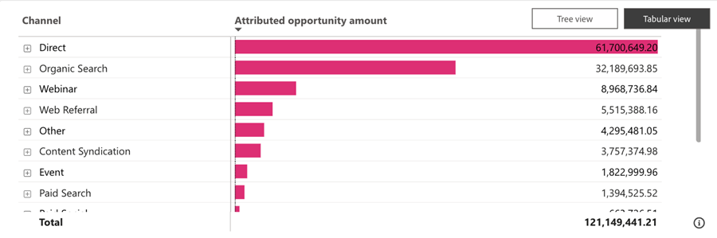

# 已归因的机会仪表板 {#attributed-opportunity-dashboard}

Attributed Opportunity Dashboard可全面了解营销工作如何对新兴和成熟的Pipeline机会作出贡献。 详细了解可归属于您的策略的每个开放和已结束的商机，并灵活地按商机阶段进行筛选，从而强调营销影响力在已结束交易之外的全部范围。

**仪表板回答的问题**：

* 哪些渠道、子渠道或营销活动在归因机会数量方面排名最高？
* 已归因的开放和已结束机会总数和计数是多少？

## 功能板组件 {#dashboard-components}

### KPI拼贴 {#kpi-tiles}

* **已归因业务机会金额**：根据所选归因模型，在筛选的日期期间内创建的具有接触点的已关闭和未结业务机会的收入贡献总计。
* **已归因的商机**：具有接触点的已关闭和已打开商机的数量。

### 按渠道随时间变化的归因机会金额图表 {#attributed-opportunity-amount-by-channel-over-time-chart}

栈叠条形图显示每个月/季度/年按渠道划分的归因机会总金额。

* 利用向下钻取和向上钻取功能按月、季度或年对数据进行分类。
* 将鼠标悬停在条形图区段或条形图之间的空格上可显示详细信息。

**图表回答的问题**：

* 哪些渠道每季度产生的归因机会数量最多？
* 上个月按渠道划分的已归因机会金额明细是多少？

### 已归因的机会金额表 {#attributed-opportunity-amount-table}

按渠道、子渠道和促销活动分段的总归因机会金额，以表格和树格式显示。 单击右上角的按钮可在视图之间切换。

**讨论区回答的问题**：

* 在渠道内的不同子渠道中，归因机会数量分配有何不同？
* 特定子渠道下的哪些营销活动可产生归因最多的机会数量？

#### 表格视图 {#tabular-view}

表格视图提供了对已归因商机金额分布的清晰和有条理的洞察。 用户可以通过将数据分类为渠道、子渠道和营销活动，快速识别性能模式并确定高效的营销策略。

单击每个渠道旁边的&#x200B;**+**&#x200B;图标以显示按子渠道和促销活动划分的明细。

#### 树视图 {#tree-view}

树视图支持更具交互性和更细粒度的数据探索，允许营销人员识别其营销工作中的趋势、异常或杰出表现。

单击分支可更深入地了解后续层次结构层。

### 筛选器窗格

此仪表板配备了以下设置和过滤器：

* 日期（基于业务机会创建日期）
* 归因模型
   * 对于未完成的机会，“完整路径”和“自定义”归因模型可提供时间点视图，而不表示最终归因结果。
* 机会阶段（基于当前阶段）
* 渠道、子渠道
* Campaign
* 区段
