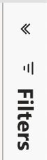

# 了解功能板基础知识 {#discover-dashboard-basics}

本文将引导您了解重新设计的界面的基本功能，确保您可以轻松地访问和解读数据。 深入了解过滤器窗格的动态，并揭示增强的报告功能的复杂性，例如钻取功能、交叉过滤和工具提示。

## 筛选器窗格 {#filter-pane}

每个功能板都包含一系列过滤器，并带有以下无缝导航和自定义控件。

<table style="table-layout:auto"> 
 <tbody> 
  <tr> 
   <th>名称</th> 
   <th>图标</th>
   <th>描述</th>
  </tr> 
  <tr> 
   <td>汉堡按钮</td> 
   <td></td>
   <td>打开或关闭筛选器窗格。</td>
  </tr>
  <tr> 
   <td>重置</td> 
   <td></td>
   <td>将筛选器返回到默认设置。</td>
  </tr>
   <tr> 
   <td>可视化上的筛选器</td> 
   <td></td>
   <td>将光标悬停在可视化的右上角上，然后单击按钮以查看其活动的过滤器。</td>
  </tr>
 </tbody> 
</table>

## 报告功能 {#report-capabilities}

### 向下和向上展开 {#drill-down-and-up}

* 将鼠标悬停在可视化图表上以标识它是否具有层次结构；操作栏中存在钻取控制选项指示了这一点。

* 单击以灰色背景突出显示的单个向下箭头来激活向下钻取。 要还原，请使用向上钻取图标。

要一次向下钻取一个字段，请打开向下钻取图标并选择可视元素，如条形图。

使用双箭头向下钻取图标可前进到下一个层次结构级别。

使用类似分支的图标在当前视图中添加其他层次结构级别。

### 穿透钻取 {#drill-through}

* 要浏览可视化图表后的数据，请右键单击该可视化元素并选择“穿透钻取”选项。

* 要导出基础数据，请将鼠标悬停在穿透钻取页面的右上角，单击“更多选项”按钮，然后选择“导出数据”。

* 要放大特定视觉对象或图块，请将鼠标悬停在右上角并选择“聚焦”按钮。

### 交叉筛选 {#cross-filtering}

默认情况下，选择一个可视化图表中的值或轴标签会交叉过滤报表页面上的其他可视化图表，确保它们仅显示过滤的相关数据。

### 工具提示 {#tooltips}

工具提示提供有关显示数据的补充详细信息。 只需将鼠标悬停在可视元素上，就会弹出上下文工具提示，提供与该特定数据点相关的见解或解释。

